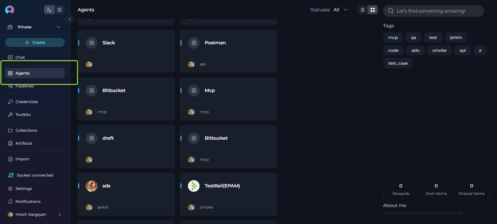
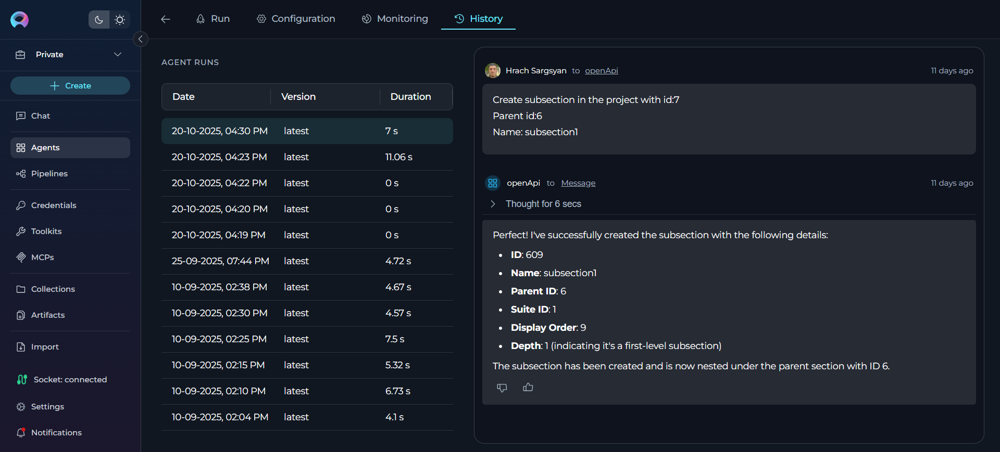

# Agents

## Overview

**What are ELITEA Agents?**

ELITEA Agents are customizable virtual assistants or bots that you can create within the ELITEA interface. Each agent is tailored to handle specific tasks or sets of tasks, based on the instructions and capabilities you define. These agents integrate various components and external toolkits, allowing them to make informed decisions and perform actions like searching on Google, creating Jira tickets, interacting with your code in GitHub. The flexibility of ELITEA Agents enables them to work with a wide range of external toolkits, making them versatile tools for automating complex workflows.

## Private project - Agents menu

ELITEA Agents are a cornerstone feature within the ELITEA platform, designed to significantly enhance and expand the capabilities of AI technologies. By leveraging the advanced natural language processing capabilities of GPT models, ELITEA Agents serve as virtual assistants or "agents" that automate tasks and streamline workflows, providing users with a more efficient and effective way to interact with AI models.

{: loading=lazy }

## Purpose of ELITEA Agents

The primary purpose of ELITEA Agents is to provide a structured and efficient way to interact with AI models for diverse use cases. Unlike open-ended conversations, agents are designed to achieve specific goals, tasks, or workflows. This is particularly beneficial in scenarios that involve repetitive or intricate tasks requiring multiple steps or the aggregation and processing of information from various sources. By automating these processes, ELITEA Agents help reduce manual effort and increase productivity.

## How do Agents work?

Creating an Agent involves defining a set of instructions, toolkits, or goals that the agent is meant to accomplish. These instructions can range from simple to complex, incorporating steps, conditions, and actions that guide the agent's behavior. Once configured, the agent utilizes the natural language processing capabilities of the selected GPT model to interpret and execute the provided instructions. This allows the agent to autonomously perform tasks, make decisions, and adapt to changing conditions without requiring constant human intervention.

## Key Features of ELITEA Agents

* **Autonomy**: ELITEA Agents operate independently, making decisions and taking actions based on predefined goals and instructions.
* **Proactivity**: Agents can proactively determine the next steps needed to achieve their objectives, even in the absence of explicit instructions.
* **Integration**: By combining external toolkits and internal capabilities, agents can seamlessly integrate decision-making processes with actionable tasks.
* **Customization**: Users can tailor agents to meet specific needs, defining the scope and complexity of tasks they are designed to handle.
* **Scalability**: ELITEA Agents can be scaled to manage a wide array of tasks across different domains, enhancing their utility and effectiveness.

By understanding and utilizing ELITEA Agents, users can unlock the full potential of AI-driven automation, transforming how tasks are managed and executed within the ELITEA platform. This not only improves efficiency but also empowers users to focus on more strategic and creative aspects of their work.

## Integration with External Toolkits, Services, and APIs

ELITEA Agents are designed to be highly versatile, capable of integrating with a wide array of external toolkits, services, and APIs. This capability allows agents to extend their functionality beyond the core ELITEA platform, enabling them to perform complex and specialized tasks across various domains. By leveraging these integrations, Agents can act as powerful virtual assistants, automating and streamlining workflows to enhance productivity and efficiency.

* **Analysis Tools**: **Pandas** - Agents can integrate with data analysis tools to process, analyze, and manipulate datasets, enabling data-driven decision making and automated reporting capabilities.

* **Code Repositories**: **ADO Repos, Bitbucket, GitHub, GitLab, GitLab Org** - Integration with version control systems enables agents to manage code repositories, facilitate pull requests, conduct code reviews, and automate development workflows. This helps streamline the development process, ensuring code integrity and facilitating collaboration among developers.

* **Development Tools**: **Sonar, SQL** - Agents can connect with code quality and database tools to perform code analysis, execute database queries, and maintain development standards throughout the software development lifecycle.

* **Documentation Platforms**: **ADO Wiki, Confluence** - By integrating with documentation tools, agents can automate content creation, update documentation, and manage knowledge bases, ensuring that teams have access to up-to-date information.

* **Office and Productivity**: **PPTX, Sharepoint** - Agents can work with office applications and collaboration platforms to create presentations, manage documents, and facilitate team collaboration across different departments.

* **Project Management**: **ADO Boards, Jira, Rally** - Agents can integrate with project management tools to manage tasks, track issues, update project status, and facilitate team collaboration. This integration allows agents to automate project updates, issue tracking, and workflow management, ensuring that teams remain aligned and informed.

* **Test Management**: **ADO Plans, QTest, Testrail, XRAY Cloud, Zephyr Enterprise, Zephyr Essential, Zephyr Scale, Zephyr Squad** - By connecting with test management platforms, agents can assist in managing test cases, test plans, executing tests, and generating reports. This integration streamlines the software testing lifecycle, improving accuracy and efficiency in quality assurance processes.

* **Testing and Quality Assurance**: **Browser, Carrier, Open API, Report Portal, TestIO** - Agents can leverage testing tools to perform automated testing, browser automation, API testing, and quality assurance reporting, enhancing the overall testing strategy and execution.

* **Other Specialized Tools**: **Agent, Artifact, Custom, Figma, Google Places, Postman, Salesforce, ServiceNow, Slack** - ELITEA Agents can interact with a variety of specialized tools including design platforms, location services, API testing tools, CRM systems, enterprise service management, and communication platforms. These integrations empower agents to perform diverse tasks across different business domains.

### Setting Up Integrations

To set up these integrations, users may need to perform additional configuration and authentication steps. This includes providing API keys, access tokens, or configuring webhooks and communication channels between ELITEA and the external toolkits or services. These steps ensure secure and seamless integration, allowing ELITEA Agents to function effectively within your existing technological ecosystem.

By harnessing the power of these integrations, ELITEA Agents can automate a wide range of tasks, from project management and software testing to code management and data processing. This not only enhances the capabilities of the ELITEA platform but also empowers users to achieve greater efficiency and productivity in their workflows.

## Navigating the Agents Menu

The Agents menu is accessible from the main platform navigation. Upon entering the Agents section, you'll see a dashboard listing all created agents for your project.

  {: loading=lazy }

## Creating an Agent

To set up a new agent:

1. Click the **+ Create** button located at the top of the main sidebar.
2. In the **General** section, fill out the required fields:
   - **Name**: Enter a unique name for your agent
   - **Description**: Provide a clear description of the agent's purpose
   - **Tags** (optional): Add tags by typing a tag name or selecting from pre-existing tags
3. In the **Instructions** section, provide detailed guidelines for the AI agent that specify how it should behave and what tasks it should perform.
4. Optionally, add and configure **Welcome Message** and **Conversation Starter**. 
5. Click **Save**.

Your newly created agent will subsequently appear on the **Agents** page for your project.

{: loading=lazy }

When configuring Agents, you can further personalize their profiles by adding a custom image along with the **Name** and **Description**. This feature allows you to create a unique, visually distinct identity for each Agent, making them easier to recognize and manage.

To add an image:

1. Click the **Pen Icon** next to the image placeholder. Clicking this icon will open the image upload interface.
2. Click the **Upload a Custom Image** icon to upload a custom image from your local system to personalize the Agent's profile.
3. **Use Default Images** from a set of default images provided by the platform.

{: loading=lazy }

### How to Create Instructions

The **Instructions** section is the core component where you define how your agent should behave and what tasks it should perform. This field serves as the foundational knowledge base that guides the AI model in understanding and processing your specific requests.

#### How to Input Instructions

* **Identify Key Information**: Before entering data into the Instructions field, identify the essential details or instructions that the model needs to know to fulfill your request effectively. This could include the topic, specific terms, relevant background information, or the scope of the task.
* **Enter the Details**: In the Instructions field, clearly and concisely input the identified information. Ensure that the information is directly relevant to the task to maintain the agent's focus and efficiency.
* **Using toolkits**: For enhancing agent's capabilities, you can integrate toolkits and provide instructions how to use them and in which order. The name of toolkit can be denoted by "", (e.g. "Access_JIRA" toolkit).

{: loading=lazy }

### How to select and configure Toolkits

Toolkits are integrations with external or ELITEA's internal services that enhance your agent's capabilities by allowing it to interact with various resources and perform specific tasks. In addition to toolkits, you can also add other Agents, MCPs (Model Context Protocol servers), and Pipelines to extend your agent's functionality. You can add these resources to your agent during the creation process or edit them later.

**Adding Resources to Your Agent**:

1. In the agent creation or editing interface, navigate to the toolkits section
2. Click the **+Toolkit** button to browse available resources
3. You can add the following types of resources:
   - **Toolkits**: Select an existing toolkit from the list or click **"+ Create New"** to create a new toolkit
   - **Agents**: Add nested agents to enable your agent to delegate tasks or collaborate with specialized agents
   - **MCPs**: Integrate Model Context Protocol servers to provide additional context and capabilities. You can select an existing MCP from the list or click "+ Create New" to create a new MCP
   - **Pipelines**: Include pipelines to orchestrate complex multi-step workflows
4. Configure any additional settings as required for the selected resource
5. Save your agent configuration

> **Note:** For detailed instructions on creating and configuring toolkits, refer to the [How to Create a Toolkit](toolkits.md) guide.

Below is the list of toolkits supported by the platform. For detailed instructions on how to configure each toolkit, please refer to the corresponding section by clicking on the respective toolkit link:

| **Category**           | **Available Toolkits**                                                                                 |
|------------------------|------------------------------------------------------------------------------------------------------|
| **Analysis**           | [Pandas](../integrations/toolkits/pandas_toolkit.md)                                                  |
| **Code Repositories**  | [ADO Repos](../integrations/toolkits/ado_repos_toolkit.md), [Bitbucket](../integrations/toolkits/bitbucket_toolkit.md), [GitHub](../integrations/toolkits/github_toolkit.md), [GitLab](../integrations/toolkits/gitlab_toolkit.md), [GitLab Org](../integrations/toolkits/gitlab_org_toolkit.md) |
| **Development**        | [Sonar](../integrations/toolkits/sonar_toolkit.md), [SQL](../integrations/toolkits/sql_toolkit.md)     |
| **Documentation**      | [ADO Wiki](../integrations/toolkits/ado_wiki_plan_board_toolkit.md), [Confluence](../integrations/toolkits/confluence_toolkit.md) |
| **Office**             | PPTX, [Sharepoint](../integrations/toolkits/sharepoint_toolkit.md)                                     |
| **Other**              | Agent (this page), [Artifact](../integrations/toolkits/artifact_toolkit.md), [Custom](../integrations/toolkits/custom_toolkit.md), [Figma](../integrations/toolkits/figma_toolkit.md), [Google Places](../integrations/toolkits/google_places_toolkit.md), [Postman](../integrations/toolkits/postman_toolkit.md), [Salesforce](../integrations/toolkits/salesforce_toolkit.md), [ServiceNow](../integrations/toolkits/servicenow_toolkit.md), [Slack](../integrations/toolkits/slack_toolkit.md) |
| **Project Management** | [ADO Boards](../integrations/toolkits/ado_wiki_plan_board_toolkit.md), [Jira](../integrations/toolkits/jira_toolkit.md), [Rally](../integrations/toolkits/rally_toolkit.md) |
| **Test Management**    | [ADO Plans](../integrations/toolkits/ado_wiki_plan_board_toolkit.md), [QTest](../integrations/toolkits/qtest_toolkit.md), [Testrail](../integrations/toolkits/testrail_toolkit.md), [XRAY Cloud](../integrations/toolkits/xray_toolkit.md), [Zephyr Enterprise](../integrations/toolkits/zephyr_enterprise_toolkit.md), Zephyr Essential, [Zephyr Scale](../integrations/toolkits/zephyr_scale_toolkit.md), Zephyr Squad |
| **Testing**            | [Browser](../integrations/toolkits/browser_toolkit.md), Carrier, [Open API](../integrations/toolkits/openapi_toolkit.md), [Report Portal](../integrations/toolkits/reportportal_toolkit.md), [TestIO](../integrations/toolkits/testIO_toolkit.md) |

{: loading=lazy }

### INTERNAL TOOLS

ELITEA provides built-in internal tools that extend your agent's capabilities without requiring external integrations. These tools enable your agents to perform specialized tasks directly within the platform.

**Available Internal Tools**:

* **Python Sandbox**: Enables secure Python code execution using Pyodide. Your agent can execute Python code, perform calculations, analyze data, and use compatible Python packages like numpy, pandas, and matplotlib.

* **Image Creation**: Allows your agent to generate images based on text descriptions using AI image generation capabilities.

* **Planner**: Provides structured planning and task breakdown capabilities, helping your agent organize complex workflows into manageable steps.

**How to Enable Internal Tools**:

1. In the **TOOLKITS** section, find the internal tools toggles at the bottom
2. Toggle the switches for the tools you want to enable
3. Click **Save**

{: loading=lazy }

!!! info "Learn More"
    For detailed information about each internal tool:
    
    * [Python Sandbox Guide](../how-tos/chat-conversations/enable-internal-tools.md) - Capabilities, available packages, and troubleshooting
    * [Image Generation Guide](../how-tos/chat-conversations/image-generation.md) - Creating images with AI using text descriptions
    * [Planner Internal Tool Guide](../how-tos/chat-conversations/planner-internal-tool.md) - Structured planning and task breakdown

### WELCOME MESSAGE

The **Welcome Message** feature allows you to provide additional context and instructions that appear when users interact with your agent in the chat interface. This message helps set expectations and guide users on how to best utilize the agent.

**How to Add the Welcome Message**:

1. **Access the Welcome Message Section**: In the agent creation or editing interface, navigate to the Welcome Message section.
2. **Add the Welcome Message**: Type the welcome message text in the input field.
3. **Save the Configuration**: After entering the desired text, ensure to save the changes to the agent. This action makes the configured welcome message available to users in the **Chat** section.

{: loading=lazy }

**Using the Welcome Message**:

When users go to the **Chat** section of the agent, they will see the configured **Welcome Message**. It provides helpful context and instructions to guide their interaction with the agent.

**Examples of Welcome Message**:

* "Use this agent for generating manual test cases"
* "Don't forget to double-check the generated test cases"
* "I can help you analyze code, write documentation, and review pull requests"

### CONVERSATION STARTERS

The **Conversation Starter** feature enables you to configure predefined prompts that help users quickly initiate specific types of interactions with your agent. These starters appear as clickable buttons in the chat interface, making it easy for users to get started.

**How to Add a Conversation Starter**:

1. **Access the Configuration Panel**: Navigate to the **Conversation Starter** section in the agent creation or editing interface.
2. **Add a Conversation Starter**: Click the `+` icon to open the text input field where you can type the text you wish to use as a conversation starter.
3. **Save the Configuration**: After entering the desired text, ensure to save the changes to the agent. This action makes the configured conversation starter available for use.

**Using a Conversation Starter**:

**Initiate a Conversation**: Go to the **Chat** section of the agent. Here, you will find the saved conversation starters displayed as clickable options. Click on the desired starter to automatically populate the chat input and execute the agent.

**Examples of Conversation Starters**:

* "Generate test cases for provided Acceptance Criteria."
* "Generate automatic test cases for selected [Test_Case_ID]."
* "Review this code and suggest improvements."
* "Help me write documentation for this feature."

{: loading=lazy }

By setting up conversation starters, you streamline the process of initiating specific tasks or queries, making your interactions with the agent more efficient and standardized.

### How to Execute Agent

To execute the agent and get the output:

1. **Configure the Agent**: Ensure your agent is properly configured with clear instructions and any necessary toolkits.
2. **Navigate to Chat**: Access the agent's chat interface by clicking on the agent from your agents list.
3. **Select the AI Model**: In the chat interface, choose the appropriate AI model (e.g., gpt-4o, gpt-5.1, etc.) from the model selection dropdown.
4. **Adjust Model Settings** (Optional): Click the **Model Settings** icon (⚙️) next to the model selector to fine-tune the response generation. The settings vary depending on the selected model:

    **For Reasoning Models** (e.g., GPT-5.1):
    
    * **Reasoning** - Controls the depth of logical thinking and problem-solving with three levels:
        * **Low**: Fast, surface-level reasoning with concise answers and minimal steps
        * **Medium**: Balanced reasoning with clear explanations and moderate multi-step thinking (default)
        * **High**: Deep, thorough reasoning with detailed step-by-step analysis (may be slower)
    
    **For Standard Models** (e.g., GPT-4o):
    
    * **Creativity** - Controls response randomness and creativity. Lower values produce more focused and deterministic outputs, while higher values generate more diverse and creative responses with five levels (1-5):
        * **1**: Highly focused and deterministic outputs
        * **2**: Mostly focused with slight variation
        * **3**: Balanced between focus and creativity (default)
        * **4**: More varied and creative responses
        * **5**: Maximum creativity and diversity
    
    **Max Completion Tokens** Limits the maximum length of AI responses measured in tokens (roughly 4 characters per token).(All Models):
    
    * **Auto** (default): System automatically sets the token limit to 4096 tokens
    * **Custom**: Manually set a specific token limit for responses
        * When Custom is selected, you can enter a specific number of maximum tokens
        * The interface shows remaining tokens available after your specified limit
        * Setting too high a value will show an error if it exceeds the model's maximum output tokens

    {: loading=lazy }   

5. **Start Interaction**: Begin your conversation by either:
   - Clicking on a **Conversation Starter** (if configured) to use a predefined prompt
   - Typing your question or command directly into the chat input field
   - Using simple commands like "Go", "Start Generating", "Execute", or "Run it" followed by clicking the **Send** button

**Additional Interaction Features:**

* **Auto scroll to bottom**: This option can be toggled on or off to automatically scroll to the bottom of the output as it is being generated. This feature is helpful during long outputs to keep the most recent content visible.
* **Full Screen Mode**: Increase the size of the output window for better visibility and focus. This mode can be activated to expand the output interface to the full screen.

**Post-Output Actions:**

* **Continue the Dialogue**: To keep the conversation going, simply type your next question or command in the chat box and click the **Send** icon.
* **Copy the Output**: Click the **Copy to Clipboard** icon to copy the generated text for use elsewhere.
* **Regenerate Response**: If the output isn't satisfactory, click the **Regenerate** icon to prompt the Gen AI to produce a new response.
* **Delete Output**: To remove the current output from the chat, click the **Delete** icon.
* **Purge Chat History**: For a fresh start or to clear sensitive data, click the **Clean** icon to erase the chat history.
* **Like or Dislike the Output**: 
  * Click the **Like** icon if the output meets your expectations.
  * Click the **Dislike** icon if the output is unsatisfactory. Upon disliking, you will have the option to leave a comment explaining why the output did not meet your expectations. This feedback helps improve the system's performance and relevance.

{: loading=lazy }

### Managing Agent Versions: Save, Create Versions, Publish and Manage

To optimally manage your agent, understanding how to save and create versions is crucial. Follow these guidelines to efficiently save your agent, create versions, and manage them.

#### How to Save an Agent:

* To save your work on an agent for the first time, simply click the **Save** button. This action creates what's known as the "**latest**" version of your agent.
* You can continue to modify your agent and save the changes to the "**latest**" version at any time by clicking the **Save** button again. If you wish to discard any changes made, you have the option to click the **Discard** button before saving.

**Remember**: The "**latest**" version represents the initial version you create. You can keep updating this version with your changes by saving them, without the need to create additional versions for your agent.

#### How to Create New Versions:

For instances where you need to create and manage different iterations of your agent:

1. **Initiate a New Version**: Start by clicking the **Save As Version** button.
2. **Name Your Version**: When saving your work, provide a version name that clearly identifies the iteration or changes made. Click **Save** to confirm your entry. 

**Best Practices for Version Naming**:

* **Length**: Keep the version name concise, not exceeding 48 characters. This ensures readability and compatibility across various systems.
* **Characters**: Avoid using special characters such as spaces (" "), underscores ("_"), and others that might cause parsing or recognition issues in certain environments.
* **Clarity**: Choose names that clearly and succinctly describe the version's purpose or the changes it introduces, facilitating easier tracking and management of different versions.

Upon creating a new version of the agent, several options become available to you:

* **Delete**: Remove this version of the agent if it’s no longer needed.
* **Execute**: Run this specific version of the agent to see how it performs.
* **Navigate Versions**: Use the **Version** dropdown list to switch between and select different versions of the agent. This allows for easy comparison and management of various iterations.

### Publishing an Agent Version

The **Publish** functionality allows you to make a specific version of your agent available for public use after moderator approval. This ensures that only reviewed and approved versions are accessible to users.

#### How to Publish an Agent Version:

1. Navigate to the top menu and click the **Publish** button. A dialog box will appear prompting you to confirm the publishing process.
2. **Provide a Version Name**. Enter a meaningful name for the version you want to publish. This helps in identifying the version during the review process.
3. **Submit for Approval**:
   * Once you click **Publish**, the version will be sent to a moderator for review.
   * The moderator will evaluate the agent version and either approve or reject the request.

{: loading=lazy }

#### What Happens After Publishing:

* **If Approved**:
  * The agent version will be made publicly available for use.
  * Users will be able to access and execute the published version in Agent studio

* **If Rejected**:
  * The moderator may provide feedback on why the version was not approved.
  * You can make the necessary changes and resubmit the version for approval.

By following these steps, you can effectively manage the lifecycle and iterations of your agents, ensuring that each version is appropriately saved, published, and utilized as per your requirements.

### Viewing Agent History

The **History** tab provides a complete audit trail of all past executions of your agent. This feature allows you to:

- **Review past conversations**: View complete chat histories from previous agent runs
- **Track performance**: Monitor execution duration across different versions
- **Debug issues**: Replay conversations to identify where problems occurred
- **Compare versions**: See how different agent versions performed with the same inputs
- **Audit trail**: Maintain records of all agent interactions for compliance purposes

The History tab displays runs in a two-panel layout with a list of all executions on the left (showing date, version, and duration) and the complete conversation replay on the right when you select a run.

For detailed instructions on using the History tab, please refer to the **[Agents and Pipelines History Guide](../how-tos/agents-pipelines/agents-pipelines-history.md)**.

{: loading=lazy }

---

## References

For more detailed information on related topics, please refer to the following documentation:

- **[Credentials](credentials.md)** - Learn how to create and manage credentials for toolkit integrations
- **[Toolkits](toolkits.md)** - Comprehensive guide on creating and configuring toolkits
- **[Glossary](../home/glossary.md)** - Definitions of key terms and concepts used in the ELITEA platform

