# Artifacts

## Introduction

The **Artifacts** menu in ELITEA provides a dedicated interface for managing artifact buckets and the files they contain. Artifacts are primarily used in conjunction with the Artifact Toolkit within ELITEA Agents, offering temporary storage for data and context during agent workflows. This menu allows users to directly interact with artifact storage, enabling actions such as creating buckets, uploading and downloading files, managing retention policies, and organizing project-related data. Artifact storage is project-specific, accessible to project members, and is also available for private projects.

### Accessing the Artifacts

1. Click the **ELITEA** icon in the sidebar to open the ELITEA menu. 
2. Select **"Artifacts"** to access the management page. If the menu item is missing, contact your administrator.

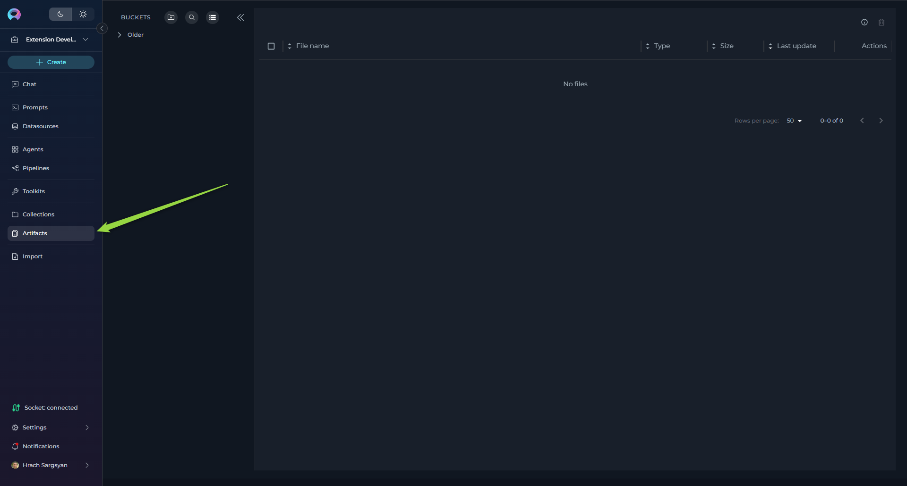

## Components

* **Buckets Sidebar:**
    * A sidebar on the left lists all artifact buckets for the project.
    * Buckets are grouped by date: **Today**, **Yesterday**, **This Week**, and **Older** for quick access to recent and historical artifacts.
    * The sidebar is expandable and collapsible, allowing users to show or hide it as needed for a more flexible workspace.

  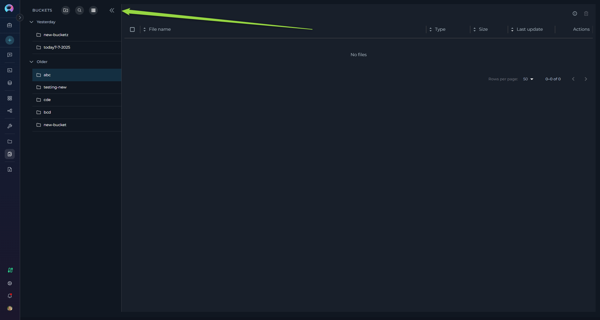

* **Add Bucket Button:** 
    * Located at the top of the sidebar, this button initiates the process of creating a new artifact bucket.
  
      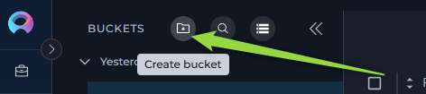

* **Search Bar for Buckets:**
    * A prominent search bar at the top of the sidebar allows you to search for buckets by name or keyword.

     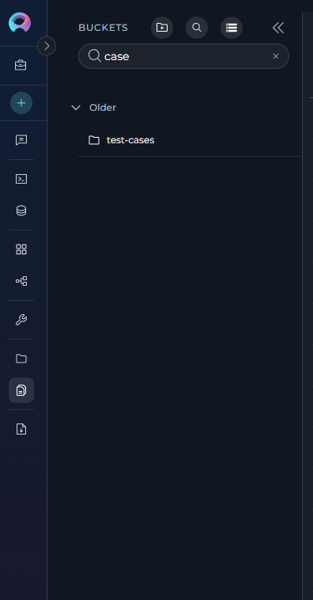

* **Storage Settings Button:**
    * Located at the top of the sidebar, provides access to storage configuration and information.

* **File List:** 
    * Located to the right of the bucket list, this panel displays the files contained within the selected bucket. The list shows file name, size, last update date, and available actions (Preview, Download, Delete). A bulk delete option for selected files and an info icon are located in the upper right corner. Pagination is available for long file lists, along with options to adjust the number of files displayed per page and sort files by column headers.
    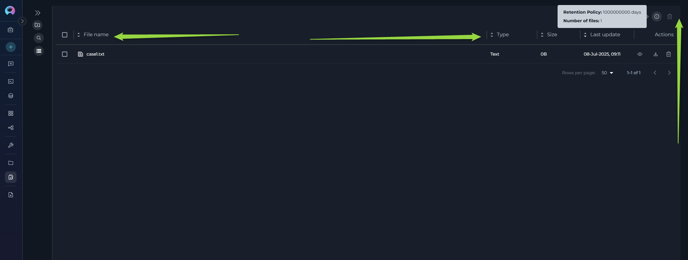

## Artifact Functionality

### Buckets Sidebar and Grouping

* **Sidebar:** The sidebar on the left lists all artifact buckets for the project. The sidebar is expandable and collapsible, allowing users to show or hide it as needed for a more flexible workspace.
* **Auto-selection:** When no bucket is selected, the system automatically selects the most recently active bucket based on file activity for better user experience.

   

### Storage Settings Button
* At the top of the sidebar, a dedicated storage info panel displays the storage name, total storage used, and the project storage limit (if configured).
* The storage settings button provides access to storage configuration selection, allowing users to switch between different storage integrations.
* **Storage Usage Display:** When available, shows bucket count, used space, and quota information (e.g., "5.2GB / 9GB" with usage percentage).
* **Storage Type Information:** Displays the storage type (e.g., "S3 Storage") and additional metadata.
* Currently supports multiple storage configurations if project has access to both personal and shared storage integrations.

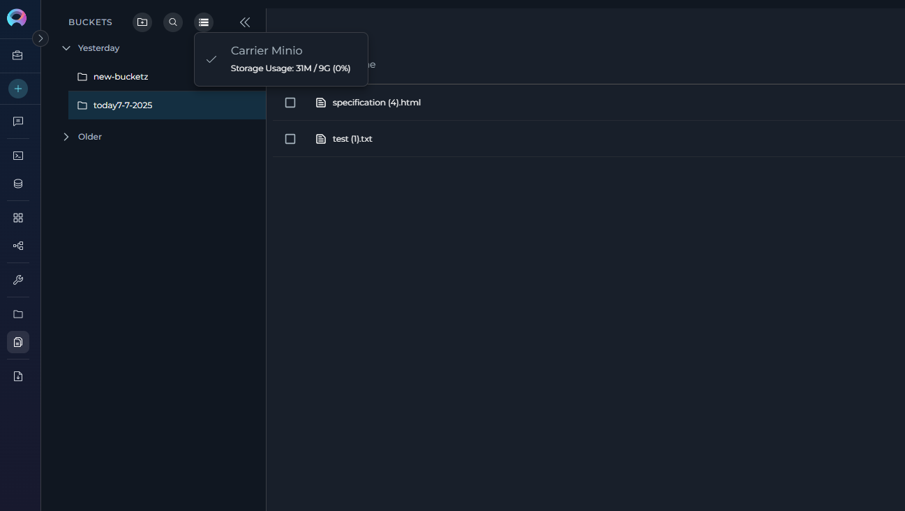

### Searching and Filtering

* **Search Bar:** Use the search bar at the top of the sidebar to find buckets by name or ID. Results update instantly as you type.
* **Search Activation:** The search function can be activated by clicking the search icon, which expands to show a full search input field.
* **Storage Type Filter:** Use the storage settings dropdown to switch between different storage configurations if multiple are available.

  

###  Creating a New Bucket

* **Initiate Bucket Creation:** Click the **"+ Create Bucket"** button located at the top of the sidebar.
* **Enter Bucket Name:** A "New Bucket" dialog will appear. In the "Name" field, enter a unique name for your new bucket.
      * **Naming Conventions:** Bucket names must start with a letter and can only contain letters, numbers, and hyphens. Spaces and other special characters are not allowed. Maximum length is 56 characters.
      * **Uniqueness:** Ensure the bucket name is unique within the project. If a non-unique name is entered, instead of creating a new bucket, the system will use the existing bucket and **update the retention policy of the existing bucket** to the newly provided retention period.
* **Set Retention Policy:** Select the desired retention policy for the bucket.
      * **Period Type:** Choose the time unit for retention from the "Period Type" dropdown (Days, Weeks, Months, Years).
      * **Value:** Enter a numerical value in the number field to specify the duration of the retention period. Be aware that some storage types may have limitations on the maximum retention period (e.g., not exceeding year 9999). Provide meaningful and realistic retention durations.
      * **Intelligent Conversion:** The system automatically converts retention policies to user-friendly units (e.g., displaying "1 Year" instead of "365 Days" when appropriate).
* **Save Bucket:** Click the **"Save"** button in the "New Bucket" dialog to create the bucket with the specified name and retention policy. The newly created bucket will then appear in the Bucket List and will be automatically selected.

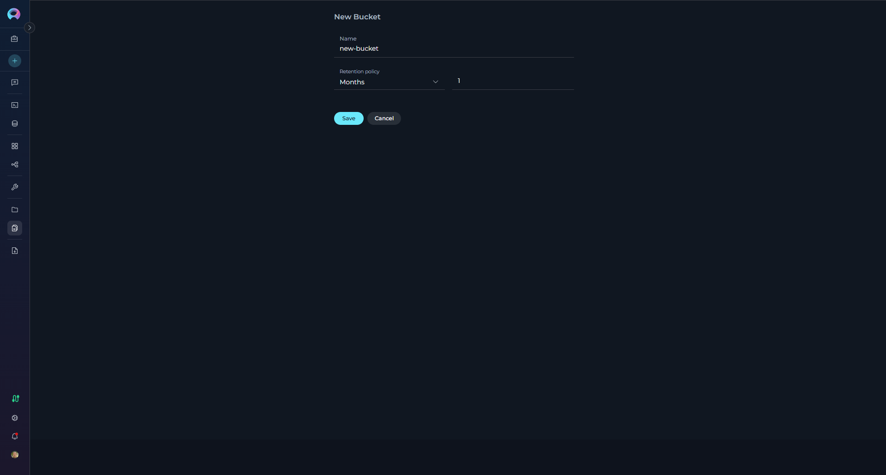

### Editing and Deleting Buckets

**Editing a Bucket:**

* **Access Edit Mode:** In the Bucket List, click on the three dots icon next to the bucket you want to modify. A context menu with an **"Edit"** icon (pencil icon) will appear. Click on this "Edit" icon.
* **Modify Retention Policy:** The "Edit Bucket" dialog will open, displaying the current retention policy. Modify the "Period Type" and "Value" as needed to set a new retention period. Note that you **cannot change the bucket name** in edit mode.
* **Permission-based Access:** Edit functionality is available based on user permissions (bucket owner, or users with artifacts.buckets.update permission).
* **Save or Discard Changes:**
      * Click **"Save"** to apply the new retention policy to the bucket.
      * Click **"Cancel"** to discard the changes and revert to the original retention policy.

**Deleting a Bucket:**

* **Access Delete Mode:** In the Bucket List, click on the three dots icon next to the bucket you want to delete. A context menu with a **"Delete"** icon (trash can icon) will appear. Click on this "Delete" icon.
* **Permission-based Access:** Delete functionality is available based on user permissions (bucket owner, or users with artifacts.buckets.delete permission).
* **Confirmation Dialog:** A confirmation dialog will appear, prompting you to confirm the bucket deletion with the message "Are you sure to delete bucket? It can't be restored."
* **Auto-selection After Deletion:** When a bucket is deleted, if it was the currently selected bucket, the system automatically selects the next available bucket to maintain workflow continuity.
* **Delete Bucket:** Click the **"Delete"** button in the confirmation dialog to permanently delete the bucket and all files it contains.

    !!! warning "Warning"
        Deleting a bucket is a permanent action. All files within the bucket will be deleted and cannot be recovered.

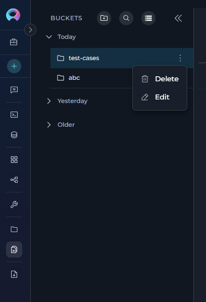
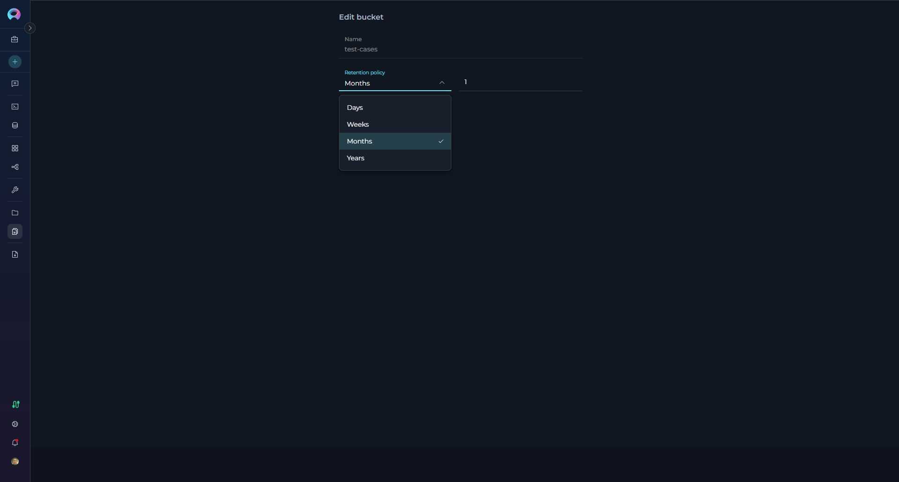
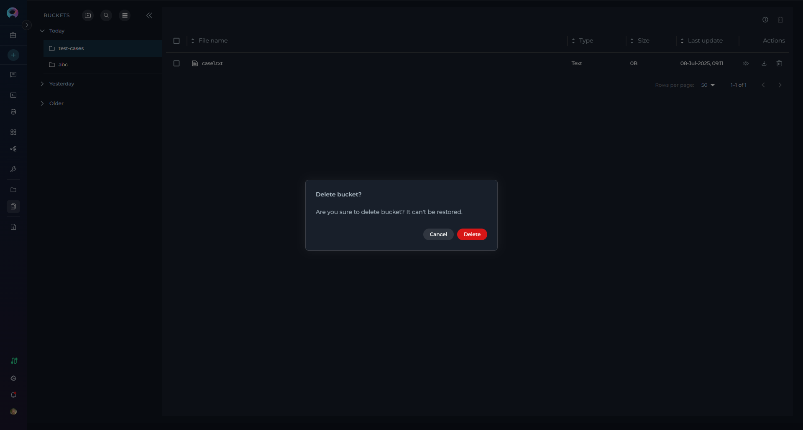

### Viewing and Managing Files In a Bucket

* **Select a Bucket:** Click a bucket in the sidebar to view its files in the main panel.
* **File Table:** The table shows file name, type, size, last update, uploader, and actions. File type icons/labels are shown automatically based on file extensions.
* **Permission-based Actions:** Available actions depend on user permissions (create, update, delete) and bucket ownership.
* **Bucket Information:** A bucket info tooltip displays the current retention policy in a user-friendly format (e.g., "1 Year", "6 Months").
* **File List Navigation:**
    * **Pagination:** If the file list is long, pagination controls will appear below the list, allowing you to navigate through multiple pages of files (default: 50 files per page).
    * **Items Per Page:** Use the "items per page" selector to adjust the number of files displayed on each page.
    * **Sorting:** Click on the column headers ("Name," "Size," "Last Update Date") to sort the file list by that column in ascending or descending order.

    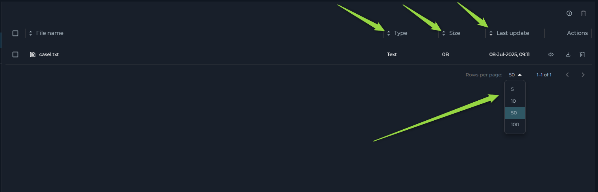

###  Uploading Files to a Bucket

*   **Select Target Bucket:** Ensure you have selected the bucket in the Bucket List where you want to upload files.
*   **Multiple Upload Methods:**
    *   **Drag and Drop:** Drag and drop files directly from your computer's file explorer into the File List area on the right side of the Artifacts page.
    *   **Upload Button:** Use the upload button in the file table toolbar to open a file browser and select files to upload.
    *   **Bucket Menu Upload:** Right-click on a bucket in the sidebar and select "Upload files" from the context menu.
*   **Duplicate File Handling:** If files with the same name already exist in the bucket, a confirmation dialog will appear listing the duplicate files and asking if you want to proceed with overwriting them.
*   **Upload Progress:** After initiating upload, ELITEA will provide visual feedback regarding the upload status through the upload status indicator.
*   **Permission Requirements:** Upload functionality requires appropriate permissions (artifacts.create or artifacts.buckets.create).

    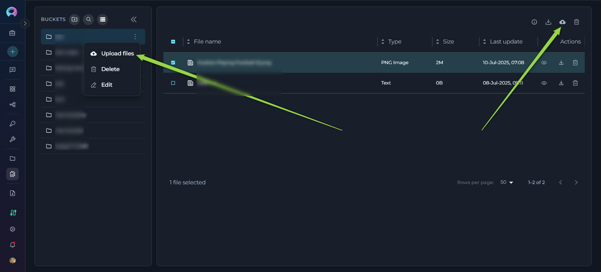

!!! note "Note"
    Files with the same name and extension will replace existing files without additional confirmation once the initial duplicate warning is accepted.

### File Preview

* Navigate to the File List of the bucket containing the file you want to preview.
* Click on the Preview icon (eye symbol). Files must be under the size limit for preview (varies by file type, with flexible limits based on file content).
* The file will open in **Canvas Mode**, providing a full-featured preview experience without leaving the Artifacts page.
    
**Preview Features:**

* **Canvas-like Interface:** Files open in a dedicated preview panel with header controls and content area.
* **Language Detection and Selection:** Automatic programming language detection with manual override option via dropdown selector.
* **Multiple View Modes:** Support for different rendering modes depending on file type:
  * **Text and Code Files:** Displayed with syntax highlighting, line numbers, and proper formatting for over 50+ supported programming languages and file types.
  * **Markdown Files:** Toggle between **Raw** (source code) and **Preview** (rendered) modes.
      * Raw mode shows the original Markdown source with syntax highlighting
      * Preview mode displays the rendered Markdown with proper formatting, including support for Mermaid diagrams
  * **CSV/TSV Files:** Toggle between **Raw** (text view) and **Table** (formatted table) modes for better data visualization.
  * **Image Files:** Direct image preview with proper scaling and centering.
  * **Mermaid Diagram Files:** Toggle between **Raw** (source) and **Diagram** (rendered) modes to view both the code and the visual diagram.

**Preview Controls:**

* **Copy Functionality:** Copy the entire file content or selected portions using the Copy button in the preview toolbar.
* **Language Override:** Manually select syntax highlighting language from an extensive list of supported programming languages.
* **Close/Navigation:** Easy close button to return to the file list.
* **Auto-detection:** Supports a wide range of file types including programming languages, configuration files, documentation formats, data files, and more.

**File Size Limits:** Preview is available for files under specific size limits (flexible based on file type) to ensure good performance. Larger files will show a download option instead.

This feature enables comprehensive inspection of file contents directly within the Artifacts interface, significantly streamlining workflow and reducing context switching.
   
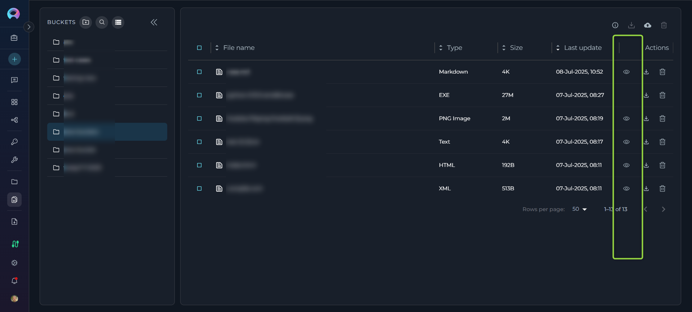
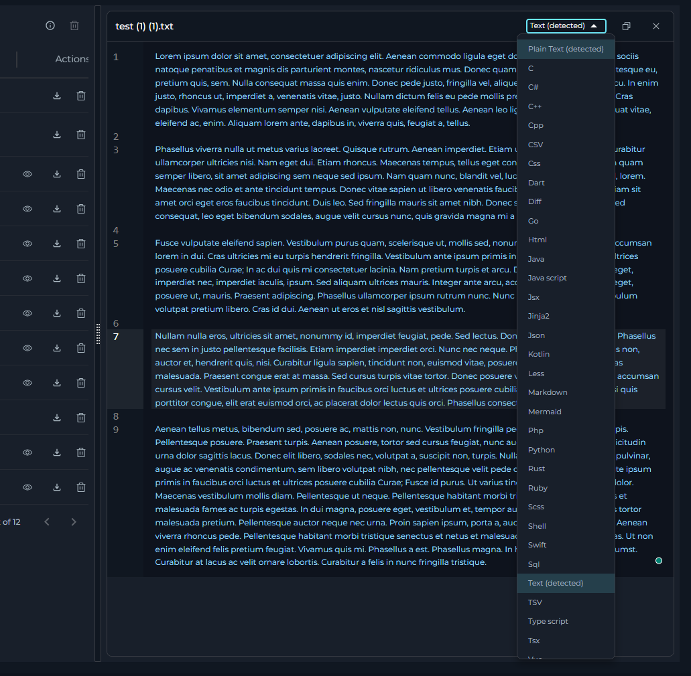
    

###  Downloading Files from a Bucket

*   **Single File Download:** Navigate to the File List and locate the **"Download"** icon (download arrow icon) on the right side of the file entry. Click this icon to download the file to your local computer.
*   **Multiple File Download:** Select multiple files using the checkboxes, then click the **"Download files"** button in the toolbar to download all selected files.
*   **Permission Requirements:** Download functionality is generally available to all users with bucket access.
*   **Download Progress:** The system provides feedback during the download process.

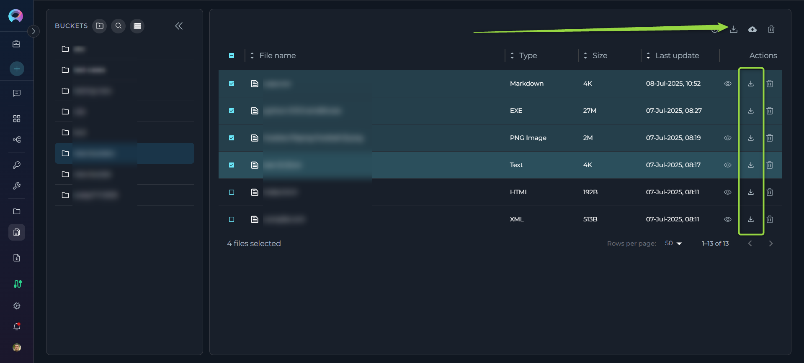
###  Deleting Files from a Bucket

*   **Access File List:** Navigate to the File List of the bucket containing the files you want to delete.
*   **Single File Deletion:** Click the **"Delete"** icon (trash can) on the right side of the file entry to delete individual files.
*   **Multiple File Deletion:** To delete multiple files at once:
    *   Select the checkboxes next to each file you want to delete in the File List.
    *   Once one or more files are selected, a **"Delete"** icon will become active in the upper part of the File List (above the list itself). Click this "Delete" icon to delete all selected files.
*   **Permission Requirements:** Delete functionality requires appropriate permissions (artifacts.delete or bucket ownership).
*   **Confirmation:** You may be prompted to confirm the file deletion before it is permanently removed.
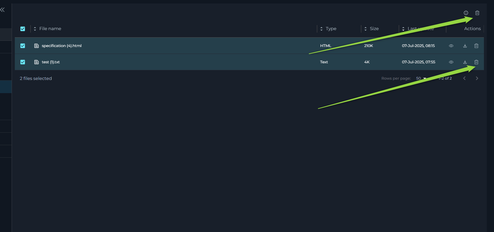

## FAQ

**Q: What types of files can I upload?**

**A:** All file types are supported for upload. For optimal agent workflow integration, plain text files are recommended. The preview feature supports 50+ file types including programming languages, configuration files, documentation formats, data files (CSV/TSV), images, and Mermaid diagrams. See the [Artifact Toolkit Guide](../integrations/toolkits/artifact_toolkit.md) for agent-specific usage details.

**Q: How can I preview files?**

**A:** Select a file and click the preview icon (eye symbol) to open it in Canvas Mode. The preview supports multiple view modes: code with syntax highlighting, rendered Markdown, table view for CSV/TSV files, and rendered diagrams for Mermaid files. You can copy content, switch languages, and toggle between raw and rendered views.

**Q: Who can access artifact files?**

**A:** Access is controlled by project membership and specific permissions. Users need appropriate permissions for different actions: artifacts.create for uploading, artifacts.buckets.update for editing buckets, artifacts.delete for deleting files, etc. Bucket owners have full control over their buckets.

**Q: Can I use multiple storage configurations?**

**A:** Yes, if your project has access to multiple storage integrations (personal and shared), you can switch between them using the storage settings menu. Each storage configuration maintains its own set of buckets and quota limits.

**Q: How does the file size limit work for previews?**

**A:** The system uses flexible file size limits based on file type and content. Most text files under a reasonable size can be previewed. Files that exceed the limit will show a download option instead of preview.

**Q: What happens to my bucket selection when I switch projects?**

**A:** Bucket selections are isolated by project context. Each project maintains its own selection state, and switching projects will not affect your bucket selections in other projects.

**Q: Why do I get an error when creating a bucket?**

**A:** Check that the retention policy is valid, the name follows conventions (starts with letter, only letters/numbers/hyphens, max 56 characters), and you have the necessary permissions. Reduce the retention period if it exceeds storage limitations.

**Q: Why is the "Save" button disabled?**

**A:** The bucket name may be invalid or not unique, the retention value is not a valid integer, or you don't have the necessary permissions to create/modify buckets.

**Q: Why are files missing from my bucket?**

**A:** Files may be deleted due to retention policy expiration, manual deletion by users with appropriate permissions, or agent actions. Check the retention policy settings and project activity logs if available. Files are permanently deleted when buckets are removed.
