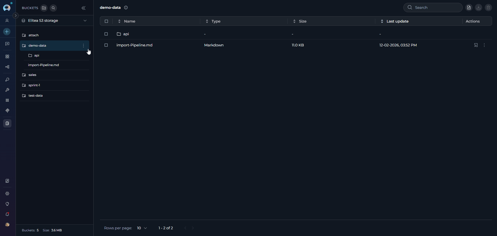
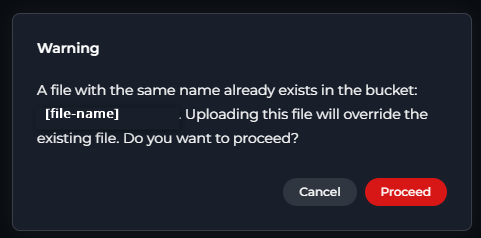

# Artifacts

## Introduction

The **Artifacts** menu in ELITEA provides a dedicated interface for managing artifact buckets and the files they contain. Artifacts are primarily used in conjunction with the Artifact Toolkit within ELITEA Agents, offering temporary storage for data and context during agent workflows. This menu allows users to directly interact with artifact storage, enabling actions such as creating buckets, uploading and downloading files, managing retention policies, and organizing project-related data. Artifact storage is project-specific, accessible to project members, and is also available for private projects.

## Navigating the Artifacts Menu

The Artifacts menu is accessible from the main platform navigation. Upon entering the Artifacts section, you'll see a dashboard displaying artifact buckets and their contained files.

{loading=lazy}

### Main Elements:

* **Buckets Sidebar:**
    * A collapsible sidebar on the left displays all artifact buckets for the project
    * Shows a hierarchical tree structure with expandable buckets
    * Each bucket can be expanded to show its folder/file structure in a nested tree view
    * Includes bucket search functionality and storage selector at the top
    * Displays bucket count and total size statistics at the bottom
* **Bucket Header:**
    * Located at the top of the sidebar
    * Contains "Buckets" title
    * **Create Bucket button** - Initiates the bucket creation process
    * **Search icon** - Activates bucket search functionality
    * **Collapse/Expand icon** - Toggles sidebar visibility
* **Storage Settings Selector:**
    * Located below the bucket header in the sidebar
    * Displays current storage configuration name and type
    * Click to open dropdown menu showing all available storage configurations
    * Shows storage type (e.g., "S3 STORAGE") for each option
* **Bucket Footer:**
    * Located at the bottom of the sidebar
    * Displays "Buckets:" count showing total number of buckets
    * Displays "Size:" showing total storage used across all buckets
* **File Table:** 
    * Located to the right of the bucket sidebar
    * Displays files and folders for the selected bucket or folder
    * Shows breadcrumb navigation at the top when navigating into folders
    * File table columns: Name, Type, Size, Last update, Actions
    * Supports drag-and-drop file upload directly into the table area
    * Includes search bar, upload button, download button, and delete button in the toolbar
    * Bucket info tooltip shows retention policy and file count

{loading=lazy}

## Artifact Functionality

**Buckets Sidebar and Tree Structure**

* **Sidebar:** The sidebar on the left lists all artifact buckets for the project. The sidebar is collapsible, allowing users to show or hide it as needed for a more flexible workspace.
* **Tree Structure:** Buckets are displayed in a hierarchical tree view:
    * Click on a bucket to select it and view its contents in the file table
    * Click on a bucket again (when already selected) to expand/collapse its tree view
    * Expanded buckets show their folder and file structure in a nested tree directly in the sidebar
    * Folders are indicated with folder icons and can be expanded to show nested contents
    * Files are displayed with their names and can be clicked to preview
* **Auto-expansion:** When a bucket is selected, it automatically expands to show its file tree structure in the sidebar
* **Auto-selection:** When no bucket is selected, the system automatically selects the most recently active bucket based on file activity for better user experience
* **Bucket Sorting:** Buckets are automatically sorted by recent activity, with most recently used buckets appearing at the top

   {loading=lazy}

###  Creating a New Bucket

1. **Initiate Bucket Creation:** Click the **"+ Create Bucket"** button located at the top of the sidebar.

2. **Bucket Form:** A bucket creation form will appear with the following fields:

    * **Name (Required):** Enter a unique name for your bucket
        * Must start with a letter
        * Can contain only letters, numbers, and hyphens
        * Maximum length: 56 characters
        * Default placeholder: "new-bucket"
    
    * **Retention Policy (Required):** Configure how long files are retained
        * **Period Type:** Select from dropdown (Days, Weeks, Months, Years)
        * **Value:** Enter a number (minimum: 1)
        
        !!! warning "Default Retention Policy"
            The default retention policy is set to **1 Year**. After the retention period expires, files in the bucket will be automatically deleted and cannot be recovered. Make sure to set an appropriate retention period based on your data storage needs.
    
3. **Save or Cancel:**
    * Click **"Save"** to create the bucket with the specified configuration
    * Click **"Cancel"** to discard and return to the bucket list
    * The Save button is disabled if the name is invalid or missing

4. **After Creation:** The newly created bucket will appear in the bucket list

{loading=lazy}

!!! note "Bucket Name Uniqueness"
    If a bucket with the same name already exists in the selected storage, an error message will appear: `Bucket with name [bucket-name] already exists`. You must choose a different name to create a new bucket.

### Storage Settings

* **Storage Selector:** Located below the bucket header in the sidebar
* **Current Storage Display:** Shows the currently selected storage configuration:
    * Storage configuration name or label
    * Storage type in uppercase format (e.g., "S3 STORAGE")
    * Click anywhere on the selector to open the storage menu
* **Storage Selection Menu:** When opened, displays all available storage configurations:
    * Each storage option shows:
        * Storage configuration name/label
        * Storage type (e.g., "S3 STORAGE")
        * Checkmark icon next to the currently selected storage
    * Click on any storage option to switch to that configuration
    * Menu automatically closes after selection
* **Switching Storage:** When you switch storage configurations:
    * The bucket list updates to show buckets from the new storage
    * Any file selection is cleared
    * The selection history for the previous storage is cleared

{loading=lazy}

### Searching and Filtering

* **Search Icon:** Located in the bucket header at the top of the sidebar
* **Search Activation:** 
    * Click the search icon to activate search mode
    * If the sidebar is collapsed, clicking search will automatically expand the sidebar first
    * Once activated, a search input field appears to enter search terms
* **Bucket Search:** 
    * Search buckets by name
    * Results filter instantly as you type
    * Shows "No buckets found" message when search returns no results with suggestion to "Try adjusting your search terms"
    * Clear the search to return to full bucket list
* **Storage Filter:** Use the storage selector dropdown to switch between different storage configurations if multiple are available

  {loading=lazy}

### Editing and Deleting Buckets

**Editing a Bucket:**

* **Access Edit Mode:** In the Bucket List, click on the three dots icon next to the bucket you want to modify. A context menu with an **"🖍 Edit"** icon will appear. Click on this "Edit" icon.
* **Modify Retention Policy:** The "Edit Bucket" dialog will open, displaying the current retention policy. Modify the "Period Type" and "Value" as needed to set a new retention period. Note that you **cannot change the bucket name** in edit mode.
* **Permission-based Access:** Edit functionality is available based on user permissions (bucket owner, or users with artifacts.buckets.update permission).
* **Save or Discard Changes:**
      * Click **"Save"** to apply the new retention policy to the bucket.
      * Click **"Cancel"** to discard the changes and revert to the original retention policy.

{loading=lazy}

**Deleting a Bucket:**

* **Access Delete Mode:** In the Bucket List, click on the three dots icon next to the bucket you want to delete. A context menu with a **"🗑 Delete"** icon will appear. Click on this "Delete" icon.
* **Confirmation Dialog:** A confirmation dialog will appear, prompting you to confirm the bucket deletion.
* **Delete Bucket:** Click the **"Delete"** button in the confirmation dialog to permanently delete the bucket and all files it contains.

{loading=lazy}

!!! warning "Warning"
    Deleting a bucket is a permanent action. All files and folders within the bucket will be deleted and cannot be recovered.
        
    **Permission-based Access:** Delete functionality is available based on user permissions (bucket owner, or users with artifacts.buckets.delete permission).
        
    **Auto-selection After Deletion:** When a bucket is deleted, if it was the currently selected bucket, the system automatically selects the next available bucket to maintain workflow continuity.

##  Uploading Files to a Bucket

**Upload Methods:**

There are three ways to upload files to a bucket:

1. **Drag and Drop:** Drag files from your computer's file explorer and drop them directly into the file table area (requires a bucket or folder  to be selected first)
    
     {loading=lazy}

2. **Upload Button:** Click the cloud upload icon in the file table toolbar to open a file browser and select files to upload (requires a bucket or folder to be selected)
    
      {loading=lazy}

3. **Bucket Action Menu:** Click the three dots icon next to any bucket in the sidebar and select "Upload files" from the context menu to upload directly to that bucket

!!! note "Multiple File Selection"
    You can select multiple files at once from your computer's file browser. All selected files will be uploaded together.

### Upload Path Dialog:

For all three upload methods above, after you select files from your computer's file browser, the **Upload Path Dialog** opens to let you specify the upload destination:

* **Purpose:** Allows you to specify a folder path (new or existing) where the selected files will be uploaded
* **Current Location:** Shows the selected bucket name (and current folder path if applicable)
* **Folder Path Input:**
    * Enter a folder path to organize files (e.g., "data/reports" or "images/icons")
    * Use "/" to create nested folders
    * Leave empty to upload to the bucket root (or current folder if already inside a folder)
    !!! warning "Path validation:"
        * Cannot start with "/"
        * Cannot contain consecutive slashes "//"
        * Folder names must contain only letters, numbers, dots, hyphens, and underscores
        * The **bucket name** path cannot be deleted or edited
* **Folder Depth Limit:** Maximum folder depth is 10 levels
    * Dialog shows current folder depth and prevents exceeding the limit
    * If already at maximum depth, folder path input is disabled
* **Actions:** 
    * Click "Cancel" to abort the upload
    * Click "Upload" to confirm and upload the selected files to the specified path

{loading=lazy}

!!! note "Duplicate File Handling"
    If files with the same name already exist in the bucket, a confirmation dialog appears:

    * Lists all duplicate filenames
    * Warns that uploading will override existing files
    * Provides options to proceed or cancel
    * Once confirmed, files are overwritten without additional prompts
    {width="400" loading=lazy}

**Supported File Types:**

* **All file types are accepted** - No file type restrictions
* **Multiple files** can be uploaded simultaneously

| Category | File Types |
|----------|------------|
| **Programming Languages** | Python, JavaScript, TypeScript, Java, C++, C#, Go, Rust, PHP, Ruby, Perl, Lua, Dart, Kotlin, Swift, Scala, R |
| **Data Formats** | JSON, CSV, TSV, SQL, YAML, XML, JSONL, NDJSON |
| **Documents** | Markdown, Text, PDF, Word (DOC, DOCX), Excel (XLS, XLSX), PowerPoint (PPT, PPTX) |
| **Configuration Files** | .env, .config, .properties, YAML, TOML, INI, .gitignore, .editorconfig, .eslintrc, .prettierrc |
| **Web Technologies** | HTML, CSS, SCSS, Sass, Less, SVG |
| **Images** | JPEG, PNG, GIF, BMP, WebP, ICO |
| **Archives** | ZIP, TAR, GZ, RAR, 7Z |
| **Shell Scripts** | Bash, Zsh, PowerShell |
| **Build Files** | Dockerfile, Makefile, Gradle, Maven POM, CMake |
| **Other** | Log files, Patch files, Feature files, LaTeX, reStructuredText |

---

## Viewing and Managing Files In a Bucket

* **Select a Bucket:** Click a bucket in the sidebar to view its files in the file table.
* **File Table:** The table displays files and folders with the following columns:
    * **Name** - File or folder name (folders always appear first, sorted separately from files)
    * **Type** - File type 
    * **Size** - File size  
    * **Last update** - Last modification date and time in format "dd-MM-yyyy, hh:mm a"
    * **Actions** - View/Edit file, Download, Delete buttons for files
* **Folder Navigation:**
    * **Breadcrumb Navigation:** When inside a folder, breadcrumbs appear at the top of the file table showing the current path
        * Format: `[bucket name] > [folder1] > [folder2]` (with arrow separators)
        * Click on any breadcrumb segment to navigate back to that level
    * **Navigate into Folders:** Click on a folder row in the table to navigate into it
    * **Tree View Navigation:** In the sidebar tree, click on folders to expand/collapse them, or click to select and navigate
* **File List Features:**
    * **Pagination:** Pagination controls appear below the file list (default: 50 files per page)
    * **Items Per Page:** Use the "items per page" selector to choose: 10, 25, 50, or 100 files per page
    * **Sorting:** Click column headers ("Name," "Type," "Size," "Last update") to sort in ascending or descending order
    * **Search:** Use the search bar in the toolbar to filter files by name
    * **Selection:** Checkboxes allow selecting multiple files for batch operations (download or delete)

    {loading=lazy}

### File Preview

To preview a file, you can:

* **Select a file in the bucket tree:** Click on any file in the expanded bucket tree structure in the sidebar
* **Click the View/Edit File icon:** In the File Table, click the View/Edit icon (eye symbol) on the right side of the file entry

Files must be under the size limit for preview (varies by file type, with flexible limits based on file content). The file will open in **Canvas Mode**, providing a full-featured preview experience without leaving the Artifacts page.
    
**Preview Features:**

* **Canvas-like Interface:** Files open in a dedicated preview panel with header controls and content area.
* **Language Detection and Selection:** Automatic programming language detection with manual override option via dropdown selector.
* **Multiple View Modes:** Support for different rendering modes depending on file type:
  * **Text and Code Files:** Displayed with syntax highlighting, line numbers, and proper formatting for 50+ supported programming languages and file types.
  * **Markdown Files:** Toggle between **Code** (source code with syntax highlighting) and **Rendered** (formatted output) modes.
  * **CSV/TSV Files:** Toggle between **Code** (text view) and **Rendered** (formatted table) modes for better data visualization.
  * **Image Files:** Direct image preview with proper scaling and centering.
  * **Mermaid Diagram Files (.mermaid, .mmd):** Toggle between **Code** (source) and **Rendered** (visual diagram) modes to view both the code and the visual diagram.
* **Supported File Types:** Includes text, markdown, CSV, TSV, mermaid, image, and code files with various programming language extensions.

{loading=lazy}

**Preview Controls:**

* **Copy Functionality:** Copy the entire file content or selected portions using the Copy button in the preview toolbar.
* **Language Override:** Manually select syntax highlighting language from an extensive list of supported programming languages.
* **Close/Navigation:** Easy close button to return to the file list.
* **Auto-detection:** Supports a wide range of file types including programming languages, configuration files, documentation formats, data files, and more.

{loading=lazy}

!!! info "File Preview Requirements"
    **File Type Requirements:**
    
    Preview is available only for supported file types including programming languages (Python, JavaScript, Java, C++, etc.), data formats (JSON, CSV, YAML, XML), configuration files, web technologies (HTML, CSS), images (JPEG, PNG, GIF, SVG), and special files (Dockerfile, Makefile, .gitignore). Binary files and unsupported formats cannot be previewed.
    
    **File Size Limit:**
    
    Preview is available for files under **2MB**. Files exceeding this limit will show "File too large to preview" message with download option instead.
    
    This feature enables comprehensive inspection of file contents directly within the Artifacts interface, significantly streamlining workflow and reducing context switching.

### Editing Files in Artifacts

Canvas file editing allows you to edit actual files directly within the Artifacts interface without using external tools. You can work with code files, text documents, data files (CSV/TSV), and special formats like Markdown and Mermaid diagrams.

**How to Edit Files:**

1. **Open the File:** Click on a file in the bucket tree structure or click the **View/Edit File icon** (eye symbol) in the File Table
2. **Edit in Canvas Mode:** The file opens in a dedicated preview panel with editing capabilities:
    * **Code Editor:** Syntax highlighting, language dropdown, Find/Replace, code folding, Copy functionality, Undo/Redo
    * **Table Editor:** Toggle **Raw/Table** modes, edit cells, add/remove rows/columns, sort/filter, Export to XLSX
    * **Markdown Editor:** Toggle **Raw/Preview** modes, edit markdown source, view rendered output
    * **Mermaid Diagram Editor:** Edit diagram code in Raw mode, toggle to **Diagram** mode for visual diagram preview, export PNG/JPG/SVG
    * **Image Preview:** View-only for JPG, PNG, GIF, BMP, WebP, SVG, TIFF
3. **Save or Discard Changes:**
    * **Save button:** Click to save changes and overwrite the original file in the bucket
    * **Discard button:** Click to discard all unsaved changes
    * **Close (X icon):** If unsaved changes exist, an alert dialog appears asking to confirm closure
    * Save and Discard buttons are only enabled when you have unsaved changes

!!! note "Editing Limitations"
    * **CSV/TSV files** can only be edited in **Raw mode**. Switch to Raw mode to make changes, then toggle back to Rendered mode to view the table.
    * **Markdown files** can only be edited in **Raw mode**. Switch to Raw mode to edit the markdown source, then toggle to Preview mode to see the rendered output.
    * **Mermaid diagrams** can only be edited in **Raw mode**. Edit the diagram code in Raw mode, then toggle to Rendered mode to see the visual diagram.
    * **Image files** are **view-only** and cannot be edited.
    * Files must be under **2MB** for editing
    * The file overwrites the original in the bucket with the same filename and location
    * Other users with bucket access will see the updated version

!!! warning "Single-User Editing"
    Artifact file editing is single-user (last save wins). If multiple users edit the same file simultaneously, the last person to save will overwrite previous changes. Coordinate with team members to avoid conflicts.

For detailed information about file editing features, controls, and workflows, see **[File Editing in Canvas](../how-tos/chat-conversations/file-editing-canvas.md)**.

###  Downloading Files from a Bucket

*   **Download Progress:** The system provides feedback during the download process.
*   **Single File Download:** Navigate to the File List and locate the **"Download"** icon (download arrow icon) on the right side of the file entry. Click this icon to download the file to your local computer.
*   **Multiple File Download:** Select multiple files using the checkboxes, then click the **"Download files"** button in the toolbar to download all selected files as a **ZIP archive**.

!!! note "Multiple File Downloads"
    When downloading multiple files, all selected files are automatically packaged into a single ZIP file for convenient download.

{loading=lazy}

###  Deleting Files from a Bucket

*   **Access File List:** Navigate to the File List of the bucket containing the files you want to delete.
*   **Single File Deletion:** Click the **"Delete"** icon (trash can) on the right side of the file entry to delete individual files.
*   **Multiple File Deletion:** To delete multiple files at once:
    *   Select the checkboxes next to each file you want to delete in the File List.
    *   Once one or more files are selected, a **"Delete"** icon will become active in the upper part of the File List (above the list itself). Click this "Delete" icon to delete all selected files.
*   **Permission Requirements:** Delete functionality requires appropriate permissions (artifacts.delete or bucket ownership).
*   **Confirmation:** You may be prompted to confirm the file deletion before it is permanently removed.

{loading=lazy}

!!! note "Folder Deletion Behavior"
    When you delete all files from a folder, the folder itself will be automatically deleted. Empty folders are not supported in the Artifacts system.

## Troubleshooting

??? warning "Cannot upload files to bucket"
    **Possible causes:**
    
    * No bucket is selected - Select a bucket from the sidebar before uploading
    * Insufficient permissions - Ensure you have `artifacts.create` or `artifacts.buckets.create` permission
    * Storage quota exceeded - Check storage usage in storage settings menu
    * Network connectivity issues - Verify your internet connection and try again

??? warning "File preview not available"
    **Possible causes:**
    
    * File type not supported - Preview only works with supported file types (programming languages, data formats, configuration files, images, etc.)
    * File size exceeds 2MB limit - Files larger than 2MB cannot be previewed. Download the file to view it locally
    * File is corrupted - Try re-uploading the file
    * Binary file format - Binary files cannot be previewed in the browser

??? warning "Bucket creation fails"
    **Possible causes:**
    
    * Bucket name already exists - Choose a different unique name for your bucket
    * Invalid bucket name format - Name must start with a letter and contain only letters, numbers, and hyphens (max 56 characters)
    * Insufficient permissions - Ensure you have `artifacts.buckets.create` permission
    * Invalid retention policy - Ensure retention value is a positive integer and period type is selected

??? warning "Cannot delete files or buckets"
    **Possible causes:**
    
    * Insufficient permissions - Ensure you have `artifacts.delete` permission or are the bucket owner
    * Files are in use - Wait for any ongoing operations to complete
    * Network issues - Check your connection and try again

??? warning "Upload shows duplicate file warning"
    **Expected behavior:**
    
    * This is a confirmation dialog, not an error - The system detects files with matching names in the bucket
    * Click "Proceed" to overwrite existing files or "Cancel" to abort the upload
    * Once confirmed, duplicate files will be replaced without additional prompts

??? warning "Cannot navigate into folders or breadcrumbs not working"
    **Possible causes:**
    
    * Click directly on the folder row in the table to navigate into it
    * Use breadcrumb segments at the top of the file table to navigate back up the folder hierarchy
    * In the sidebar tree, click on folders to expand/collapse them
    * Ensure the bucket is selected and expanded in the sidebar

??? warning "Upload path dialog shows 'Maximum folder depth reached'"
    **Expected behavior:**
    
    * The maximum folder nesting depth is 10 levels
    * The dialog shows your current folder depth
    * If already at level 10, you cannot create deeper nested folders
    * Upload files to the current location or navigate to a shallower folder level

??? warning "Bucket tree not showing files or folders"
    **Possible causes:**
    
    * Bucket may be empty - Check "No files in this bucket" message
    * Bucket may not be expanded - Click on the bucket to expand its tree view
    * Network issues - Wait a moment and try expanding the bucket again
    * Check for "Loading files..." or "Failed to load files" messages in the tree

??? warning "Storage settings show 'Loading usage...'"
    **Possible causes:**
    
    * Storage data is being retrieved - Wait a few seconds for the information to load
    * Network latency - Check your internet connection
    * Storage configuration issues - Contact your administrator if the issue persists

??? warning "Files disappear from bucket"
    **Possible causes:**
    
    * Retention policy expired - Files are automatically deleted when the retention period ends
    * Manual deletion - Another user with appropriate permissions may have deleted the files
    * Agent actions - Agents with access to the Artifact Toolkit may have deleted files during workflow execution
    * Check retention policy settings and project activity logs for more information

### Support Contact

If you encounter issues not covered in this guide or need additional assistance with artifact management, please refer to **[Contact Support](../support/contact-support.md)** for detailed information on how to reach the ELITEA Support Team.

## FAQ

??? question "What types of files can I upload?"
    All file types are supported for upload. For optimal agent workflow integration, plain text files are recommended. The preview feature supports 50+ file types including programming languages, configuration files, documentation formats, data files (CSV/TSV), images, and Mermaid diagrams. See the [Artifact Toolkit Guide](../integrations/toolkits/artifact_toolkit.md) for agent-specific usage details.

??? question "How can I preview files?"
    Select a file and click the preview icon (eye symbol) to open it in Canvas Mode. The preview supports multiple view modes: code with syntax highlighting, rendered Markdown, table view for CSV/TSV files, and rendered diagrams for Mermaid files. You can copy content, switch languages, and toggle between raw and rendered views.

??? question "Who can access artifact files?"
    Access is controlled by project membership and specific permissions. Users need appropriate permissions for different actions: artifacts.create for uploading, artifacts.buckets.update for editing buckets, artifacts.delete for deleting files, etc. Bucket owners have full control over their buckets.

??? question "Can I use multiple storage configurations?"
    Yes, if your project has access to multiple storage integrations (personal and shared), you can switch between them using the storage settings menu. Each storage configuration maintains its own set of buckets and quota limits.

??? question "How does the file size limit work for previews?"
    Preview is available for files under 2MB. Files exceeding this limit will show "File too large to preview" message with the file size details and a download option instead.

??? question "What happens to my bucket selection when I switch projects?"
    Bucket selections are isolated by project context. Each project maintains its own selection state, and switching projects will not affect your bucket selections in other projects.

??? question "How do I navigate into folders within buckets?"
    There are two ways to navigate folders:
    
    1. **Sidebar Tree View:** Click on a bucket to expand it, then click on folders to expand and see nested contents. Click on any file or folder to select it.
    2. **File Table:** Click on any folder row in the file table to navigate into that folder. Use breadcrumb navigation at the top to move back up the folder hierarchy.

??? question "Why does the bucket automatically expand when I select it?"
    This is expected behavior. When you select a bucket, it automatically expands in the sidebar to show its folder and file tree structure, making it easy to browse and select files without additional clicks.

??? question "Why do I get an error when creating a bucket?"
    Check that the retention policy is valid, the name follows conventions (starts with letter, only letters/numbers/hyphens, max 56 characters), and you have the necessary permissions. Reduce the retention period if it exceeds storage limitations.

??? question "Why are buckets displayed in a specific order?"
    Buckets are automatically sorted by recent activity. The most recently used buckets (based on file activity) appear at the top of the list for easier access.

??? question "Why is the 'Save' button disabled?"
    The bucket name may be invalid or not unique, the retention value is not a valid integer, or you don't have the necessary permissions to create/modify buckets.

??? question "Why are files missing from my bucket?"
    Files may be deleted due to retention policy expiration, manual deletion by users with appropriate permissions, or agent actions. Check the retention policy settings and project activity logs if available. Files are permanently deleted when buckets are removed.

!!! info "Additional Resources"
    For more information about working with artifacts in ELITEA:
    
    * **[Artifact Toolkit Guide](../integrations/toolkits/artifact_toolkit.md)** - Learn how to use artifacts with ELITEA Agents
    * **[Attach Images and Files in Chat](../how-tos/chat-conversations/attach-images-and-files-in-chat.md)** - Upload and share files in chat conversations
    * **[Data Analysis Internal Tool](../how-tos/chat-conversations/data-analysis-internal-tool.md)** - Analyze data files using the internal data analysis tool