# Artifacts

## Introduction

The **Artifacts** menu in ELITEA provides a dedicated interface for managing artifact buckets and the files they contain. Artifacts are primarily used in conjunction with the Artifact Toolkit within ELITEA Agents, offering temporary storage for data and context during agent workflows. This menu allows users to directly interact with artifact storage, enabling actions such as creating buckets, uploading and downloading files, managing retention policies, and organizing project-related data. Artifact storage is project-specific, accessible to project members, and is also available for private projects.

## Navigating the Artifacts Menu

The Artifacts menu is accessible from the main platform navigation. Upon entering the Artifacts section, you'll see a dashboard displaying artifact buckets and their contained files.

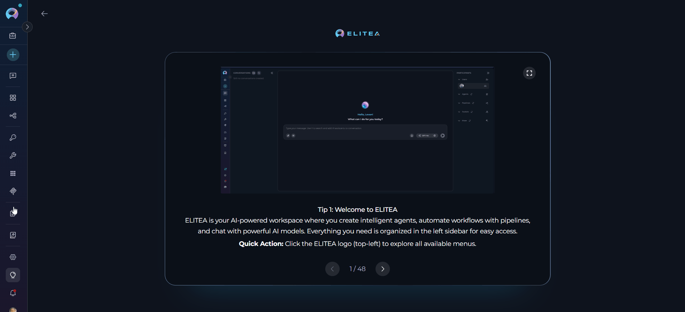{loading=lazy}

### Main Elements:

* **Buckets Sidebar:**
    * A sidebar on the left lists all artifact buckets for the project.
* **Add Bucket Button:** 
    * Located at the top of the sidebar, this button initiates the process of creating a new artifact bucket.
* **Search Bar for Buckets:**
* **Storage Settings Button:**
    * Located at the top of the sidebar, provides access to storage configuration and information.
* **File List:** 
    * Located to the right of the bucket list, this panel displays the files contained within the selected bucket. The list shows file name, size, last update date, and available actions (Preview, Download, Delete). A bulk delete option for selected files and an info icon are located in the upper right corner. Pagination is available for long file lists, along with options to adjust the number of files displayed per page and sort files by column headers.

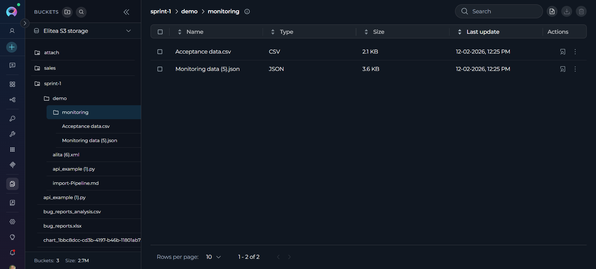{loading=lazy}

## Artifact Functionality

**Buckets Sidebar and Grouping**

* **Sidebar:** The sidebar on the left lists all artifact buckets for the project. The sidebar is expandable and collapsible, allowing users to show or hide it as needed for a more flexible workspace.
* **Auto-selection:** When no bucket is selected, the system automatically selects the most recently active bucket based on file activity for better user experience.

   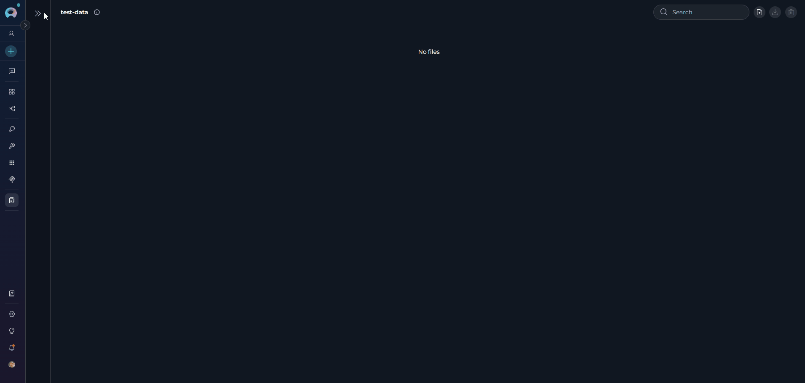{loading=lazy}

**Storage Settings**

* **Storage Settings Button:** Located at the top of the sidebar, click the storage icon to open the storage settings menu.
* **Storage Configuration Menu:** Displays all available storage configurations (personal and shared) for the project.
* **Storage Selection:** Each storage option in the menu shows:
    * Storage configuration name
    * Storage type (e.g., "S3 STORAGE")
    * Bucket count (number of buckets in the selected storage)
    * Storage usage information:
        * **With quota:** Displays used space and total quota (e.g., "5.2GB / 9GB")
        * **Without quota:** Shows only used space (e.g., "Used: 5.2GB")
    * A checkmark icon indicates the currently selected storage
* **Switching Storage:** Click on any storage option to switch between different storage configurations(if any)
* **Loading State:** Shows "Loading usage..." while storage usage information is being retrieved

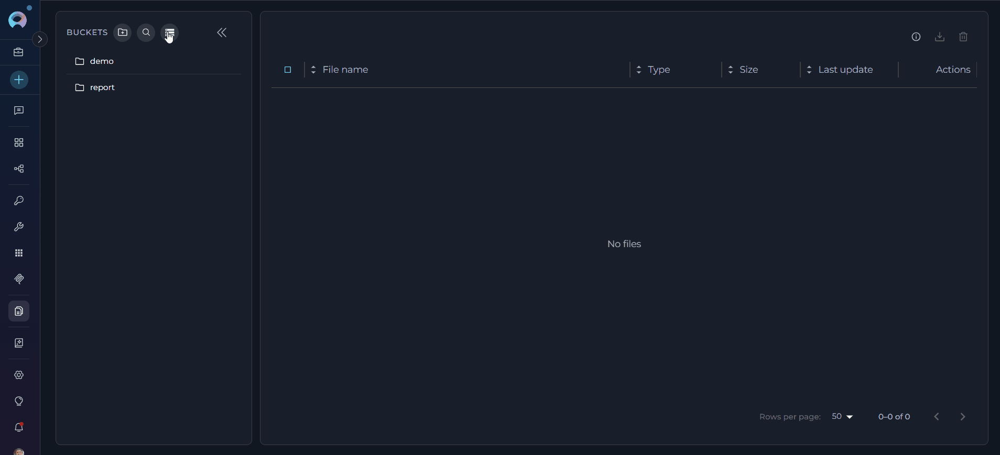{loading=lazy}

**Searching and Filtering**

* **Search Bar:** Use the search bar at the top of the sidebar to find buckets by name or ID. Results update instantly as you type.
* **Search Activation:** The search function can be activated by clicking the search icon, which expands to show a full search input field.
* **Storage Type Filter:** Use the storage settings dropdown to switch between different storage configurations if multiple are available.

  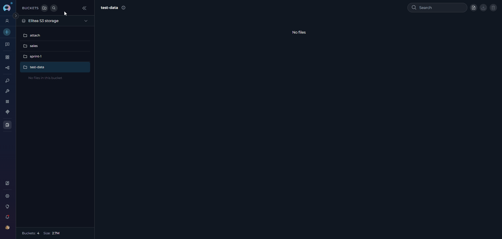{loading=lazy}

###  Creating a New Bucket

1. **Initiate Bucket Creation:** Click the **"+ Create Bucket"** button located at the top of the sidebar.

2. **Bucket Form:** A bucket creation form will appear with the following fields:

    * **Name (Required):** Enter a unique name for your bucket
        * Must start with a letter
        * Can contain only letters, numbers, and hyphens
        * Maximum length: 56 characters
        * Default placeholder: "new-bucket"
    
    * **Retention Policy (Required):** Configure how long files are retained
        * **Period Type:** Select from dropdown (Days, Weeks, Months, Years)
        * **Value:** Enter a number (minimum: 1)
        * Default: 1 Month

3. **Save or Cancel:**
    * Click **"Save"** to create the bucket with the specified configuration
    * Click **"Cancel"** to discard and return to the bucket list
    * The Save button is disabled if the name is invalid or missing

4. **After Creation:** The newly created bucket will appear in the bucket list

{loading=lazy}

!!! note "Bucket Name Uniqueness"
    If a bucket with the same name already exists in the selected storage, an error message will appear: `Bucket with name [bucket-name] already exists`. You must choose a different name to create a new bucket.

### Editing and Deleting Buckets

**Editing a Bucket:**

* **Access Edit Mode:** In the Bucket List, click on the three dots icon next to the bucket you want to modify. A context menu with an **"Edit"** icon (pencil icon) will appear. Click on this "Edit" icon.
* **Modify Retention Policy:** The "Edit Bucket" dialog will open, displaying the current retention policy. Modify the "Period Type" and "Value" as needed to set a new retention period. Note that you **cannot change the bucket name** in edit mode.
* **Permission-based Access:** Edit functionality is available based on user permissions (bucket owner, or users with artifacts.buckets.update permission).
* **Save or Discard Changes:**
      * Click **"Save"** to apply the new retention policy to the bucket.
      * Click **"Cancel"** to discard the changes and revert to the original retention policy.

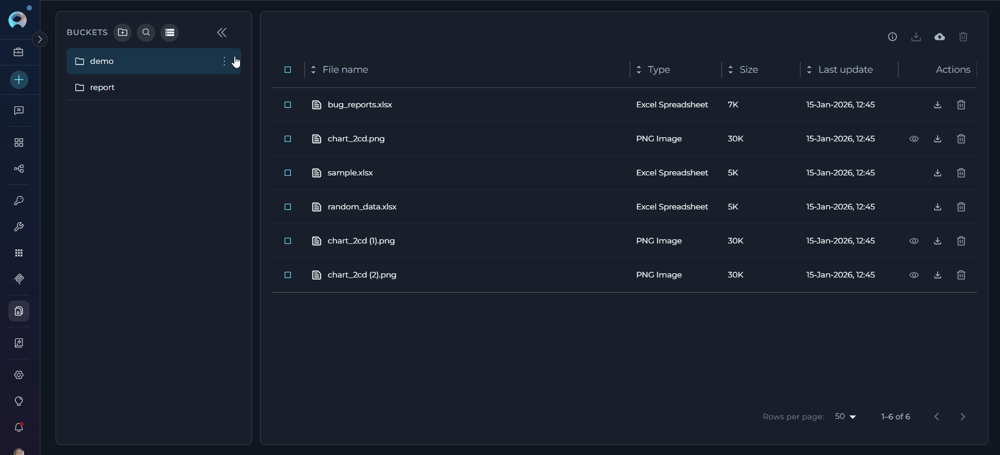{loading=lazy}

**Deleting a Bucket:**

* **Access Delete Mode:** In the Bucket List, click on the three dots icon next to the bucket you want to delete. A context menu with a **"Delete"** icon (trash can icon) will appear. Click on this "Delete" icon.
* **Confirmation Dialog:** A confirmation dialog will appear, prompting you to confirm the bucket deletion.
* **Delete Bucket:** Click the **"Delete"** button in the confirmation dialog to permanently delete the bucket and all files it contains.

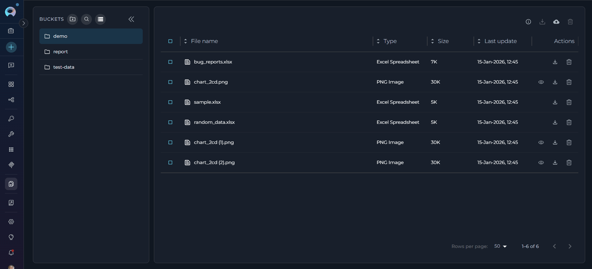{loading=lazy}

!!! warning "Warning"
    Deleting a bucket is a permanent action. All files within the bucket will be deleted and cannot be recovered.
        
    **Permission-based Access:** Delete functionality is available based on user permissions (bucket owner, or users with artifacts.buckets.delete permission).
        
    **Auto-selection After Deletion:** When a bucket is deleted, if it was the currently selected bucket, the system automatically selects the next available bucket to maintain workflow continuity.

##  Uploading Files to a Bucket

**Upload Methods:**

There are three ways to upload files to a bucket:

1. **Drag and Drop:** Drag files from your computer's file explorer and drop them directly into the file list area (requires a bucket to be selected first)
    
     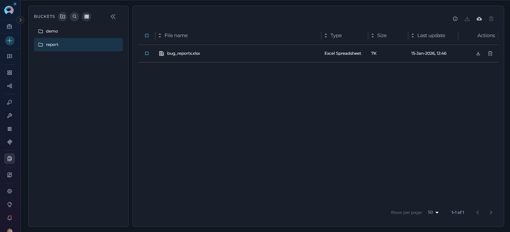{loading=lazy}

2. **Upload Button:** Click the cloud upload icon in the file table toolbar to open a file browser and select files to upload (requires a bucket to be selected)
    
      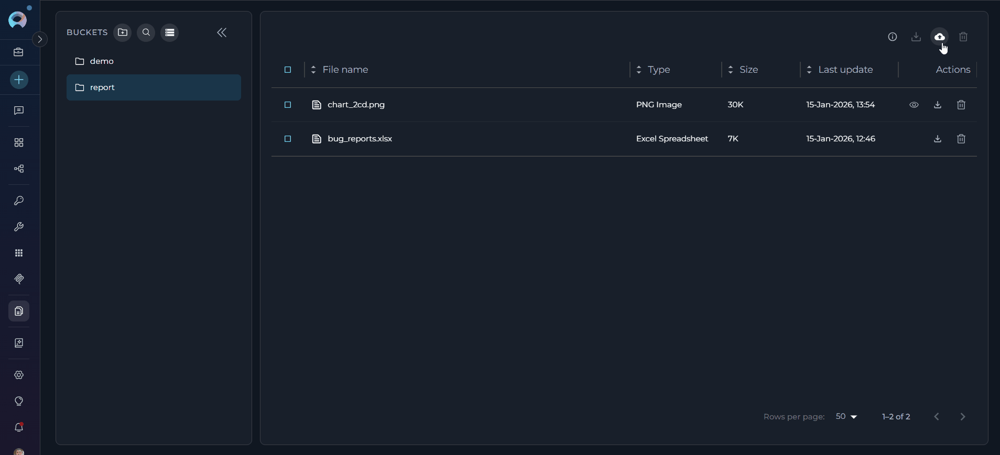{loading=lazy}

3. **Bucket Action Menu:** Click the three dots icon next to any bucket in the sidebar and select "Upload files" from the context menu to upload directly to that bucket

**Supported File Types:**

* **All file types are accepted** - No file type restrictions
* **Multiple files** can be uploaded simultaneously

| Category | File Types |
|----------|------------|
| **Programming Languages** | Python, JavaScript, TypeScript, Java, C++, C#, Go, Rust, PHP, Ruby, Perl, Lua, Dart, Kotlin, Swift, Scala, R |
| **Data Formats** | JSON, CSV, TSV, SQL, YAML, XML, JSONL, NDJSON |
| **Documents** | Markdown, Text, PDF, Word (DOC, DOCX), Excel (XLS, XLSX), PowerPoint (PPT, PPTX) |
| **Configuration Files** | .env, .config, .properties, YAML, TOML, INI, .gitignore, .editorconfig, .eslintrc, .prettierrc |
| **Web Technologies** | HTML, CSS, SCSS, Sass, Less, SVG |
| **Images** | JPEG, PNG, GIF, BMP, WebP, ICO |
| **Archives** | ZIP, TAR, GZ, RAR, 7Z |
| **Shell Scripts** | Bash, Zsh, PowerShell |
| **Build Files** | Dockerfile, Makefile, Gradle, Maven POM, CMake |
| **Other** | Log files, Patch files, Feature files, LaTeX, reStructuredText |

**Upload Behavior:**

* **Permission Requirements:** Upload functionality requires appropriate permissions
* **Duplicate File Handling:** If files with the same name already exist in the bucket, a confirmation dialog appears:
    * Lists all duplicate filenames
    * Warns that uploading will override existing files
    * Provides options to proceed or cancel
    * Once confirmed, files are overwritten without additional prompts
    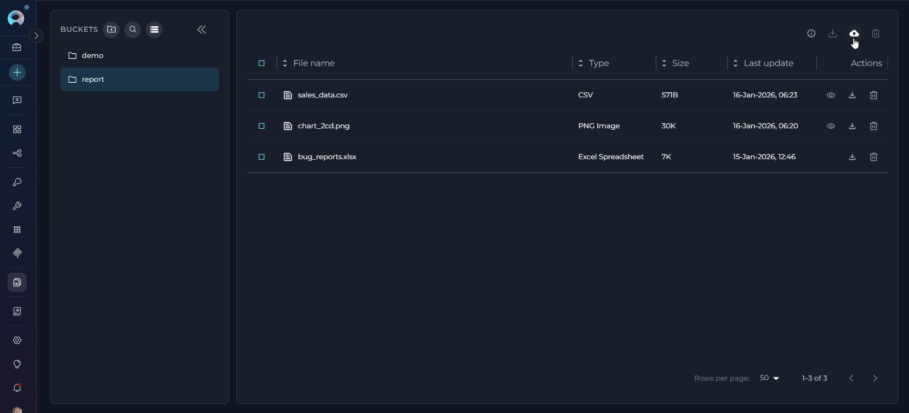{width="400" loading=lazy}
* **Upload Progress:** Visual feedback shows upload status for each file in the file list
* **Uploading Rows:** Files being uploaded appear in the table with "Uploading..." status and progress indicators
* **Auto-Refresh:** The file list automatically refreshes after upload completion to show the newly uploaded files

## Viewing and Managing Files In a Bucket

* **Select a Bucket:** Click a bucket in the sidebar to view its files in the main panel.
* **File Table:** The table shows file name, type, size, last update, uploader, and actions. File type icons/labels are shown automatically based on file extensions.
* **Permission-based Actions:** Available actions depend on user permissions (create, update, delete) and bucket ownership.
* **Bucket Information:** A bucket info tooltip displays the current retention policy in a user-friendly format (e.g., "1 Year", "6 Months").
* **File List Navigation:**
    * **Pagination:** If the file list is long, pagination controls will appear below the list, allowing you to navigate through multiple pages of files (default: 50 files per page).
    * **Items Per Page:** Use the "items per page" selector to adjust the number of files displayed on each page.
    * **Sorting:** Click on the column headers ("Name," "Size," "Last Update Date") to sort the file list by that column in ascending or descending order.

    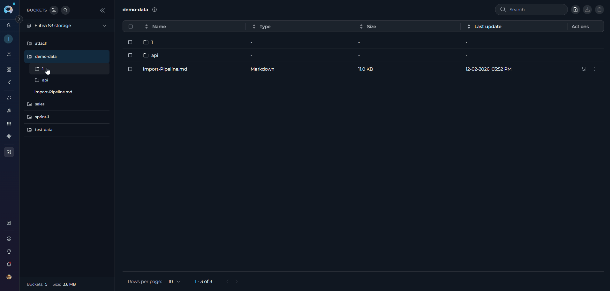{loading=lazy}

### File Preview

* Navigate to the File List of the bucket containing the file you want to preview.
* Click on the Preview icon (eye symbol). Files must be under the size limit for preview (varies by file type, with flexible limits based on file content).
* The file will open in **Canvas Mode**, providing a full-featured preview experience without leaving the Artifacts page.
    
**Preview Features:**

* **Canvas-like Interface:** Files open in a dedicated preview panel with header controls and content area.
* **Language Detection and Selection:** Automatic programming language detection with manual override option via dropdown selector.
* **Multiple View Modes:** Support for different rendering modes depending on file type:
  * **Text and Code Files:** Displayed with syntax highlighting, line numbers, and proper formatting for over 50+ supported programming languages and file types.
  * **Markdown Files:** Toggle between **Raw** (source code) and **Preview** (rendered) modes.
      * Raw mode shows the original Markdown source with syntax highlighting
      * Preview mode displays the rendered Markdown with proper formatting, including support for Mermaid diagrams
  * **CSV/TSV Files:** Toggle between **Raw** (text view) and **Table** (formatted table) modes for better data visualization.
  * **Image Files:** Direct image preview with proper scaling and centering.
  * **Mermaid Diagram Files:** Toggle between **Raw** (source) and **Diagram** (rendered) modes to view both the code and the visual diagram.

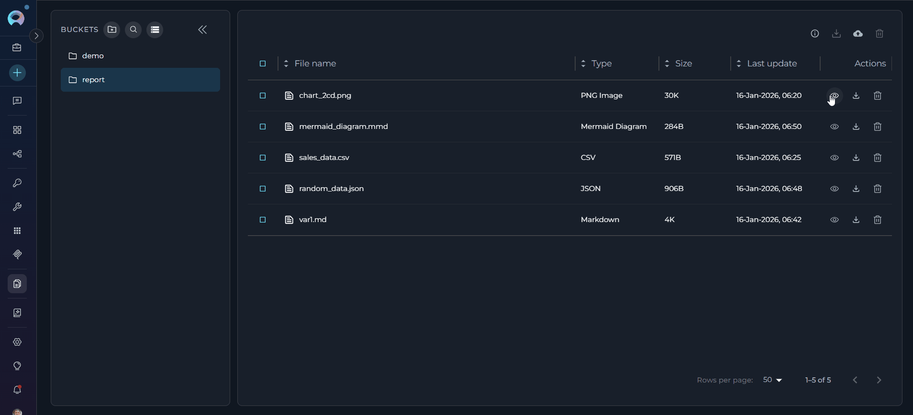{loading=lazy}

**Preview Controls:**

* **Copy Functionality:** Copy the entire file content or selected portions using the Copy button in the preview toolbar.
* **Language Override:** Manually select syntax highlighting language from an extensive list of supported programming languages.
* **Close/Navigation:** Easy close button to return to the file list.
* **Auto-detection:** Supports a wide range of file types including programming languages, configuration files, documentation formats, data files, and more.

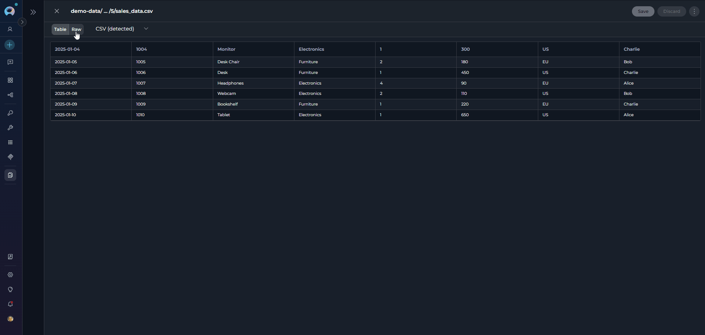{loading=lazy}

!!! info "File Preview Requirements"
    **File Type Requirements:**
    
    Preview is available only for supported file types including programming languages (Python, JavaScript, Java, C++, etc.), data formats (JSON, CSV, YAML, XML), configuration files, web technologies (HTML, CSS), images (JPEG, PNG, GIF, SVG), and special files (Dockerfile, Makefile, .gitignore). Binary files and unsupported formats cannot be previewed.
    
    **File Size Limit:**
    
    Preview is available for files under **2MB**. Files exceeding this limit will show "File too large to preview" message with download option instead.
    
    This feature enables comprehensive inspection of file contents directly within the Artifacts interface, significantly streamlining workflow and reducing context switching.
   

###  Downloading Files from a Bucket

*   **Download Progress:** The system provides feedback during the download process.
*   **Single File Download:** Navigate to the File List and locate the **"Download"** icon (download arrow icon) on the right side of the file entry. Click this icon to download the file to your local computer.
*   **Multiple File Download:** Select multiple files using the checkboxes, then click the **"Download files"** button in the toolbar to download all selected files.

!!! info "Permission Requirements"
    Download functionality is generally available to all users with bucket access.

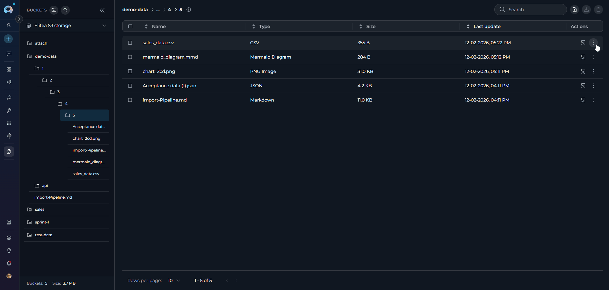{loading=lazy}

###  Deleting Files from a Bucket

*   **Access File List:** Navigate to the File List of the bucket containing the files you want to delete.
*   **Single File Deletion:** Click the **"Delete"** icon (trash can) on the right side of the file entry to delete individual files.
*   **Multiple File Deletion:** To delete multiple files at once:
    *   Select the checkboxes next to each file you want to delete in the File List.
    *   Once one or more files are selected, a **"Delete"** icon will become active in the upper part of the File List (above the list itself). Click this "Delete" icon to delete all selected files.
*   **Permission Requirements:** Delete functionality requires appropriate permissions (artifacts.delete or bucket ownership).
*   **Confirmation:** You may be prompted to confirm the file deletion before it is permanently removed.

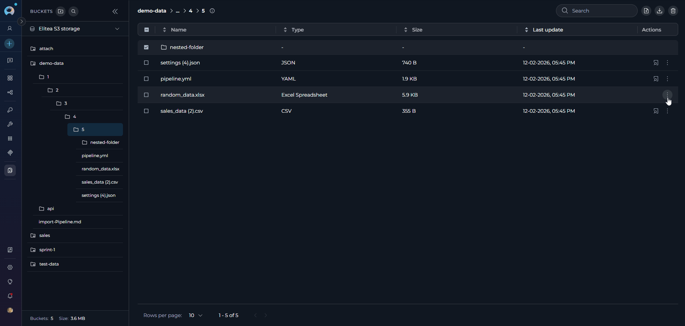{loading=lazy}

## Troubleshooting

??? warning "Cannot upload files to bucket"
    **Possible causes:**
    
    * No bucket is selected - Select a bucket from the sidebar before uploading
    * Insufficient permissions - Ensure you have `artifacts.create` or `artifacts.buckets.create` permission
    * Storage quota exceeded - Check storage usage in storage settings menu
    * Network connectivity issues - Verify your internet connection and try again

??? warning "File preview not available"
    **Possible causes:**
    
    * File type not supported - Preview only works with supported file types (programming languages, data formats, configuration files, images, etc.)
    * File size exceeds 2MB limit - Files larger than 2MB cannot be previewed. Download the file to view it locally
    * File is corrupted - Try re-uploading the file
    * Binary file format - Binary files cannot be previewed in the browser

??? warning "Bucket creation fails"
    **Possible causes:**
    
    * Bucket name already exists - Choose a different unique name for your bucket
    * Invalid bucket name format - Name must start with a letter and contain only letters, numbers, and hyphens (max 56 characters)
    * Insufficient permissions - Ensure you have `artifacts.buckets.create` permission
    * Invalid retention policy - Ensure retention value is a positive integer and period type is selected

??? warning "Cannot delete files or buckets"
    **Possible causes:**
    
    * Insufficient permissions - Ensure you have `artifacts.delete` permission or are the bucket owner
    * Files are in use - Wait for any ongoing operations to complete
    * Network issues - Check your connection and try again

??? warning "Upload shows duplicate file warning"
    **Expected behavior:**
    
    * This is a confirmation dialog, not an error - The system detects files with matching names in the bucket
    * Click "Proceed" to overwrite existing files or "Cancel" to abort the upload
    * Once confirmed, duplicate files will be replaced without additional prompts

??? warning "Storage settings show 'Loading usage...'"
    **Possible causes:**
    
    * Storage data is being retrieved - Wait a few seconds for the information to load
    * Network latency - Check your internet connection
    * Storage configuration issues - Contact your administrator if the issue persists

??? warning "Files disappear from bucket"
    **Possible causes:**
    
    * Retention policy expired - Files are automatically deleted when the retention period ends
    * Manual deletion - Another user with appropriate permissions may have deleted the files
    * Agent actions - Agents with access to the Artifact Toolkit may have deleted files during workflow execution
    * Check retention policy settings and project activity logs for more information

### Support Contact

If you encounter issues not covered in this guide or need additional assistance with artifact management, please refer to **[Contact Support](../support/contact-support.md)** for detailed information on how to reach the ELITEA Support Team.

## FAQ

??? question "What types of files can I upload?"
    All file types are supported for upload. For optimal agent workflow integration, plain text files are recommended. The preview feature supports 50+ file types including programming languages, configuration files, documentation formats, data files (CSV/TSV), images, and Mermaid diagrams. See the [Artifact Toolkit Guide](../integrations/toolkits/artifact_toolkit.md) for agent-specific usage details.

??? question "How can I preview files?"
    Select a file and click the preview icon (eye symbol) to open it in Canvas Mode. The preview supports multiple view modes: code with syntax highlighting, rendered Markdown, table view for CSV/TSV files, and rendered diagrams for Mermaid files. You can copy content, switch languages, and toggle between raw and rendered views.

??? question "Who can access artifact files?"
    Access is controlled by project membership and specific permissions. Users need appropriate permissions for different actions: artifacts.create for uploading, artifacts.buckets.update for editing buckets, artifacts.delete for deleting files, etc. Bucket owners have full control over their buckets.

??? question "Can I use multiple storage configurations?"
    Yes, if your project has access to multiple storage integrations (personal and shared), you can switch between them using the storage settings menu. Each storage configuration maintains its own set of buckets and quota limits.

??? question "How does the file size limit work for previews?"
    Preview is available for files under 2MB. Files exceeding this limit will show "File too large to preview" message with the file size details and a download option instead.

??? question "What happens to my bucket selection when I switch projects?"
    Bucket selections are isolated by project context. Each project maintains its own selection state, and switching projects will not affect your bucket selections in other projects.

??? question "Why do I get an error when creating a bucket?"
    Check that the retention policy is valid, the name follows conventions (starts with letter, only letters/numbers/hyphens, max 56 characters), and you have the necessary permissions. Reduce the retention period if it exceeds storage limitations.

??? question "Why is the 'Save' button disabled?"
    The bucket name may be invalid or not unique, the retention value is not a valid integer, or you don't have the necessary permissions to create/modify buckets.

??? question "Why are files missing from my bucket?"
    Files may be deleted due to retention policy expiration, manual deletion by users with appropriate permissions, or agent actions. Check the retention policy settings and project activity logs if available. Files are permanently deleted when buckets are removed.

!!! info "Additional Resources"
    For more information about working with artifacts in ELITEA:
    
    * **[Artifact Toolkit Guide](../integrations/toolkits/artifact_toolkit.md)** - Learn how to use artifacts with ELITEA Agents
    * **[Attach Images and Files in Chat](../how-tos/chat-conversations/attach-images-and-files-in-chat.md)** - Upload and share files in chat conversations
    * **[Data Analysis Internal Tool](../how-tos/chat-conversations/data-analysis-internal-tool.md)** - Analyze data files using the internal data analysis tool