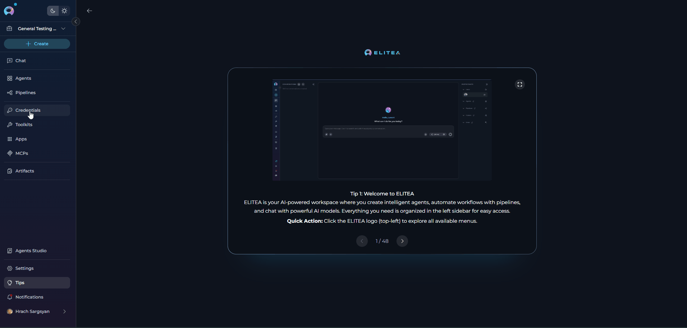
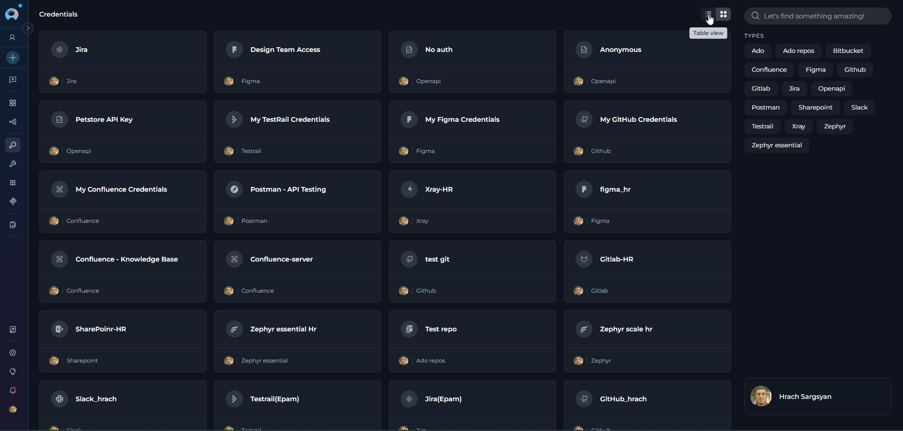
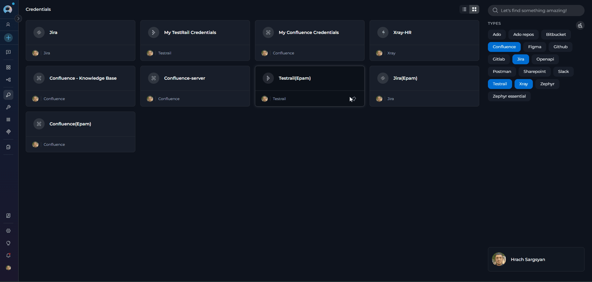
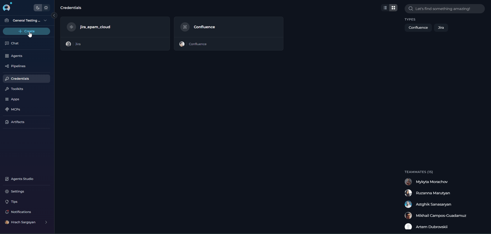
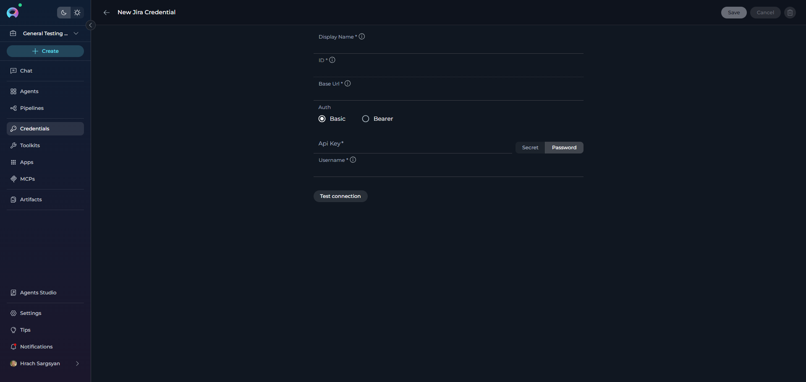
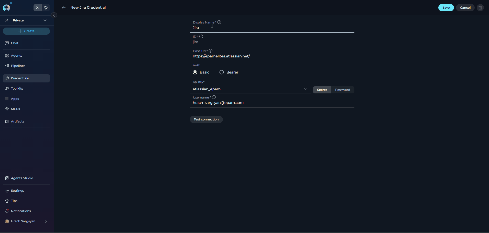
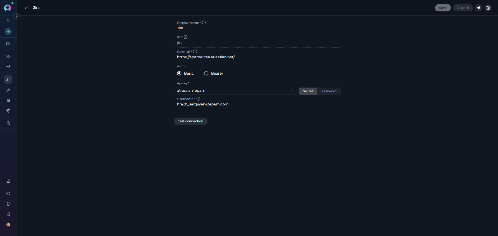

# Credentials

## Introduction to the Credentials Menu

The **Credentials** menu in the ELITEA platform provides a secure and centralized interface for managing the authentication details and access tokens needed to connect your agents and toolkits to external services. Credentials are required for integrations such as project management systems, code repositories, cloud platforms, and other third-party APIs. This guide walks you through the Credentials menu, explains its features, and describes how to manage your authentication data for seamless integration.

---

## What Are Credentials?

**Credentials** in ELITEA are secure records containing sensitive information—such as API keys, OAuth tokens, usernames, or passwords—used to authenticate your agents and toolkits with external platforms. By storing credentials centrally, ELITEA helps ensure secure access control and simplifies credential management across all your integrations.

---

## Navigating the Credentials Menu

The Credentials menu is accessible from the main platform navigation. Upon entering the Credentials section, you'll see a dashboard listing all saved credentials.

{loading=lazy}

### Main Elements:

* **Credential Cards:** Each card displays the credential's name and type.
* **Search and Filter:** Use the search bar to quickly locate credentials by name or type.
* **Add Credential Button:** Use the `+ Create` button to create new credentials.

### Credentials Dashboard

The Credentials dashboard provides multiple ways to view and manage your credentials:

**View Options**

* **Card View** - Visual cards displaying credential name, type, and key information. Ideal for browsing and quick identification.
* **Table View** - Organized list format with columns for detailed credential information. Better for managing large numbers of credentials.

Switch between views using the view toggle button in the top-right corner of the dashboard.

{loading=lazy}

**Search and Filter**

* **Search Bar** - Quickly find credentials by typing the credential name or related keywords
* **Filter by Type** - Filter credentials by their type/category (e.g., show only GitHub, Jira, or Slack credentials). Select one or multiple types to narrow down the list.

{loading=lazy}

**Pinning Credentials**

Pin frequently used credentials to keep them at the top of your list for quick access:

1. Locate the credential you want to pin
2. Click the pin icon (📌) on the credential card or in the table row
3. Pinned credentials will appear at the top of the list, separated from unpinned ones
4. Click the pin icon again to unpin the credential

{loading=lazy}

---

## Supported Credential Types

The ELITEA platform currently supports the following credential types, organized by category to help you quickly find the integration you need:

| **Category**                    | **Credential Type**             | **Description**                         |
|---------------------------------|---------------------------------|-----------------------------------------|
| **Code Repositories**           | ADO Repos                       | Azure DevOps repositories               |
|                                 | Bitbucket                       | Bitbucket code repositories             |
|                                 | GitHub                          | GitHub code repositories                |
|                                 | GitLab                          | GitLab code repositories                |
| **Communication**               | Slack                           | Slack team messaging and notifications  |
| **Development**                 | Sonar                           | SonarQube code quality and security     |
|                                 | SQL                             | SQL database connections                |
| **Documentation**               | Confluence                      | Confluence wiki and documentation       |
| **Integrations**                | OpenAPI                         | OpenAPI specification integration       |
| **Office**                      | SharePoint                      | SharePoint document management          |
| **Other**                       | Figma                           | Figma design collaboration              |
|                                 | Google Places                   | Google Places location services         |
|                                 | Postman                         | Postman API management                  |
|                                 | Salesforce                      | Salesforce CRM                          |
|                                 | ServiceNow                      | ServiceNow IT service management        |
| **Project Management**          | Ado                             | Azure DevOps project management         |
|                                 | Jira                            | Jira issue and project tracking         |
|                                 | Rally                           | Rally agile project management          |
| **Storage**                     | S3 API Credentials              | Amazon S3 compatible storage            |
| **Test Management**             | QTest                           | QTest test management                   |
|                                 | TestRail                        | TestRail test case management           |
|                                 | Xray Cloud                      | Xray test management for Jira Cloud     |
|                                 | Zephyr Enterprise               | Zephyr test management, enterprise      |
|                                 | Zephyr Essential                | Zephyr test management, essential       |
|                                 | Zephyr Scale                    | Zephyr test management for Jira Cloud   |
| **Testing**                     | Browser                         | Browser automation and testing          |
|                                 | Carrier                         | Carrier testing platform                |
|                                 | Report Portal                   | Test reporting and analytics            |
|                                 | TestIO                          | TestIO crowdsourced testing             |

---

## Creating a New Credential

You can add new authentication records to the platform by creating a credential through the Credentials menu.

**How to Create a New Credential**

Follow these steps to add authentication details to the platform:

1. **Open the Credentials Menu:** Go to the Credentials section from the main navigation bar.
2. **Click `+ Create`:** Find the `+ Create` button at the top of the sidebar.

{loading=lazy}

!!! note "Note"
    Only users with the necessary permissions can create or configure credentials. If the `+ Create` button is disabled, contact your platform administrator.

**Selecting a Credential Type**

Choose the required credential type from the categorized list. The credential types are organized by category to help you quickly find the integration you need. You can also use the search bar to quickly locate a specific credential type by name.

{loading=lazy}

### Configuring Credential Details

Once you've selected a credential type, you'll need to configure the following fields:

**Main Configuration Fields:**

* **Display Name*** - A clear, descriptive name for your credential that helps identify its purpose
* **ID*** - A unique identifier for the credential (auto-generated or customizable depending on the platform configuration)
* **Parameters** - Integration-specific fields that vary by credential type, such as:
    * **API Key/Token*** - Authentication key or token (requirements vary by integration)
        * Can reference a **Secret** for enhanced security
        * Can use a **Password** field type for masked input
    * **URLs** - Service endpoints or base URLs
    * **Usernames** - Account identifiers
    * **Additional Fields** - Other integration-specific parameters

!!! warning "Security Recommendation"
    When prompted for sensitive information like API keys, passwords, or tokens, it's recommended to use **[Secrets](../getting-started/create-secret.md)** instead of entering plain text values. Secrets provide enhanced security for your sensitive data.

{loading=lazy}

!!! tip "Tip"
    The exact fields required for each credential depend on the integration type. For detailed setup instructions for each credential type, see the [How to Use Credentials](../how-tos/credentials-toolkits/how-to-use-credentials.md) guide.

**Saving Your Credential**

Before saving, you can use the **Test Connection** button to verify your credential configuration (availability varies by credential type). This helps ensure your credentials are correctly configured before adding them to your dashboard.

Click **Save** (top right) to add the credential to your dashboard. It will now appear in the list, ready for assignment to toolkits.

{loading=lazy}

---

## Editing and Managing Credentials

**How to Edit an Existing Credential**

To edit a credential, open its detailed page from the Credentials dashboard. On this page, you can:

* **Edit Credential Details:** Update the name and parameters (API keys, tokens, URLs).
* **Save Changes:** Click **Save** to apply your updates. Changes are applied immediately and reflected in the dashboard.
* **Delete Credential:** Use the "Delete" icon (top right) to remove the credential. Enter the name of the credential and Confirm deletion in the dialog.

{loading=lazy}

!!! tip "Tip"
    Regularly rotate and update your credentials to maintain security and compliance.

---

## Assigning Credentials to Toolkits and Agents

Once a credential is created, it is available for assignment when configuring toolkits or agents:

1. When adding or editing a toolkit, open the Credentials dropdown.
2. Select an existing credential from the list or create a new one.
3. Save your changes to apply the credential to your toolkit or agent.

!!! note "Reference"
    For more information on creating and managing Toolkits, see the [Toolkits documentation](../how-tos/chat-conversations/how-to-create-and-edit-toolkits-from-canvas.md)

---

## Troubleshooting

??? warning "Failed Authentication"
    Double-check credential values and permissions. Verify that:
    
    * The API keys, tokens, or passwords are correct and haven't expired
    * Your account has the necessary permissions for the integration
    * The service URLs are accurate and accessible

??? warning "Credential Not Appearing"
    If a credential doesn't show up in your list:
    
    * Refresh the credential list or reload the page
    * Verify your permissions - you may not have access to view certain credentials
    * Check if you're viewing the correct project scope (personal vs. project credentials)

??? warning "Toolkit/Agent Cannot Use Credential"
    When a toolkit or agent can't access a credential:
    
    * Ensure the credential is correctly assigned to the toolkit or agent
    * Verify the credential type is compatible with the integration
    * Check that the credential hasn't been deleted or modified by another user

For further assistance, contact your platform administrator.

### Support Contact

If you encounter issues not covered in this guide or need additional assistance with credential management, please refer to **[Contact Support](../support/contact-support.md)** for detailed information on how to reach the ELITEA Support Team.

---

!!! info "Additional Resources"
    Explore these related guides to enhance your credential management experience:

    * **[Glossary](../home/glossary.md)** — Definitions of common terms used across the platform
    * **[Toolkits](../menus/toolkits.md)** — Complete guide to the Toolkits menu interface and advanced configuration options
    * **[How to Use Credentials](../how-tos/credentials-toolkits/how-to-use-credentials.md)** — Step-by-step guide for creating and managing credentials
    * **[Secrets Management](./settings/secrets.md)** — Secure credential storage best practices