# MCPs

## Introduction to the MCPs Menu

The **MCPs** menu in the ELITEA platform provides a centralized interface for managing and configuring Model Context Protocol (MCP) servers that extend your AI agents' capabilities. MCPs enable your agents to interact with external services and tools through standardized protocol interfaces. This guide walks you through the MCPs menu, explains how to navigate its features, and describes how to configure and use MCPs effectively.

---

## What Are MCPs?

**MCPs** (Model Context Protocol servers) are external tool providers that follow the MCP specification to expose specialized capabilities to ELITEA. Unlike native toolkits (built-in integrations), MCPs represent connections to external servers that can provide tools for browser automation, repository operations, API integrations, and other domain-specific tasks.

ELITEA supports two types of MCPs:

* **Local MCPs** - External MCP servers running locally and connected through the Elitea MCP Client (STDIO transport)
* **Remote MCPs** - HTTP/HTTPS-based MCP servers accessible over the network

Once configured, MCP tools become available to agents, pipelines, and conversations just like native toolkit tools, enabling powerful automation and orchestration capabilities.

---

## Navigating the MCPs Menu

The MCPs menu is accessible from the main platform navigation. Upon entering the MCPs section, you'll see a dashboard listing all configured MCP servers for your project.

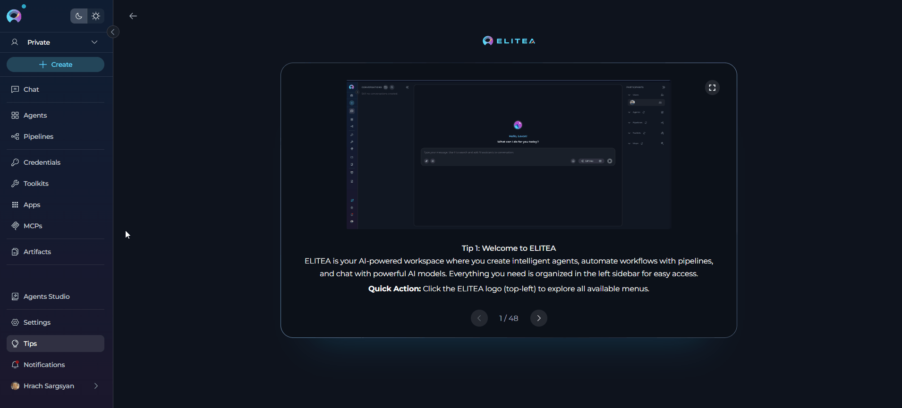{loading=lazy}

**Main Elements:**

* **MCP Cards:** Each card displays the MCP name, type (Local/Remote), connection status, and available tools count.
* **Search and Filter:** Quickly locate MCPs using the search bar or filter by type (Local/Remote).
* **Create MCP Button:** Use the `+ Create` button to add a new MCP configuration.

### MCPs Dashboard

The MCPs dashboard provides multiple ways to view and manage your MCP servers:

**View Options**

* **Card View** - Visual cards displaying MCP name, type, connection status, and key information. Ideal for browsing and quick identification.
* **Table View** - Organized list format with columns for detailed MCP information. Better for managing large numbers of MCPs.

Switch between views using the view toggle button in the top-right corner of the dashboard.

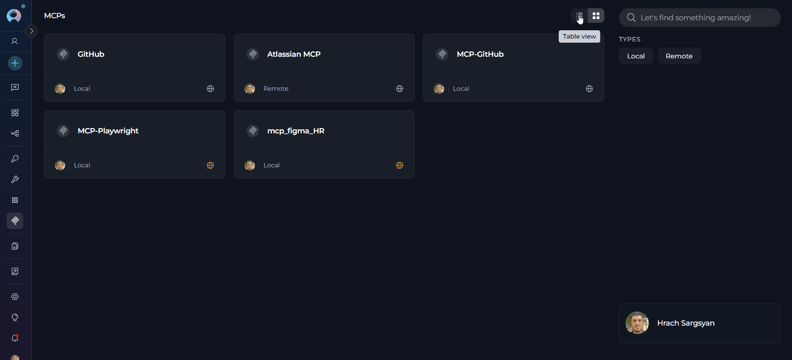

**Search and Filter**

* **Search Bar** - Quickly find MCPs by typing the MCP name or related keywords
* **Filter by Type** - Filter MCPs by their type:
    * **Local** - MCPs running locally via Elitea MCP Client
    * **Remote** - HTTP/HTTPS-based MCP servers

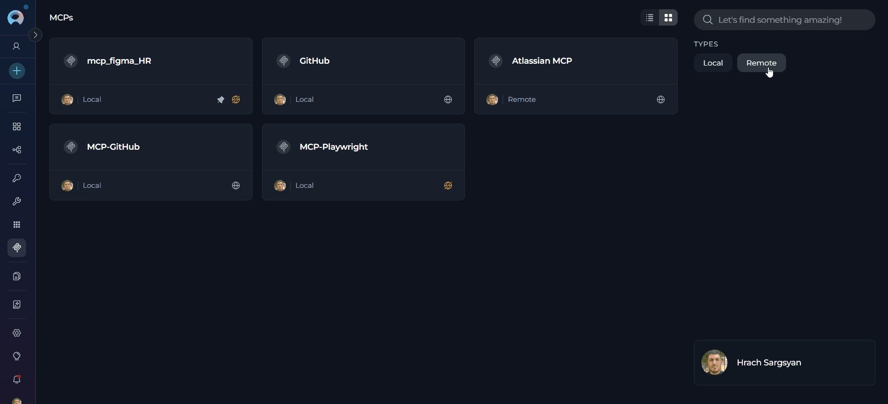

**Pinning MCPs**

Pin frequently used MCPs to keep them at the top of your list for quick access:

1. Locate the MCP you want to pin
2. Click the pin icon (📌) on the MCP card or in the table row
3. Pinned MCPs will appear at the top of the list, separated from unpinned ones
4. Click the pin icon again to unpin the MCP

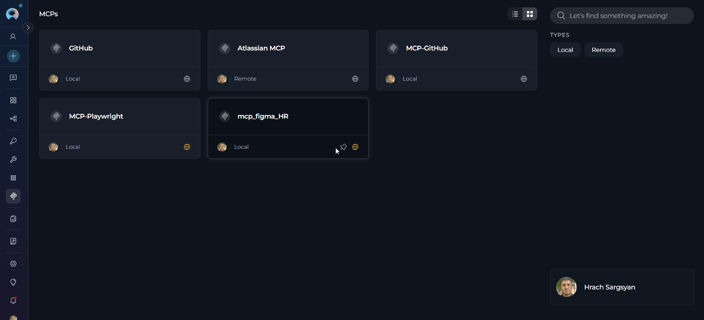{loading=lazy}

**MCP Connection States**

MCPs display their current connection status:

* **Connected** (Grey) - Active connection; tools are available for use

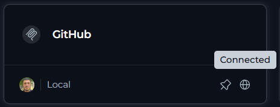{width="250"}

* **Disconnected** (Orange) - MCP exists but cannot reach server; tools unavailable

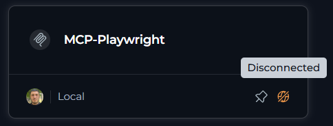{width="250"}
---

## MCP Types

ELITEA supports two types of MCP servers, each designed for different deployment scenarios and use cases:

### Local MCPs

**Local MCPs** are external MCP servers running on your local machine and connected through the Elitea MCP Client using STDIO (Standard Input/Output) transport.

**Key Features:**

* Connected via Elitea MCP Client (STDIO transport)
* Run as local processes on your machine
* Automatically discovered when MCP Client is running
* Ideal for development and local automation tasks

For detailed setup instructions, see the **[MCP Client Integration Guide](../integrations/mcp/create-and-use-client-stdio.md)**.

### Remote MCPs

**Remote MCPs** are HTTP/HTTPS-based MCP servers accessible over the network, hosted anywhere accessible to your ELITEA instance.

**Key Features:**

* No local client installation required
* Accessed via HTTP/HTTPS URLs
* Support OAuth 2.0 authentication
* Ideal for team environments and cloud deployments
* Easier to share across teams and projects

**Common Examples:** GitHub MCP, Atlassian MCPs (Jira, Confluence)

For detailed setup instructions, see the **[Remote MCP Integration Guide](../integrations/mcp/create-and-use-remote-mcp.md)**.

---

## Creating a New MCP

### Creating a Local MCP

!!! warning "Prerequisites"
    Before creating a Local MCP entry, ensure the Elitea MCP Client is installed and running with your target MCP server configured and connected. 
    
    If no local MCP servers are available, you'll see a message: **"Still no local MCP available. Follow creation guides in our [Documentation](../integrations/mcp/create-and-use-client-stdio.md)."** with a link redirecting you to the MCP Client Integration Guide for installation and setup instructions.

	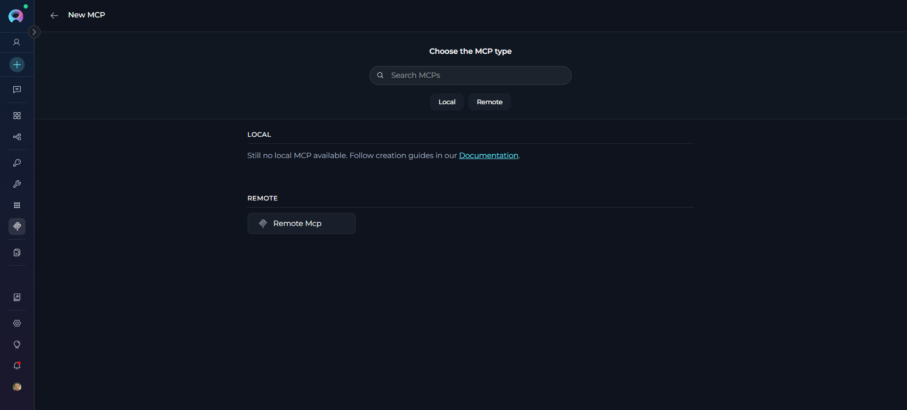{width="450"}

**How to Create a Local MCP:**

1. **Open the MCPs menu** from the main navigation.
2. **Click the `+ Create` button** in the dashboard.
3. **Select the available Local MCP servers** that are running locally and connected to your project.
4. **Enter basic details:**
    * **Name (Required):** Descriptive label (e.g., "Playwright Browser Automation")
    * **Description (Optional):** A brief description to clarify the MCP's purpose and usage
5. **TOOLS** - Select which specific tools and actions to enable for this MCP
    * Review available tools carefully and enable only those needed for your use case
    * Enabling only necessary tools improves security (principle of least privilege) and optimizes performance
    * **[Make Tools Available by MCP](../integrations/mcp/make-tools-available-by-mcp.md)** - (optional checkbox) Enable this option to make the selected tools accessible through the external MCP clients to use the toolkit's capabilities
6. **Click `Create`** to finalize. The new MCP card appears in your dashboard with its current connection status.

    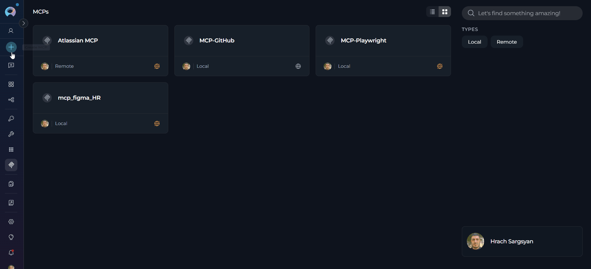{loading=lazy}

### Creating a Remote MCP

Remote MCPs connect to external MCP servers over HTTP/HTTPS. They are ideal for cloud-based integrations like GitHub, Atlassian (Jira/Confluence), and other enterprise services.

!!! warning "Prerequisites"
    Ensure you have the following ready before proceeding:
    
    * **Server URL**: HTTP/HTTPS endpoint of the remote MCP server
    * **Authentication Credentials**: Depending on the server:
        * Bearer token (API key)
        * OAuth 2.0 client credentials (Client ID, Client Secret)
        * Custom authentication headers

**How to Create a Remote MCP:**

1. Navigate to **MCPs** → Click **+ Create**
2. Click **Remote MCP** 
3. Enter name, description, and server URL
4. Configure authentication (Headers, OAuth, or None)
5. Click **Load tools** 
6. Complete OAuth flow 
7. Select tools and click **Create**

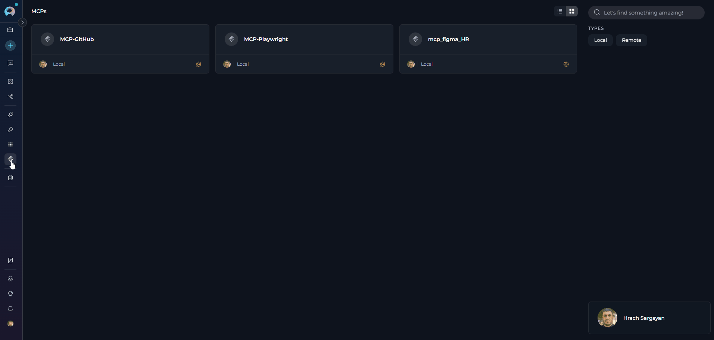

!!! info "Detailed Configuration Guide"
    For comprehensive setup instructions, authentication methods, real-world examples (GitHub, Atlassian), and troubleshooting, see the **[Remote MCP Integration Guide](../integrations/mcp/create-and-use-remote-mcp.md)**.

---

## Managing MCP Configuration

After creating an MCP, you can view and edit its configuration by clicking on the MCP card in the dashboard. The MCP detail page provides two main tabs for managing different aspects of your MCP:

### Run Tab

The **Run Tab** is where you configure the MCP's connection settings and manage enabled tools.

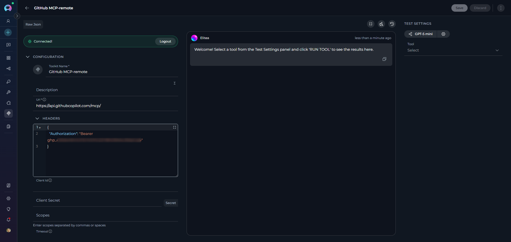{loading=lazy}

**What You Can Do on the Run Tab:**

* **Edit MCP Details:** Update the name and description
* **Manage Tool Selection:** Configure which specific tools are enabled for this MCP. In the "Tools" section, select only the tools your agents will use. Enabling only necessary tools improves security (principle of least privilege) and optimizes performance
* **Update Connection Settings (Remote MCPs):** Modify server URL, authentication credentials, session ID, timeout, and custom headers
* **Connection Badge (Remote MCPs):** Log in or log out using OAuth authentication. The connection badge shows your current authentication status
* **Save Changes:** Click **Save** to apply your updates. Changes are applied immediately and reflected in the dashboard
* **Remove MCP:** Click the **Remove** (trash) icon to delete the MCP. Confirm the removal in the dialog
* **Copy Link:** Click the copy link icon to copy a direct link to the MCP's detailed page—useful for sharing with teammates who have access

!!! note "Local MCP Configuration"
    If the Local MCP Client is not connected, the configuration will be shown in raw JSON format.

#### Tool Management

When selecting tools for your MCP:
    
* **Review available tools** carefully and enable only those needed for your specific use case
* **Test each enabled tool** using the Test Settings panel to ensure proper functionality
* **Update tool selection** as your requirements change or new tools become available

!!! tip "Least Privilege Principle"
    Enable only the tools you actually need. This reduces complexity, improves performance, and enhances security by limiting the scope of available actions.

#### Testing MCP Functionality

The MCP configuration page includes a **Test Settings** panel on the right side that allows you to test MCP functionality in real-time. For comprehensive testing instructions and best practices, see [How to Test Toolkit Tools](../how-tos/credentials-toolkits/how-to-test-toolkit-tools.md).

**Steps to Test an MCP:**

1. **Select a Model:** Choose the LLM model from the model dropdown (e.g., `gpt-4o`).

2. **Adjust Model Settings** (Optional): Click the **Model Settings** icon (⚙️) next to the model selector to fine-tune the response generation. The settings vary depending on the selected model:
    
    **For Reasoning Models** (e.g., GPT-5.1):
    
    * **Reasoning** - Controls the depth of logical thinking and problem-solving with three levels:
        * **Low**: Fast, surface-level reasoning with concise answers and minimal steps
        * **Medium**: Balanced reasoning with clear explanations and moderate multi-step thinking (default)
        * **High**: Deep, thorough reasoning with detailed step-by-step analysis (may be slower)
    
    **For Standard Models** (e.g., GPT-4o):
    
    * **Creativity** - Controls response randomness and creativity. Lower values produce more focused and deterministic outputs, while higher values generate more diverse and creative responses with five levels (1-5):
        * **1**: Highly focused and deterministic outputs
        * **2**: Mostly focused with slight variation
        * **3**: Balanced between focus and creativity (default)
        * **4**: More varied and creative responses
        * **5**: Maximum creativity and diversity
    
    **Max Completion Tokens** - Limits the maximum length of AI responses measured in tokens (roughly 4 characters per token) (All Models):
    
    * **Auto** (default): System automatically sets the token limit to 4096 tokens
    * **Custom**: Manually set a specific token limit for responses
        * When Custom is selected, you can enter a specific number of maximum tokens
        * The interface shows remaining tokens available after your specified limit
        * Setting too high a value will show an error if it exceeds the model's maximum output tokens

3. **Select Tool:** Use the **Tool** dropdown to choose which MCP tool you want to test.
    * **Search functionality:** Type in the search box to filter available tools
    * **Tool options:** Select from available tools
    * **Provide Required Parameters (if prompted):** Fill in any inputs required by the selected tool

4. **Execute the tool:** Click the **RUN TOOL** button and review the results in the output area. `(The RUN TOOL button appears after selecting a tool.)`

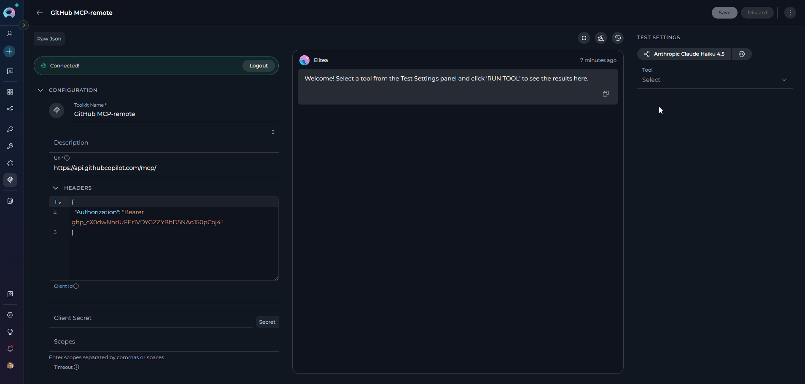{loading=lazy}

### History Tab

The **History** tab provides a comprehensive log of all operations and activities performed with the MCP.
For detailed instructions on using the History tab, see [Toolkits History Tab Guide](../how-tos/credentials-toolkits/toolkit_history_tab.md).

**Using the History Tab**

The History tab allows you to:

* **View operation history:** Track MCP operations and their status
* **Monitor MCP usage:** Review when and how the MCP has been used
* **Track changes:** See configuration changes and updates made to the MCP
* **Troubleshoot issues:** Analyze past operations to identify and resolve problems
* **Audit trail:** Maintain a record of MCP activities for compliance and review purposes

---

## Using MCPs in Workflows

Once an MCP is configured and connected, you can use its tools in various ELITEA workflows:

**In Agents**

1. Navigate to the **[Agents](agents.md)** menu.
2. Select or create an agent.
3. In the agent's configuration, add the desired MCP from the list of available MCPs.
4. Save your agent.

**In Pipelines**

1. Navigate to the **[Pipelines](pipelines.md)** menu.
2. Select or create a pipeline.
3. In the pipeline configuration, add the desired MCP to enable automated workflow steps.
4. Save your pipeline.

**In Chat**

1. Open a **[Chat](chat.md)** session.
2. Access the MCP selector within the chat interface.
3. Select one or more MCPs to make their capabilities available during the conversation.
4. Use natural language to interact with the MCP's features.

!!! info "Tip"
    You can use multiple MCPs simultaneously in agents, pipelines, and chat sessions to create powerful, integrated workflows that span multiple services and platforms.

---

## Best Practices

Following these best practices ensures optimal MCP performance, security, and maintainability:

??? tip "Enable Only Required Tools"
    **Least Privilege Principle:** Disable MCP tools that aren't needed for current workflows. This reduces complexity, improves performance, and enhances security by limiting the scope of available actions.
    
    **How to apply:**
    
    * Review all enabled tools when creating or editing an MCP
    * Disable unused tools in the Run Tab → Tool Management section
    * Periodically audit agent/pipeline tool usage and remove unnecessary MCPs
    
    **Benefits:**
    
    * Faster agent decision-making (fewer tools to evaluate)
    * Reduced risk of unintended tool invocations
    * Clearer audit trails in History Tab

??? tip "Use Clear and Consistent Naming"
    **Naming Convention:** Use descriptive names that clearly identify the MCP's purpose, environment, or scope. Avoid generic names like "MCP 1" or "Test Server".
    
    **Recommended formats:**
    
    * **By Environment:** "GitHub Production", "GitHub Staging", "GitHub Development"
    * **By Purpose:** "Playwright Browser Automation", "Filesystem Local Documents"
    * **By Team:** "DevOps GitHub MCP", "QA Playwright MCP"
    
    **Benefits:**
    
    * Easier to identify correct MCP when assigning to agents/pipelines
    * Reduces configuration errors in multi-environment setups
    * Improves team collaboration and handoff documentation

??? tip "Monitor Connection Status Regularly"
    **Proactive Monitoring:** Check MCP connection states before starting critical operations, especially for time-sensitive workflows.
    
    **What to monitor:**
    
    * **Local MCPs:** Verify Elitea MCP Client is running (system tray or CLI)
    * **Remote MCPs:** Check OAuth login state and token expiration
    * **Both Types:** Review connection status indicators in dashboard
    
    **When to check:**
    
    * Before deploying agents or pipelines to production
    * After system restarts or network changes
    * When agents/pipelines report tool invocation failures
    
    **Quick fix:** Keep MCP Client as a startup application (Local) or set up token refresh notifications (Remote)

??? tip "Test After Server Updates"
    **Version Compatibility:** When updating external MCP server packages or configurations, always re-test key tools before using them in production workflows.
    
    **Testing checklist:**
    
    1. Update MCP server software or configuration
    2. Restart MCP server (Local) or verify remote endpoint
    3. Open MCP in ELITEA and check connection status
    4. Use Test Settings panel to validate critical tools
    5. Review tool parameter schemas for changes
    6. Update agent/pipeline configurations if needed
    
    **Common issues after updates:**
    
    * New tool parameters require additional inputs
    * Deprecated tools removed from server
    * Authentication requirements changed (Remote MCPs)

---

## Troubleshooting

Common MCP issues and their solutions:

??? warning "MCP Shows Disconnected Status"
    **Symptoms:**
    
    * Orange connection indicator
    * Tools unavailable in agents/pipelines/chat
    * "Cannot reach server" error messages
    
    **Likely Causes:**
    
    * **Local MCPs:** Elitea MCP Client not running or server not configured
    * **Remote MCPs:** Network connectivity issue, server down, or incorrect URL
    * **Both:** Configuration mismatch between ELITEA and server
    
    **Resolution Steps:**
    
    1. **Local MCPs:**
        * Check if Elitea MCP Client is running (system tray or `ps aux | grep alita-mcp`)
        * Verify server is listed in MCP Client configuration file
        * Restart MCP Client: `alita-mcp run` or use tray app restart
        * Check MCP Client logs for errors: `~/.alita-mcp/logs/`
    
    2. **Remote MCPs:**
        * Verify server URL is correct and accessible (ping or curl test)
        * Check network connectivity and firewall rules
        * Confirm server is running and responding to HTTP requests
        * Review server-side logs for connection errors
    
    3. **Both Types:**
        * Re-create MCP configuration with correct server details
        * Test connection using Test Settings panel
        * Contact server administrator if issue persists

??? warning "Tools Not Appearing in List"
    **Symptoms:**
    
    * Empty tools list in MCP configuration
    * "No tools available" message
    * Tools missing after server update
    
    **Likely Causes:**
    
    * MCP created while server was offline
    * Server hasn't registered tools yet
    * Authentication required but not completed (Remote MCPs)
    * MCP server configuration error
    
    **Resolution Steps:**
    
    1. Verify MCP shows "Connected" status
    2. **Local MCPs:** Ensure MCP Client is running and server is started
    3. **Remote MCPs:** Complete OAuth authentication if required
    4. Click refresh button in MCP detail page
    5. Close and reopen the MCP configuration page
    6. Check MCP server logs for tool registration errors
    7. If still empty, delete and recreate the MCP entry
    
    **Prevention:** Always ensure server is running and connected before creating MCP configuration

??? warning "Tool Invocation Fails During Execution"
    **Symptoms:**
    
    * Error messages in agent/pipeline execution logs
    * "Tool execution failed" in chat responses
    * Timeout errors or parameter validation failures
    
    **Likely Causes:**
    
    * Incorrect tool parameters provided by AI
    * MCP server bug or crash
    * Network timeout (Remote MCPs)
    * Permission or authentication issues
    
    **Resolution Steps:**
    
    1. Use Test Settings panel to isolate the issue:
        * Test the specific tool with known-good parameters
        * Review error output for clues (parameter names, types)
    2. Check MCP server logs for detailed error messages
    3. Verify tool parameter schemas match server expectations
    4. For Remote MCPs:
        * Check OAuth token validity
        * Verify custom headers are correct
        * Test server endpoint directly with curl/Postman
    5. For Local MCPs:
        * Restart MCP server via Elitea MCP Client
        * Check for conflicting processes or resource limits
    6. If errors persist:
        * Disable the problematic tool
        * Report issue to MCP server maintainer
        * Use alternative tools or workarounds

### Support Contact

If you encounter issues not covered in this guide or need additional assistance with MCP management, please refer to **[Contact Support](../support/contact-support.md)** for detailed information on how to reach the ELITEA Support Team.

---

!!! info "Additional Resources"
    * **[MCP Server Integration Guide](../integrations/mcp/create-and-use-server-stdio.md)** – Create and configure MCP servers with STDIO transport
    * **[Toolkits](./toolkits.md)** – Native toolkit integrations and configurations
    * **[Testing Toolkit Functionality](../how-tos/credentials-toolkits/how-to-test-toolkit-tools.md)** – Comprehensive testing guide for tools and MCPs

---

