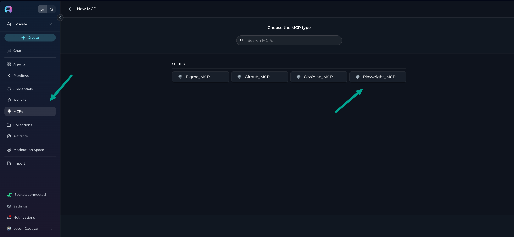

# MCPs

## Introduction to the MCPs Menu

The **MCPs** menu lets you manage external **Model Context Protocol (MCP) servers** that your ELITEA project can use. Unlike standard toolkits (native integrations), MCP entries appear only **after you connect at least one MCP server through the Elitea MCP Client**. Once connected, MCPs expose their tools to agents, pipelines, and conversations for orchestration and automation.

!!! note "Menu Availability"
	The MCPs menu is empty by default. It becomes available (and populated) only after the Elitea MCP Client connects your project to one or more configured MCP servers.

---

## What Are MCPs?

**MCPs** represent external MCP servers (e.g., Playwright MCP, Figma MCP, GitHub MCP) that expose tools following the Model Context Protocol. When the Elitea MCP Client is running, these tools become available inside ELITEA just like native toolkit tools—allowing agents and pipelines to perform actions such as browser automation, repository operations, or other domain tasks.

**Key characteristics:**

* External runtime managed outside the ELITEA web UI (started via the Elitea MCP Client CLI or tray app)
* Dynamic tool discovery (tools are listed from the connected server)
* Connection state: **Connected** (active) or **Disconnected** (client not running / server unreachable)
* Tools can be selectively enabled per MCP entry

For MCP Client setup see the **[MCP Client Integration Guide](../integrations/mcp/mcp-client.md)**.

---

## Navigating the MCPs Menu

When populated, the MCPs menu shows a card/grid or table list of all configured MCP connections for your project.

### Main Elements

* **MCP Cards / Rows:** Show name, description (if provided), connection state, and number of enabled tools.
* **Search & Filter:** Locate MCPs by name or state.
* **`+ Create` Button:** Opens the create panel to create a new MCP reference (logical entry) within the project.
* **State Indicator:** Displays Connected or Disconnected (orange) based on live client status.

---

## Creating a New MCP

You create an MCP entry in ELITEA after (or while) configuring the underlying MCP server in your local Elitea MCP Client.

### How to Create a New MCP

1. Ensure the **Elitea MCP Client** is installed and started (see [integration guide](../integrations/mcp/mcp-client.md)).
2. Open the **MCPs** menu.
3. Select the **available MCP servers** you want to add after they are running locally and connected to your project.
4. Click **`+ Create`**.
5. Enter basic details:
	* **Name:** Descriptive label (e.g., "Playwright Browser Automation").
	* **Description:** Purpose or scope (optional).
    * Select or review the **Tools** list (fetched when the server is reachable) and optionally unselect tools you do not want exposed.
6. Click **Save**.

!!! tip "Disconnected Creation"
	If the MCP Client is not running at creation time, tools may not be auto-discovered. Start the client and revisit the MCP to refresh the tool list.

---

## MCP States

| **State** | **Meaning** | **User Action Needed?** | **Typical Cause** |
|-----------|-------------|-------------------------|-------------------|
| Connected | Active link to the external MCP server; tools callable. | No | MCP Client running and server responding. |
| Disconnected | MCP entry exists but cannot reach server. Tools unavailable. | Start / restart MCP Client or server. | Client stopped, network issue, misconfiguration. |

!!! warning "Using Disconnected MCPs"
	Disconnected MCPs cannot be invoked by agents, pipelines, or conversations. Start the Elitea MCP Client to re-establish connectivity.

---

## Editing and Configuring an MCP

Open an MCP entry to view or modify its configuration.

You can:

* **Rename** the MCP.
* **Update Description**.
* **Enable / Disable Tools** (subset selection for least privilege).
* **Delete MCP** (if no longer needed).

---

## Testing MCP Functionality

Each MCP detail page includes a **Test Settings** panel—identical in behavior to **Toolkits** testing.

### Test Panel Controls

* **Model Selection:** Choose LLM model (e.g., `gpt-4o`).
* **Temperature / Top P / Top K / Max Completion Tokens:** Adjust generation parameters.
* **Tool Selector:** Pick a tool exposed by the MCP server.
* **Parameter Inputs:** Provide required arguments (auto-generated form fields where applicable).
* **Run Tool:** Executes and streams response in a chat-like interface.

### Interface Features

* **Chat Output:** Shows input + tool results.
* **Fullscreen Mode:** Expand for deeper inspection.
* **Clear Results:** Reset panel for next test.
* **Error Visibility:** Connection or invocation failures surface immediately.

!!! tip "Connection First"
	If the MCP is Disconnected, start the Elitea MCP Client and refresh before testing.

---

## Using MCPs with Agents, Pipelines & Conversations

### Assigning to Agents or Pipelines

1. Open **Agents**.
2. Create or edit an agent.
3. In the **Toolkits** section, click **+MCP** and choose the desired MCP.
4. (Optional) Adjust enabled tools at agent level if supported.
5. The MCP Servers will be automatically added to the agent's toolkit list and be available for use.

!!! note "Multiple MCPs"
    You can attach multiple MCPs to a single agent to combine toolsets.

!!! tip "Pipeline Configuration"
	Adding MCP servers to a pipeline follows the same pattern as adding them to an agent: use the **+MCP** selector (or equivalent pipeline tool selection control), choose the MCP, then enable only the required tools.

### Using in Conversations

1. Open **Chat → Conversations**.
2. Start a new or open an existing conversation.
3. In **Participants → MCP** section, select one or more MCPs.
4. Once Connected, conversation prompts can invoke those MCP tools.

!!! note "Multiple MCPs"
    You can attach multiple MCPs to a single agent to combine toolsets.

---

## Best Practices

* **Least Privilege:** Disable tools not needed by current workflows.
* **Consistent Naming:** Use clear names to distinguish similar servers (e.g., "Playwright (QA)" vs "Playwright (Prod)").
* **Monitor State:** Reconnect promptly if Disconnected before critical operations.
* **Version Awareness:** When updating external MCP server packages, re-test key tools.
* **Secure Context:** Avoid exposing sensitive environment paths or commands through custom MCP server arguments.

---

## Troubleshooting

| **Issue** | **Symptoms** | **Likely Cause** | **Resolution** |
|-----------|--------------|------------------|----------------|
| MCP Disconnected | Grey/red state badge | Client not running | Start tray app / CLI (`alita-mcp run` / `tray`). |
| No Tools Listed | Empty tool list | Server offline or created while disconnected | Start server, refresh MCP detail. |
| Tool Invocation Error | Error output in test panel | Parameter mismatch or server error | Check server logs / update args. |
| Stale Tool List | Missing newly added tools | No refresh since server change | Use refresh control or reopen page. |

!!! danger "Persistent Failures"
	If all tools fail consistently while the state shows Connected, verify the underlying MCP server command and arguments in your local configuration file.

---

## Summary

The **MCPs** menu bridges ELITEA and external MCP servers, letting you orchestrate advanced, protocol-compliant tools inside agents, pipelines, and conversations. By managing connection state, curating enabled tools, and validating functionality through Test Settings, you maintain reliable augmented automation.

---

## Additional Resources

* **[MCP Client Integration Guide](../integrations/mcp/mcp-client.md)** – Install & configure the Elitea MCP Client
* **[Toolkits](./toolkits.md)** – Native integrations overview
* **[AI Configuration](./settings/ai-configuration.md)** – Model & embedding configuration

