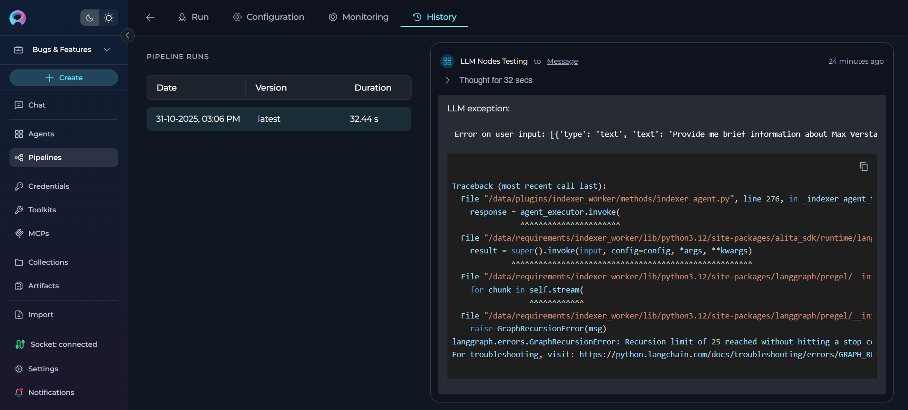

# Pipelines

## Introduction

**Pipelines** in ELITEA provide a powerful way to automate workflows by visually designing and executing sequences of states and actions. This feature is ideal for managing complex processes, integrating toolkits, and ensuring seamless data flow across various tasks.

## Navigating the Pipelines Menu

The Pipelines menu is accessible from the main platform navigation. Upon entering the Pipelines section, you'll see a dashboard with different views depending on your applied filters:

### Interface Elements

**Pipeline List Display:**

- **Table View**: Compact table format displaying pipelines in rows with columns for name, description, status, and metadata

- **Card List View**: Visual card layout showing pipeline thumbnails, titles, descriptions, and key information in an organized grid

**Search Field:**
- Global search functionality to quickly find pipelines by name, description, tags, or author
- Real-time filtering as you type to narrow down results instantly

**Filtering dropdown:**

   `Filter By:` (For Public Projects)
 >  - **Latest**: View the most recently published pipelines
 >  - **My Liked**: Access pipelines you've liked
 >  - **Trending**: Explore trending pipelines based on usage and popularity
 >  - **Admin**: Administrative view for managing all pipelines (visible to administrators only)

`Statuses:`(For Private Projects)

> - **All**: View all pipelines in your project
> - **Drafts**: Access pipeline drafts that haven't been published yet
> - **Published**: View published pipelines
> - **Moderation**: Pipelines pending moderation approval
> - **Approval**: Pipelines awaiting user approval
> - **Rejected**: Previously rejected pipelines

**Tags Section:**
- Interactive tag cloud or list showing all available pipeline tags
- Click tags to filter pipelines by specific categories or functionalities

**Community Features (Public Projects):**
- **Trending Authors**: Discover and follow popular pipeline creators in the community

## What are ELITEA Pipelines?

ELITEA Pipelines are customizable workflows that you can create within the ELITEA interface to automate complex processes. Each pipeline is designed to handle specific tasks or sequences of tasks by connecting various nodes such as conditions, decisions, loops, and tool integrations. Pipelines enable seamless interaction with external services, toolkits, and data sources, allowing users to design workflows that automate tasks like data processing, decision-making, and integration with tools like Jira, GitHub, or Salesforce. The flexibility of ELITEA Pipelines makes them powerful tools for streamlining operations and reducing manual effort.

## Purpose of ELITEA Pipelines

The primary purpose of ELITEA Pipelines is to provide a structured and efficient way to automate workflows for diverse use cases. Unlike manual task execution, pipelines are designed to handle repetitive, multi-step, or intricate processes that require coordination between various tools and data sources. This is particularly beneficial in scenarios where tasks involve conditional logic, iterative operations, or integration with multiple external systems. By automating these workflows, ELITEA Pipelines help reduce errors, save time, and increase productivity.

## How do Pipelines Work?

Creating a Pipeline involves defining a sequence of nodes, each representing a specific action, decision, or condition. These nodes can include operations like looping through data, making decisions based on conditions, or interacting with external toolkits. Users can visually design the workflow using the Flow Designer or configure it programmatically using the YAML Editor for advanced customization. Once configured, the pipeline executes the defined steps autonomously, leveraging integrated toolkits and external services to complete tasks. This allows users to automate complex workflows, adapt to dynamic conditions, and achieve their goals with minimal manual intervention.

## Key Features of ELITEA Pipelines

- **Automation**: ELITEA Pipelines enable seamless automation of workflows by connecting states and actions, reducing manual effort and streamlining complex processes.
- **Flexibility**: Pipelines can be customized to handle a wide range of tasks, from simple linear workflows to intricate multi-step processes, adapting to diverse use cases.
- **Integration**: By incorporating toolkits, datasources, and external APIs, pipelines can integrate various resources and services, ensuring efficient execution of tasks.
- **Visualization**: The Flow Designer provides an intuitive visual interface for designing workflows, making it easy to map out and manage even the most complex processes.
- **Monitoring**: Pipelines include robust monitoring capabilities, allowing users to track performance, analyze execution metrics, and troubleshoot issues in real-time.

By leveraging ELITEA Pipelines, users can automate and optimize their workflows, ensuring efficiency and scalability while maintaining full control over their processes. This empowers users to focus on higher-level strategic tasks, driving innovation and productivity within the ELITEA platform.

## Pipeline Interface Structure

When working with pipelines, the interface is organized into several key tabs:

### Run Tab
The **Run** tab serves as the primary execution environment where you can:

- Execute your pipeline with real data
- View the pipeline execution flow and results
- Interact with the pipeline through the chat interface
- Monitor real-time execution progress

### Configuration Tab  
The **Configuration** tab is where you design and configure your pipeline:

- Use the **Flow Designer** to visually create your pipeline workflow
- Switch to **YAML Editor** for advanced text-based configuration
- Set up general information (name, description, tags)
- Configure toolkits and integrations
- Add welcome messages and conversation starters

### Monitoring Tab
The **Monitoring** tab provides comprehensive analytics and performance tracking:

- View detailed execution logs and metrics
- Track pipeline performance over time
- Analyze usage patterns and bottlenecks
- Access debugging information for troubleshooting

## Creating a Pipeline

To set up a new Pipeline:

1. Click the **+ Create** button located in the sidebar navigation.
2. In the **General** section, fill out the required fields:

     - **Name**: Enter a unique name for your pipeline
     - **Description**: Provide a clear description of the pipeline's purpose
     - **Tags** (optional): Add tags by typing a tag name or selecting from pre-existing tags

3. Click **Save** to save your work on a Pipeline for the first time. This action creates what's known as the "**latest**" version of your pipeline.
4. Optionally, add and configure:
     - **Welcome Message**: Define a welcome message to guide users interacting with the pipeline.
     - **Conversation Starters**: Add predefined commands or prompts to initiate interactions with the pipeline.
5. **Integration of Toolkits** becomes available after the first save. Navigate to the **Toolkits** section to enhance the pipeline's functionality by connecting it to external services or internal tools.
6. Click **Save** again to preserve your additional configurations.

### Adding Toolkits, Agents, and Pipelines

After saving your initial pipeline, the **TOOLKITS** section becomes available with three integration options:

#### **Add a Toolkit**
Click the **+ Toolkit** button to integrate external services and tools into your pipeline:

- **Purpose**: Connect your pipeline to external APIs, databases, and services like Jira, GitHub, Slack, or custom APIs
- **Selection Options**: 
  
     - **Select Existing Toolkits**: Browse and choose from available toolkits in the platform's toolkit library
     - **Create New Toolkit**: Click the **+ Create new** button to build a custom toolkit for your specific requirements

!!! info "Reference"
    For detailed information on creating and managing toolkits, refer to the **[Toolkits Menu Guide](toolkits.md)**.

#### **Add an Agent** 
Click the **+ Agent** button to incorporate existing agents into your pipeline workflow:

- **Purpose**: Leverage pre-built AI agents with specialized capabilities and knowledge domains
- **Selection Process**: Choose from existing agents in your workspace

#### **Add a Pipeline**
Click the **+ Pipeline** button to nest other pipelines within your current pipeline:

- **Purpose**: Create complex workflows by chaining multiple pipelines together
- **Selection Process**: Select from existing pipelines in your workspace

!!! tip "Integration Best Practices"
    - **Toolkit Integration**: Ensure you have proper credentials configured before adding toolkits
    - **Agent Integration**: Test agent responses and adjust parameters for optimal performance
    - **Pipeline Integration**: Consider data flow and dependencies when nesting pipelines

   
When configuring Pipelines, you can further personalize their profiles by adding a custom image along with the **Name** and **Description**. This feature allows you to create a unique, visually distinct identity for each Pipeline, making them easier to recognize and manage.

To add an image:

1. Click the **Pen Icon** next to the image placeholder. Clicking this icon will open the image upload interface.
2. Click the **Upload a Custom Image** icon to upload a custom image from your local system to personalize the Pipeline's profile.
3. **Use Default Images** from a set of default images provided by the platform.

### WELCOME MESSAGE

The **Welcome Message** feature allows you to provide additional context and instructions that appear when users interact with your pipeline in the chat interface. This message helps set expectations and guide users on how to best utilize the pipeline.

**How to Add the Welcome Message**:

1. **Add the Welcome Message**: Type the welcome message text in the input field.
2. **Save the Configuration**: After entering the desired text, ensure to save the changes to the pipeline. This action makes the configured welcome message available to users in the **Run** tab.

**Using the Welcome Message**:

When users go to the **Run** tab of the pipeline, they will see the configured **Welcome Message**. It provides helpful context and instructions to guide their interaction with the pipeline.

**Examples of Welcome Message**:

* "Use this pipeline for generating manual test cases"
* "Don't forget to double-check the generated test cases"
* "I can help you analyze data and generate reports"

### CONVERSATION STARTERS

The **Conversation Starter** feature enables you to configure and add predefined text that can be used to initiate a conversation when executing a pipeline. This feature is particularly useful for setting a consistent starting point for interactions facilitated by the pipeline.

**How to Add a Conversation Starter**:

1. **Access the Configuration Panel**: Navigate to the **Conversation Starter**  section.
2. **Add a Conversation Starter**: Click the `+` icon to open the text input field where you can type the text you wish to use as a conversation starter.
3. **Save the Configuration**: After entering the desired text, ensure to save the changes to the pipeline. This action makes the configured conversation starter available for use.

**Using a Conversation Starter**:

**Initiate a Conversation**: Go to the **Run** tab of the pipeline. Here, you will find the saved conversation starters displayed as clickable options. Click on the desired starter to automatically populate the chat input and execute the pipeline.

**Examples of Conversation Starters**:

* "Generate test cases for provided Acceptance Criteria."
* "Generate automatic test cases for selected [Test_Case_ID]."
* "Review this code and suggest improvements."
* "Help me write documentation for this feature."

By setting up conversation starters, you streamline the process of initiating specific tasks or queries, making your interactions with the pipeline more efficient and standardized.

### **Flow Designer**:

* Use the **Flow** tab to visually design your pipeline by connecting various nodes, such as **Agent**, **Condition**, **Decision**, **Function**, **LLM**, **Loop**, **Loop from Tool**, **Pipeline**, **Router**, **State Modifier**, **Tool**, and **Custom**.

* Add new nodes by clicking the **+** icon and selecting the desired node type from the dropdown menu.

* Use the **End** node to define the completion of the pipeline.
* Drag and drop connections between nodes to establish the workflow's logic and transitions.
* Zoom in or out and adjust the view for better navigation and management of complex workflows.

### Best Practices for Using Nodes

* **Plan Your Workflow**: Before adding nodes, outline the desired workflow to ensure a clear and logical structure.
* **Use Descriptive Names**: Name each node clearly to make the pipeline easier to understand and maintain.
* **Test Iteratively**: Test nodes and connections incrementally to identify and resolve issues early in the design process.
* **Optimize Loops**: Use loops efficiently to avoid unnecessary iterations and improve pipeline performance.
* **Leverage Node Types**: Choose the appropriate node type for each task:

     - **Tool**: Integrate with external services and APIs
    - **LLM**: Leverage language models for text processing and generation
    - **Function**: Create custom logic and data transformations
    - **Decision**: Implement conditional branching based on criteria
    - **Condition**: Set up simple true/false evaluations
    - **Loop/Loop from Tool**: Handle iterative operations
    - **Agent**: Integrate other agents into your pipeline
    - **Pipeline**: Nest pipelines within pipelines for complex workflows
    - **Router**: Direct flow based on multiple conditions
    - **State Modifier**: Manage and update pipeline state variables
    - **Custom**: Implement specialized functionality

!!! note "Reference"
     For detailed information on each node type and its use cases, refer to the [Pipeline Architecture Guide](../features/pipelines/pipeline-agent-framework.md).

By following best practices and leveraging the available nodes, you can design efficient and scalable workflows tailored to your specific needs.

### **YAML Editor**:

* Switch to the **YAML** tab to configure the pipeline using code for advanced customization.
* Define complex workflows, conditions, and logic that may not be easily achievable through the visual Flow Designer.
* Use the YAML editor to fine-tune node configurations, set advanced parameters, and integrate custom logic.
* Validate your YAML syntax to ensure the pipeline runs smoothly without errors.

* This is particularly useful for users who prefer a code-first approach, need to implement intricate logic, or want to replicate and modify existing pipelines efficiently.

### How to Execute Pipeline

To execute the pipeline and get the output:

1. **Configure the Pipeline**: Ensure your pipeline is properly configured with clear instructions and any necessary toolkits.
2. **Navigate to Chat**: Access the pipeline's chat interface by clicking on the pipeline from your pipelines list, then go to the **Run** tab.
3. **Select the AI Model**: In the chat interface, choose the appropriate AI model (e.g., gpt-4o-2024-11-20, gpt-4o-2024-08-06, etc.) from the model selection dropdown.

   

4. **Adjust Parameters** (Optional): Fine-tune the response generation with these settings:
    * **Temperature (0.1-1.0)** - adjusts the level of creativity or unpredictability in responses.
        * **Higher values**: Responses are more creative and varied, but may be less consistent and more unpredictable.
        * **Lower values**: Responses are more consistent and predictable, but may be less creative and varied.
      * **Top P (0-1)** - determines the cumulative probability threshold for selecting words, balancing between creativity and consistency.
        * **Higher values**: A wider range of words is considered, leading to more creative and diverse responses.
        * **Lower values**: A narrower range of words is considered, leading to more consistent and predictable responses.
      * **Max Completion Tokens** - sets the cap on the response length, helping tailor responses to be as concise or detailed as desired.
        * **Higher values**: Responses can be longer and more detailed.
        * **Lower values**: Responses are shorter and more concise.

       

5. **Start Interaction**: Begin your conversation by either:
     - Clicking on a **Conversation Starter** (if configured) to use a predefined prompt
     - Typing your question or command directly into the chat input field
     - Using simple commands like "Go", "Start Generating", "Execute", or "Run it" followed by clicking the **Send** button

**Additional Interaction Features:**

* **Auto scroll to bottom**: This option can be toggled on or off to automatically scroll to the bottom of the output as it is being generated. This feature is helpful during long outputs to keep the most recent content visible.
* **Full Screen Mode**: Increase the size of the output window for better visibility and focus. This mode can be activated to expand the output interface to the full screen.

**Post-Output Actions:**

* **Continue the Dialogue**: To keep the conversation going, simply type your next question or command in the chat box and click the **Send** icon.
* **Copy the Output**: Click the **Copy to Clipboard** icon to copy the generated text for use elsewhere.
* **Regenerate Response**: If the output isn't satisfactory, click the **Regenerate** icon to prompt the Gen AI to produce a new response.
* **Delete Output**: To remove the current output from the chat, click the **Delete** icon.
* **Purge Chat History**: For a fresh start or to clear sensitive data, click the **Clean** icon to erase the chat history.
* **Like or Dislike the Output**: 
    * Click the **Like** icon if the output meets your expectations.
    * Click the **Dislike** icon if the output is unsatisfactory. Upon disliking, you will have the option to leave a comment explaining why the output did not meet your expectations. This feedback helps improve the system's performance and relevance.

### Managing Pipeline Versions: Save, Create Versions, Publish and Manage

To optimally manage your pipeline, understanding how to save and create versions is crucial. Follow these guidelines to efficiently save your pipeline, create versions, and manage them.

#### How to Save a Pipeline:

* To save your work on a Pipeline for the first time, simply click the **Save** button. This action creates what's known as the "**latest**" version of your pipeline.
* You can continue to modify your pipeline and save the changes to the "**latest**" version at any time by clicking the **Save** button again. If you wish to discard any changes made, you have the option to click the **Discard** button before saving.

!!! note "Note"
    The "**latest**" version represents the initial version you create. You can keep updating this version with your changes by saving them, without the need to create additional versions for your pipeline.

#### How to Create New Versions:

For instances where you need to create and manage different iterations of your Pipeline:

1. **Initiate a New Version**: Start by clicking the **Save As Version** button.
2. **Name Your Version**: When saving your work, provide a version name that clearly identifies the iteration or changes made. Click **Save** to confirm your entry. 

**Best Practices for Version Naming**:

* **Length**: Keep the version name concise, not exceeding 48 characters. This ensures readability and compatibility across various systems.
* **Characters**: Avoid using special characters such as spaces (" "), underscores ("_"), and others that might cause parsing or recognition issues in certain environments.
* **Clarity**: Choose names that clearly and succinctly describe the version's purpose or the changes it introduces, facilitating easier tracking and management of different versions.

Upon creating a new version of the Pipeline, several options become available to you:

* **Delete**: Remove this version of the Pipeline if it’s no longer needed.
* **Execute**: Run this specific version of the Pipeline to see how it performs.
* **Navigate Versions**: Use the **Version** dropdown list to switch between and select different versions of the Pipeline. This allows for easy comparison and management of various iterations.

By following these steps, you can effectively manage the lifecycle and iterations of your pipelines, ensuring that each version is appropriately saved, published, and utilized as per your requirements.

### Publishing a Pipeline Version

The **Publish** functionality allows you to make a specific version of your pipeline available for public use after moderator approval. This ensures that only reviewed and approved versions are accessible to users.

#### How to Publish a Pipeline Version:

1. Navigate to the top menu and click the **Publish** button. A dialog box will appear prompting you to confirm the publishing process.
2. **Provide a Version Name**. Enter a meaningful name for the version you want to publish. This helps in identifying the version during the review process.
3. **Submit for Approval**:
      * Once you click **Publish**, the version will be sent to a moderator for review.
      * The moderator will evaluate the pipeline version and either approve or reject the request.

#### What Happens After Publishing:

* **If Approved**:
    * The pipeline version will be made publicly available for use.
    * Users will be able to access and execute the published version.

* **If Rejected**:
    * The moderator may provide feedback on why the version was not approved.
    * You can make the necessary changes and resubmit the version for approval.

  By following these steps, you can effectively manage the lifecycle and iterations of your pipelines, ensuring that each version is appropriately saved, published, and utilized as per your requirements.

#### Best Practices for Publishing:

* **Test Thoroughly**: Ensure the pipeline is fully functional and free of errors before submitting it for publishing.
* **Provide Clear Version Names**: Use descriptive names to make it easier for moderators and users to understand the purpose of the version.
* **Incorporate Feedback**: If a version is rejected, carefully review the feedback provided by the moderator and address the issues before resubmitting.

By following these steps, you can ensure a smooth publishing process and make your pipeline versions available for broader use.

### Monitoring Pipelines

The **Monitoring** menu allows you to track the performance and activity of your Pipeline in real-time. By accessing this feature, you can view detailed logs, analyze execution metrics, and identify potential issues or bottlenecks in your pipeline's workflows.
For detailed instructions on how to use the Monitoring feature, please refer to the **[Monitoring User Guide](../features/monitoring.md)**

### Viewing Pipeline History

The **History** tab provides a complete audit trail of all past executions of your pipeline. This feature allows you to:

- **Review past conversations**: View complete chat histories from previous pipeline runs
- **Track performance**: Monitor execution duration across different versions
- **Debug issues**: Replay conversations to identify where problems occurred in the workflow
- **Compare versions**: See how different pipeline versions performed with the same inputs
- **Audit trail**: Maintain records of all pipeline interactions for compliance purposes

The History tab displays runs in a two-panel layout with a list of all executions on the left (showing date, version, and duration) and the complete conversation replay on the right when you select a run.

For detailed instructions on using the History tab, please refer to the **[Agents and Pipelines History Guide](../how-tos/agents-pipelines/agents-pipelines-history.md)**.

### Best Practices for Pipelines

* **Keep It Modular**: Break down complex workflows into smaller, manageable states for better readability and maintainability.
* **Use Tags**: Organize pipelines with tags to make them easier to find and manage.
* **Test Iteratively**: Test each state or action individually before executing the entire pipeline to ensure accuracy.
* **Monitor Regularly**: Use the Monitoring feature to track performance and identify areas for improvement.
* **Document Your Logic**: Use clear names and descriptions for nodes to make your pipeline self-documenting.
* **Validate Data Flow**: Ensure proper data flow between nodes by testing with sample data.
* **Handle Errors Gracefully**: Implement error handling and fallback mechanisms in your pipeline design.

---

!!! info "Related Documentation"
    For more detailed information on related topics, please refer to the following documentation:

    - **[Credentials](credentials.md)** - Learn how to create and manage credentials for toolkit integrations
    - **[Toolkits](toolkits.md)** - Comprehensive guide on creating and configuring toolkits
    - **[Pipeline Agent Framework](../features/pipelines/pipeline-agent-framework.md)** - Advanced pipeline development guide
    - **[Monitoring](../features/monitoring.md)** - Track and analyze pipeline performance
    - **[Glossary](../home/glossary.md)** - Definitions of key terms and concepts used in the ELITEA platform

