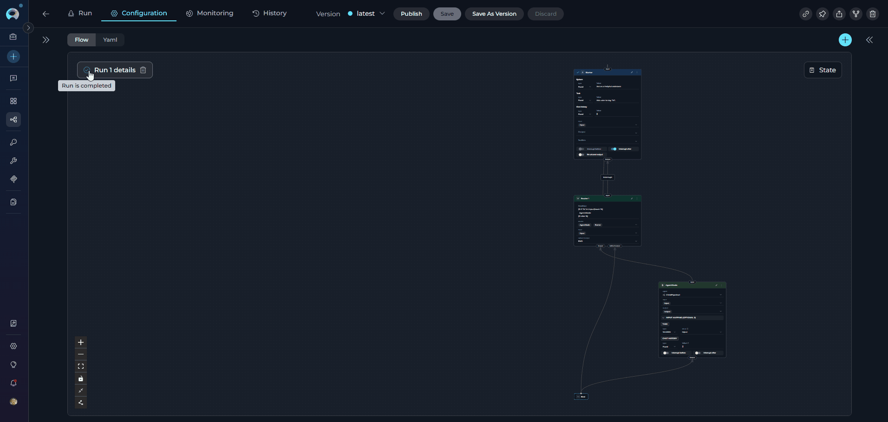
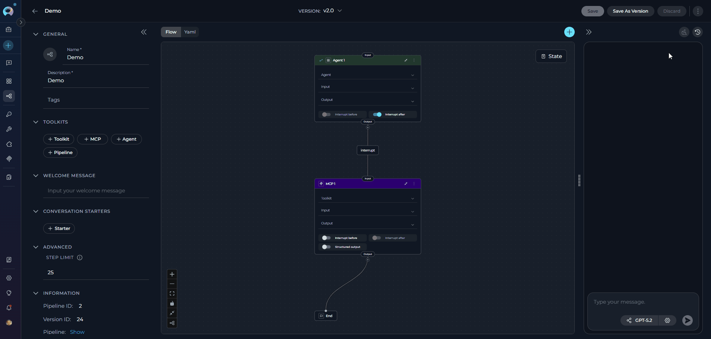

# Pipelines

## Overview

**What are ELITEA Pipelines?**

ELITEA Pipelines are powerful workflow automation tools that enable you to visually design and execute complex sequences of actions and decisions. Each pipeline is purpose-built to orchestrate multi-step processes by connecting various nodes—including LLM interactions, toolkit integrations, conditional logic, and custom code execution. Pipelines seamlessly interact with external services, toolkits, and data sources, allowing you to automate sophisticated workflows ranging from data processing and decision-making to integration with platforms like Jira, GitHub, and Salesforce.

**Why Use Pipelines?**

Unlike manual task execution or simple automation, pipelines provide a structured approach to complex workflow automation:

* **Workflow Orchestration**: Automate multi-step processes with conditional logic, loops, and parallel execution paths
* **Visual Design**: Design complex workflows using an intuitive drag-and-drop interface or advanced YAML configuration
* **Service Integration**: Connect multiple tools and services in a single workflow for seamless data flow
* **Reusability**: Create modular, reusable workflows that can be nested and combined for different use cases
* **Scalability**: Handle both simple linear processes and intricate multi-branch workflows with equal efficiency

**How Pipelines Work**

Creating a pipeline involves three key aspects:

1. **Node-Based Design**: Build workflows by connecting nodes representing different actions—LLM calls, agent interactions, toolkit operations, code execution, routers, and decision points
2. **Visual or Code Configuration**: Use the Flow Designer for visual workflow creation or switch to YAML Editor for advanced programmatic configuration
3. **Execution & Integration**: Connect toolkits, agents, and MCPs to extend capabilities; configure model settings and conversation flows for interactive pipelines

Once configured, the pipeline executes autonomously, following the defined logic flow, making decisions based on conditions, and leveraging integrated services to complete tasks while adapting to dynamic inputs.

**Key Capabilities**

* **Visual Workflow Design**: Intuitive Flow Designer with drag-and-drop nodes for easy workflow creation and management
* **Conditional Logic**: Implement complex decision trees using Router and Decision nodes for dynamic workflow paths
* **Multi-Service Integration**: Connect external toolkits, agents, MCPs, and nested pipelines within a single workflow
* **Flexible Configuration**: Toggle between visual Flow Designer and YAML Editor for different levels of customization
* **State Management**: Track and modify workflow state throughout execution using State Modifier nodes
* **Version Control**: Create, manage, and compare different versions of pipelines for iterative development

By leveraging ELITEA Pipelines, you can automate complex processes, reduce manual effort, and create scalable workflow solutions that adapt to your organization's evolving needs.

## Navigating the Pipelines Menu

The Pipelines menu is accessible from the main platform navigation. Upon entering the Pipelines section, you'll see a dashboard listing all created pipelines for your project.

{: loading=lazy }

### Pipelines Dashboard

The Pipelines dashboard provides multiple ways to view and manage your pipelines:

**View Options**

* **Card View** - Visual cards displaying pipeline name, description, and key information. Ideal for browsing and quick identification.
* **Table View** - Compact table format with columns for name, description, status, and metadata. Better for managing large numbers of pipelines.

Switch between views using the view toggle button in the top-right corner of the dashboard.

{: loading=lazy }

**Search and Filter**

* **Search Bar** - Quickly find pipelines by typing the pipeline name, description, or related keywords
* **Filter by Tags** - Filter pipelines by their assigned tags to find workflows in specific categories or with particular characteristics. Click tags to narrow down the list.

{: loading=lazy }

**Pinning Pipelines**

Pin frequently used pipelines to keep them at the top of your list for quick access:

1. Locate the pipeline you want to pin
2. Click the pin icon (📌) on the pipeline card or in the table row
3. Pinned pipelines will appear at the top of the list, separated from unpinned ones
4. Click the pin icon again to unpin the pipeline

{: loading=lazy }

---

## Creating a Pipeline

To set up a new Pipeline:

1. Click the **+ Create** button located in the sidebar navigation.
2. In the **General** section, fill out the required fields:

     - **Name**: Enter a unique name for your pipeline (e.g., "Test Case Generator Pipeline")
     - **Description**: Provide a clear description of the pipeline's purpose (e.g., "Automatically generates comprehensive test cases from acceptance criteria and user stories")
3. Optionally, add and configure:
         - **Tags**: Add tags by typing a tag name or selecting from pre-existing tags
         - **Welcome Message**: Define a welcome message to guide users interacting with the pipeline. (e.g., "Welcome! I can help you generate test cases based on your acceptance criteria. Simply provide your requirements and I'll create comprehensive test scenarios for you.")
         - **Conversation Starters**: Add predefined commands or prompts to initiate interactions with the pipeline. (e.g., "Generate test cases for the login feature" or "Create test scenarios for payment processing")
4. In the **Advanced** section (optional):
         - **Step Limit**: Set the maximum number of tool execution steps the pipeline can perform in a single turn (range: 0-999, default: 25). This parameter controls how many iterations the pipeline can execute before stopping, preventing infinite loops and managing resource usage. A higher step limit allows more complex multi-step workflows, while a lower limit ensures faster execution for simpler tasks.
5. Click **Save** to save your work on a Pipeline for the first time. This action creates what's known as the "**latest**" version of your pipeline.   

{: loading=lazy }

!!! info "Integration of Toolkits"
    Integration of Toolkits becomes available after the first save. Navigate to the **Toolkits** section to enhance the pipeline's functionality by connecting it to external services or internal tools.

!!! tip "Adding a Custom Image"
    When configuring Pipelines, you can further personalize their profiles by adding a custom image along with the **Name** and **Description**. This feature allows you to create a unique, visually distinct identity for each Pipeline, making them easier to recognize and manage.

    To add an image:

    1. Click the **Pen Icon** next to the image placeholder. Clicking this icon will open the image upload interface.
    2. Click the **Upload a Custom Image** icon to upload a custom image from your local system to personalize the Agent's profile.
    3. **Use Default Images** from a set of default images provided by the platform.

    {: loading=lazy }

### How to Select and Configure Toolkits

Toolkits are integrations with external or ELITEA's internal services that enhance your pipeline's capabilities by allowing it to interact with various resources and perform specific tasks. In addition to toolkits, you can also add other Agents, MCPs (Model Context Protocol servers), and Pipelines to extend your pipeline's functionality. You can add these resources to your pipeline during the creation process or edit them later.

**Adding Resources to Your Pipeline**:

1. In the pipeline Configuration interface, navigate to the **TOOLKITS** section
2. Click the **+Toolkit** button to browse available resources
3. You can add the following types of resources:
      - **[Toolkits](toolkits.md)**: Select an existing toolkit from the list or click **"+ Create New"** to create a new toolkit
      - **[Agents](agents.md)**: Add nested agents to enable your pipeline to delegate tasks or collaborate with specialized agents
      - **[MCPs](mcps.md)**: Integrate Model Context Protocol servers to provide additional context and capabilities. You can select an existing MCP from the list or click "+ Create New" to create a new MCP
      - **Pipelines**: Include other pipelines to create complex multi-step workflows by chaining pipelines together

> **Note:** Your changes are saved automatically when you add or remove resources.

{: loading=lazy }

!!! tip "Integration Best Practices"
    - **Toolkit Integration**: Ensure you have proper credentials configured before adding toolkits
    - **Agent Integration**: Test agent responses and adjust parameters for optimal performance
    - **MCP Integration**: Verify MCP server connectivity and context requirements before integration
    - **Pipeline Integration**: Consider data flow and dependencies when nesting pipelines

## Pipeline Interface Structure

When working with pipelines, the interface is organized into several key tabs:

### History Tab
The **History** tab provides a complete audit trail of all past pipeline executions:

- Review past conversations and execution results
- Track performance metrics across different versions
- Debug issues by replaying previous runs
- Compare how different versions performed
- Maintain compliance records of all pipeline interactions

## Configuration Tab 
The **Configuration** tab is where you design and configure your pipeline:

- Use the **Flow Designer** to visually create your pipeline workflow
- Switch to **YAML Editor** for advanced text-based configuration
- Set up general information (name, description, tags)
- Configure toolkits and integrations
- Add welcome messages and conversation starters

### State Management

The **State** feature in pipelines allows you to define and manage variables that persist throughout the entire pipeline execution. State variables enable data to be shared between different nodes, maintain context across workflow steps, and control the flow of information through your pipeline.

**What is Pipeline State?**

Pipeline state is a collection of key-value pairs that store data during pipeline execution. These variables can be accessed and modified by any node in your workflow, making it possible to:

* Pass data between nodes without explicit connections
* Store intermediate results for later use
* Implement conditional logic based on accumulated data
* Track workflow progress and decision outcomes

!!! note "Default State Variables"
    Every pipeline includes two built-in default state variables that are automatically available without manual configuration:
    
    * **`inputs`** - Captures user input and data provided when the pipeline is executed
    * **`messages`** - Stores the conversation history and message exchanges throughout pipeline execution
    
    These default states can be referenced using in your workflow nodes.

**How to Define State Variables:**

1. In the **Configuration** tab, locate the **State** section
2. Click **+ Context** to create a new state variable
3. Enter a **Variable Name** (use descriptive names like `project_id`, `analysis_result`, `counter`)
4. Set an **Initial Value** (optional) - can be text, numbers, or JSON objects
5. Add a **Description** (optional) to document the variable's purpose
6. Click **Save** to apply your changes

{: loading=lazy }

**Using State in Your Pipeline:**

Once defined, state variables can be accessed and modified throughout your pipeline:

* **State Modifier Nodes**: Use these specialized nodes to read from and write to state variables during pipeline execution
* **Reference in Nodes**: Access state variables in other nodes using the syntax `{{state.variable_name}}`
* **Conditional Logic**: Use state variables in Decision and Router nodes to control workflow branches
* **Data Transformation**: Pass state values between LLM, Code, and Toolkit nodes for complex processing

??? tip "Best Practices for State Management"
    * **Use Descriptive Names**: Choose clear, meaningful names for state variables (e.g., `customer_data` instead of `data1`)
    * **Initialize When Possible**: Set initial values to prevent undefined variable errors
    * **Document Purpose**: Add descriptions to help team members understand each variable's role
    * **Keep State Minimal**: Only store essential data to maintain pipeline performance
    * **Clean Up**: Clear or reset state variables when they're no longer needed

!!! info "Learn More About State Management"
    For detailed information about advanced state management techniques and examples, see the **[Pipeline State Management Guide](../how-tos/pipelines/states.md)**.

### **Flow Designer**:

* Use the **Flow** tab to visually design your pipeline by connecting various nodes, such as **LLM**, **Agent**, **Toolkit**, **MCP**, **Code**, **Custom**, **Router**, **Decision**, **State Modifier**, and **Printer**.
* Add new nodes by clicking the **+** icon and selecting the desired node type from the dropdown menu.
* Use the **End** node to define the completion of the pipeline.
* Drag and drop connections between nodes to establish the workflow's logic and transitions.
* Zoom in or out and adjust the view for better navigation and management of complex workflows.

{: loading=lazy }

??? tip "Best Practices for Using Nodes"
    **Plan Your Workflow**: Before adding nodes, outline the desired workflow to ensure a clear and logical structure.

    **Use Descriptive Names**: Name each node clearly to make the pipeline easier to understand and maintain.

    **Test Iteratively**: Test nodes and connections incrementally to identify and resolve issues early in the design process.

    **Leverage Node Types**: Choose the appropriate node type for each task:

    **Interaction Nodes:**

    - **[LLM Node](../how-tos/pipelines/nodes/interaction-nodes.md#llm-node)**: Leverage language models for text processing and generation
    - **[Agent Node](../how-tos/pipelines/nodes/interaction-nodes.md#agent-node)**: Integrate other agents into your pipeline for specialized tasks
    
    **Execution Nodes:**

    - **[Toolkit Node](../how-tos/pipelines/nodes/execution-nodes.md#toolkit-node)**: Integrate with external services and APIs
    - **[MCP Node](../how-tos/pipelines/nodes/execution-nodes.md#mcp-node)**: Connect to Model Context Protocol servers for additional context
    - **[Code Node](../how-tos/pipelines/nodes/execution-nodes.md#code-node)**: Execute custom code logic within your pipeline
    - **[Custom Node](../how-tos/pipelines/nodes/execution-nodes.md#custom-node)**: Implement specialized functionality with custom configurations
    
    **Control Flow Nodes:**

    - **[Router Node](../how-tos/pipelines/nodes/control-flow-nodes.md#router-node)**: Direct flow based on multiple conditions
    - **[Decision Node](../how-tos/pipelines/nodes/control-flow-nodes.md#decision-node)**: Implement conditional branching based on criteria
    
    **Utility Nodes:**
    
    - **[State Modifier Node](../how-tos/pipelines/nodes/utility-nodes.md#state-modifier-node)**: Manage and update pipeline state variables
    - **[Printer Node](../how-tos/pipelines/nodes/utility-nodes.md#printer-node)**: Output and display data during pipeline execution

    By following best practices and leveraging the available nodes, you can design efficient and scalable workflows tailored to your specific needs.

!!! info "Learn More About Flow Designer"
    For comprehensive information about using the Flow Designer and advanced workflow design techniques, see the **[Flow Designer Guide](../how-tos/pipelines/flow-editor.md)**.

### **YAML Editor**:

* Switch to the **YAML** tab to configure the pipeline using code for advanced customization.
* Define complex workflows, conditions, and logic that may not be easily achievable through the visual Flow Designer.
* Use the YAML editor to fine-tune node configurations, set advanced parameters, and integrate custom logic.
* Validate your YAML syntax to ensure the pipeline runs smoothly without errors.

{: loading=lazy }

* This is particularly useful for users who prefer a code-first approach, need to implement intricate logic, or want to replicate and modify existing pipelines efficiently.

!!! info "Learn More About YAML Configuration"
    For detailed information about YAML syntax, configuration options, and advanced pipeline programming, see the **[YAML Editor Guide](../how-tos/pipelines/yaml.md)**.

## How to Execute Pipeline

To execute the pipeline and get the output:

1. **Configure the Pipeline**: Ensure your pipeline is properly configured with clear instructions and any necessary toolkits.
2. **Navigate to Pipeline**: Access the pipeline's interface by clicking on the pipeline from your pipelines list.
3. **Select the AI Model**: In the interface, choose the appropriate AI model (e.g., gpt-4o, gpt-5.1, etc.) from the model selection dropdown.
4. **Adjust Model Settings** (Optional): Click the **Model Settings** icon (⚙️) next to the model selector to fine-tune the response generation. The settings vary depending on the selected model:

    **For Reasoning Models** (e.g., GPT-5.1):
    
    * **Reasoning** - Controls the depth of logical thinking and problem-solving with three levels:
        * **Low**: Fast, surface-level reasoning with concise answers and minimal steps
        * **Medium**: Balanced reasoning with clear explanations and moderate multi-step thinking (default)
        * **High**: Deep, thorough reasoning with detailed step-by-step analysis (may be slower)
    
    **For Standard Models** (e.g., GPT-4o):
    
    * **Creativity** - Controls response randomness and creativity. Lower values produce more focused and deterministic outputs, while higher values generate more diverse and creative responses with five levels (1-5):
        * **1**: Highly focused and deterministic outputs
        * **2**: Mostly focused with slight variation
        * **3**: Balanced between focus and creativity (default)
        * **4**: More varied and creative responses
        * **5**: Maximum creativity and diversity
    
    **Max Completion Tokens** Limits the maximum length of AI responses measured in tokens (roughly 4 characters per token).(All Models):
    
    * **Auto** (default): System automatically sets the token limit to 4096 tokens
    * **Custom**: Manually set a specific token limit for responses
        * When Custom is selected, you can enter a specific number of maximum tokens
        * The interface shows remaining tokens available after your specified limit
        * Setting too high a value will show an error if it exceeds the model's maximum output tokens

    {: loading=lazy }   

5. **Start Interaction**: Begin your conversation by either:
     - Clicking on a **Conversation Starter** (if configured) to use a predefined prompt
     - Typing your question or command directly into the chat input field
     - Using simple commands like "Go", "Start Generating", "Execute", or "Run it" followed by clicking the **Send** button

**Additional Interaction Features:**

* **Full Screen Mode**: Increase the size of the output window for better visibility and focus. This mode can be activated to expand the output interface to the full screen.
* **Continue the Dialogue**: To keep the conversation going, simply type your next question or command in the chat box and click the **Send** icon.
* **Copy the Output**: Click the **Copy to Clipboard** icon to copy the generated text for use elsewhere.
* **Regenerate Response**: If the output isn't satisfactory, click the **Regenerate** icon to prompt the Gen AI to produce a new response.
* **Delete Output**: To remove the current output from the chat, click the **Delete** icon.
* **Purge Chat History**: For a fresh start or to clear sensitive data, click the **Clean** icon to erase the chat history.
* **Like or Dislike the Output**: 
    * Click the **Like** icon if the output meets your expectations.
    * Click the **Dislike** icon if the output is unsatisfactory. Upon disliking, you will have the option to leave a comment explaining why the output did not meet your expectations. This feedback helps improve the system's performance and relevance.

{: loading=lazy }

### Managing Context Budget

When the `context_manager` secret is enabled at the project level, the **Context Budget** widget appears during pipeline execution to help you manage token usage effectively. This feature provides intelligent control over conversation token consumption through automated message pruning and summarization.

**What is Context Management?**

Context Management helps maintain conversation continuity while staying within model token limits by automatically managing message history, generating summaries of older conversations, and preserving important messages. This ensures your pipeline can handle longer conversations without hitting token limitations.

**Key Features:**

* **Real-time Token Tracking**: Monitor token consumption as your pipeline processes requests
* **Automatic Pruning**: System removes older messages when context limit is reached
* **Conversation Summarization**: Generate summaries of conversation history to preserve context
* **Message Preservation**: Configure how many recent messages to always keep
* **Flexible Strategies**: Choose between different pruning strategies based on your needs

**Accessing the Context Budget Widget:**

1. Ensure the `context_manager` secret is set to `true` in your project settings
2. Start executing your pipeline
3. The Context Budget widget appears above the chat interface
4. Click to expand and view detailed metrics and configuration options

{: loading=lazy }

!!! info "Learn More About Context Management"
    For detailed information about context management configuration, strategies, and best practices, see the **[Context Management Guide](../how-tos/chat-conversations/context-management.md)**.

### Pipeline Runs

Each time you execute a pipeline, the system creates a **pipeline run** that captures the complete execution context, including inputs, outputs, state changes, and performance metrics. Pipeline runs provide valuable insights into how your workflows perform and help with debugging and optimization.

**Key Features of Pipeline Runs:**

* **Execution Tracking**: Monitor the progress and status of each pipeline execution in real-time
* **Input/Output Capture**: Review the exact inputs provided and outputs generated for each run
* **State Evolution**: Track how state variables change throughout the execution
* **Performance Metrics**: Analyze execution time, token usage, and resource consumption
* **Error Diagnostics**: Identify where failures occur and access detailed error messages

Pipeline runs are automatically saved and can be accessed through the History tab, where you can replay past executions, compare different runs, and analyze workflow behavior over time.

!!! info "Learn More About Pipeline Runs"
    For comprehensive information about managing and analyzing pipeline runs, including advanced debugging and optimization techniques, see the **[Pipeline Runs Guide](../how-tos/pipelines/pipeline-runs.md)**.

## Managing Pipeline Versions: Save, Create Versions, and Manage

To optimally manage your pipeline, understanding how to save and create versions is crucial. Follow these guidelines to efficiently save your pipeline, create versions, and manage them.

**How to Save a Pipeline:**

* To save your work on a Pipeline for the first time, simply click the **Save** button. This action creates what's known as the "**latest**" version of your pipeline.
* You can continue to modify your pipeline and save the changes to the "**latest**" version at any time by clicking the **Save** button again. If you wish to discard any changes made, you have the option to click the **Discard** button before saving.

!!! note "Note"
    The "**latest**" version represents the initial version you create. You can keep updating this version with your changes by saving them, without the need to create additional versions for your pipeline.

### How to Create New Versions:

For instances where you need to create and manage different iterations of your Pipeline:

1. **Initiate a New Version**: Start by clicking the **Save As Version** button.
2. **Name Your Version**: When saving your work, provide a version name that clearly identifies the iteration or changes made.
3. Click **Save** to confirm your entry. 

{: loading=lazy }

??? tip "Best Practices for Version Naming"
    * **Length**: Keep the version name concise, not exceeding 48 characters. This ensures readability and compatibility across various systems.
    * **Characters**: Avoid using special characters such as spaces (" "), underscores ("_"), and others that might cause parsing or recognition issues in certain environments.
    * **Clarity**: Choose names that clearly and succinctly describe the version's purpose or the changes it introduces, facilitating easier tracking and management of different versions.

Upon creating a new version of the Pipeline, several options become available to you:

* **Delete**: Remove this version of the Pipeline if it's no longer needed.
* **Execute**: Run this specific version of the Pipeline to see how it performs.
* **Navigate Versions**: Use the **Version** dropdown list to switch between and select different versions of the Pipeline. This allows for easy comparison and management of various iterations.

By following these steps, you can effectively manage the lifecycle and iterations of your pipelines, ensuring that each version is appropriately saved and utilized as per your requirements.

### Viewing Pipeline History

The **History** tab provides a complete audit trail of all past executions of your pipeline. This feature allows you to:

- **Review past conversations**: View complete chat histories from previous pipeline runs
- **Track performance**: Monitor execution duration across different versions
- **Debug issues**: Replay conversations to identify where problems occurred in the workflow
- **Compare versions**: See how different pipeline versions performed with the same inputs
- **Audit trail**: Maintain records of all pipeline interactions for compliance purposes

The History tab displays runs in a two-panel layout with a list of all executions on the left (showing date, version, and duration) and the complete conversation replay on the right when you select a run.

For detailed instructions on using the History tab, please refer to the **[Agents and Pipelines History Guide](../how-tos/agents-pipelines/agents-pipelines-history.md)**.

{: loading=lazy }

---

## Best Practices

??? tip "Keep It Modular"
    Break down complex workflows into smaller, manageable nodes for better readability and maintainability. Create reusable pipeline components.

??? tip "Use Clear Node Names"
    Name each node descriptively to make your pipeline self-documenting. Use consistent naming conventions across your pipelines.

??? tip "Test Iteratively"
    Test each node and connection individually before executing the entire pipeline. Use sample data to validate data flow.

??? tip "Organize with Tags"
    Use tags to categorize pipelines by function, department, or use case. This makes pipelines easier to find and manage.

??? tip "Version Your Pipelines"
    Create named versions for significant changes. This allows you to roll back if needed and compare different iterations.

??? tip "Handle Errors Gracefully"
    Implement error handling and fallback mechanisms in your pipeline design. Use Decision nodes to manage error conditions.

??? tip "Document Your Logic"
    Add descriptions to nodes and use the YAML editor comments to explain complex logic. Include conversation starters that demonstrate usage.

---

## Troubleshooting

??? warning "Pipeline Not Executing"
    Check that all required toolkits are properly configured with valid credentials. Verify node connections are complete. Review the execution history for error messages.

??? warning "Node Failing or Timing Out"
    Verify toolkit credentials and network connectivity. Check if external services are accessible. Review node configuration parameters for correctness.

??? warning "Incorrect Data Flow"
    Review connections between nodes to ensure data is passed correctly. Test with sample data to identify where data transformation fails. Check State Modifier configurations.

??? warning "Cannot Save Pipeline Changes"
    Verify you have edit permissions. Check for validation errors in node configurations. Try discarding changes and reapplying them incrementally.

??? warning "Version Not Creating"
    Ensure the version name meets requirements (max 48 characters, no special characters). Check that you have permission to create versions. Try refreshing the page.

??? warning "Pipeline Not Appearing in List"
    Clear search filters and check tag filters. Verify you're in the correct project. Refresh the pipelines dashboard.

For further assistance, contact your platform administrator or refer to the support documentation.

### Support Contact

If you encounter issues not covered in this guide or need additional assistance with Pipeline management, please refer to **[Contact Support](../support/contact-support.md)** for detailed information on how to reach the ELITEA Support Team.

---

!!! info "Additional Resources"
    For more detailed information on related topics, please refer to the following documentation:

    * **[Credentials](credentials.md)** - Learn how to create and manage credentials for toolkit integrations
    * **[Toolkits](toolkits.md)** - Comprehensive guide on creating and configuring toolkits
    * **[Glossary](../home/glossary.md)** - Definitions of key terms and concepts used in the ELITEA platform
    * **[Pipeline Overview](../how-tos/pipelines/overview.md)** - Advanced pipeline development guide
    * **[Nodes and Connectors](../how-tos/pipelines/nodes-connectors.md)** - Learn how to connect and manage nodes in your pipeline workflows
    * **[Entry Point Configuration](../how-tos/pipelines/entry-point.md)** - Configure pipeline entry points and initialization
    * **[AI Assistant in Nodes](../how-tos/pipelines/ai-assistant-in-nodes.md)** - Use AI assistance for node configuration and setup
    * **[How to Create and Edit Pipelines from Canvas](../how-tos/chat-conversations/how-to-create-and-edit-pipelines-from-canvas.md)** - Design workflows from chat interface

