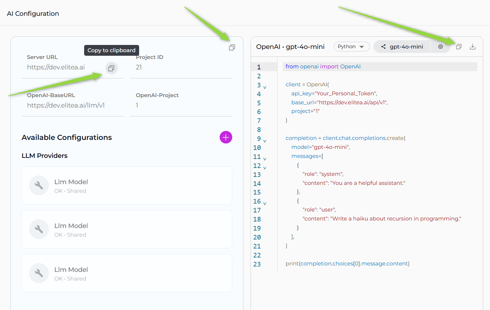
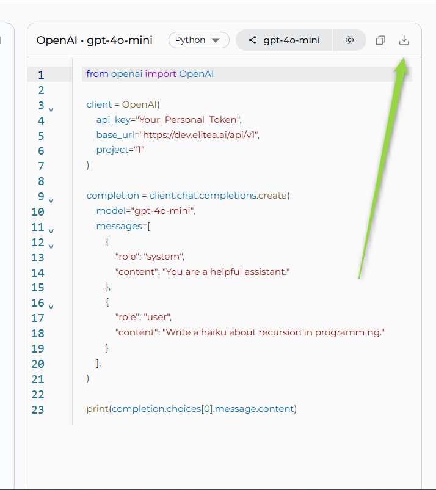
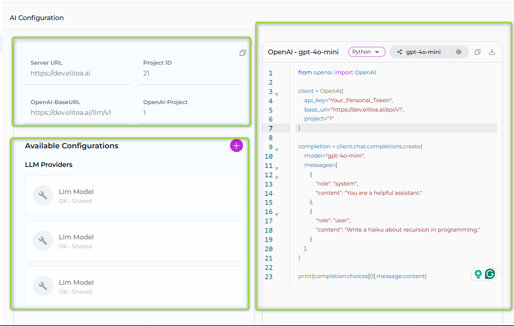
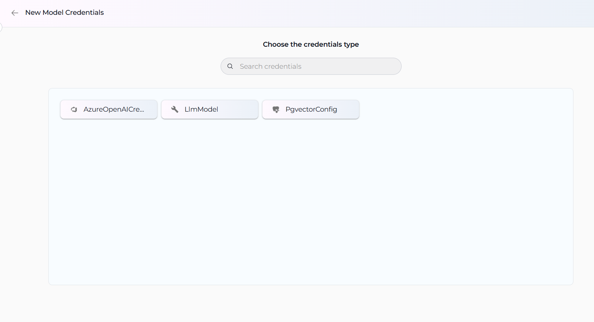

The **AI Configuration** section serves as the central hub for managing essential technical settings that enable the smooth operation of ELITEA's features, such as Alita Code or Alita Code Chat. This section provides configuration details and management for AI models and related services within your project environment.

!!! note "Note"
    The available settings and configurations may vary depending on the project selected. It's important to select the appropriate project from the project dropdown menu to access specific configurations relevant to that project.

### Key Configuration Fields

**Server Configuration:**

* **Server URL** - The base server URL for your ELITEA instance (e.g., `https://nexus.elitea.ai`)
* **Project ID** - The unique identifier for your current project, used for API calls and service requests
* **OpenAI-BaseURL** - The API endpoint URL for OpenAI-compatible services, typically formatted as `{server_url}/llm/v1`
* **OpenAI-Project** - The project identifier used for OpenAI API compatibility (displayed when a model is selected)

**Copy Configuration Features:**

All configuration fields in the AI Configuration section include convenient copy functionality:

* **Individual Field Copy** - Each configuration field displays a copy button (📋) when you hover over it
* **Click to Copy** - Simply click the copy button next to any field to copy its value to your clipboard
* **Copy All Configuration** - Use the copy icon (📋) in the top-right corner to copy all configuration details at once
* **Automatic Feedback** - A toast notification confirms when values are successfully copied
* **Code Examples** - Generated code snippets include copy buttons for easy integration into your projects

This copy functionality makes it easy to transfer configuration values between different environments, share settings with team members, or integrate values into your development workflow.
   
   

### Integration Options

The **Integration Options** section allows you to select and configure AI models from your available integrations:

* **Model Selection Dropdown** - Choose from configured LLM models available in your project
* **Model Capabilities Display** - View supported capabilities of the selected model (Chat, Completion, Embeddings, Function Calling, etc.)
* **Configuration Details** - Access technical details and settings for the selected model
* **IDE Configuration Generation** - Download configuration files for VS Code and JetBrains IDEs

**Download Configuration Files:**

After selecting a model from the Integration Options, you can download code examples in three different formats:

* **cURL Example** - Download `api_example.sh` file with command-line API usage examples
* **Node.js Example** - Download `api_example.js` file with JavaScript/Node.js integration code
* **Python Example** - Download `api_example.py` file with Python API integration examples
* **Pre-configured Parameters** - Downloaded files include server URL, project ID, model settings, and authentication details
* **Ready-to-Use Code** - Each example contains complete, functional code that you can immediately use in your projects
* **Multiple Language Support** - Choose the programming language that best fits your development environment

These downloadable code examples provide ready-to-use integration templates, eliminating the need to write API integration code from scratch.

### Available Configurations

The lower section displays organized categories of your configured integrations:

**LLM Providers**
* Lists configured Large Language Model providers and their associated models
* Shows both personal and shared configurations within the project
* Displays model configurations with status indicators (OK • Shared)

**Vector Storage**
* Displays configured vector database connections for embeddings and similarity search
* Includes providers like PGVector and other supported vector stores

**Embedding Models**
* Shows configured embedding model integrations for text processing and similarity calculations
* Lists available embedding providers and their specific models

**AI Credentials**
* Manages authentication credentials for AI service providers
* Securely stores API keys and tokens for various AI platforms

Each configuration section displays the configuration name, type, and sharing status (personal vs. shared). You can create new configurations using the `+` button in the Available Configurations header.

  

### Creating Model Credentials

To create new model credentials for AI service providers:

1. **Access Credential Creation:** Click the `+` button in the Available Configurations section or navigate to Credentials menu and select **+ Create**

2. **Choose Credential Type:** Select from the following options:
   * **AzureOpenAI** - For Azure OpenAI service integrations
   * **LlmModel** - For general Large Language Model configurations 
   * **PgvectorConfig** - For PostgreSQL vector database connections

   

3. **Configure Credential Details:** Enter a descriptive name for the credential, provide required authentication information (API keys, endpoints, tokens), and configure service-specific parameters based on the selected type

4. **Save:** Click **Save** to make the credential available for use

5. **Integration Usage:** Once saved, credentials appear in relevant configuration sections. Use the credentials when setting up agents, toolkits, or other integrations, and generate code examples showing how to use the configured endpoints
