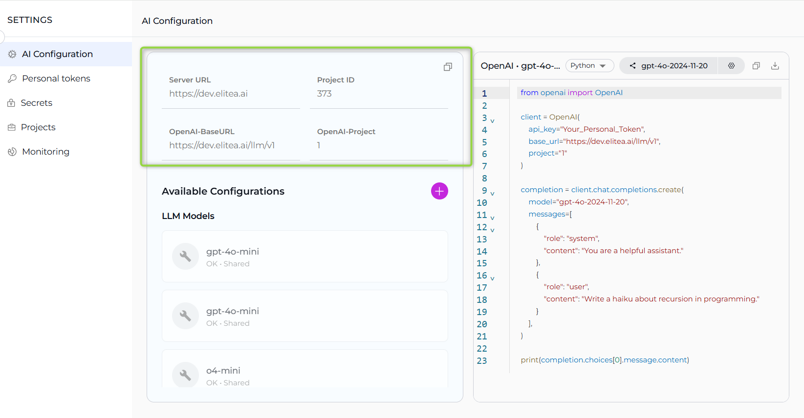
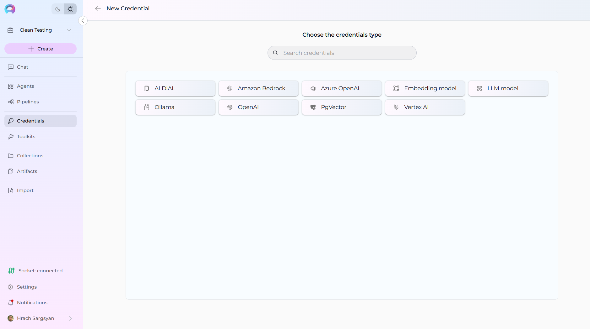

# AI Configuration

The **AI Configuration** section serves as the central hub for managing essential technical settings that enable the smooth operation of ELITEA's features, such as Alita Code or Alita Code Chat. This section provides configuration details and management for AI models and related services within your project environment.

!!! note "Project-Specific Configurations"
    The available settings and configurations may vary depending on the project selected. It's important to select the appropriate project from the project dropdown menu to access specific configurations relevant to that project.

---

## Key Configuration Fields

**Server Configuration:**

* **Server URL** - The base server URL for your ELITEA instance (e.g., `https://next.elitea.ai`)
* **Project ID** - The unique identifier for your current project, used for API calls and service requests
* **OpenAI-BaseURL** - The API endpoint URL for OpenAI-compatible services, typically formatted as `{server_url}/llm/v1`
* **OpenAI-Project** - The project identifier used for OpenAI API compatibility (displayed when a model is selected)

**Copy Configuration Features:**

All configuration fields in the AI Configuration section include convenient copy functionality:

* **Individual Field Copy** - Each configuration field displays a copy button when you hover over it
* **Click to Copy** - Simply click the copy button next to any field to copy its value to your clipboard
* **Copy All Configuration** - Use the copy icon in the top-right corner to copy all configuration details at once
* **Automatic Feedback** - A toast notification confirms when values are successfully copied
* **Code Examples** - Generated code snippets include copy buttons for easy integration into your projects

This copy functionality makes it easy to transfer configuration values between different environments, share settings with team members, or integrate values into your development workflow.

---

## Model Selection and Code Examples

**Model Selection:**

The model selection dropdown allows you to choose from configured LLM models available in your project. When you select a model:

* **Model Capabilities Display** - View supported capabilities of the selected model including Chat, Completion, Embeddings, Function Calling, Reasoning, and Code Generation
* **Configuration Details** - Access technical details and settings for the selected model
* **Integration Information** - See the integration name and model specifications

**Code Examples and Downloads:**

After selecting a model, you can generate and download code examples in multiple programming languages:

* **cURL Example** - Download `api_example.sh` file with command-line API usage examples
* **Node.js Example** - Download `api_example.js` file with JavaScript/Node.js integration code  
* **Python Example** - Download `api_example.py` file with Python API integration examples

**Code Example Features:**

* **Language Selection** - Choose between cURL, Node.js, and Python code examples using the dropdown
* **Pre-configured Parameters** - Downloaded files include server URL, project ID, model settings, and authentication details
* **Ready-to-Use Code** - Each example contains complete, functional code that you can immediately use in your projects
* **Copy and Download** - Both copy to clipboard and download file options available
* **Live Preview** - Code examples update dynamically based on your selected model and configuration

These code examples provide ready-to-use integration templates, eliminating the need to write API integration code from scratch.

---

## Available Configurations

The Available Configurations section displays organized categories of your configured integrations. Each section shows both personal and shared configurations within your project, with status indicators for each configuration.

**LLM Models**

* Lists configured Large Language Model providers and their associated models
* Displays model configurations with status indicators (OK • Shared or OK • Local)
* Includes models from providers like OpenAI, Azure OpenAI, Vertex AI, Ollama, Amazon Bedrock, and HuggingFace
* Shows integration name and model specifications for each configuration

**Embedding Models**

* Shows configured embedding model integrations for text processing and similarity calculations
* Lists available embedding providers and their specific models
* Supports various embedding providers for vector similarity operations

**Vector Storage** 

* Displays configured vector database connections for embeddings and similarity search
* Includes providers like PGVector, Chroma, and other supported vector stores
* Shows connection details and configuration status

**Configuration Management:**

* Each configuration displays the configuration name, integration type, and sharing status (Local vs Shared)
* Click on any configuration to edit or view its details (except for shared configurations in non-public projects)
* Use the `+` button in the Available Configurations header to create new model credentials

---

## Creating Custom Model Credentials

### Step 1: Create LLM provider credentials

You can create new credentials directly from the AI Configuration section using the **+** button .

**From AI Configuration:**

1. **Access Credential Creation:** Click the `+` button in the Available Configurations header
2. **Automatic Navigation:** The system navigates to the credential creation page with model configuration context
3. **Integration Selection:** Choose from available integration types based on your project's configured schemas

**Available Credential Types:**

The system supports various credential types depending on your project configuration, including:

* **Azure OpenAI** - For Azure OpenAI service integrations
* **OpenAI** - For standard OpenAI API connections
* **Vertex AI** - For Google Cloud Vertex AI integrations  
* **Amazon Bedrock** - For AWS Bedrock AI services
* **HuggingFace** - For HuggingFace model integrations
* **Ollama** - For local Ollama model deployments
* **PGVector** - For PostgreSQL vector database connections
* **Chroma** - For Chroma vector database integrations
* **AI Dial** - For AI Dial platform connections

**Configuration Steps:**

1. **Enter Credential Details:** Provide a descriptive name for the credential
2. **Authentication Information:** Enter required API keys, endpoints, tokens, or connection strings
3. **Service-Specific Parameters:** Configure parameters specific to the selected integration type
4. **Save and Verify:** Click **Save** to create the credential and verify the connection

## Model Provider Credential Examples

When creating model provider credentials, it's important to ensure that the detailse like "api version" corresponds exactly to the provider's recommendations to be used for needed model.

For Vertex AI integrations, you need to paste the JSON content in vertex credentials field that was downloaded during the Vertex AI configuration setup:

Once the LLM Model Provider Credentials are created proseed with adding LLM model

### Step 2: Add LLM Models

1. After credentials are created, add LLM models in the Available Configurations section
2. Select the credentials created in Step 1 from the dropdown
3. Configure each model separately - you can add multiple models using the same credentials
4. When creating models, it's important to ensure that the model name (not the display name) corresponds exactly to the provider's model name.

!!! info "Multiple Models, Same Credentials"
    You can configure several models with the same credentials. Each model will be configured as a separate LLM but use the same authentication credentials for efficiency.

!!! warning "Project-Level Access Control"
    If custom LLM configuration is done at the project level (not in private space), it will be accessible to all project members. Keep in mind cost control and usage monitoring when sharing configurations.

  **Integration Usage:**

Once saved, credentials become available throughout the platform for various integrations:
 
* Model selection dropdowns throughout the platform automatically include configured credentials
* Toolkit setups that need specific AI capabilities
* Assign specific AI capabilities to toolkit operations
* Configure embedding models for text processing tools
* Set up vector storage connections for data retrieval tools
* Set up LLM providers for agent reasoning and decision-making 

!!! tip "Best Practices"
    - Use descriptive names for credentials to easily identify their purpose
    - Test credentials after creation to ensure proper connectivity

---

## Default Model Configuration

### Setting the Default Model

In the Available Configurations section, there is a **Default Model Selector** that allows you to set the default model for your project:

- **Purpose**: This model will be automatically selected as the default for all new chats and agents created in your project
- **Easy Configuration**: Simply select the desired model from the dropdown menu
- **No Save Required**: Changes are applied immediately without needing to save

**Usage Impact**:

- All new chat conversations will use this default model unless manually changed
- New agents created will have this model pre-selected unless manually changed
- Existing conversations and agents retain their previously configured models

---

## Important Warnings

!!! danger "Do Not Modify Default Models"
    Do not modify the default PG Vector or LLM models in the project, as this may cause improper project functionality and system instability.

These default models are essential for core platform operations and should remain unchanged to ensure proper system behavior.

---

## Troubleshooting

### Issue: "No Access to LLM" Message

**Problem**: "No access to LLM" message is displayed when using custom LLM configurations.( Message is different for every LLM provider)

**Solution Steps**:

1. **Verify Provider Access**: Use your model provider's platform help center or documentation pages to confirm you have access to the specific LLM mentioned in your configuration
2. **Test Credentials**: Ideally, use a CURL request to verify that your credentials can successfully access the model
3. **Check Model Availability**: Ensure the model name exactly matches the provider's model identifier
4. **Validate Authentication**: Confirm your API keys, tokens, or authentication credentials are valid and not expired

### EPAM AI Dial Specific Troubleshooting

**Issue**: EPAM AI Dial integration failures with personal tokens.

**Specific Considerations**:
- **Limited Model Access**: EPAM AI Dial personal tokens provided to EPAMers have access to a very limited model list
- **Permission Verification**: Use the corresponding permission check requests provided in the AI Dial documentation to verify model accessibility via your token
- **Token Scope**: Ensure your personal token has the necessary permissions for the specific model you're trying to configure

**Resolution Steps**:
1. Review the AI Dial documentation for permission check procedures
2. Execute permission verification requests for your specific model
3. Contact EPAM AI Dial administrators if additional model access is required
4. Consider using project-level tokens if available for broader model access

