# Analytics

## Overview

The **Analytics** feature in ELITEA provides detailed, real-time visibility into how your team uses the platform — from AI model invocations and tool executions to individual user activity and overall system health. Access Analytics through the **Settings** menu to understand adoption, diagnose performance issues, and drive continuous improvement across your project.

Analytics data is always **scoped to the currently selected project** and is refreshed from the API with results cached for up to 5 minutes.

!!! warning "Project Member Requirement"
    The Analytics section is available to **all project members** — no special permission level is required beyond membership in the project. You must be added as a member of the project to view its analytics data. Analytics are not accessible for projects you are not a member of.

## Accessing Analytics

To access the Analytics section:

1. Click on the **Settings** icon in the main navigation sidebar.
2. Select **Analytics** from the settings menu (listed below **Users**).
3. The Analytics dashboard will display, showing the project name next to the page title and the date filter bar at the top.

     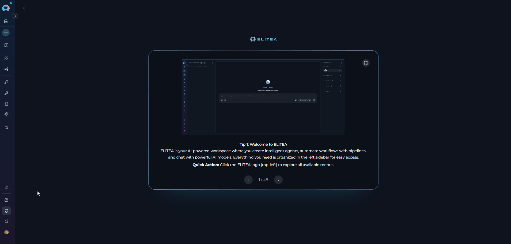

### Analytics Interface Overview

Once opened, the Analytics page is composed of the following elements:

- **Page header** — Displays the title "Analytics" and the name of the currently selected project.
- **Date filter bar** — Located directly below the header; contains the four quick-preset buttons (**Last 24h**, **Last 7d**, **Last 30d**, **Last 90d**) on the left and the **From / To** datetime pickers on the right.
- **Tab bar** — A row of six tabs (**Overview**, **Agents**, **Tools**, **Users**, **Health**, **Guide**) used to switch between different analytics views.
- **Content area** — The main scrollable panel that renders KPI cards, charts, and tables for the active tab.

     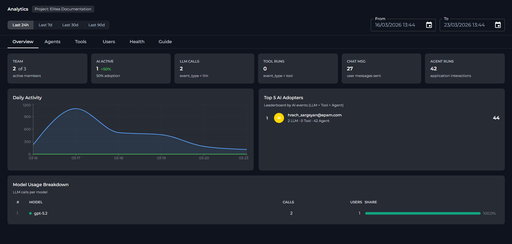

!!! note "Project Scope"
    All metrics and charts show data only for the **currently selected project**. To view analytics for a different project, switch projects using the project selector in the sidebar before opening Analytics.

## Date Range Controls

At the top of the Analytics page, a filter bar lets you control the time window applied to all tabs.

**Quick Presets**

Four preset buttons let you set the date range with a single click:

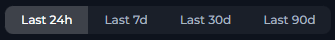

| Preset | Date Range |
|--------|-----------|
| **Last 24h** | Previous 24 hours |
| **Last 7d** | Previous 7 days (default on page load) |
| **Last 30d** | Previous 30 days |
| **Last 90d** | Previous 90 days |

**Custom Date/Time Pickers**

Use the **From** and **To** datetime pickers for precise time windows:

- **From** — Start of the analysis period. Cannot be set later than the **To** value.
- **To** — End of the analysis period. Cannot be set earlier than the **From** value.

     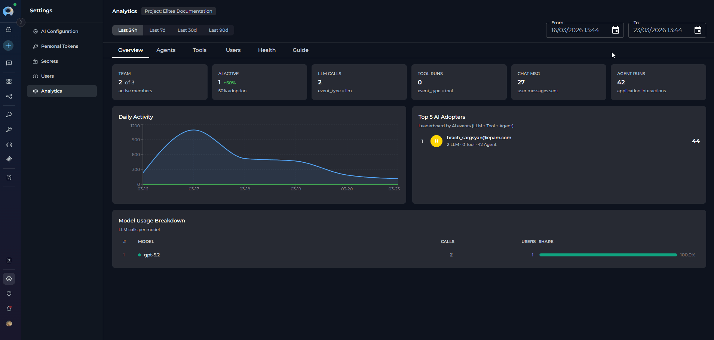

Both pickers support entering a specific date and time (24-hour format). The pickers include **Clear** and **Ok** action buttons. After adjusting the custom pickers, the active preset button is automatically deselected.

!!! info "Default Range"
    The page loads with **Last 7d** pre-selected. Re-selecting a preset button instantly refreshes all tab data for that window without any additional action.

## Analytics Tabs

The Analytics dashboard is divided into six tabs. Click any tab label to switch views.

---

### Overview Tab

The Overview tab presents project-wide KPI cards and summary charts for the selected date range.

**KPI Cards**

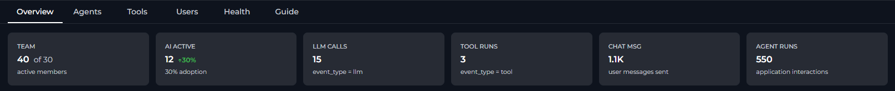

Six metric cards appear at the top of the Overview tab:

| KPI | Card | Description | Calculation |
|-----|-------|-------------|-------------|
| **TEAM** |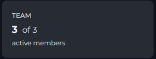| Active members (X) out of all users ever seen in the project (Y). | X = distinct users with ≥ 1 event in range; Y = distinct users all-time. |
| **AI ACTIVE** | 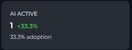 | Users with at least one LLM, tool, or agent event in the period. Includes an **adoption rate badge** (e.g. `↑ 72%`) = `AI ACTIVE / TEAM × 100%`. | Distinct users where `event_type` in (`llm`, `tool`) or `entity_type` = `application`. |
| **LLM CALLS** | 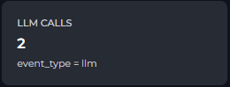 | Total number of Large Language Model invocations (prompts sent to AI models). | Count of events where `event_type = "llm"`. |
| **TOOL RUNS** | 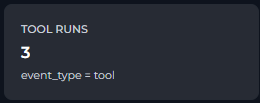 | Total number of tool executions triggered by agents or users. | Count of events where `event_type = "tool"`. |
| **CHAT MSG** | 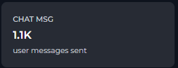 | Total user messages sent in the chat interface. | Count of events where `action = "SIO chat_predict"`. |
| **AGENT RUNS** | 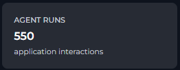 | Total interactions with agents and pipelines. | Count of events where `entity_type = "application"`. |

#### Overview Charts

Below the KPI cards, three chart sections are displayed side by side or stacked, depending on screen size:

* **Daily Activity** — Area chart with two series:

- **Events** (blue): total platform events per day.
- **Users** (green): unique active users per day.

     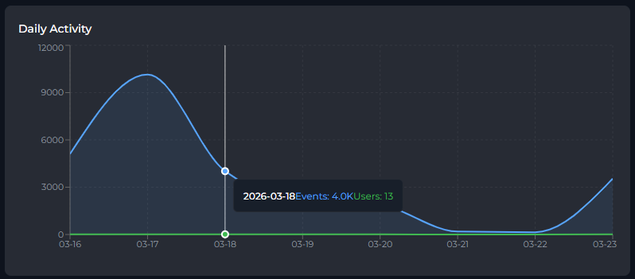

Use this chart to spot usage spikes, identify quiet periods, or track adoption trends over time.

* **Top 5 AI Adopters** — Leaderboard table showing the five users with the most combined AI events (LLM + Tool + Agent). Each row displays:

- Rank and color-coded avatar (gold/silver/bronze for top 3).
- User email.
- Per-type breakdown: `N LLM · N Tool · N Agent`.
- Total AI events score.

     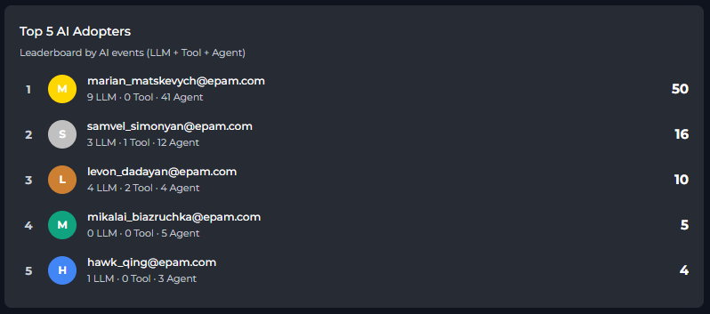

Clicking a row navigates directly to that user's detail view in the **Users** tab.

* **Model Usage Breakdown** — Table ranking all LLM models used in the project by call volume. Columns include model name, total calls, distinct users, and a share bar showing each model's percentage of total LLM calls.

     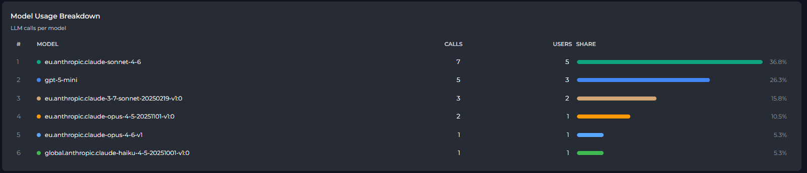

---

### Agents Tab

The Agents tab shows how individual agents (applications) are being used within the project.

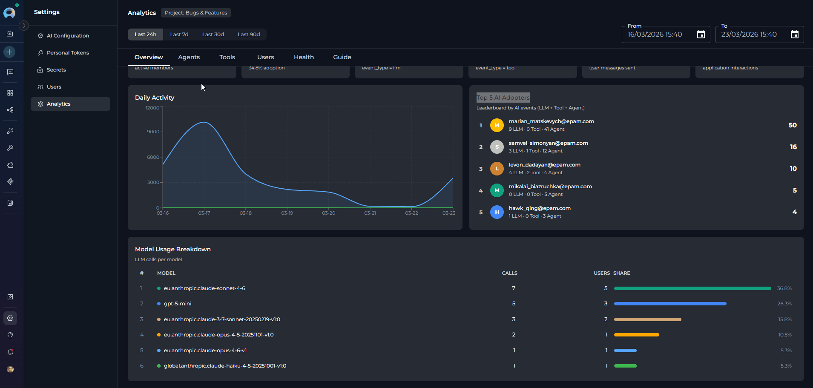

**Chat Messages Chart**

* An area chart showing the number of user messages (`SIO chat_predict` events) sent per day. Useful for tracking chat engagement trends independent of agent-specific metrics.

     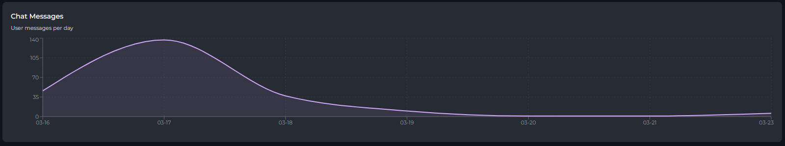

**Most Active Agents Chart**

* A bar chart showing the **top 20 agents** ranked by total event count. Each bar is color-coded and labeled with the agent name.

     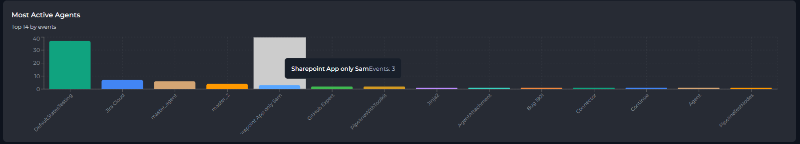

**Agent Activity Table**

* A paginated, searchable table listing all agents in the project:

     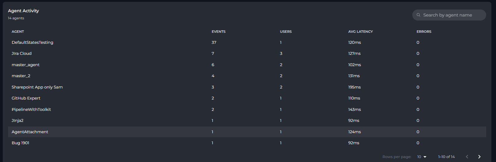

     | Column | Description |
     |--------|-------------|
     | **Agent** | Agent name (clickable to open Agent Detail View) |
     | **Events** | Total events triggered by this agent |
     | **Users** | Number of distinct users who interacted with it |
     | **Avg Latency** | Mean execution time (displayed as `Xms` or `X.Xs`) |
     | **Errors** | Error count (highlighted in red when > 0) |

Use the search box (top-right of the table) to filter agents by name. Page size can be set to 10, 20, or 50 rows per page.

#### Agent Detail View

Click any agent row to open a drill-down view showing:

- **Header**: Agent name with a back arrow to return to the full list.
- **KPI Cards**: Total Events, Unique Users, Avg Latency, Errors, Error Rate (error rate highlighted in red when > 5%).
- **Daily Usage Chart**: Area chart showing events and errors per day for this agent.
- **Users table**: Lists each user who interacted with the agent, with per-user events, average latency, and errors.
- **Tools table**: Lists each tool called by this agent, with call count.

     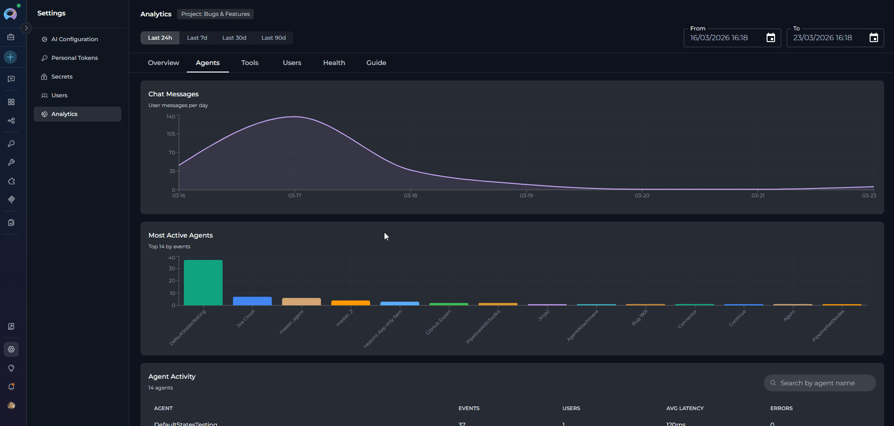

To return to the Agents list, click the **back arrow** in the detail view header.

---

### Tools Tab

The Tools tab surfaces usage patterns for individual tools executed by agents or users.

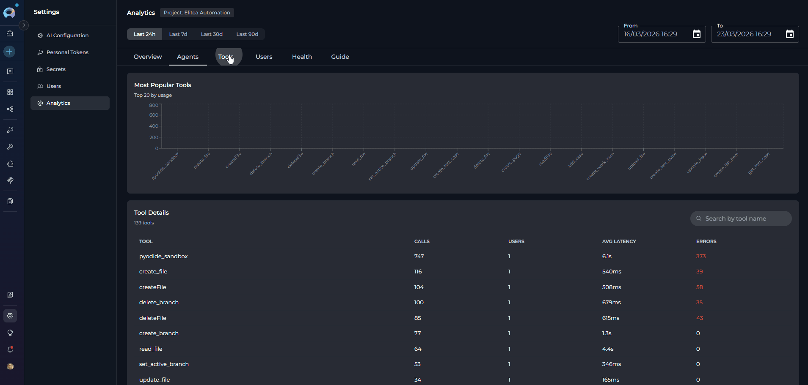

**Most Popular Tools Chart**

A bar chart showing the **top 20 tools** ranked by number of calls. Tool names on the X axis, call count on the Y axis.

**Tool Details Table**

A paginated, searchable table listing all tools used in the project:

| Column | Description |
|--------|-------------|
| **Tool** | Tool name (clickable to open Tool Detail View) |
| **Calls** | Total number of times the tool was called |
| **Users** | Distinct users who triggered this tool |
| **Avg Latency** | Mean execution time |
| **Errors** | Error count (highlighted in red when > 0) |

Use the search box to filter tools by name. Page size options: 10, 20, or 50.

#### Tool Detail View

Click any tool row to open a drill-down view:

- **KPI Cards**: Total Calls, Unique Users, Avg Latency, Errors, Error Rate.
- **Daily Usage Chart**: Area chart showing calls and errors per day for this tool.
- **Users table**: Users who called this tool, with per-user calls, average latency, and errors.
- **Agents table**: Agents that used this tool, with call count (resolved by correlating trace IDs).

     

To return to the Tools list, click the **back arrow**.

---

### Users Tab

The Users tab enables per-person analysis of platform activity.

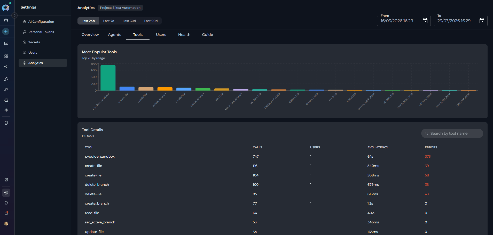

**User Activity Table**

A paginated, searchable table listing all users active in the project during the selected period:

| Column | Description |
|--------|-------------|
| **User** | User email (or `User <ID>` if email is unavailable; clickable) |
| **Events** | Total events across all types |
| **Days** | Number of distinct calendar days the user was active |
| **LLM** | LLM call count |
| **Tool** | Tool execution count |
| **Agent** | Agent interaction count |
| **Chat Msg** | Chat message count |
| **Errors** | Error count (red when > 0) |

Use the search box to filter by email address. Page size options: 10, 20, or 50.

#### User Detail View

Click any user row to open a drill-down view:

- **Header**: User email with a back arrow.
- **KPI Cards**: LLM Calls, Tool Calls, Chat Msg, Agent Runs, Active Days, Errors.
- **Daily Activity Chart**: Area chart with four series — Chat Msg (purple), LLM (blue), Tool (green), Agent (orange) — showing how this user's activity is distributed over time.
- **Models Used** list: AI models this user queried, with call counts.
- **Tools Used** list: Tools this user triggered, with call counts.
- **Agents Used** list: Agents this user interacted with, with run counts.

!!! tip "Cross-Tab Navigation"
    Clicking a user in the **Top 5 AI Adopters** leaderboard on the Overview tab navigates directly to that user's detail view in the Users tab. A back arrow returns you to the Overview.

---

### Health Tab

The Health tab provides system reliability metrics, helping you identify error patterns and latency issues.

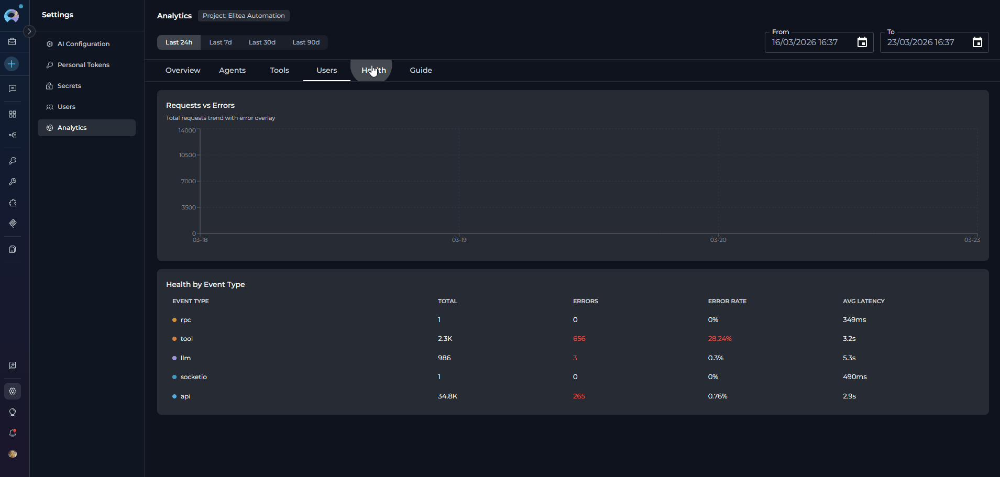

**Requests vs Errors Chart**

A dual-series area chart showing:

- **Total Requests** (blue): all events per day.
- **Errors** (red): events that resulted in an error per day.

Spikes in the red area indicate periods with elevated error rates.

**Health by Event Type Table**

A breakdown table showing reliability per event type:

| Column | Description |
|--------|-------------|
| **Event Type** | Category of platform event (color-coded dot) |
| **Total** | Total events of this type |
| **Errors** | Error count (red when > 0) |
| **Error Rate** | `Errors / Total × 100%` (red when > 5%) |
| **Avg Latency** | Mean duration in ms or seconds |

**Event types tracked:**

| Event Type | Color | Meaning |
|------------|-------|---------|
| `api` | Blue | HTTP REST API calls (UI actions, data fetches) |
| `socketio` | Teal | WebSocket events (chat, real-time features) |
| `llm` | Purple | AI model calls (Claude, GPT, Gemini, etc.) |
| `tool` | Orange | Tool executions (Jira, Slack, web search, etc.) |
| `agent` | Green | Agent workflow invocations |
| `rpc` | Yellow | Internal service-to-service calls |

!!! note "Expected Latency"
    High latency on `llm` events is normal (model inference takes time). Elevated latency on `api` or `rpc` calls may indicate infrastructure or configuration issues worth investigating.

---

### Guide Tab

The **Guide** tab is a built-in metric glossary embedded directly in the Analytics page. It explains every KPI, chart, and table column with:

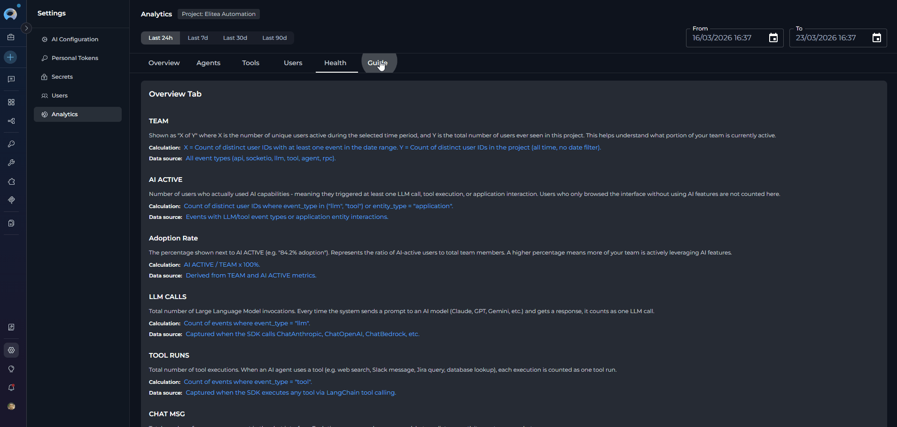

- **Description**: What the metric represents in plain language.
- **Calculation**: The exact formula used to compute the value.
- **Data source**: Which event types or platform actions contribute to the metric.

Sections covered in the Guide tab:

- Overview Tab metrics
- Overview Charts
- Agents Tab metrics
- Tools Tab metrics
- Users Tab metrics
- Health Tab metrics
- General Concepts (event types, date range behavior, project scope)

!!! tip "First Time Using Analytics?"
    Open the **Guide** tab to familiarize yourself with all metric definitions before drawing conclusions from the data.

---

## Limitations

| Limitation | Details |
|------------|---------|
| **Data freshness** | API responses are cached for **5 minutes**. Switching tabs or adjusting the date range within that window may serve cached data. |
| **Overview and Health data shared** | The Overview and Health tabs use the same underlying API call. Switching between them does not trigger a new request while cached data is still fresh. |
| **Agent / Tool / User tabs are independent** | Each tab fetches data separately with server-side pagination. Navigation within a tab (pagination, search) triggers new API requests. |
| **Top charts limited to 20 items** | The Most Active Agents and Most Popular Tools bar charts always show the top 20 items only. Use the paginated table below each chart to browse additional entries. |
| **Trace-ID correlation** | Tool-to-agent associations (in detail views) are resolved by matching `trace_id` values. This is only available when trace IDs are correctly propagated by the SDK. |
| **Project-only scope** | There is no cross-project or portfolio-level view within Analytics. For cross-project analysis, use the **Monitoring** section in Settings. |

---

## Practical Examples

??? example "Measuring AI Adoption Across Your Team"
    1. Open **Settings** → **Analytics**.
    2. Select the **Last 30d** preset.
    3. On the **Overview** tab, read the **TEAM** and **AI ACTIVE** KPI cards.
    4. The **Adoption Rate** badge (e.g., `↑ 72%`) tells you what proportion of your registered team members actively used AI features in the past 30 days.
    5. Scroll to the **Top 5 AI Adopters** leaderboard to identify your most active members — click any name to drill into their individual activity in the Users tab.

??? example "Identifying Underused or Overloaded Agents"
    1. Open the **Agents** tab.
    2. Use the **Most Active Agents** bar chart to quickly see which agents receive the most traffic.
    3. In the **Agent Activity** table, sort mentally by the **Events** column (highest first by default) to find heavily used agents.
    4. Click any agent to open its detail view and check **Avg Latency** and **Error Rate**. A high error rate (> 5%) highlights agents that may need debugging or configuration review.
    5. Agents with zero events in the selected period may be deprecated or not yet discovered by your team.

??? example "Auditing Tool Usage and Reliability"
    1. Open the **Tools** tab.
    2. The **Most Popular Tools** chart gives an at-a-glance view of which integrations are relied upon most.
    3. In the **Tool Details** table, look for tools with a non-zero **Errors** count (displayed in red).
    4. Click a tool with errors to open its detail view: the **Daily Usage** chart reveals when errors spiked, and the **Users** sub-table shows which users encountered them.
    5. Cross-reference with the **Health** tab to check the system-wide error rate for the `tool` event type during the same period.

??? example "Reviewing an Individual User's Activity"
    1. Open the **Users** tab.
    2. Use the search box to filter by the user's email address.
    3. Click the user's row to open their detail view.
    4. Review the **Daily Activity** area chart to see on which days they were most active and which event types dominate.
    5. The **Models Used**, **Tools Used**, and **Agents Used** lists show exactly which platform resources this user engaged with — useful for onboarding support or license reviews.

??? example "Investigating an Error Spike"
    1. Open the **Health** tab.
    2. In the **Requests vs Errors** chart, identify the date range of the error spike.
    3. In the **Health by Event Type** table, find the row with the highest **Error Rate** (values > 5% are highlighted in red).
    4. Note the event type (e.g., `llm` or `tool`) and navigate to the corresponding tab (**Agents** or **Tools**) to identify which specific agent or tool was responsible.
    5. Narrow the date range using the **From/To** pickers to focus on the spike period, then re-examine the relevant tab.

---

## Best Practices

??? tip "Start with a Meaningful Date Range"
    Before reading any metrics, set the date range that matches your analysis goal. Use **Last 7d** for recent activity reviews, **Last 30d** for monthly reporting, and custom pickers for audit periods tied to specific events or releases.

??? tip "Use the Guide Tab Before Drawing Conclusions"
    Open the **Guide** tab to review exact metric definitions and calculation formulas. Metrics like **TEAM** (active users vs. total ever seen) and **AI ACTIVE** (LLM/Tool/Agent users only) have specific scopes that affect interpretation.

??? tip "Combine Overview and Users Tabs for Adoption Analysis"
    Use the **Overview** tab to get the aggregate adoption picture, then drill down via the **Top 5 AI Adopters** leaderboard or the **Users** tab to identify specific individuals for coaching or recognition.

??? tip "Monitor Health Regularly"
    Review the **Health** tab after deployments or integrations changes. A sudden increase in `llm` or `tool` error rates often signals a misconfigured AI model or a broken external service credential.

??? tip "Cross-Reference Agents and Tools Tabs"
    When an agent shows high errors in the **Agents** tab, open its detail view and check the **Tools** sub-table. Then visit the **Tools** tab, click the problematic tool, and check which other agents also rely on it — helping you assess the blast radius of a broken integration.

??? tip "Leverage Cross-Tab Navigation"
    You can navigate directly from the **Overview** leaderboard to a specific user's detail view without going through the Users tab manually. Similarly, using the back arrow in any detail view returns you smoothly to the list without losing your sort or search state.

---

!!! related "Related Pages"
    - [Users](users.md) — Manage project members whose activity is tracked in Analytics.
    - [Toolkits](../toolkits.md) — Configure and manage the tools that appear in the Tools tab.
    - [Agents](../agents.md) — Create and manage the agents whose usage is tracked in the Agents tab.
