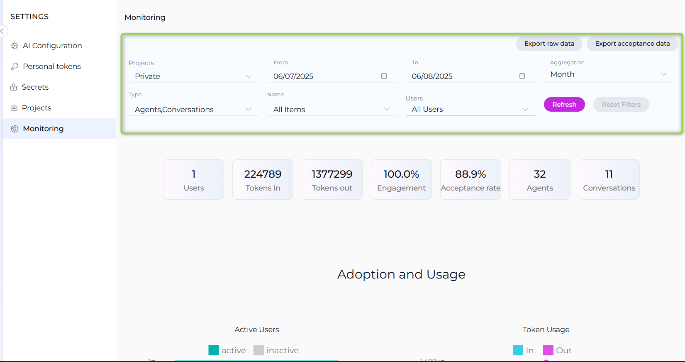
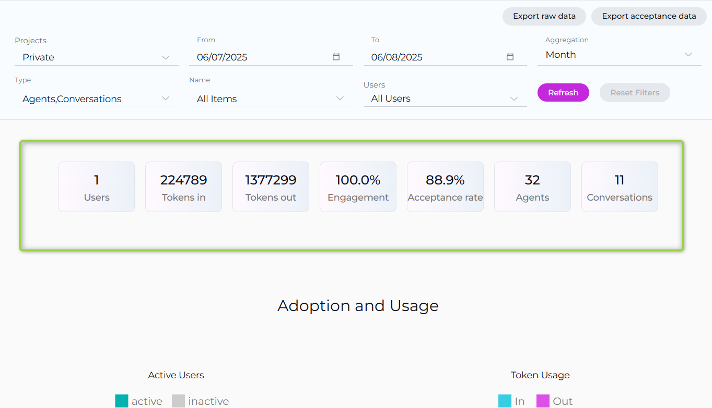
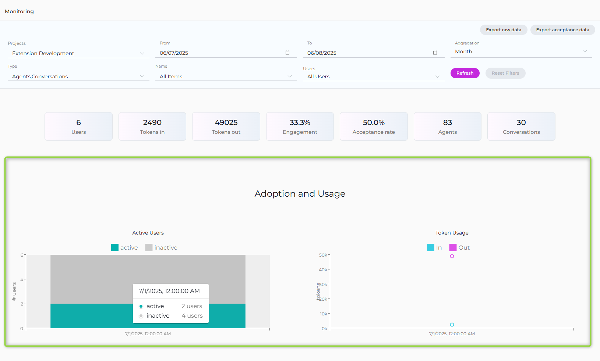
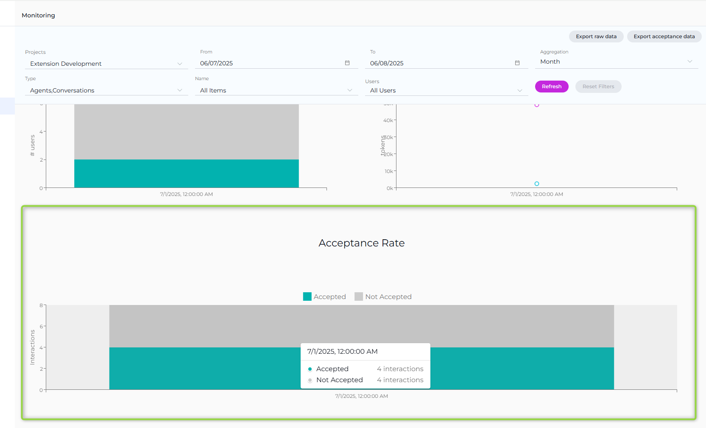
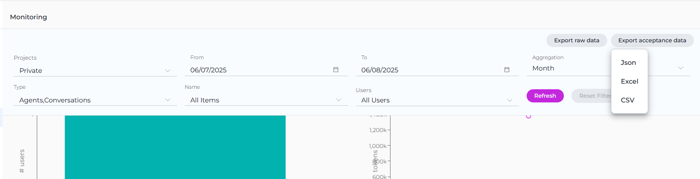
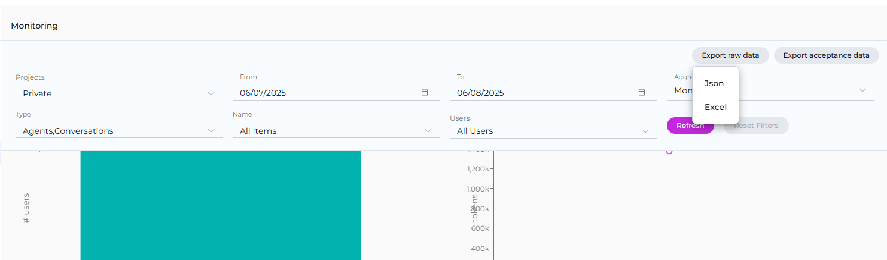

The **Monitoring** feature in ELITEA is designed to provide a comprehensive overview of the application's usage and performance. This feature is essential for administrators and users who want to gain insights into various aspects of the application, from user engagement to the effectiveness of configured artifacts like agents and conversations. By leveraging the detailed charts and statistics available within the Monitoring feature, you can make informed decisions to optimize the performance and user experience of your ELITEA application.

### Configuration Options

At the top of the **Monitoring** page, you have several options and settings to configure the charts and metrics you wish to monitor:

* **Projects**: A dropdown list allowing you to select the project. **Note**: For your Private project, you can only see your private project data. If you have an admin role in other projects, you can select other projects to monitor.
* **From and To Date Fields**: These fields are used to select the time period for which you want to see the data.
* **Aggregation**: A dropdown list providing options to view aggregated data over different time periods. You can choose from `Hour`, `Day`, `Week`, `Two Weeks`, `Three Weeks`, and `Month` to tailor the data aggregation to your specific needs.
* **Type**: A dropdown list allowing you to select between `Agents` and `Conversations` to focus your monitoring on specific elements.
* **Name**: A dropdown list to select specific items by name, such as created agents or conversations.
* **Users**: A dropdown list to select which users' data you want to monitor. **Note**: For your private project, you can only see your own user data. If you have an admin role in another project, you can select other users to monitor.

To apply any changes or selections, click the **Apply** button. Use the **Refresh** button to update the monitoring data based on the latest activities and configurations.

### Key Metrics

Below the configuration options, you'll find an overview of key metrics that give you a snapshot of the current state of the system:

* **Users**: The total number of users interacting with the ELITEA application.
* **Tokens In**: The number of tokens consumed by the ELITEA application.
* **Tokens Out**: The number of tokens generated by the ELITEA application.
* **Engagement**: The percentage of active users out of all users who logged into ELITEA for the selected period, indicating the level of interaction with the application.
* **Acceptance rate**: The percentage of interactions during the selected period where users accepted the generated output by copying, downloading, or saving it, reflecting user satisfaction and utility of the results.
* **Agents**: The total number of agents created.
* **Conversations**: The total number of conversations created.

These metrics are accompanied by a date range selector, allowing you to filter the data for a specific period.

### Available Charts

The Monitoring feature provides several chart types to help you analyze different aspects of ELITEA usage:

#### Adoption and Usage

* **Active Users**: A bar chart displaying the number of active users over time.
* **Token Usage**: A line chart showing the tokens consumed (In) and generated (Out) over time.

These charts provide insights into user engagement and the application's token economy.

#### Acceptance Rate

The **Acceptance Rate** chart provides a comprehensive view of user interactions with the ELITEA application, focusing on how often users accept the generated outputs. This chart helps you assess how frequently users find the generated outputs useful enough to accept by copying, downloading, or saving them.

* **Accepted Interactions**: Shows the count of interactions where users have accepted the generated output, indicating satisfaction and utility.
* **Not Accepted Interactions**: Reflects the number of interactions where users did not accept the output, suggesting areas for potential improvement in response quality.

### Project Group Support

When you have administrative access to multiple projects, the Monitoring feature supports project grouping:

* **Project Treemap**: Visual representation of projects within a selected group, allowing you to drill down into individual project metrics.
* **Portfolio-Level Monitoring**: Aggregate metrics across multiple projects for high-level oversight.

### Data Export

The Monitoring feature includes comprehensive export capabilities to help you create reports and share insights with stakeholders. Two main export options are available in the top-right corner of the Monitoring interface:

#### Export Raw Data

The **Export raw data** option allows you to export comprehensive monitoring data based on your current filter selections. This export includes:

* All metrics data for the selected time period
* User activity information
* Token usage statistics
* Agent and conversation performance data
* Chart data points and trends

#### Export Acceptance Data

The **Export acceptance data** option provides focused export of user acceptance metrics, including:

* Acceptance rate statistics
* User interaction data showing accepted vs. not accepted outputs
* Detailed acceptance trends over time
* Performance indicators related to user satisfaction

#### Export Formats

Both export options support multiple file formats to accommodate different analysis needs:

* **JSON**: Machine-readable format ideal for data processing and integration with other tools
* **Excel**: Spreadsheet format perfect for detailed analysis, pivot tables, and business reporting
* **CSV**: Comma-separated values format for compatibility with various data analysis tools and databases

#### Using Export Features

1. Configure your monitoring filters (Projects, Date Range, Type, Name, Users, Aggregation)
2. Click **Refresh** to apply your filter settings
3. Choose either **Export raw data** or **Export acceptance data** from the export dropdown
4. Select your preferred format (JSON, Excel, or CSV)
5. The file will be downloaded to your device for further analysis

These export capabilities enable you to perform deeper analysis, create custom reports, share data with stakeholders, and integrate monitoring insights into your existing reporting workflows.