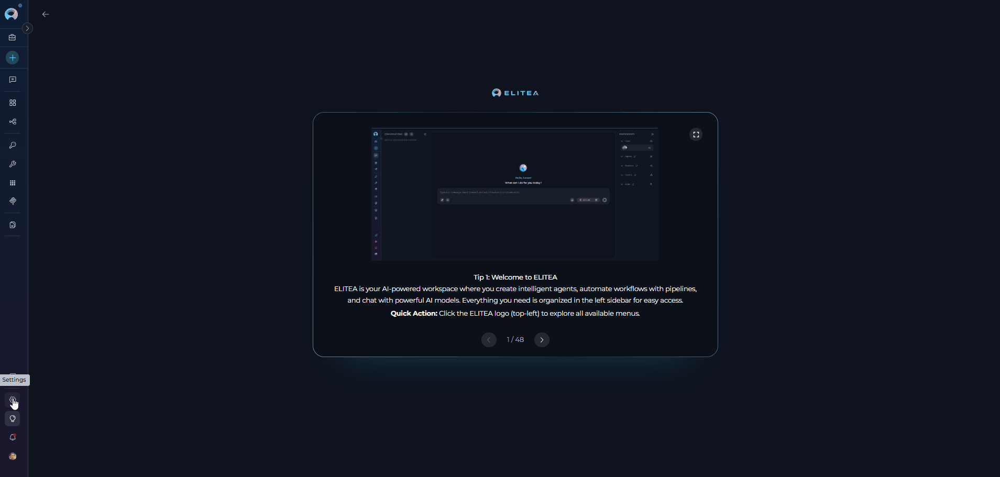
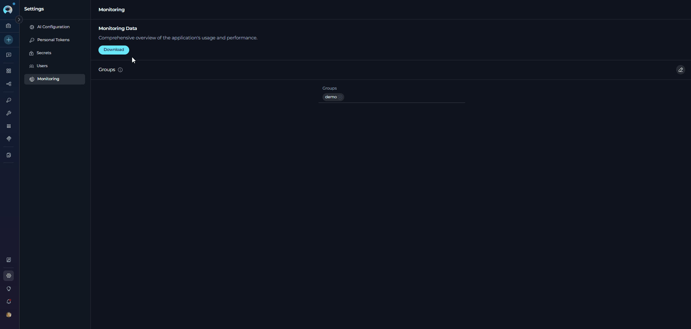
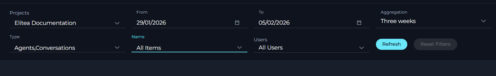
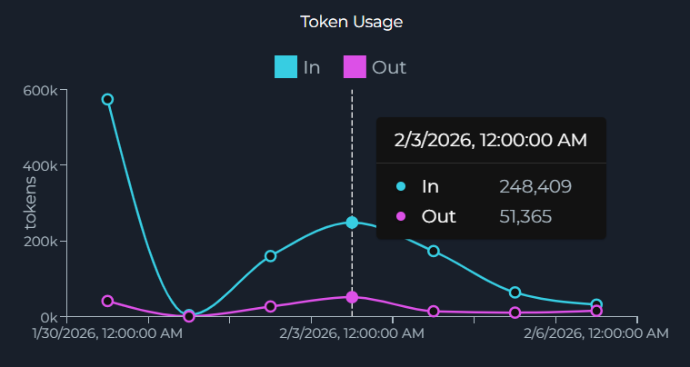
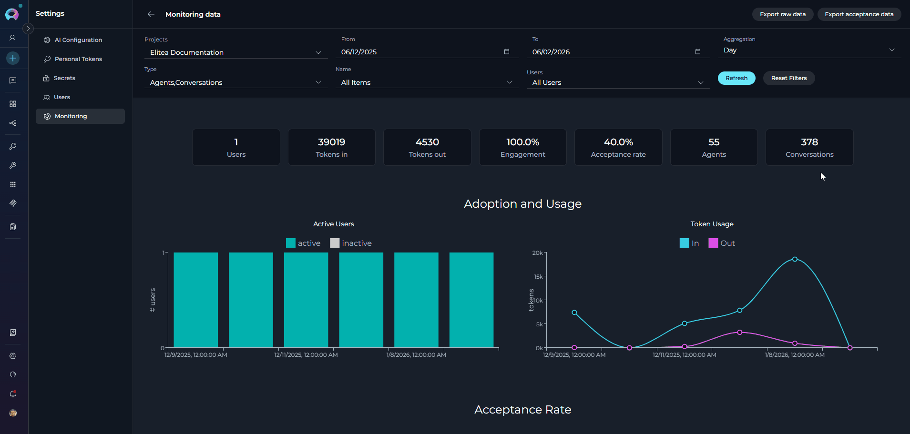

# Monitoring

## Overview

The **Monitoring** feature in ELITEA provides insights into application usage and performance. Access monitoring through the **Settings** menu to analyze user engagement, token usage, and the effectiveness of your agents and conversations.

## Accessing Monitoring

To access the Monitoring section:

1. Click on the **Settings** icon in the main navigation sidebar.
2. Select **Monitoring** from the settings menu.
3. The Monitoring interface will display with two main sections available:
   - **Monitoring** - Main landing page with project groups management
   - **Monitoring Data** - Detailed analytics dashboard with filters, metrics, and charts

{loading=lazy}

## Managing Groups:

To manage project groups:

1. Click the **Edit** icon (pencil icon) on the right side of the Groups header.
2. The tag editor will open, allowing you to add or remove group tags.
3. Click **Save** to apply changes or **Cancel** to discard.

**Purpose of Groups:**

Project groups are organizational tags that enable portfolio-level monitoring and management across multiple projects. They serve several key purposes:

* **Portfolio Organization**: Group related projects together for unified monitoring and analysis
* **Cross-Project Analytics**: View aggregated metrics across all projects within a group using the treemap visualization
* **Efficient Filtering**: Quickly filter monitoring data by selecting a group instead of individual projects
* **Hierarchical Navigation**: Drill down from group-level insights to individual project details
* **Flexible Categorization**: Assign projects to multiple groups based on different criteria (e.g., department, product line, environment)

Groups appear in the Projects filter dropdown in the Monitoring Data dashboard, allowing you to select either individual projects or entire groups for monitoring analysis.

## Monitoring Data Dashboard

To access the detailed analytics dashboard:

1. From the Monitoring landing page, click the **Download** button.
2. The Monitoring Data dashboard will display with comprehensive filters, metrics, and charts.

### Filter Options

Configure the data displayed using the following filters located at the top of the dashboard:

| Filter | Description | Options | Details |
|--------|-------------|---------|----------|
| **Projects** | Select projects or project groups to monitor | • Single project selection • Project group selection (shows all projects in the group) • "All Projects" option when no selection is made | Choose specific projects or use groups to view aggregated metrics. Groups enable portfolio-level monitoring across multiple related projects |
| **From** | Start date for the monitoring period | Date picker | Defines the beginning of the time range for data analysis. Works in conjunction with the To date to set the monitoring window |
| **To** | End date for the monitoring period | Date picker | Defines the end of the time range, cannot exceed today's date. Combined with From date to establish the data collection period |
| **Aggregation** | Time period aggregation | • Hour • Day • Week • Two weeks • Three weeks • Month | Determines how data points are grouped in charts. Smaller periods (Hour) show detailed trends, larger periods (Month) show long-term patterns |
| **Type** | Select entity types to monitor | • Agents (labeled as "applications" in data) • Conversations • "All Types" when no selection is made | Filters monitoring data by entity category. Selecting a specific type updates the Name dropdown and affects which metrics are displayed |
| **Name** | Select specific agents or conversations by name | • Dropdown shows items matching selected Type(s) • "All Items" when no selection is made | Narrows monitoring to specific entities(e.g.,Agents). Dynamically populated based on Type selection. Disabled until at least one project is selected |
| **Users** | Select specific users to monitor | "All Users" when no selection is made | Filters data by user activity. Useful for analyzing individual or team performance. Disabled until at least one project is selected |
| **Refresh** | Apply filter changes and update all metrics and charts | Action button | Executes the current filter configuration and reloads all dashboard data including metrics and charts |
| **Reset Filters** | Clear all filters and return to default values | Action button | Restores all filters to their initial state, useful for starting a new analysis from scratch |

### Key Metrics

Below the filter options, key metrics provide a snapshot of the current monitoring period:

| Metric | Description | Details |
|--------|-------------|----------|
| **Users** | Total number of users | Counts unique users who interacted with the application during the selected time period. Helps track user base growth and adoption |
| **Tokens in** | Number of tokens consumed (input to LLM) | Measures the total input tokens sent to language models. Useful for understanding request complexity and API usage costs |
| **Tokens out** | Number of tokens generated (output from LLM) | Measures the total output tokens generated by language models. Indicates response volume and helps track generation costs |
| **Engagement** | Percentage representing the total engagement rate | Shows the ratio of active users to total users who logged in. Higher percentages indicate stronger user interaction with the platform |
| **Acceptance rate** | Percentage of interactions where users accepted outputs | Reflects user satisfaction by measuring how often generated outputs are copied, downloaded, or saved. Key quality indicator |
| **Agents** | Total number of agents (applications) | Count of configured agents in the system. Only displayed when Type filter is set to "All Types" to provide comprehensive overview |
| **Conversations** | Total number of conversations | Count of conversation instances created. Only displayed when Type filter is set to "All Types" to provide comprehensive overview |

## Available Charts

The Monitoring Data dashboard includes several chart sections to visualize different aspects of application usage:

### Project Treemap

When a project group is selected (or "All Projects"), a treemap visualization displays:

* Visual representation of projects within the group
* Hierarchical view showing group and project levels
* Click on group or project elements to drill down into specific data

### Adoption and Usage

This section displays two charts side by side:

* **Active Users**: Bar chart showing active and inactive users over time
      - Stacked bars showing active users and inactive users
      - Y-axis: Number of users
      - X-axis: Date (formatted based on aggregation period)
      {width="350"}

* **Token Usage**: Line chart showing token consumption and generation
      - Displays "Tokens in" and "Tokens out" metrics over time
      - X-axis: Date (formatted based on aggregation period)
      {width="350"}

### Acceptance Rate

A comprehensive chart showing user acceptance of generated outputs:

- Displays accepted vs. not accepted interactions over time
- Helps assess user satisfaction with generated outputs
- Shows trends in output acceptance

 {width="450"}

!!! note "Chart Visibility"
    Some charts may be hidden based on system configuration. Additional chart sections such as Sentiments (Human Input and LLM Output sentiment analysis), Accuracy (Relevancy, Reliability, and Prompt Scatter quality metrics), and Topics (Topic Prompt and Topic Chart analysis) may be available depending on your system configuration.

## Data Export

Two export buttons are located in the top-right corner of the Monitoring Data dashboard:

### Using Export Features

1. Configure your monitoring filters (Projects, Date Range, Type, Name, Users, Aggregation)
2. Click **Refresh** to apply filter settings
3. Click either **Export raw data** or **Export acceptance data**
4. Select your preferred format (JSON, Excel, or CSV)
5. The file downloads automatically to your device

### Export Raw Data

{width="550"}

Export comprehensive monitoring data based on current filter selections:

**Supported Formats:**

* **JSON**: Machine-readable format for data processing and integration
* **Excel**: Spreadsheet format for analysis and reporting

**Exported Data Includes:**

* All metrics data for the selected time period
* User activity information
* Token usage statistics
* Agent and conversation performance data
* Chart data points based on current filters

### Export Acceptance Data

{width="550"}

Export focused acceptance metrics:

**Supported Formats:**

* **JSON**: Machine-readable format
* **Excel**: Spreadsheet format
* **CSV**: Comma-separated values format

**Exported Data Includes:**

* Acceptance rate statistics
* User interaction data (accepted vs. not accepted)
* Acceptance trends over time
* Performance indicators for user satisfaction

## Best Practices

??? tip "Use Project Groups for Portfolio Management"
    Organize related projects using group tags to enable portfolio-level monitoring. This allows you to view aggregated metrics across multiple projects and drill down into specific project details using the treemap visualization.

??? tip "Configure Filters Before Refreshing"
    Set all desired filters (Projects, Date Range, Type, Name, Users, Aggregation) before clicking **Refresh** to minimize API calls and improve performance. Use **Reset Filters** to quickly return to default values.

??? tip "Choose Appropriate Aggregation Periods"
    Select aggregation periods based on your analysis needs:
    
    - **Hour**: For detailed short-term analysis or debugging
    - **Day**: For weekly or monthly trend analysis
    - **Week/Two weeks/Three weeks**: For quarterly reviews
    - **Month**: For long-term trends and annual reporting

??? tip "Monitor Acceptance Rate Regularly"
    Track the acceptance rate metric to gauge user satisfaction with generated outputs. A declining acceptance rate may indicate issues with output quality or relevance that require prompt attention.

??? tip "Export Data for Historical Analysis"
    Regularly export monitoring data to build a historical database. This enables long-term trend analysis, compliance reporting, and comparison of performance across different time periods.

??? tip "Use Sentiment Analysis for Quality Insights"
    Review the Sentiments charts to understand user input patterns and LLM output quality. Comparing Human Input sentiment with LLM Output sentiment can reveal opportunities for improving agent responses.

??? tip "Leverage Session Storage for Workflow Efficiency"
    Your filter preferences are automatically saved in session storage, allowing you to maintain consistent monitoring views when navigating between different sections of the application.

