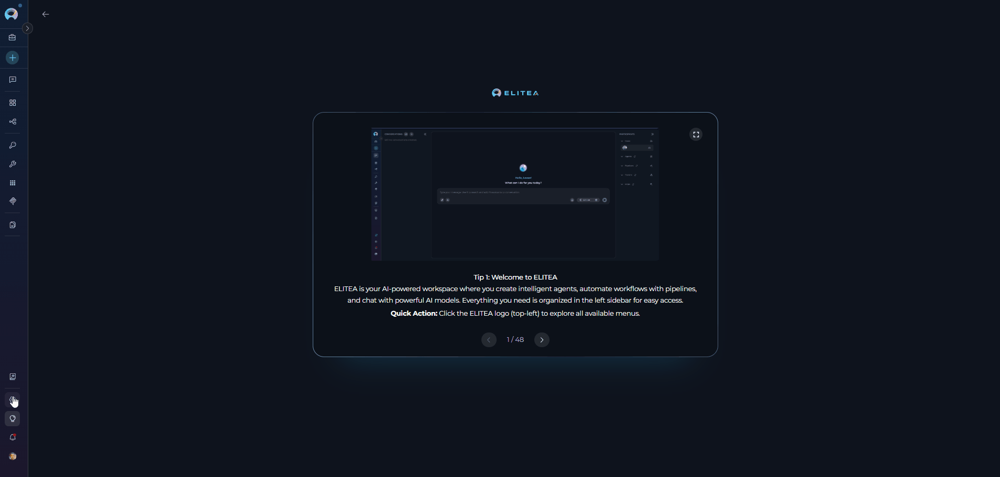
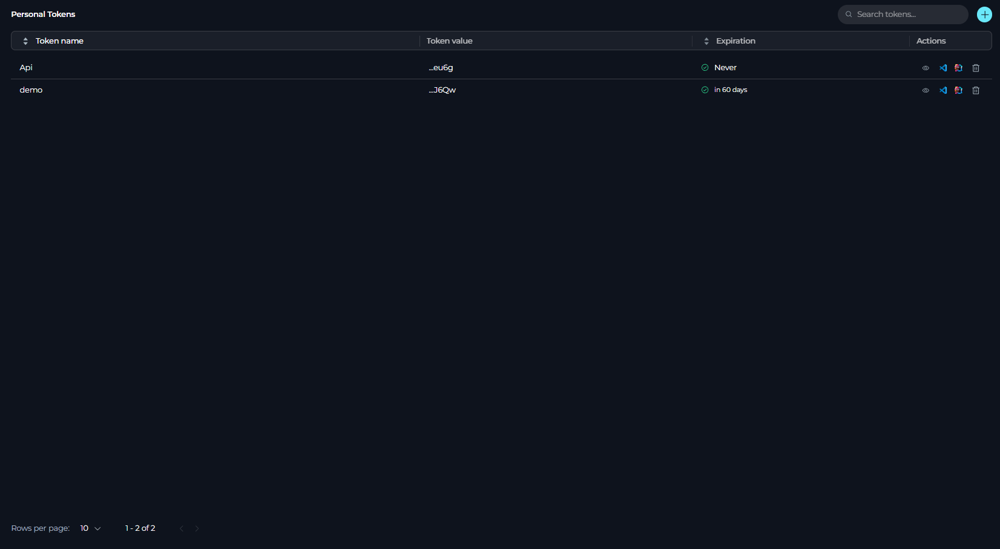
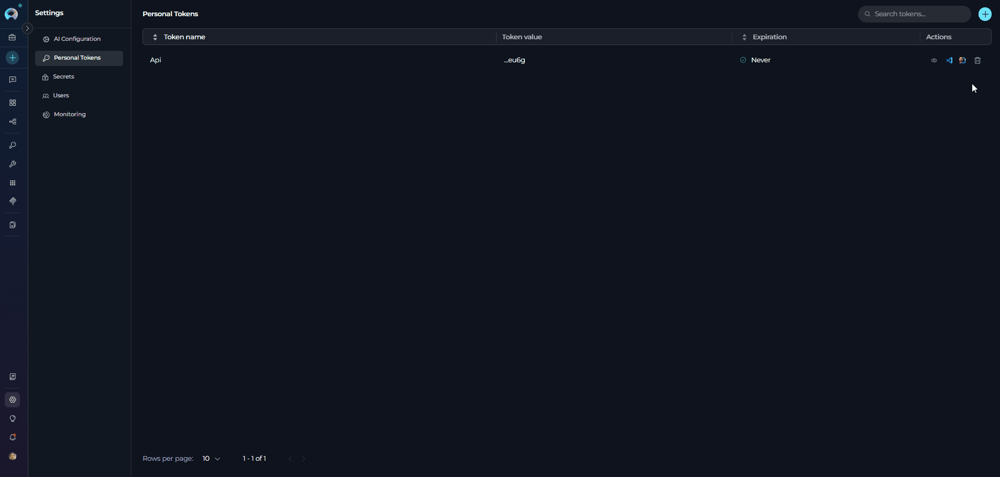
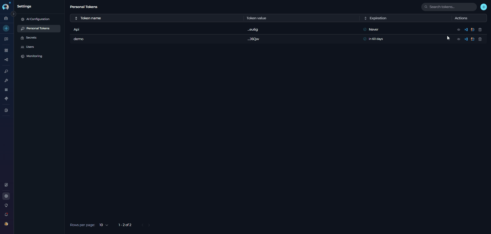
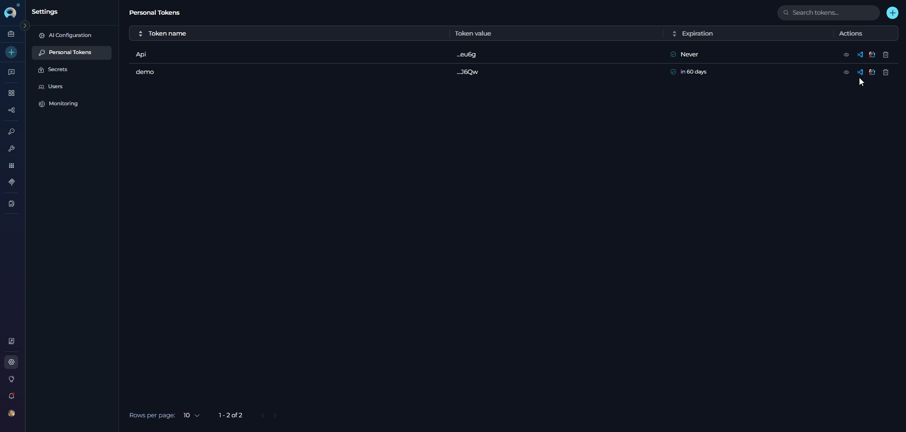
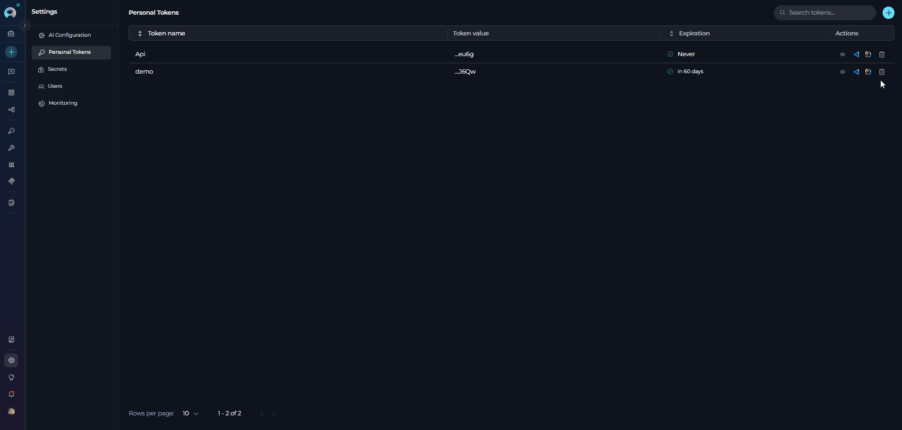

# Personal Tokens

## Overview

The **Personal Tokens** section allows you to create and manage personal access tokens for API access and IDE integrations. These tokens enable secure communication between your development environments (VSCode, JetBrains IDEs) and ELITEA's backend services.

## Navigating to Personal Tokens

To access the Personal Tokens section:

1. Click on the **Settings** icon in the main navigation sidebar.
2. Select **Personal Tokens** (or **Tokens**) from the settings menu.
3. The Personal Tokens management interface will display.

{loading=lazy}

## Main Components

The Personal Tokens section includes:

* **Search Field**: Filter tokens by name using "Search tokens..." placeholder
* **+ Button**: Generate new personal tokens
* **Tokens Table**: Displays all tokens with columns for Token name, Token value, Expiration, and Actions
* **Pagination Controls**: Navigate through tokens lists (supports 5, 10, 50, or 100 tokens per page)
* **Action Icons**: Preview settings, Download VSCode settings, Download JetBrains settings, and Delete options

## Tokens Table



The tokens table displays the following information:

* **Token name**: The identifier for the token
* **Token value**: Last 4 characters of the token (e.g., "...ab12")
* **Expiration**: Status indicator showing:
    * ✓ Green icon with "in X days" for tokens expiring in more than 7 days
    * ⚠ Warning icon with "in X days" for tokens expiring within 7 days
    * ✓ Green icon with "Never" for tokens without expiration
    * ✗ Gray icon with "Expired" for expired tokens
* **Actions**: Icons for preview, downloads, and delete operations

!!! tip "Table Features"
    The tokens table supports:
    
    * **Sorting**: Click the "Token name" or "Expiration" column headers to sort
    * **Pagination**: Change the number of tokens displayed per page (5, 10, 50, or 100)
    * **Search**: Filter tokens by name in real-time

## Creating a Personal Token

To generate a new personal token:

1. Click the **+** button in the top-right corner of the Personal Tokens section.
2. The "New Token" creation page will open with a form containing:
      - **Name** field: Enter a descriptive name for the token
      - **Expiration period** dropdown: Select from Never, Days, Weeks, Hours, or Minutes
      - **Value** field: Enter the number of expiration units (appears when not "Never")
3. Click the **Generate** button to create the token.
      - A dialog titled  will appear with:
      - The full token value (displayed once)
5. Click the **Copy** button to copy the token to your clipboard.
6. Close the dialog to return to the tokens list.

{loading=lazy}

!!! warning "Token Security"
    * The generated token is displayed **only once**. You cannot view the full token value again after closing the dialog. Make sure to copy and securely store it before closing.
    
    * Token names must be unique Choose descriptive names that identify the token's purpose (e.g., "VSCode-Development", "JetBrains-Production")

You can set token expiration using the following measures:

| Expiration Measure | Description | Use Case |
|--------------------|-------------|----------|
| **Never** | Token does not expire | Recommended only for development environments |
| **Days** | Token expires after specified number of days | Default: 30 days. Suitable for production tokens |
| **Weeks** | Token expires after specified number of weeks | Medium-term access tokens |
| **Hours** | Token expires after specified number of hours | Short-term or temporary access |
| **Minutes** | Token expires after specified number of minutes | Testing and validation purposes |

## Managing Personal Tokens

!!! tip "Searching Tokens"
    Use the search field at the top to filter tokens by name. The search is case-insensitive and filters results in real-time as you type.

### Preview Settings

To preview IDE settings for a token:

1. Click the **👁** (eye) icon in the Actions column.
2. A preview panel will open on the right side showing the IDE configuration for the selected token.
3. Use the dropdown selector to switch between **VSCode** and **JetBrains** IDE settings.
4. From the preview panel, you can:
   * **Copy**: Click the copy button to copy the settings to your clipboard
   * **Download**: Click the download button to save the settings file
5. Click the close button to hide the preview panel.

{loading=lazy}

### Downloading IDE Settings

{loading=lazy}

**For VSCode:**

1. Click the **VSCode** icon in the Actions column.
2. A `settings.json` file will be downloaded with pre-configured settings including:

!!! example "Example `settings.json` file"
    ```json
    {
      "alitacode.providerServerURL": "https://next.elitea.ai",
      "alitacode.LLMServerUrl": "https://next.elitea.ai",
      "alitacode.modelName": "gpt-5-mini",
      "alitacode.LLMModelName": "gpt-5-mini",
      "alitacode.authToken": "...gnrJ6Qw",
      "alitacode.LLMAuthToken": "...gnrJ6Qw",
      "alitacode.projectId": 123,
      "alitacode.integrationUid": "",
      "alitacode.defaultViewMode": "split",
      "alitacode.verifySsl": false,
      "eliteacode.LLMServerUrl": "https://next.elitea.ai",
      "eliteacode.LLMModelName": "gpt-5-mini",
      "eliteacode.LLMAuthToken": "...gnrJ6Qw",
      "eliteacode.projectId": 123,
      "eliteacode.integrationUid": "",
      "eliteacode.displayType": "split",
      "eliteacode.verifySsl": false,
      "eliteacode.debug": false
    }
    ```

**For JetBrains IDEs:**

1. Click the **JetBrains** icon in the Actions column.
2. An `alita.xml` file will be downloaded with pre-configured settings.

!!! example "Example `alita.xml` file"
    ```xml
    <?xml version="1.0" encoding="UTF-8"?>
    <project version="4">
      <component name="AlitaSettings">
        <option name="displayType" value="SPLIT" />
        <option name="integrationName" value="" /> 
        <option name="integrationUid" value="" />
        <option name="llmCustomModelEnabled" value="true" /> 
        <option name="llmCustomModelName" value="gpt-5-mini" />
        <option name="llmServerUrl" value="https://next.elitea.ai" />
        <option name="projectId" value="123" />
        <option name="provider" value="ALITA_EYE" />
      </component>
    </project>
    ```

!!! note "Download Availability"
    IDE settings download icons are only available when a model configuration is selected and you are not in the Public project.

### Deleting Tokens

To remove a token:

1. Click the **🗑** (delete) icon in the Actions column.
2. A confirmation dialog will appear asking you to confirm the deletion.
3. Type the token name to confirm deletion.
4. Click **Delete** to permanently remove the token.

{loading=lazy}

!!! warning "Permanent Deletion"
    Deleting a token is permanent and cannot be undone. Any applications or IDEs using this token will lose access immediately. Ensure the token is no longer in use before deletion.

## Best Practices

??? tip "Use Descriptive Token Names"
    Name your tokens based on their purpose and environment. Examples: "VSCode-MacBook-Dev", "JetBrains-Windows-Prod", "API-Testing-Temp"

??? tip "Set Appropriate Expiration Periods"
    * Use "Never" only for personal development environments
    * Set 30-90 days expiration for production tokens
    * Use short expiration (hours/minutes) for testing and temporary access

??? tip "Monitor Token Expiration"
    Regularly check tokens with warning icons (⚠) indicating expiration within 7 days. Generate replacement tokens before expiration to avoid service interruptions.

??? tip "Rotate Tokens Regularly"
    Even for tokens set to "Never" expire, consider rotating them periodically (every 3-6 months) for enhanced security.

??? tip "Delete Unused Tokens"
    Remove tokens that are no longer in use to minimize security risks. Before deletion, verify the token is not actively used by any IDE or application.
