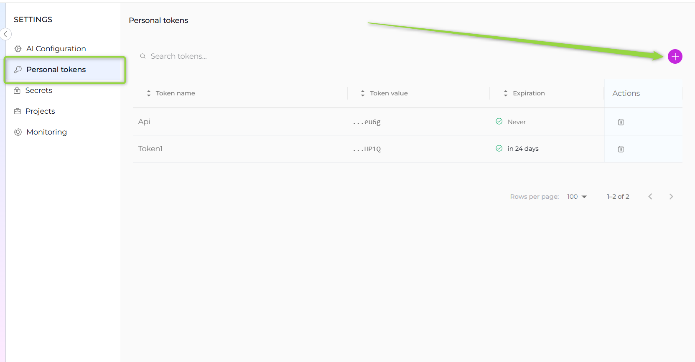
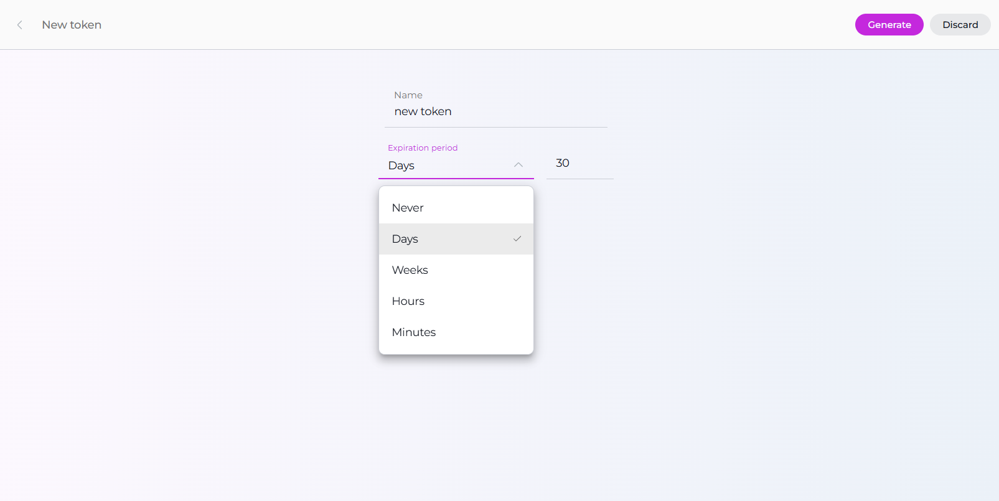
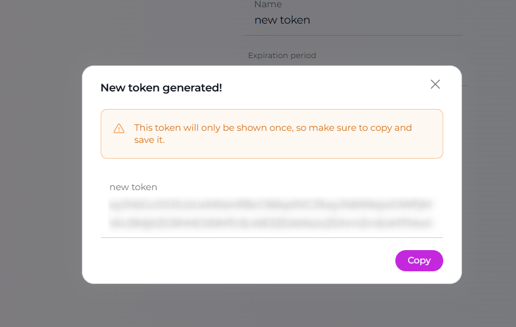
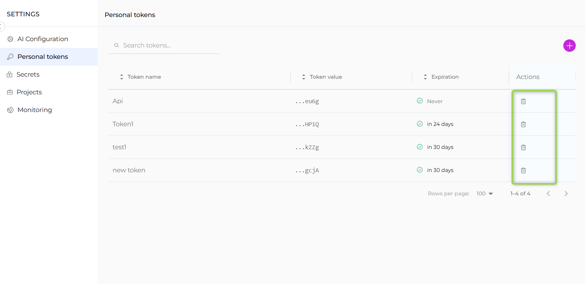

The **Personal Tokens** section allows you to create and manage personal access tokens that are essential for API access and IDE integrations. These tokens enable secure communication between your applications, scripts, and development environments with ELITEA's backend services.
 

**Creating a Personal Token:**

1. Navigate to the **Personal Tokens** section in Settings.
2. Click the `+` icon to create a new token.
3. Enter a descriptive **name** for the token and set an **expiration date**.
4. Click **Generate** to create the token.
5. **Important**: Immediately copy and securely store the generated token - it will not be visible again once you close the dialog.

**Managing Personal Tokens:**

* **Token Security**: Once a token is generated, it cannot be viewed again. Make sure to copy and store it securely during creation.
* **Token Expiration**: Monitor token expiration dates and renew tokens before they expire to avoid service interruptions.
* **Deleting Tokens**: Click the delete icon (🗑️) in the Actions column to permanently remove a token. This action cannot be undone, so ensure the token is no longer needed before deletion.

!!! note "Reference"
    For detailed IDE setup instructions, refer to the [Elitea Code Documentation](../../integrations/extensions/elitea-code.md).