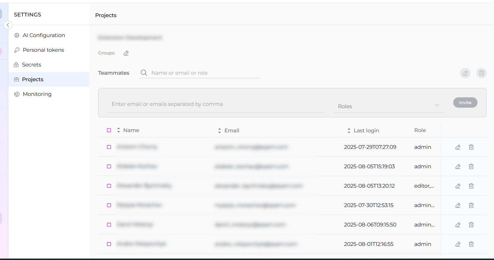
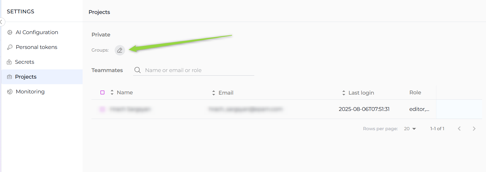
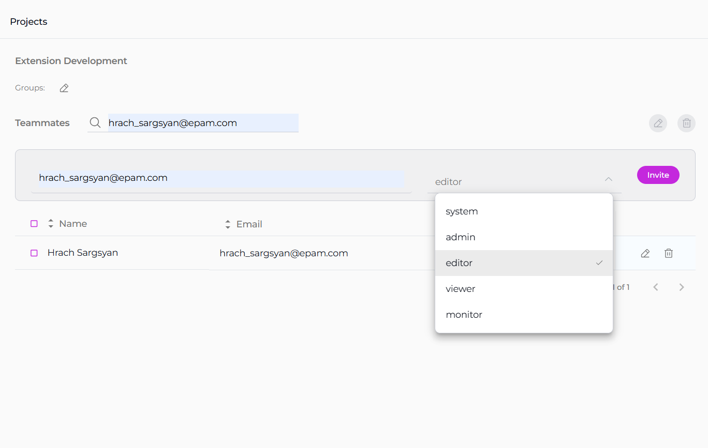
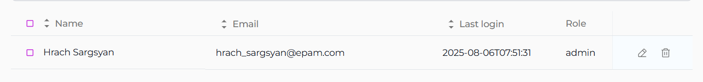

The **Projects** section ( Settings -> Projects) is specifically designed for administrators and becomes accessible when you hold administrative privileges in any project other than your private project within ELITEA. 

!!! note "Project Selection"
    It's important to select the appropriate project from the project dropdown menu to access specific configurations relevant to that project.

### Groups

The **Groups** feature in ELITEA is designed to facilitate efficient management and monitoring of multiple projects by admins or managers. This feature allows you to consolidate several projects under a single group, making it easier to oversee and coordinate activities across these projects.
If you are an admin of two or more projects, you can leverage the Groups feature to organize and monitor your projects collectively:

* **Create a New Group**: Click the **Pencil** icon to initiate the creation of a new group. You will be prompted to name the group and select the projects you wish to include.

* **Add Projects to Existing Group**: If you already have established groups, you can add additional projects to these groups.

This grouping functionality not only simplifies the administrative workload but also enhances the visibility and control over multiple projects, enabling more effective management and monitoring.

### Teammates

The **Teammates** feature in ELITEA is specifically crafted to streamline the process of collaborating within projects by allowing you to invite new users (teammates) and assign them appropriate roles. These roles include system, admin, editor, and viewer, each providing different levels of access and control within the project. 

!!! note "Admin Role Required"
    Only users with an admin role are empowered to invite new members. This ensures that the invitation and role assignment process is managed by users with appropriate authority and understanding of the project's needs.

**Inviting New Teammates**:

1. Enter the prospective member's email address in the **Email Address** input field.
2. Select their role from the **Role** dropdown menu. 
3. Click the **Invite** button. 
4. An invitation will be sent, and upon their first login, their details will be added to the **Teammates**, activating their account.

!!! note "User Invitation"
    * Multiple users can be invited simultaneously by separating email addresses with a comma.
    * For Epam projects, use the invitee's Epam email. For customer projects, the customer's Active Directory is utilized for invitations.

**Managing Teammates**:

The **Teammates** table displays all members, their roles, and their last login information. Admins can modify a user's role or revoke access by clicking the respective **Edit** or **Delete** icons next to a user's name.

### User Roles:

**System**: Grants comprehensive permissions, including additional administrative capabilities(not recommanded for usage).

**Admin**: Allows full project access and user management. Admins can create and modify Agents, execute Agents, and manage project-level configurations such as adding custom LLMs and managing user roles.

**Editor**: Provides editing rights within the project. Editors can create and modify Agents and execute them, but they do not have project-administration capabilities like user management.

**Viewer**: Limits access to execution and viewing only. Viewers can execute Agents from the Agents page and within chat, Create chats, Add existing agents, but cannot create or modify Agents or change project settings.

**Monitor**: When a user is assigned the Monitor role, their activities ( e.g. agent execution token usage ) are recorded and displayed in the monitoring section. Users without the Monitor role will not have their activities tracked or shown in the monitoring section. Note: The Monitor role is used only for monitoring purposes. Users must have an additional role to be able to use the platform.

**Note** "Multiple Roles"
    When multiple roles are assigned to a user, they will have access to all permissions and capabilities of the combined roles. 