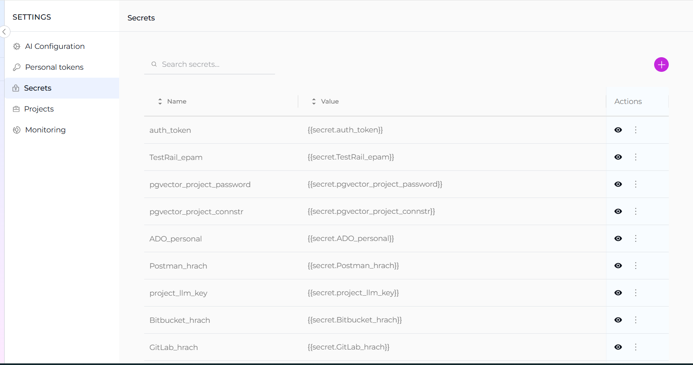
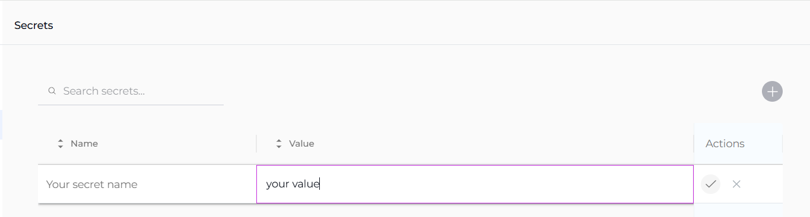
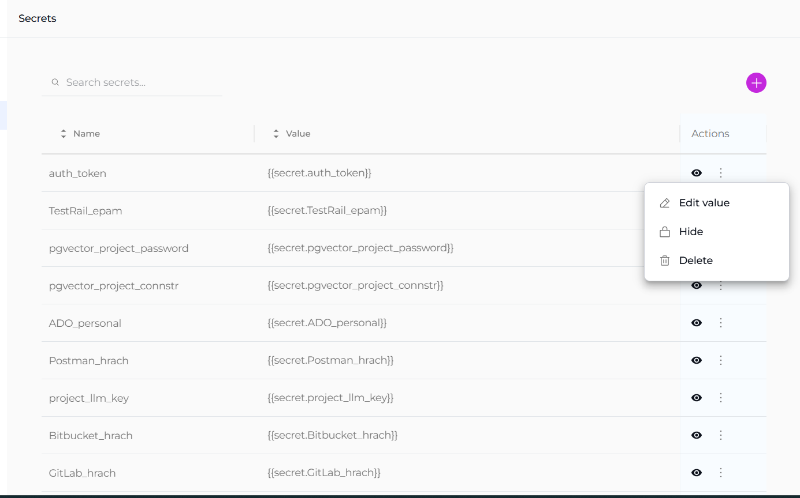

The **Secrets** feature in ELITEA serves as a secure vault designed to store and manage sensitive information such as passwords, tokens, API keys, and other authentication details. This centralized system allows you to configure secrets once and utilize them across various components, such as Agent's toolkits within ELITEA.

  

!!! note "Public Project Limitation"
    The **Secrets** section is not available for public projects. This feature is only accessible in private and organization projects where enhanced security controls are required.

**Creating a Secret**:

To add a new secret to the vault, follow these steps:

1. Click the `+` icon to initiate the creation of a new secret.
2. Enter a descriptive name for the secret to help you identify its use.
3. In the Value field, input the token, password, API key, or any other authentication details.
4. Once configured, this secret can now be selected and used within various components of ELITEA.

  

**Managing Secrets**:

The management of secrets is straightforward and secure, facilitated by the **Secrets** table which displays all your configured secrets:

* **View Secret**: Click the **Eye** icon to reveal the value of a configured secret. This allows you to quickly check the details without modifying them.
* **Copy Secret**: Easily copy the secret value to your clipboard (by clicking the hidden value) for use in configurations or integrations.
* **Hide Secret**: Hide the secret from the interface to maintain security when not actively managing the secret.
* **Modify Secret**: Update the value of the secret if the existing credentials change or need to be corrected.
* **Delete Secret**: Remove a secret permanently from the vault if it is no longer needed or if security concerns necessitate its deletion.

This feature enhances the security and efficiency of managing sensitive information within ELITEA, ensuring that authentication details are handled in a secure, centralized manner.

