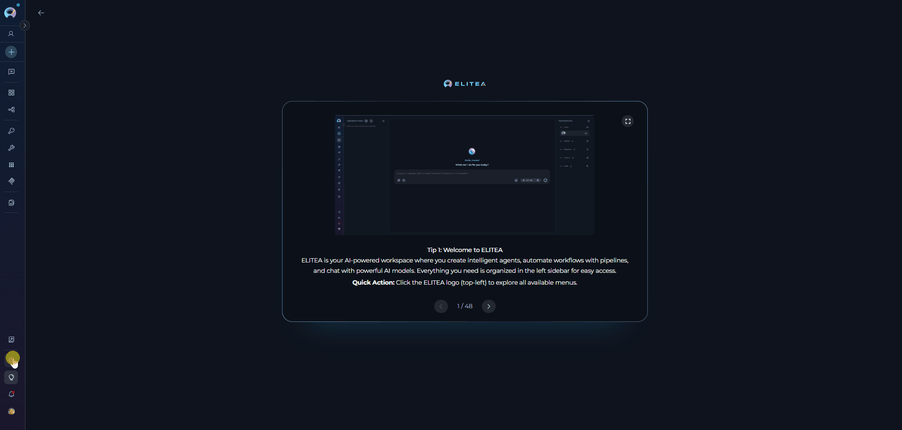
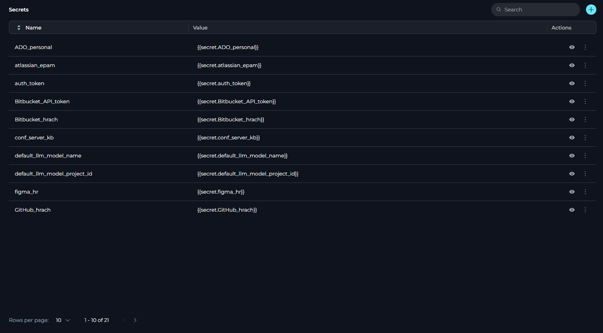
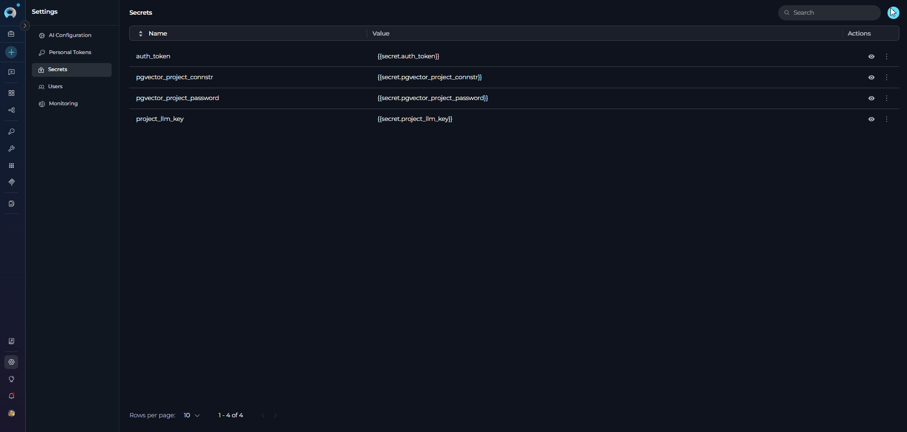
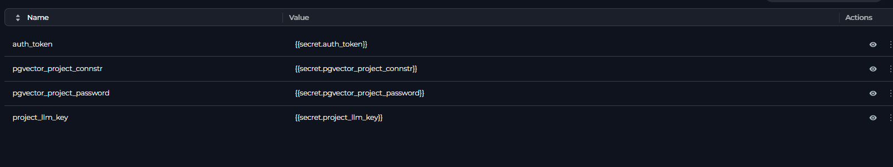
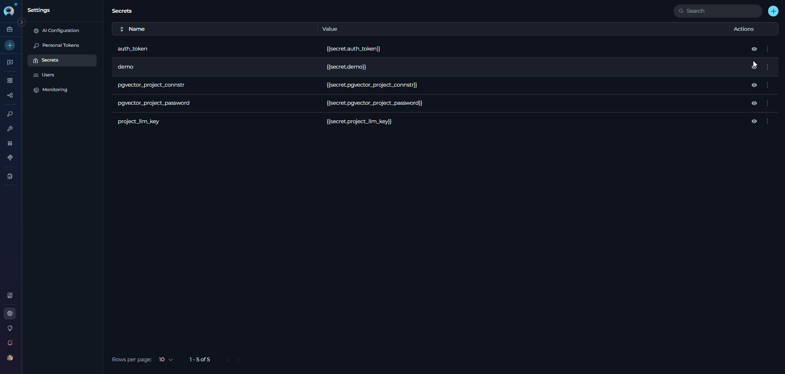
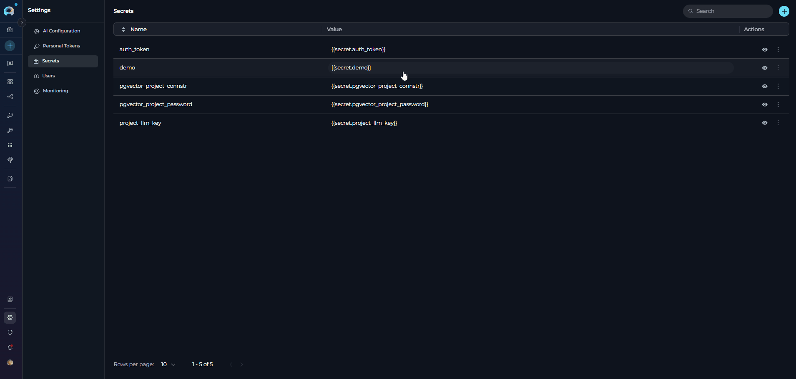
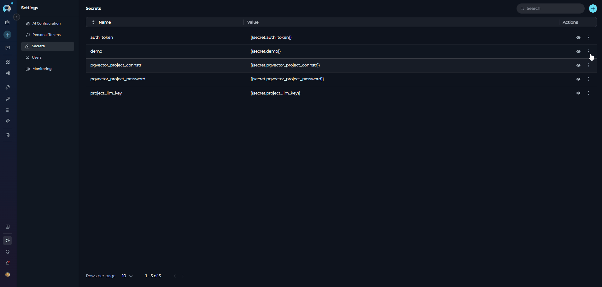
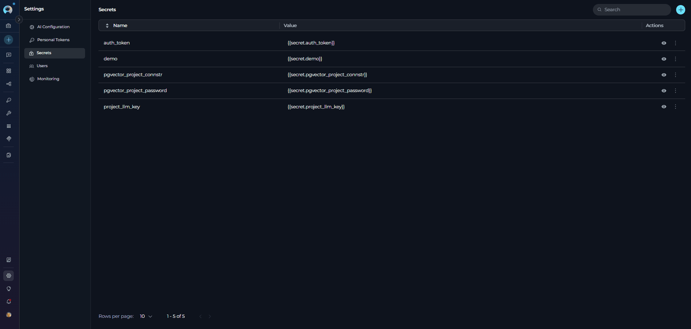
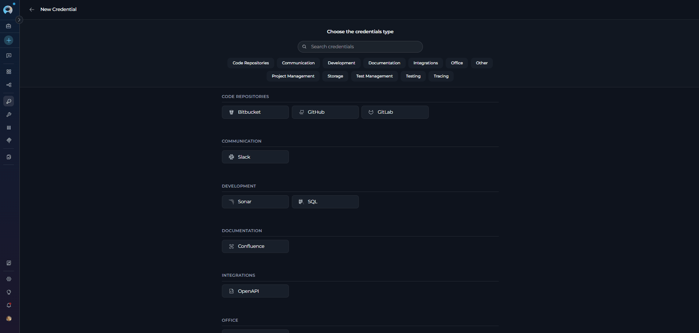

# Secrets

## Overview

The **Secrets** section (Settings → Secrets) allows you to securely store and manage sensitive information such as passwords, tokens, API keys, and other authentication details. This centralized system enables you to configure secrets once and utilize them across various components within ELITEA.

!!! note "Project Selection"
    Select the appropriate project from the project dropdown menu to manage secrets specific to that project.

## Navigating the Secrets Settings Menu

!!! warning "Permissions Required"
    The Secrets section is not available for users with **Viewer** or **Monitor** roles. Only users with System, Admin, or Editor roles can access this section. Secret creation, editing, and deletion capabilities are further restricted based on your assigned role permissions.

{loading=lazy}

To access the Secrets section:

1. Click on the **Settings** icon in the main navigation sidebar.
2. Select **Secrets** from the vertical navigation drawer on the left.
3. The Secrets management interface will display in the main content area.

**Main Components**

The Secrets section interface includes the following key elements:

* **Search Field**: Located in the header, allows you to filter secrets by name
* **+ Button**: Creates new secret entries (visible when you have secret creation permissions)
* **Secrets Table**: Displays all project secrets with columns for Name, Value, and Actions
* **Pagination Controls**: Located at the bottom of the table for navigating through secrets lists (supports 5, 10, 50, or 100 secrets per page)
* **Action Icons**: Show/Hide, Edit, and Delete options for individual secret management

## Secrets Table

The Secrets section displays a table with the following information for each secret:

* **Name**: The identifier for the secret (cannot be edited after creation)
* **Value**: The masked secret value (displayed as hidden by default for security)
* **Actions**: Show/Hide, Edit, and Delete options for managing secrets

!!! tip "Table Features"
    The secrets table supports:
    
    * **Sorting**: Click the Name column header to sort secrets alphabetically
    * **Pagination**: Navigate between pages and change the number of secrets displayed per page (5, 10, 50, or 100)
    * **Search**: Filter secrets by name using the search field in the header

## Creating a Secret

To add a new secret to your project:

1. Click the **+** button in the top-right corner of the Secrets section.
2. A new editable row will appear at the current pagination position:
   * Enter a unique name for the secret in the **Name** field
   * Enter the secret value (password, token, API key, etc.) in the **Value** field
3. Click the **✓** (checkmark) icon to save the secret, or click the **✗** (close) icon to cancel.

{loading=lazy}

!!! note "Secret Name Requirements"
    - Secret names must be unique within the project
    - The name cannot be changed after the secret is created
    - **Allowed characters:** letters (a-z, A-Z), numbers (0-9), and underscores (_)
    - Hyphens and special characters are not permitted
    - Choose descriptive names that clearly identify the secret's purpose

## Managing Secrets

The Secrets table provides several actions for managing your configured secrets:

!!! warning "Default Secrets"
    ELITEA automatically creates default secrets that are critical for project functionality. These include system-provisioned authentication tokens, database connection strings, and other platform-critical credentials.
    
    **Important Restrictions:**
    
    * Default secrets are **read-only** and cannot be modified or deleted
    * Users can only view secret values using the eye icon
    * Edit, Hide, and Delete actions are disabled for these secrets
    
    Attempting to modify or delete default secrets may impact your project's core functionality.
    
    {loading=lazy}

### Viewing Secrets

To reveal a secret's value:

1. Click the **👁** (eye) icon in the Actions column.
2. The secret value will be revealed in place of the masked value.
3. Click the **👁‍🗨** (eye with slash) icon to hide the secret value again.

{loading=lazy}

### Copying Secrets

To copy a secret value to your clipboard:

1. Click the masked secret value in the Value column.
2. The secret will be automatically copied to your clipboard.

{loading=lazy}

### Editing Secrets

To update a secret's value:

1. Click the **⋮** (three dots) icon in the Actions column.
2. Select **Edit value** from the menu.
3. The Value field becomes editable (the Name field cannot be edited).
4. Enter the new secret value.
5. Click the **✓** (checkmark) icon to save, or click the **✗** (close) icon to cancel.

{loading=lazy}

!!! tip "Search and Filter"
    Use the search input at the top of the page to quickly find secrets by name. Enter your search term in the **Search** field to filter the secrets list.

### Hiding Secrets

To permanently hide a secret from the UI:

1. Click the **⋮** (three dots) icon in the Actions column.
2. Select **Hide** from the menu.
3. In the confirmation dialog, type the secret name to confirm.
4. Click **Confirm** to hide the secret.

**What Happens When You Hide a Secret:**

* **UI Removal**: The secret is completely removed from the Secrets table and will no longer be visible in the interface
* **Dropdown Availability**: Hidden secrets will not appear in the secret selection dropdown when creating or editing credentials
* **Existing Credentials**: Credentials that already reference the hidden secret continue to function normally - the secret value continues to be used as a password for authentication

!!! warning "Permanent Action"
    Once hidden, the secret is completely removed from the Secrets table and will no longer be visible in the UI. Hidden secrets cannot be unhidden.

!!! example "Example"
    If you hide `github_api_token` that's currently used by 3 credentials, those 3 credentials will continue to authenticate successfully, but you won't be able to select this secret for any new credentials.

### Deleting Secrets

To remove a secret from the project:

1. Click the **⋮** (three dots) icon in the Actions column.
2. Select **Delete** from the menu.
3. In the confirmation dialog, type the secret name to confirm deletion.
4. Click **Delete** to confirm, or **Cancel** to abort.

**What Happens When You Delete a Secret:**

* **Complete Removal**: Both the secret and its value are permanently deleted from the system
* **Existing Credentials Affected**: All credentials referencing the deleted secret will fail authentication immediately
* **Cannot Be Recovered**: Deletion is permanent and cannot be undone

!!! warning "Permanent Deletion"
    Deletion is permanent and cannot be undone. All credentials using this secret will fail authentication immediately.

{loading=lazy}

## Hide vs Delete: Understanding the Difference

It's important to understand the distinction between hiding and deleting secrets, as they have different impacts on your credentials and integrations:

| Feature | Hide | Delete |
|---------|------|--------|
| **UI Visibility** | Removed from Secrets table | Removed from Secrets table |
| **Secret Value** | Preserved in the system | Permanently deleted |
| **Existing Credentials** | Continue to work normally | Fail authentication immediately |
| **New Credentials** | Cannot select this secret | Cannot select this secret |
| **Reversibility** | Cannot be unhidden through UI | Cannot be recovered |
| **Use Case** | Prevent new usage while maintaining existing integrations | Completely remove unused secrets |

## Using Secrets in Credentials

Secrets can be referenced in credentials to securely store authentication details for integrations and toolkits. This approach provides centralized management and enhanced security compared to storing values directly in each credential.

When creating or editing a credential:

1. Navigate to the **Credentials** page from the main navigation.
2. Create a new credential or edit an existing one.
3. For authentication fields (tokens, API keys, passwords), toggle between:
   * **Password**: Direct value entry (plain text)
   * **Secret**: Select from existing secrets dropdown
4. Select your desired secret from the dropdown.

!!! warning "Secret Availability"
    Only secrets existing in your project appear in the dropdown. Deleting or hiding a secret used by a credential may cause authentication failures.

## Best Practices

??? tip "Hide Before Delete"
    Before deleting a secret, consider hiding it first to prevent new usage while verifying that removing it won't break existing integrations. Once you've confirmed no active credentials depend on it, you can proceed with deletion.

??? tip "Use Descriptive Secret Names"
    Choose clear, descriptive names for your secrets that indicate their purpose and where they're used. For example, use names like `github_api_token` or `database_password_production` rather than generic names like `token1` or `secret2`.

??? tip "Avoid Copying Secrets with Trailing Spaces"
    When copying secret values, ensure no trailing spaces or hidden characters are included. Use the copy functionality provided in the interface rather than manually selecting and copying text to avoid formatting issues.

??? tip "Regular Secret Rotation"
    Periodically rotate sensitive credentials to maintain security. Update secret values when team members leave, after suspected compromises, or according to your organization's security policies.

??? tip "Verify Secret Access Before Deletion"
    Before deleting a secret, verify that it's not being used by any agents, toolkits, or other components in your project. Deleting an active secret may cause functionality issues.

??? tip "Document Secret Usage"
    Maintain documentation about which secrets are used by which components or integrations. This helps prevent accidental deletion and makes troubleshooting easier.