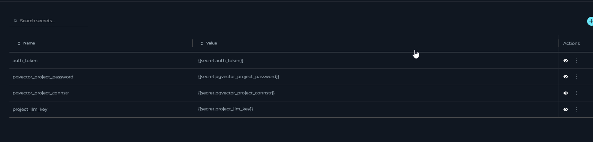

The **Secrets** feature in ELITEA serves as a secure vault designed to store and manage sensitive information such as passwords, tokens, API keys, and other authentication details. This centralized system allows you to configure secrets once and utilize them across various components, such as Agent's toolkits within ELITEA.

  

!!! note "Public Project Limitation"
    The **Secrets** section is not available for public projects. This feature is only accessible in private and organization projects where enhanced security controls are required.

**Creating a Secret**:

To add a new secret to the vault, follow these steps:

1. Click the `+` icon to initiate the creation of a new secret.
2. Enter a descriptive name for the secret to help you identify its use.
3. In the Value field, input the token, password, API key, or any other authentication details.
4. Once configured, this secret can now be selected and used within various components of ELITEA.

  

**Managing Secrets**:

The management of secrets is straightforward and secure, facilitated by the **Secrets** table which displays all your configured secrets:

* **View Secret**: Click the **Eye** icon to reveal the value of a configured secret. This allows you to quickly check the details without modifying them.
* **Copy Secret**: Easily copy the secret value to your clipboard (by clicking the hidden value) for use in configurations or integrations.
* **Hide Secret**: Hide the secret from the interface to maintain security when not actively managing the secret.
* **Modify Secret**: Update the value of the secret if the existing credentials change or need to be corrected.
* **Delete Secret**: Remove a secret permanently from the vault if it is no longer needed or if security concerns necessitate its deletion.

This feature enhances the security and efficiency of managing sensitive information within ELITEA, ensuring that authentication details are handled in a secure, centralized manner.

## Default Secrets

ELITEA automatically creates several default secrets that are critical for project functionality. These secrets are essential for current project operations and should not be modified or deleted by users.

!!! warning "Critical System Secrets"
    The following default secrets are automatically managed by ELITEA and are essential for proper platform operation. Do not modify or delete these secrets as it may cause your project functionality issues.

The default secrets include:

- **auth_token**: Authentication token used for secure communication between ELITEA components
- **pgvector_project_password**: Password for the project's vector database connection
- **pgvector_project_connstr**: Connection string for the project's vector database

- **project_llm_key**: Authentication token used for utilizing LLMs in the project.

These secrets are automatically provisioned when your project is created and are maintained by the ELITEA platform to ensure seamless operation of core features.

  

## Troubleshooting

### Issue: Secret Works when provided directly to toolkit but toolkit will not work when referanced from secrets

**Problem**: When using a secret in configurations, it works during testing but fails during actual execution.

**Possible Causes**:
- The secret was copied with additional leading or trailing spaces
- Hidden newline characters were included when copying the secret
- The secret value was not copied completely

**Solution**:
1. Copy the secret value again, ensuring no trailing spaces are included
2. Paste the secret directly without any additional formatting
3. Verify the complete secret value was copied by checking its length or content

!!! tip "Copy Best Practice"
    When copying secrets, use the copy button provided in the interface rather than manually selecting and copying text to avoid hidden characters.

### Issue: Deleted Default Secrets

**Problem**: One or more default secrets were accidentally deleted.

**Resolution**:
1. **Automatic Recovery**: Most default secrets will be automatically recreated within 24 hours
2. **Manual Recovery**: If automatic recovery doesn't occur or immediate restoration is needed:
   - Contact the support team via **SupportAlita@epam.com**
   - Include your project details and specify which default secrets were deleted
  

!!! danger "Important"
    Deleting default secrets may temporarily impact platform functionality until they are restored. Contact support immediately if you accidentally delete any default secrets.