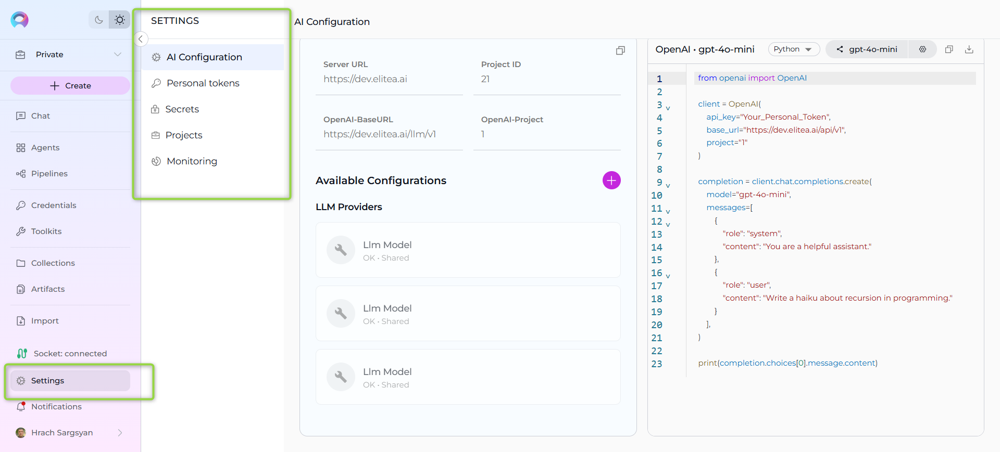

# Settings

The **Settings** is designed to offer you a centralized space to manage vital aspects of your account and configurations. This centralized space is accessible by clicking on  **Settings** icon in the main navigation sidebar.

The **Settings** consists of several sections organized in a vertical navigation drawer, each dedicated to specific functionalities:

* [**AI Configuration**](ai-configuration.md): Manage essential technical settings crucial for the smooth operation of ELITEA's features like Alita Code or Alita Code Chat.
* [**Personal Tokens**](personal-tokens.md): Create and manage personal access tokens for API access and IDE integrations.
* [**Secrets**](secrets.md): Securely store and manage API keys, passwords, and other authentication credentials.
* [**Projects**](projects.md): Manage users within a project. This section is only available for users with admin permissions within the project.
* [**Monitoring**](monitoring.md): Keep track of usage statistics by selecting different metrics and timeframes.

**Navigation**:

To navigate through the **Settings** sections, follow these steps:

1. Click on the **Settings** icon in the main navigation sidebar or access it through your user menu.
2. Use the vertical navigation drawer on the left to select the desired section by clicking on its name.

   
