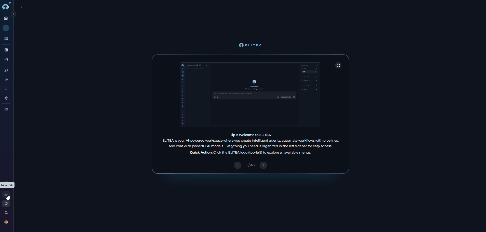
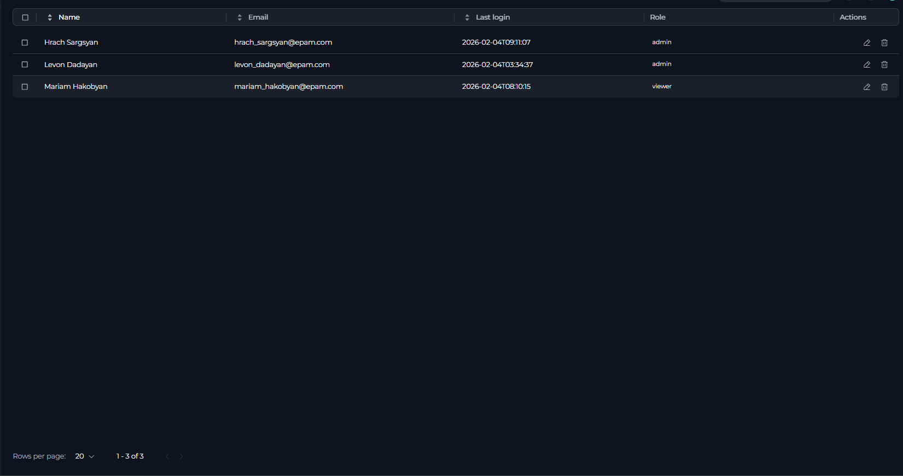
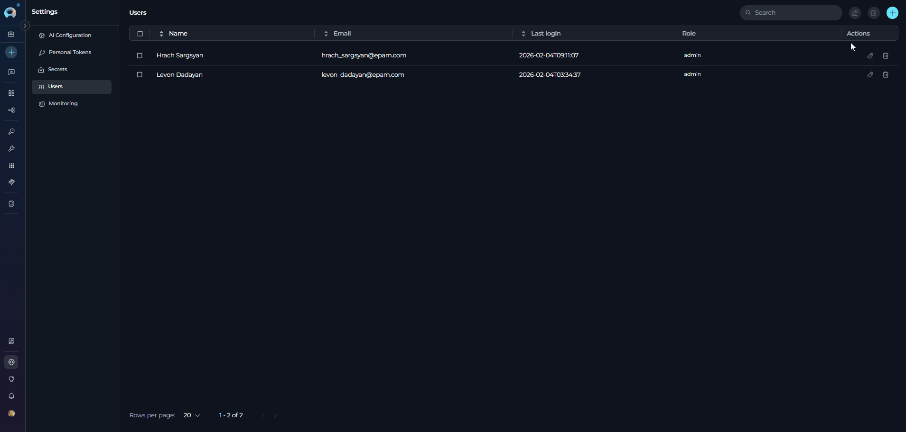
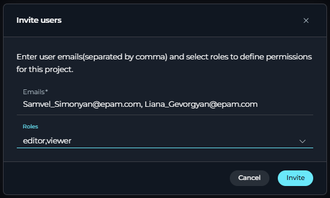
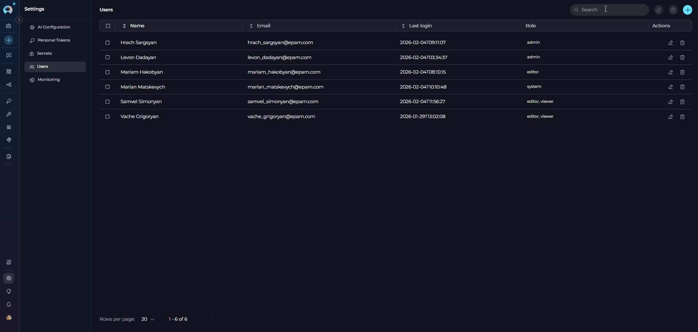
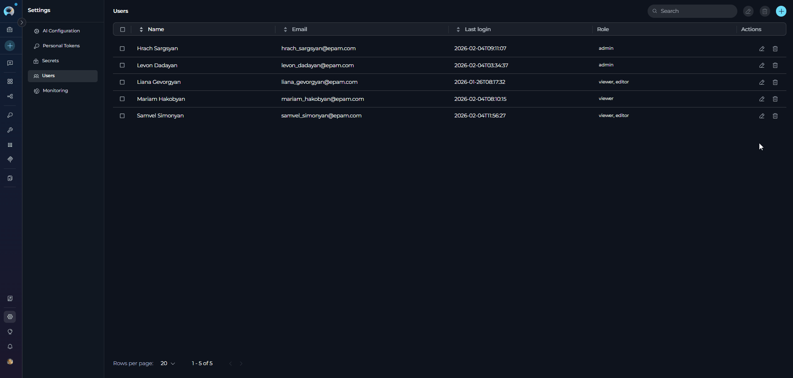
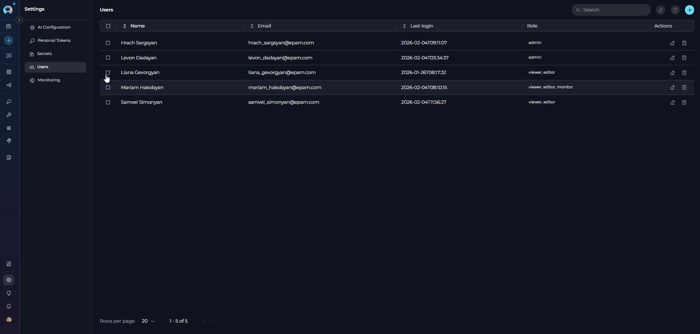
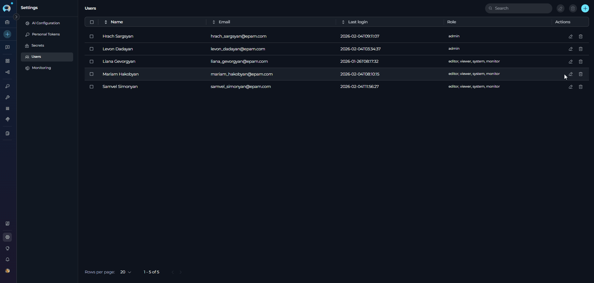
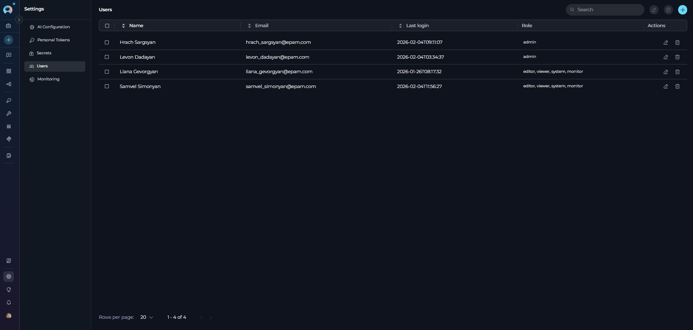

# Users

## Overview

The **Users** section (Settings → Users) allows you to manage user access and roles within a project. This section requires appropriate permissions to view and manage users.

!!! note "Project Selection"
    Select the appropriate project from the project dropdown menu to manage users specific to that project.

## Navigating the Users Settings Menu

{loading=lazy}

To access the Users section:

1. Click on the **Settings** icon in the main navigation sidebar.
2. Select **Users** from the vertical navigation drawer on the left.
3. The Users management interface will display in the main content area.

!!! warning "Permissions Required"
    Only users with the **Admin** role can add or manage users. User creation, editing, and deletion capabilities are restricted based on your assigned role in the project.

### Main Components

The Users section interface includes the following key elements:

* **Search Field**: Located in the header, allows you to filter users by name, email, or role
* **╋ Invite Users Button**: Creates new user invitations (visible when you have user creation permissions)
* **🖍 Edit Button**: Appears when users are selected, enables batch role editing
* **🗑 Delete Button**: Appears when users are selected, enables batch user removal
* **Users Table**: Displays all project users with columns for Name, Email, Last login, Role, and Actions
* **Pagination Controls**: Located at the bottom of the table for navigating through user lists
* **Action Icons**: Edit and Delete icons in each row for individual user management

## Users Table

{loading=lazy}

The Users section displays a table with the following information for each user:

* **Name**: The user's full name
* **Email**: The user's email address
* **Last login**: The date and time of the user's last login
* **Role**: The assigned role(s) for the user
* **Actions**: Edit and delete options for managing user access

!!! tip "Table Features"
    The users table supports:
    
    * **Selection**: Click checkboxes to select individual users or use the header checkbox to select all visible users
    * **Sorting**: Click column headers to sort by Name, Email, or Last login
    * **Batch Actions**: Edit or delete multiple users simultaneously by selecting them first
    * **Pagination**: Navigate between pages using the previous and next buttons, change the number of users displayed per page (10, 20, 50, or 100), and view the current range of users being displayed (e.g., "1-20 of 45")

## Inviting Users

To invite new users to your project:

1. Click the **+ Invite users** button in the top-right corner of the Users section.
2. In the **Invite users** dialog:
   * Enter user email addresses in the **Emails** field (separate multiple emails with commas)
   * Select one or more roles from the **Roles** dropdown menu
3. Click **Invite** to send the invitation.

{loading=lazy}

!!! note "Multiple Email Invitations"
    You can invite multiple users simultaneously by separating their email addresses with commas.

    {width="300" loading=lazy}

### Search and Filter

Use the search input at the top of the page to quickly find users by name, email, or role. Enter your search term in the **Search** field to filter the user list.

{loading=lazy}

## Editing User Roles

User roles define the level of access and permissions within a project. You can assign one or multiple roles to each user to customize their access level.

### Available Roles

The available roles and their scope are defined by your system configuration. Roles determine what actions users can perform within the project, such as:

| Role | Typical Permissions |
|------|---------------------|
| **System** | Comprehensive permissions including additional administrative capabilities beyond standard admin |
| **Admin** | Full project access including user management, configuration, and all creation/editing/deletion capabilities |
| **Editor** | Create and modify content (agents, chats, pipelines, etc.), but cannot delete content or access administrative functions |
| **Viewer** | Read-only access, can use existing content but cannot create, modify, or delete |
| **Monitor** | Tracking role for monitoring user activities and usage statistics |

!!! info "Role Combinations"
    Users can be assigned multiple roles simultaneously. When multiple roles are assigned, the user will have the combined permissions of all assigned roles.

### Editing Individual User Roles

To modify a user's role:

1. Click the **Edit** icon next to the user's name in the Actions column.
2. In the **Edit roles** dialog, select the desired roles from the **Roles** dropdown.
3. Click **Save** to apply the changes.

{loading=lazy}

### Batch Editing

You can edit multiple users at once:

1. Select users by clicking the checkboxes next to their names.
2. Click the **Edit** button that appears in the header when users are selected.
3. Choose the roles to apply to all selected users.
4. Click **Save**.

{loading=lazy}

## Deleting Users

To remove a user from the project:

1. Click the **Delete** icon next to the user's name.
2. Confirm the deletion in the alert dialog.

{loading=lazy}

### Batch Deletion

You can delete multiple users at once:

1. Select users by clicking the checkboxes next to their names.
2. Click the **Delete** button that appears in the header when users are selected.
3. Confirm the deletion when prompted.

{loading=lazy}

## Best Practices

??? tip "Assign Minimum Required Permissions"
    Follow the principle of least privilege by assigning users only the roles they need to perform their tasks. Start with the Viewer role and escalate to Editor or Admin only when necessary.

??? tip "Use Role Combinations Strategically"
    When assigning multiple roles to a user, ensure the combination makes sense for their responsibilities. For example, combining Editor and Monitor roles is useful for team leads who need to create content and track team activity.

??? tip "Regular Access Reviews"
    Periodically review user access and roles, especially after team changes or project transitions. Remove users who no longer need access and adjust roles as responsibilities change.

??? tip "Invite Users in Batches"
    When onboarding multiple team members, use the comma-separated email feature to invite them all at once. This saves time and ensures consistent role assignment across the team.

??? tip "Document Custom Role Assignments"
    If your organization uses custom roles or specific role combinations, document these standards to maintain consistency across projects and simplify user management for other admins. 

