# Toolkits

## Introduction to the Toolkits Menu

The **Toolkits** menu in the ELITEA platform provides a centralized interface for managing and configuring integrations that power your AI agents. Toolkits extend the capabilities of agents by enabling them to interact with a variety of services—such as project management, version control, testing tools, data processing utilities, and more. This guide walks you through the Toolkits menu, explains how to navigate its features, and describes how to configure available toolkits to best fit your workflows.

---

## What Are Toolkits?

**Toolkits** in ELITEA are modular integrations that connect your agents to external platforms and internal services. Each toolkit provides an interface for configuring connection parameters (like API keys, URLs, or credentials) and setting options specific to the target service. Once configured, toolkits can be assigned to agents, empowering them to automate tasks across different systems and domains.

---

## Navigating the Toolkits Menu

The Toolkits menu is accessible from the main platform navigation. Upon entering the Toolkits section, you'll see a dashboard listing all available toolkits, along with their configuration status.

**Main Elements:**

* **Toolkit Cards:** Each card provides a brief description, current status, and toolkit type.
* **Search and Filter:** Quickly locate a toolkit using the search bar or filter by type.
* **Create Toolkit Button:** Use the `+ Create` button to add a new integration or configure an existing one.

### Toolkits Dashboard

The Toolkits dashboard provides multiple ways to view and manage your toolkits:

**View Options**

* **Card View** - Visual cards displaying toolkit name, type, and key information. Ideal for browsing and quick identification.
* **Table View** - Organized list format with columns for detailed toolkit information. Better for managing large numbers of toolkits.

Switch between views using the view toggle button in the top-right corner of the dashboard.

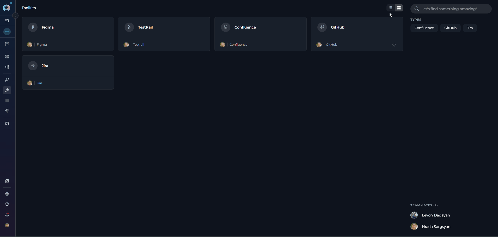

**Search and Filter**

* **Search Bar** - Quickly find toolkits by typing the toolkit name or related keywords
* **Filter by Type** - Filter toolkits by their type/category (e.g., show only GitHub, Jira, or Slack toolkits). Select one or multiple types to narrow down the list.

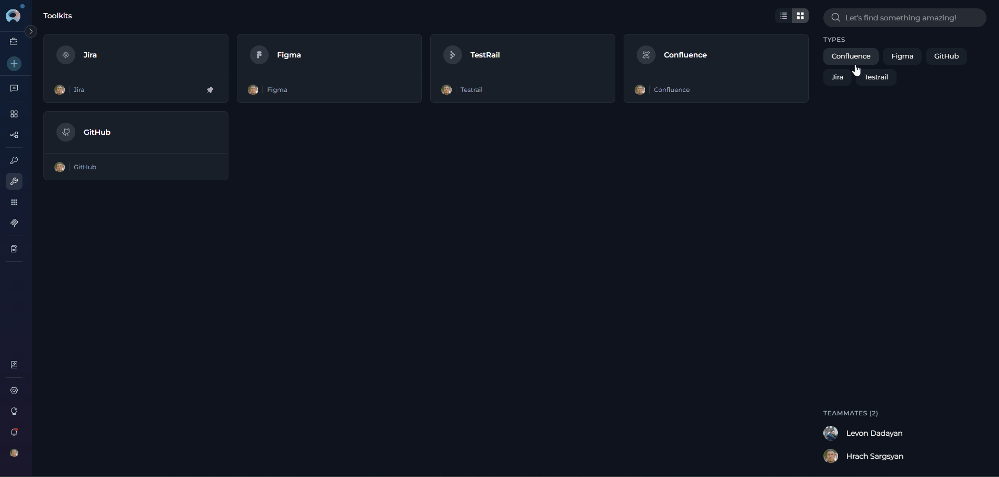

**Pinning Toolkits**

Pin frequently used toolkits to keep them at the top of your list for quick access:

1. Locate the toolkit you want to pin
2. Click the pin icon (📌) on the toolkit card or in the table row
3. Pinned toolkits will appear at the top of the list, separated from unpinned ones
4. Click the pin icon again to unpin the toolkit

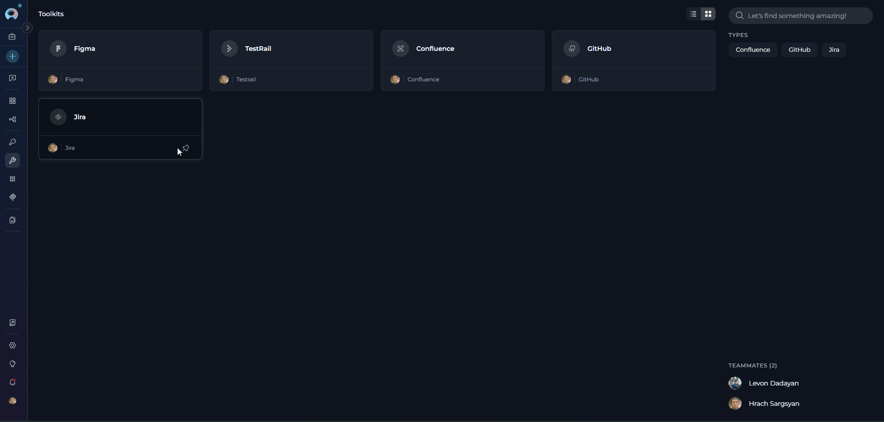{loading=lazy}

---

## Creating a New Toolkit

You can add new integrations to the platform by creating a new toolkit through the Toolkits menu.

**How to Create a New Toolkit

Follow these steps to add a new integration to the platform:

1. **Open the Toolkits Menu:** Go to the Toolkits section from the main navigation bar.
2. **Click `+ Create`:** Find the `+ Create` button at the top right of the sidebar.

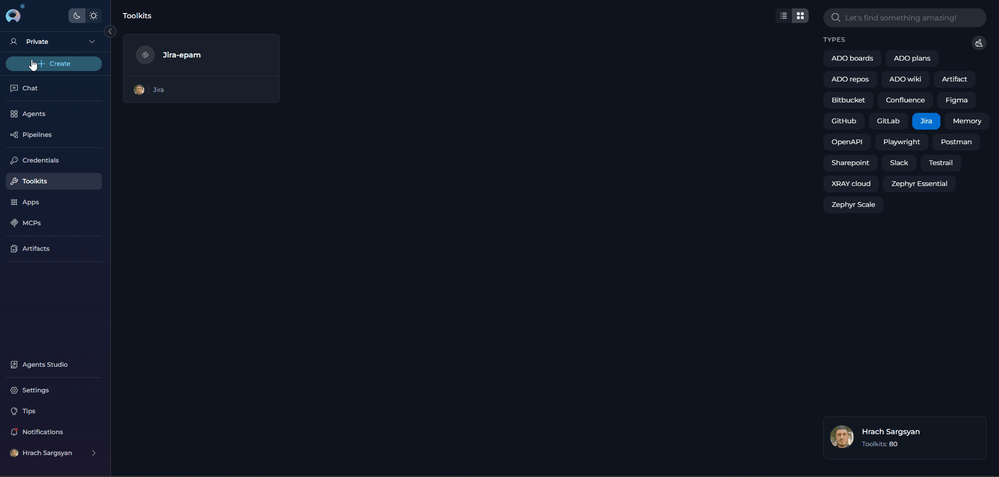{loading=lazy}

!!! note "Note"
    Only users with the necessary permissions can create or configure toolkits. If the `+ Create` button is disabled, contact your platform administrator.

**Selecting a Toolkit Type**

Choose the desired toolkit type from the categorized list. The toolkit types are organized by category to help you quickly find the integration you need. You can also use the search bar to quickly locate a specific toolkit type by name.

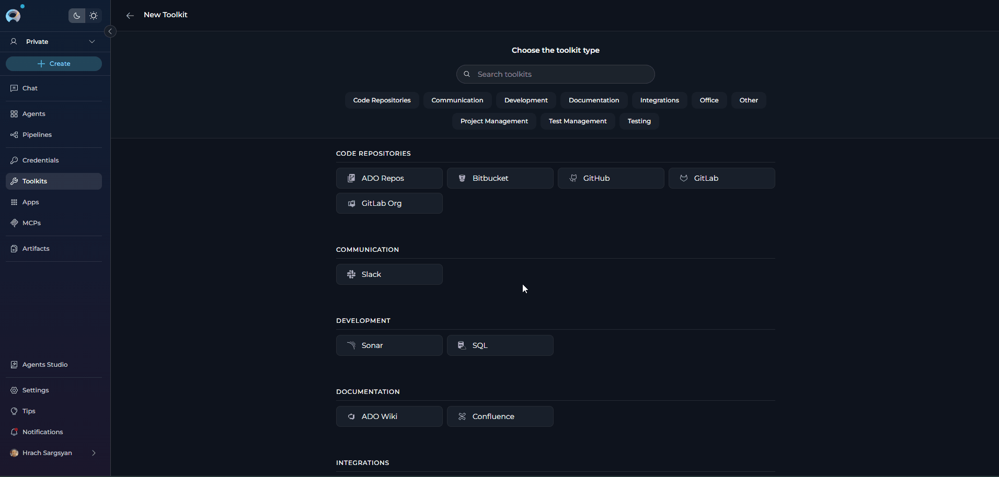{loading=lazy}

### Configuring Toolkit Details

Once you've selected a toolkit type, you'll need to configure the following fields:

**Main Configuration Fields:**

* **Toolkit Name*** - A clear, descriptive name for your toolkit
* **Description** - A brief description to clarify the toolkit's purpose and usage
* **Credentials Configuration*** - (varies by toolkit type) Select or create credentials for the integration
    * For toolkits that require credentials (e.g., Jira, GitHub), open the Credentials dropdown and either create new credentials or select an existing one
    * For toolkits without credential requirements (e.g., Artifact), configuration fields will be shown directly on the create toolkit page
* **PgVector Configuration** - Select or configure a PgVector connection to enable vector storage capabilities for document indexing and similarity search
* **Embedding Model** - Select an appropriate embedding model configuration to enable text processing and semantic search features
* **Parameters** - (varies by toolkit type) Additional integration-specific parameters such as:
    * URLs and endpoints
    * Project identifiers
    * Custom configuration options
* **TOOLS** - Select which specific tools and actions to enable for this toolkit
    * Review available tools carefully and enable only those needed for your use case
    * Enabling only necessary tools improves security (principle of least privilege) and optimizes performance
    * **[Make Tools Available by MCP](../integrations/mcp/make-tools-available-by-mcp.md)** - (optional checkbox) Enable this option to make the selected tools accessible through the external MCP clients to use the toolkit's capabilities

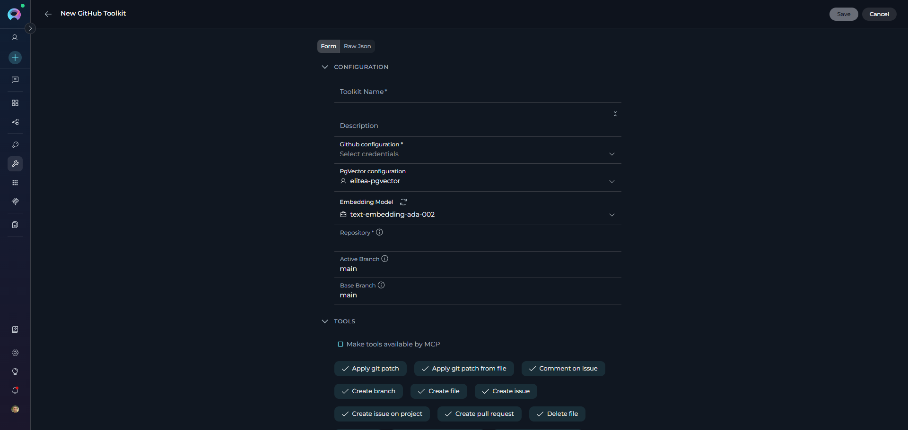{loading=lazy}

!!! note "Raw JSON Editing"
    Advanced users can switch to **Raw JSON** mode to directly edit the toolkit configuration as JSON. This provides more flexibility for complex configurations and bulk data entry. Toggle between the form view and Raw JSON view using the interface switch.

    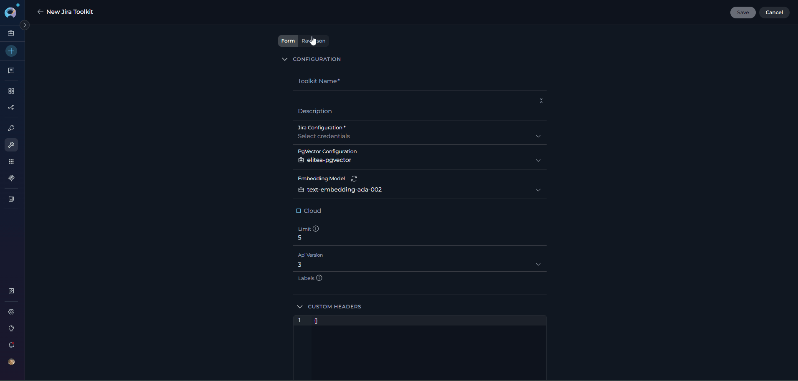{loading=lazy width="350"}

!!! tip "Vector Search Tools"
    The tools **Index data**, **List collections**, **Remove index**, **Search index**, **Stepback search index**, and **Stepback summary index** require PgVector configuration and an embedding model. These enable advanced semantic search capabilities across your artifact files. For setup instructions, see [AI Configuration](./settings/ai-configuration.md).

**Saving Your Toolkit**

Click **Save** (top right) to create the toolkit. It will now appear in your toolkits dashboard, where you can access its detailed configuration page to modify settings or adjust tool selection as needed.

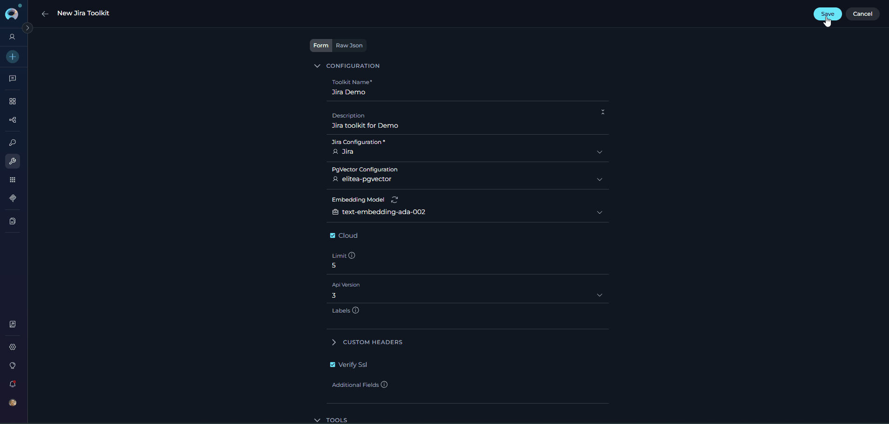{loading=lazy}

!!! tip "Tool Selection"
    You can modify tool selection at any time by visiting the toolkit's detailed configuration page. This allows you to add or remove tools as your requirements evolve.

---

## Toolkit Categories & Descriptions

The platform supports a wide range of toolkits, organized by category. Below is the latest list of categories and available toolkits. 

| **Category**                    | **Toolkit Type**                                                                  | **Description**                                      |
|---------------------------------|-----------------------------------------------------------------------------------|------------------------------------------------------|
| **Code Repositories**           | [ADO Repos](../integrations/toolkits/ado_repos_toolkit.md)                       | Azure DevOps repositories                            |
|                                 | [Bitbucket](../integrations/toolkits/bitbucket_toolkit.md)                       | Bitbucket code repositories                          |
|                                 | [GitHub](../integrations/toolkits/github_toolkit.md)                             | GitHub code repositories                             |
|                                 | [GitLab](../integrations/toolkits/gitlab_toolkit.md)                             | GitLab code repositories                             |
|                                 | [GitLab Org](../integrations/toolkits/gitlab_org_toolkit.md)                     | GitLab organization-level integration                |
| **Communication**               | [Slack](../integrations/toolkits/slack_toolkit.md)                               | Slack team messaging and collaboration               |
| **Development**                 | [Sonar](../integrations/toolkits/sonar_toolkit.md)                               | SonarQube code quality and security analysis         |
|                                 | [SQL](../integrations/toolkits/sql_toolkit.md)                                   | SQL database integration and querying                |
| **Documentation**               | [ADO Wiki](../integrations/toolkits/ado_wiki_plan_board_toolkit.md)              | Azure DevOps wiki and documentation                  |
|                                 | [Confluence](../integrations/toolkits/confluence_toolkit.md)                      | Confluence wiki and knowledge management             |
| **Integrations**                | [OpenAPI](../integrations/toolkits/openapi_toolkit.md)                           | OpenAPI specification integration                    |
| **Office**                      | [PPTX](../integrations/toolkits/powerpoint_toolkit.md)                           | PowerPoint presentation creation and editing         |
|                                 | [SharePoint](../integrations/toolkits/sharepoint_toolkit.md)                     | SharePoint document management and collaboration     |
| **Other**                       | [Artifact](../integrations/toolkits/artifact_toolkit.md)                         | Artifact file storage and management                 |
|                                 | [Custom](../integrations/toolkits/custom_toolkit.md)                             | Custom toolkit integration                           |
|                                 | [Figma](../integrations/toolkits/figma_toolkit.md)                               | Figma design collaboration and prototyping           |
|                                 | [Google Places](../integrations/toolkits/google_places_toolkit.md)               | Google Places location services and information      |
|                                 | [Memory](../integrations/toolkits/memory_toolkit.md)                             | Memory storage and retrieval capabilities            |
|                                 | [Postman](../integrations/toolkits/postman_toolkit.md)                           | Postman API development and testing                  |
|                                 | [Salesforce](../integrations/toolkits/salesforce_toolkit.md)                     | Salesforce CRM integration                           |
|                                 | [ServiceNow](../integrations/toolkits/servicenow_toolkit.md)                     | ServiceNow IT service management                     |
| **Project Management**          | [ADO Boards](../integrations/toolkits/ado_wiki_plan_board_toolkit.md)            | Azure DevOps project boards and work items           |
|                                 | [Jira](../integrations/toolkits/jira_toolkit.md)                                 | Jira issue and project tracking                      |
|                                 | [Rally](../integrations/toolkits/rally_toolkit.md)                               | Rally agile project management                       |
| **Test Management**             | [ADO Plans](../integrations/toolkits/ado_wiki_plan_board_toolkit.md)             | Azure DevOps test plans and test management          |
|                                 | [QTest](../integrations/toolkits/qtest_toolkit.md)                               | QTest test case management                           |
|                                 | [TestRail](../integrations/toolkits/testrail_toolkit.md)                         | TestRail test case and test run management           |
|                                 | [XRAY Cloud](../integrations/toolkits/xray_toolkit.md)                           | Xray test management for Jira Cloud                  |
|                                 | [Zephyr Enterprise](../integrations/toolkits/zephyr_enterprise_toolkit.md)       | Zephyr test management, enterprise edition           |
|                                 | Zephyr Essential                                                                  | Zephyr test management, essential edition            |
|                                 | [Zephyr Scale](../integrations/toolkits/zephyr_scale_toolkit.md)                 | Zephyr Scale test management for Jira Cloud          |
|                                 | Zephyr Squad                                                                      | Zephyr Squad test management for Jira Server         |
| **Testing**                     | [Browser](../integrations/toolkits/browser_toolkit.md)                           | Browser automation and web testing                   |
|                                 | Carrier                                                                           | Carrier performance testing platform                 |
|                                 | [Report Portal](../integrations/toolkits/reportportal_toolkit.md)                | Test reporting, analytics, and dashboards            |
|                                 | [TestIO](../integrations/toolkits/testIO_toolkit.md)                             | TestIO crowdsourced testing services                 |

!!! note "Note"
    Toolkit availability may evolve. Refer to the platform UI for the most current list.

---

## Managing Toolkit Configuration

The toolkit detail page provides a comprehensive interface for configuring, testing, and monitoring your toolkits. Access it by clicking on any toolkit from the Toolkits dashboard. The page is organized into three main tabs, each serving a specific purpose:

---

### Run Tab: Managing and Testing Toolkit

The **Run** tab is the primary interface for configuring toolkit settings, managing tool selection, and testing toolkit functionality in real-time.

 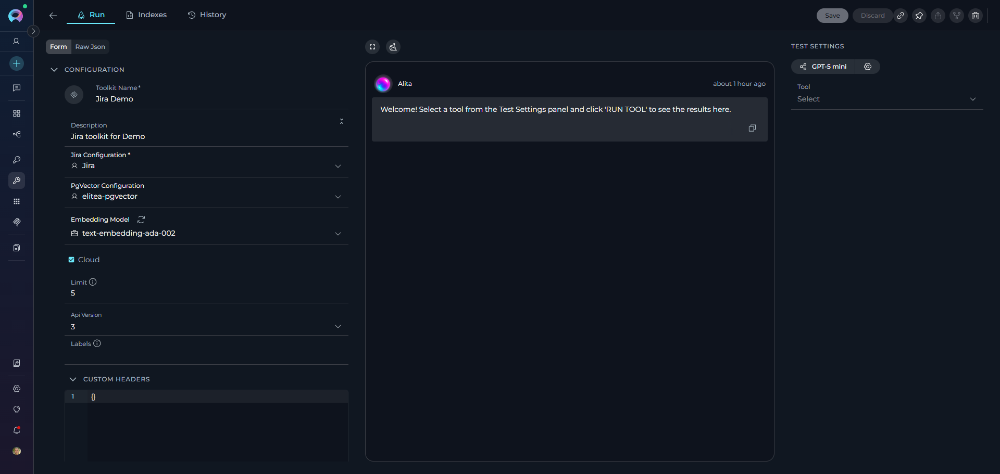{loading=lazy}

**How to Edit Toolkit Configuration**

On the Run tab, you can:

* **Edit Toolkit Details:** Update the name, description, credentials (API keys, tokens, service URLs), and any custom or advanced options directly in the configuration panel.
* **Manage Tool Selection:** Configure which specific tools are enabled for this toolkit. In the "Tools" section, check only the tools your agent will use. Enabling only necessary tools improves security (principle of least privilege) and optimizes performance.
* **Update Advanced Configurations:** Modify PgVector configuration settings or change embedding model selections to optimize performance or adapt to new requirements.
* **Save Changes:** Click **Save** to apply your updates. Changes are applied immediately and reflected in the dashboard.
* **Remove Toolkit:** Click the **Remove** (trash) icon to delete the toolkit. Confirm the removal in the dialog.
* **Copy Link:** Click the copy link icon to copy a direct link to the toolkit’s detailed page—useful for sharing with teammates who have access.
* **Export and Fork Icons:** These icons (currently unavailable) will allow you to export a toolkit’s configuration or create a fork (duplicate) of an existing toolkit in other projects in future releases.

**Tool Selection Best Practices**

When selecting tools for your toolkit:
    
* **Review available tools** carefully and enable only those needed for your specific use case
* **Test each enabled tool** using the Test Settings panel to ensure proper functionality
* **Update tool selection** as your requirements change or new tools become available

    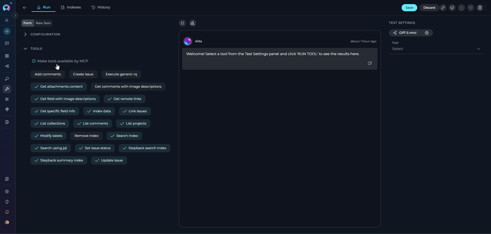{loading=lazy}

**Make Tools Available by MCP**

When configuring toolkit tools, you may see a checkbox labeled **[Make Tools Available by MCP](../integrations/mcp/make-tools-available-by-mcp.md)** in the Tools section. This option controls whether the selected tools can be accessed through the Model Context Protocol (MCP) interface.

* **Purpose:** Enables toolkit tools to be exposed and accessible via MCP servers
* **Location:** Appears in the Tools configuration section when selecting toolkit tools
* **When to Enable:** 
     - You plan to use this toolkit's tools through an MCP server
     - You want to make these tools available to external MCP clients
     - You're building MCP-based integrations that need access to these tools

!!! tip "Tip"
    Regularly use the edit function to rotate credentials, update tool selections, or modify toolkit capabilities as your needs change.

**Testing Toolkit Functionality**

The toolkit configuration page includes a **Test Settings** panel on the right side that allows you to test toolkit functionality in real-time. For comprehensive testing instructions and best practices, see [How to Test Toolkit Tools](../how-tos/credentials-toolkits/how-to-test-toolkit-tools.md).

**Steps to Test a Toolkit:**

1. **Select a Model:** Choose the LLM model from the model dropdown (e.g., `gpt-4o`).

     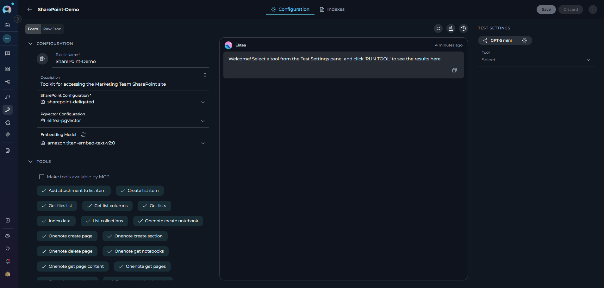{loading=lazy}

2. **Adjust Model Settings** (Optional): Click the **Model Settings** icon (⚙️) next to the model selector to fine-tune the response generation. The settings vary depending on the selected model:
    **For Reasoning Models** (e.g., GPT-5.1):
    
    * **Reasoning** - Controls the depth of logical thinking and problem-solving with three levels:
        * **Low**: Fast, surface-level reasoning with concise answers and minimal steps
        * **Medium**: Balanced reasoning with clear explanations and moderate multi-step thinking (default)
        * **High**: Deep, thorough reasoning with detailed step-by-step analysis (may be slower)
    
    **For Standard Models** (e.g., GPT-4o):
    
    * **Creativity** - Controls response randomness and creativity. Lower values produce more focused and deterministic outputs, while higher values generate more diverse and creative responses with five levels (1-5):
        * **1**: Highly focused and deterministic outputs
        * **2**: Mostly focused with slight variation
        * **3**: Balanced between focus and creativity (default)
        * **4**: More varied and creative responses
        * **5**: Maximum creativity and diversity
    
    **Max Completion Tokens** Limits the maximum length of AI responses measured in tokens (roughly 4 characters per token).(All Models):
    
    * **Auto** (default): System automatically sets the token limit to 4096 tokens
    * **Custom**: Manually set a specific token limit for responses
        * When Custom is selected, you can enter a specific number of maximum tokens
        * The interface shows remaining tokens available after your specified limit
        * Setting too high a value will show an error if it exceeds the model's maximum output tokens

    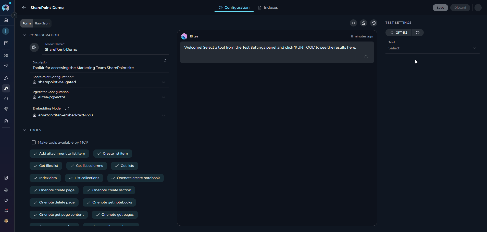{loading=lazy}

3. **Select Tool:** Use the **Tool** dropdown to choose which toolkit action you want to test.
    * **Search functionality:** Type in the search box to filter available tools
    * **Tool options:** Select from available tools
    * **Provide Required Parameters (if prompted):** Fill in any inputs required by the selected tool.
4. **Execute the tool:** Click the **RUN TOOL** button and review the results in the output area. `(The RUN TOOL button appears after selecting a tool.)`

     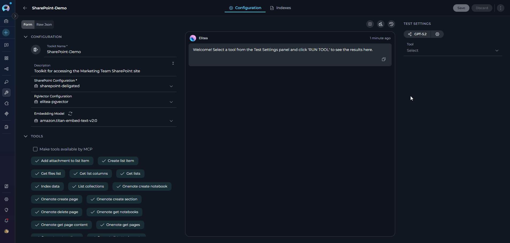{loading=lazy}
    
---

### Indexes Tab: Managing Toolkit Indexes

Toolkits that support document processing and content indexing provide an **Indexes** tab for managing indexed data.
For detailed instructions on using the Indexes tab, see [Using Indexes Tab Interface](../how-tos/indexing/using-indexes-tab-interface.md). 

**Accessing the Indexes Tab**

The Indexes tab is enabled in the toolkit detail page alongside the Run tab when:

* The toolkit schema includes indexing tools (such as `index_data`, `search_index`, `remove_index`)
* PgVector configuration is set
* Embedding Model is configured
* **index_data** tool is selected in the toolkit's tool selection

**Using the Indexes Tab**

The Indexes tab provides a dedicated interface for:

* **Creating new indexes:** Set up document indexing for the external service
* **Search indexes:** View, configure, and monitor active indexes
* **Index configuration:** Configure indexing parameters specific to each index
* **Index operations:** Execute indexing operations and track their progress
* **Removing indexes:** Delete indexes that are no longer needed

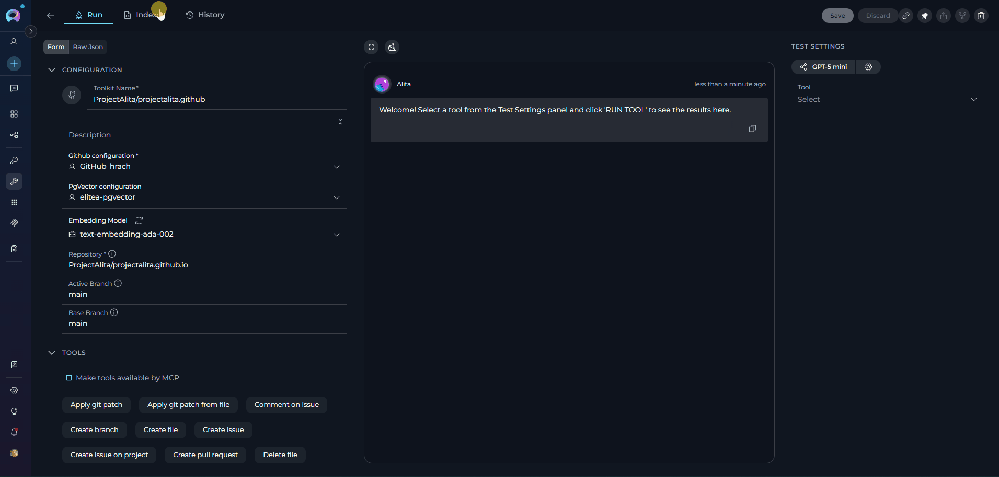{loading=lazy}

---

### History Tab: Tracking Toolkit Operations

The **History** tab provides a comprehensive log of all operations and activities performed with the toolkit.
For detailed instructions on using the History tab, see [Toolkit History Tab Guide](../how-tos/credentials-toolkits/toolkit_history_tab.md).

**Using the History Tab**

The History tab allows you to:

* **View operation history:** Track indexing operations and their status
* **Monitor toolkit usage:** Review when and how the toolkit has been used
* **Track changes:** See configuration changes and updates made to the toolkit
* **Troubleshoot issues:** Analyze past operations to identify and resolve problems
* **Audit trail:** Maintain a record of toolkit activities for compliance and review purposes

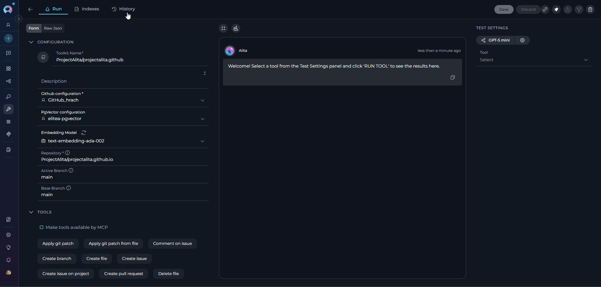{loading=lazy}
---

## Using Toolkits in Your Workflows

Once a toolkit is configured, you can use it across different areas of the platform to enhance your workflows:

**In Agents**

1. Navigate to the **[Agents](agents.md)** menu.
2. Select or create an agent.
3. In the agent's configuration, add the desired toolkit from the list of available toolkits.
4. Configure any agent-specific toolkit options, if prompted.
5. Save your agent.

**In Pipelines**

1. Navigate to the **[Pipelines](pipelines.md)** menu.
2. Select or create a pipeline.
3. In the pipeline configuration, add the desired toolkit to enable automated workflow steps.
4. Configure pipeline-specific toolkit parameters as needed.
5. Save your pipeline.

**In Chat**

1. Open a **[Chat](chat.md)** session.
2. Access the toolkit selector within the chat interface.
3. Select one or more toolkits to make their capabilities available during the conversation.
4. Use natural language to interact with the toolkit's features.

!!! info "Tip"
    You can use multiple toolkits simultaneously in agents, pipelines, and chat sessions to create powerful, integrated workflows that span multiple services and platforms.

---

## Best Practices

??? tip "Secure Your Credentials"
    Always use secure tokens or API keys. Never share credentials in public areas.

??? tip "Test Before Use"
    Use the Test Settings panel to test toolkit functionality before assigning them to agents.

??? tip "Keep Toolkits Updated"
    Update credentials and settings if your external service changes.

??? tip "Minimal Permissions"
    Grant only the permissions necessary for the agent's tasks.

---

## Troubleshooting

??? warning "Failed Connection"
    Double-check credentials, URLs, and network connectivity.

??? warning "Toolkit Not Appearing"
    Refresh the toolkits list or verify your permissions.

??? warning "Agent Cannot Use Toolkit"
    Ensure the toolkit is configured and assigned to the agent.

For further assistance, contact your platform administrator.

### Support Contact

If you encounter issues not covered in this guide or need additional assistance with toolkit management, please refer to **[Contact Support](../support/contact-support.md)** for detailed information on how to reach the ELITEA Support Team.

---

!!! info "Additional Resources"
    Explore these related guides to maximize your toolkit usage:

    * **[Glossary](../home/glossary.md)** — Definitions of common terms used across the platform
    * **[Credentials](./credentials.md)** — Learn how to create and manage credentials used by toolkits
    * **[AI Configuration](./settings/ai-configuration.md)** — Set up embedding models and vector configurations
    * **[Secrets Management](./settings/secrets.md)** — Secure credential storage best practices
