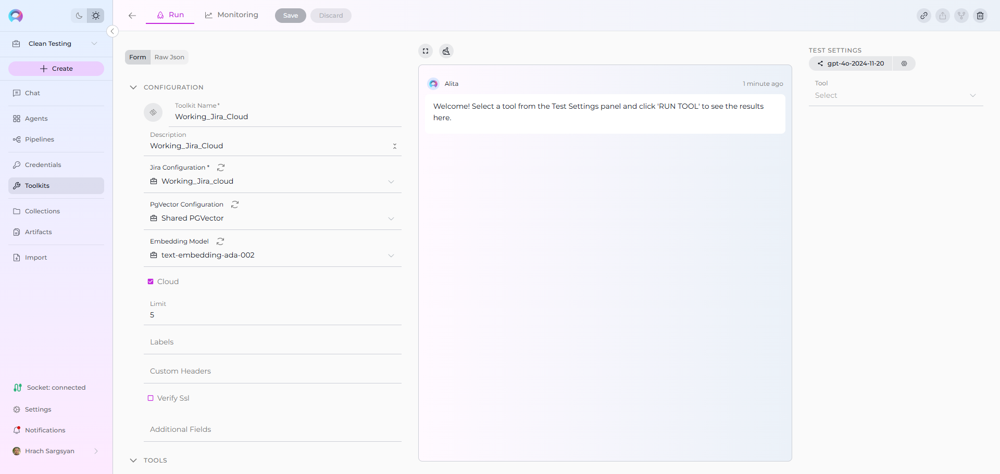
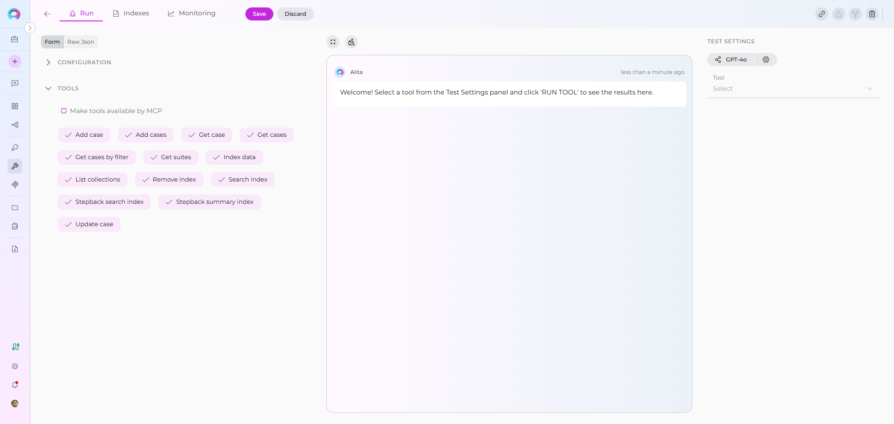
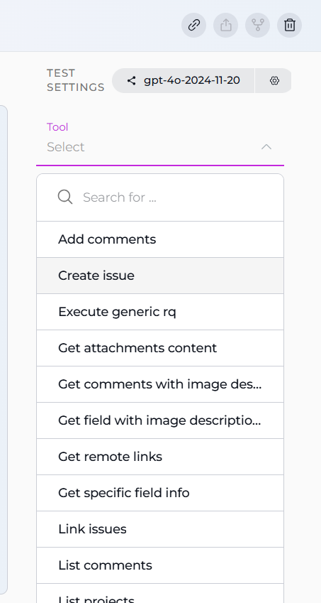
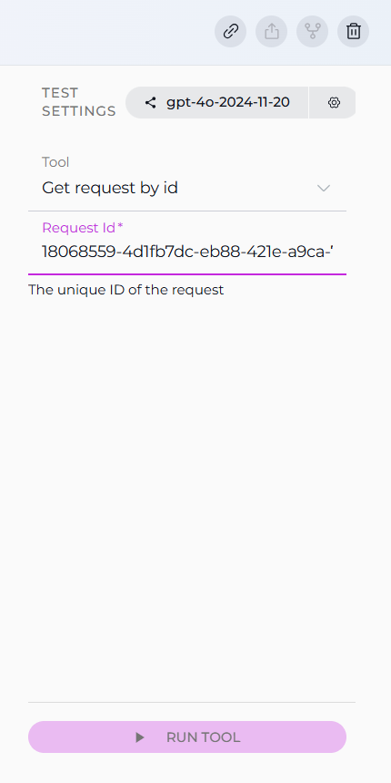

# Toolkits

## Introduction to the Toolkits Menu

The **Toolkits** menu in the ELITEA platform provides a centralized interface for managing and configuring integrations that power your AI agents. Toolkits extend the capabilities of agents by enabling them to interact with a variety of services—such as project management, version control, testing tools, data processing utilities, and more. This guide walks you through the Toolkits menu, explains how to navigate its features, and describes how to configure available toolkits to best fit your workflows.

---

## What Are Toolkits?

**Toolkits** in ELITEA are modular integrations that connect your agents to external platforms and internal services. Each toolkit provides an interface for configuring connection parameters (like API keys, URLs, or credentials) and setting options specific to the target service. Once configured, toolkits can be assigned to agents, empowering them to automate tasks across different systems and domains.

---

## Navigating the Toolkits Menu

The Toolkits menu is accessible from the main platform navigation. Upon entering the Toolkits section, you'll see a dashboard listing all available toolkits, along with their configuration status.

### Main Elements:

* **Toolkit Cards:** Each card provides a brief description, current status, and toolkit type.
* **Search and Filter:** Quickly locate a toolkit using the search bar or filter by type.
* **Create Toolkit Button:** Use the `+ Create` button to add a new integration or configure an existing one.

---

## Creating a New Toolkit

You can add new integrations to the platform by creating a new toolkit through the Toolkits menu.

### How to Create a New Toolkit

Follow these steps to add a new integration to the platform:

1. **Open the Toolkits Menu:** Go to the Toolkits section from the main navigation bar.
2. **Click `+ Create`:** Find the `+ Create` button at the top right of the sidebar.
3. **Select Toolkit Type:** Choose the desired toolkit type from the categorized list (e.g., GitHub, Jira, ADO).

    

4. **Enter Toolkit Details:**
      * **Name:** (if prompted) Provide a clear, descriptive name for your toolkit.
      * **Description:** (if prompted) Add a short description to clarify its purpose.
5. **Configure Credentials or Settings:**
       * If the toolkit requires credentials, open the Credentials dropdown and either create new credentials or select an existing one. Enter any required parameters (API keys, tokens, service URLs, etc.) as prompted.
       * For toolkits that do not require credentials, configuration fields will be shown directly on the create toolkit page. Fill in the necessary settings as prompted for that toolkit type.
6. **Configure Advanced Options (Optional):**
       * **PgVector Configuration:** Many toolkits now support vector database integration through PgVector. If available, select or configure a PgVector connection from the configuration dropdown to enable vector storage capabilities for document indexing and similarity search.
       * **Embedding Model:** For toolkits that support text processing and semantic search, select an appropriate embedding model configuration from the dropdown. This enables the toolkit to process and understand text content for advanced search and analysis features.
7. **Save the Toolkit:** Click **Save** (top right) to create the toolkit. It will now appear in your toolkits dashboard, where you can access its detailed configuration page to manage tool selection and other settings.

 

!!! note "Important Notes"
    * After creating a toolkit, you'll need to configure which specific tools are enabled by visiting the toolkit's detailed page. Tool selection is managed post-creation for better organization and security.
    * Only users with the necessary permissions can create or configure toolkits. If the `+ Create` button is disabled for you, please contact your platform administrator.

---

## Toolkit Categories & Descriptions

The platform supports a wide range of toolkits, organized by category. Below is the latest list of categories and available toolkits. 

| **Category**           | **Available Toolkits**                                                                                 |
|------------------------|------------------------------------------------------------------------------------------------------|
| **Analysis**           | Pandas                                                                                               |
| **Code Repositories**  | ADO Repos, Bitbucket, GitHub, GitLab, GitLab Org                                                     |
| **Development**        | Sonar, SQL                                                                                           |
| **Documentation**      | ADO Wiki, Confluence                                                                                 |
| **Office**             | PPTX, Sharepoint                                                                                     |
| **Other**              | Agent, Artifact, Custom, Datasource, Figma, Google Places, Postman, Salesforce, ServiceNow, Slack |                                                                                              |
| **Project Management** | ADO Boards, Jira, Rally                                                                              |
| **Test Management**    | ADO Plans, QTest, Testrail, XRAY Cloud, Zephyr Enterprise, Zephyr Essential, Zephyr Scale, Zephyr Squad |
| **Testing**            | Browser, Carrier, Open API, Report Portal, TestIO                                                    |

!!! note "Note"
    Toolkit availability may evolve. Refer to the platform UI for the most current list.

---

## Advanced Configuration Options

Many toolkits in the ELITEA platform now support advanced configuration options that enhance their capabilities for document processing, search, and AI-powered features:

### PgVector Configuration

**PgVector Configuration** enables vector database integration for toolkits that support document indexing and similarity search capabilities.

* **Purpose:** Provides vector storage for embedding-based search and document retrieval
* **Configuration:** Requires a connection string to your PgVector database instance
* **Supported Toolkits:** Available in toolkits such as Figma, Jira, TestRail, ADO, Sharepoint, Zephyr variants, and others that handle document or content processing
* **Benefits:** Enables semantic search, document similarity analysis, and improved content discovery within integrated platforms

### Embedding Model Configuration

**Embedding Model Configuration** allows toolkits to process and understand text content for advanced search and analysis features.

* **Purpose:** Converts text content into vector representations for semantic understanding
* **Configuration:** Select from available embedding model configurations in your project
* **Supported Toolkits:** Available in the same toolkits that support PgVector configuration
* **Benefits:** Enables natural language queries, content similarity matching, and AI-powered content analysis

!!! tip "Configuration Requirements"
    To use these advanced features, ensure that:
    
    * PgVector database is properly configured and accessible
    * Embedding model credentials are set up in your project's AI Configuration
    * Both configurations are created before toolkit setup for seamless integration

---

## Editing and Configuring a Toolkit

### How to Edit an Existing Toolkit

To edit a toolkit, open its detailed page from the Toolkits dashboard. On this page, you can:

* **Edit Toolkit Details:** Update the name, description, credentials (API keys, tokens, service URLs), and any custom or advanced options directly in the configuration panel.
* **Manage Tool Selection:** Configure which specific tools are enabled for this toolkit. In the "Tools" section, check only the tools your agent will use. Enabling only necessary tools improves security (principle of least privilege) and optimizes performance.
* **Update Advanced Configurations:** Modify PgVector configuration settings or change embedding model selections to optimize performance or adapt to new requirements.
* **Save Changes:** Click **Save** to apply your updates. Changes are applied immediately and reflected in the dashboard.
* **Remove Toolkit:** Click the **Remove** (trash) icon to delete the toolkit. Confirm the removal in the dialog.
* **Copy Link:** Click the copy link icon to copy a direct link to the toolkit’s detailed page—useful for sharing with teammates who have access.
* **Export and Fork Icons:** These icons (currently unavailable) will allow you to export a toolkit’s configuration or create a fork (duplicate) of an existing toolkit in other projects in future releases.

 

### Tool Selection Best Practices

When selecting tools for your toolkit:
    
* **Review available tools** carefully and enable only those needed for your specific use case
* **Test each enabled tool** using the Test Settings panel to ensure proper functionality
* **Update tool selection** as your requirements change or new tools become available

    

!!! tip "Tip"
    Regularly use the edit function to rotate credentials, update tool selections, or modify toolkit capabilities as your needs change.

---

### Testing Toolkit Functionality

The toolkit configuration page includes a **Test Settings** panel on the right side that allows you to test toolkit functionality in real-time.

1. **Select a Model:** Choose the LLM model from the model dropdown (e.g., `gpt-4o`).

  

2. **Adjust Model Parameters:** Fine-tune how the model generates responses using the following controls:
    * **Temperature (0.1 - 1.0):** Controls randomness and creativity. Lower values (e.g., 0.2) yield more predictable results.
    * **Top P (0.1 - 1.0):** Nucleus sampling parameter. Limits output to the most probable words, with higher values allowing more diversity.
    * **Top K:** Restricts choices to the top K most likely next words (e.g., 10).
    * **Max Completion Tokens:** Sets the upper limit for the length of the model’s output (e.g., 1024 tokens)
3. **Select Tool:** Use the **Tool** dropdown to choose which toolkit action you want to test.
    * **Search functionality:** Type in the search box to filter available tools
    * **Tool options:** Select from available tools
    * **Provide Required Parameters (if prompted):** Fill in any inputs required by the selected tool.

  

4. **Execute the tool:** Click the **RUN TOOL** button and review the results in the output area. `(The RUN TOOL button appears after selecting a tool.)`

  
    

#### Test Interface Features

* **Chat Interface:** Test results appear in a chat-like interface showing your input and the toolkit's response.
* **Fullscreen Mode:** Click the fullscreen icon to expand the test interface for better viewing.
* **Clear Results:** Use the clear icon to remove previous test results and start fresh.
* **Real-time Testing:** Tests are executed immediately and show both successful responses and error messages.

---

## Assigning Toolkits to Agents

Once a toolkit is configured:

1. Navigate to the **Agents** menu.
2. Select or create an agent.
3. In the agent's configuration, add the desired toolkit from the list of available toolkits.
4. Configure any agent-specific toolkit options, if prompted.
5. Save your agent.

!!! tip "Tip"
    Agents can use multiple toolkits for complex workflows.

---

## Best Practices

* **Secure Your Credentials:** Always use secure tokens or API keys. Never share credentials in public areas.
* **Test Before Use:** Use the Test Settings panel to test toolkit functionality before assigning them to agents.
* **Keep Toolkits Updated:** Update credentials and settings if your external service changes.
* **Minimal Permissions:** Grant only the permissions necessary for the agent's tasks.

---

## Troubleshooting

* **Failed Connection:** Double-check credentials, URLs, and network connectivity.
* **Toolkit Not Appearing:** Refresh the toolkits list or verify your permissions.
* **Agent Cannot Use Toolkit:** Ensure the toolkit is configured and assigned to the agent.

For further assistance, contact your platform administrator.

---

## Summary

The Toolkits menu is your gateway to extending agent capabilities across a range of enterprise services. By following the steps in this guide, you can quickly configure, manage, and assign toolkits to agents—enabling powerful, automated workflows tailored to your organization's needs.

---

!!! info "Additional Resources"
    Explore these related guides to maximize your toolkit usage:

    * **[Glossary](../home/glossary.md)** — Definitions of common terms used across the platform
    * **[Agents](./agents.md)** — Configure agents and assign toolkits to enable automated workflows
    * **[Credentials](./credentials.md)** — Learn how to create and manage credentials used by toolkits
    * **[AI Configuration](./settings/ai-configuration.md)** — Set up embedding models and vector configurations
    * **[Secrets Management](./secrets.md)** — Secure credential storage best practices
