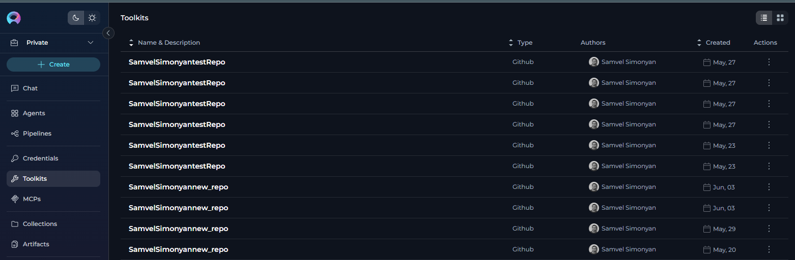

# Migration Guide: Upgrading to v2.0.0

This guide helps you upgrade from v1.7.x to ELITEA v2.0.0, focusing on the critical LLM node updates required for existing pipelines.

## Overview

Version 2.0.0 introduces an enhanced LLM node structure in pipelines with separate **System** and **Task** fields, replacing the previous single **Prompt** field. This change provides better control over AI behavior and more explicit separation of concerns.

## What's New in v2.0.0

* **Enhanced LLM Nodes**: New structure with dedicated System and Task fields
* **Improved Prompt Engineering**: Better separation of system instructions and user tasks
* **MCP Server Support**: Integrated Model Context Protocol for extended capabilities
* **Enhanced Chat Features**: Advanced conversation management and canvas improvements

## Breaking Changes

### LLM Node Structure Change (REQUIRED)

!!! warning "Action Required"
    If you have existing pipelines created before v2.0.0, you **must** manually update each LLM node to the new format. Pipelines with old LLM nodes may fail to load or execute.

**What changed:**

* Old format: Single **Prompt** field
* New format: Separate **System** and **Task** fields

**Impact:**

* Existing LLM nodes will show configuration errors
* Pipelines may fail to execute
* Manual update required for each affected node

## Migration Guides

### 1. Update LLM Nodes in Pipelines (REQUIRED)

This is the primary migration task for v2.0.0:

**[Update LLM Nodes in Pipelines](update-llm-nodes.md)**

This essential guide covers:

* Visual comparison of old vs new LLM node formats
* Symptoms of outdated nodes
* Step-by-step update instructions
* How to migrate your old prompt content
* Tips for using variables in the new format

### 2. Configure and Use MCP Servers (Optional)

Take advantage of the new Model Context Protocol support:

**MCP Client (Connect External Tools to Elitea):**

- [Connect External Tools to Elitea with MCP](../../getting-started/create-and-use-client-stdio.md)

**MCP Server (Use Elitea Agents in VS Code):**

- [Setting Up Your First MCP Server](../../getting-started/create-and-use-server-stdio.md)

These quick start guides include:

* Installing and configuring the Elitea MCP Client
* Setting up MCP servers (example: Playwright)
* Creating MCPs in the ELITEA UI
* Using MCP tools in conversations
* Testing and troubleshooting

## Migration Process

Follow these steps to migrate to v2.0.0:

### Step 1: Review Release Notes

Read the [current release notes](../../release-notes/rn_current.md) to understand all changes in v2.0.0.

### Step 2: Identify Affected Pipelines

1. Open the **Pipelines** menu
2. Look for pipelines created before v2.0.0
3. Note which ones contain LLM nodes
4. Prioritize business-critical pipelines

### Step 3: Update LLM Nodes

For each pipeline with LLM nodes:

1. Open the pipeline in edit mode
2. Go to **Configuration** → **Flow** tab
3. Click on each LLM node
4. Migrate the content:
      * Move system-level instructions to the **System** field
      * Move specific tasks/queries to the **Task** field
      * Leave **Chat History** empty (unless needed)
5. Save the node configuration
6. Save the pipeline

**Detailed instructions:** [Update LLM Nodes in Pipelines](update-llm-nodes.md)

### Step 4: Test Your Pipelines

After updating each pipeline:

1. Run a test execution
2. Verify the output matches expectations
3. Check that all LLM nodes respond correctly
4. Test any variable references

### Step 5: Optional Enhancements

Consider these optional improvements:

#### Set Up MCP Servers

Extend your agents and pipelines with Model Context Protocol:

1. Install the Elitea MCP Client
2. Bootstrap and configure MCP servers
3. Create MCP entries in ELITEA
4. Assign MCPs to agents or use in conversations

See: 
- [MCP Client Guide (External Tools → Elitea)](../../getting-started/create-and-use-client-stdio.md)
- [MCP Server Guide (Elitea Agents → VS Code)](../../getting-started/create-and-use-server-stdio.md)

#### Review New Features

Explore new capabilities introduced in v2.0.0:

* Enhanced chat and canvas features
* Improved conversation management
* Advanced MCP integration options

## Key Differences from v1.7.x

### LLM Node Structure

| **v1.7.x (Old)** | **v2.0.0 (New)** |
|------------------|------------------|
| Single **Prompt** field | Separate **System** and **Task** fields |
| Mixed system and user content | Clear separation of concerns |
| Less explicit role definition | Explicit system behavior configuration |
| Basic variable support | Enhanced variable support in both fields |

### Migration Example

**Old Format (v1.7.x):**
```
Prompt: "You are a helpful code reviewer. Analyze the following code and suggest improvements: {code_input}"
```

**New Format (v2.0.0):**
```
System: "You are a helpful code reviewer that provides constructive feedback."
Task: "Analyze the following code and suggest improvements: {code_input}"
```

## Troubleshooting

### Issue: Pipeline fails to load

**Solution:**

1. Check for LLM nodes with configuration errors
2. Update all LLM nodes to the new format
3. Save and reload the pipeline

### Issue: LLM node shows "configuration issues"

**Solution:**

1. Open the node configuration panel
2. Ensure both **System** and **Task** fields are filled
3. Click **Save** in the panel
4. Save the pipeline

### Issue: Can't find old prompt content

**Solution:**

1. Go to pipeline **Configuration** → **YAML** tab
2. Look for your LLM node in the YAML structure
3. Find the old prompt content
4. Copy and split it between System and Task fields

### Issue: Variables not working in new fields

**Solution:**

1. Click the variable icon next to the System or Task field
2. Select from available pipeline variables
3. Variables work the same way in both fields

### Issue: Duplicate toolkits after migration

**Symptoms:**
- Multiple identical or similar toolkits appear after migration from v1.6 to v1.7/2.0
- Toolkits are duplicated for every application version and every application instance
- Agents using the same toolkit show different tool sets despite being configured with the same toolkit



**Cause:**
During automatic data migration from v1.6 to v1.7 or v2.0, the migration process creates duplicate toolkits for each application version and application instance, even when they contain identical functionality.

**Solution:**

1. **Delete excessive toolkits**: Review your toolkits list and remove duplicates, keeping only one instance of each unique toolkit
2. **Reuse tools in agents**: For agents using the same toolkit that show different tool sets, you can filter (deselect) specific tools within each agent to create consistent tool sets
3. **Recreate problematic toolkits**: For some toolkits where credential selection doesn't help resolve configuration issues, it's easier to delete the toolkit completely and create a new one rather than troubleshooting and fixing the existing configuration.

!!! tip "Toolkit Management"
    After migration, audit your toolkits list and consolidate duplicates early to avoid confusion when configuring agents and pipelines.

## Rollback Considerations

!!! warning "No Automatic Rollback"
    Once you update LLM nodes to the new format, there is no automatic way to revert to the old structure. Ensure you:
    
    - Test thoroughly in a non-production environment first
    - Document your old configurations before updating
    - Keep backups of critical pipeline definitions

## Getting Help

If you encounter issues during the upgrade:

* **Migration Guide**: [Update LLM Nodes in Pipelines](update-llm-nodes.md)
* **FAQs**: [Frequently Asked Questions](../../support/faqs.md)
* **Contact Support**: Email [SupportAlita@epam.com](mailto:SupportAlita@epam.com)

When contacting support, include:

* Pipeline name and project
* Screenshot of the LLM node configuration
* Error messages (if any)
* Expected vs actual behavior

## Related Documentation

* [Release Notes - Current](../../release-notes/rn_current.md)
* [Pipelines Menu Guide](../../menus/pipelines.md)
* [Connect External Tools to Elitea with MCP (Client)](../../getting-started/create-and-use-client-stdio.md)
* [Setting Up MCP Server (Use Elitea in VS Code)](../../getting-started/create-and-use-server-stdio.md)
* [MCPs Menu Guide](../../menus/mcps.md)
* [MCP Client Integration](../../integrations/mcp/mcp-client.md)

---

**Next Step:** Start with the [Update LLM Nodes in Pipelines](update-llm-nodes.md) guide to migrate your pipelines.
