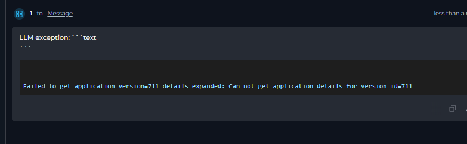
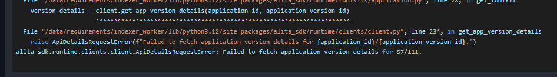

# Pipeline Migration Guide: Updating from Previous Versions

This guide provides instructions for migrating pipelines from earlier ELITEA versions (1.6, 1.7) to version 2.0. The migration process involves several important changes to node types, entity handling, and configuration formats.

!!! info "Migration Scope"
    This guide covers migration from version 1.6 and later. If you're migrating from earlier versions, additional steps may be required.

!!! note "Additional Migration Changes"
    For LLM node-specific changes and configurations, also read about [LLM Node Changes in the migration guide](update-llm-nodes.md). This covers important updates to LLM node behavior and configuration that complement the pipeline migration steps outlined in this document.

---

## Function Node Changes (Version 1.7+)

### Issue Description

In version 1.7, "Function" nodes were significantly modified and can now only be used with toolkits. Any Function nodes containing agents or prompts will appear empty after migration.

### Migration Steps

**For Agent-Based Function Nodes**

**Identify Affected Nodes**: Look for Function nodes that previously contained agents or prompts

 

1. **Replace with an Agent node**:
      1. Delete the existing Function node.
      2. Add a new **Agent** node type and integrate it into the flow (add all required connections).
      3. Select the appropriate agent from the dropdown.
2. **Configure input/output**: Set up the input and output connections as they were in the original Function node.
3. **Add task description**: Fill in the task field — this is crucial as it triggers the agent execution.

!!! warning "Task Field Requirement"
    The task field in Agent nodes is mandatory and is used to trigger agent execution. Ensure you provide a clear, descriptive task for each Agent node.

**For Toolkit-Based Function Nodes**

Function nodes can still be used for toolkit operations without LLM participation.

---

## Prompt Entity Removal (Version 1.7+)

### Issue Description

In version 1.7, the prompt entity was removed from ELITEA. Previously existing prompts were automatically converted to agents, but pipeline references may need manual updates.

 

### Migration Steps

**For Tool Nodes Using Prompts**

1. **Identify legacy Tool nodes**: Find Tool nodes that reference converted prompts (now agents).
2. **Replace with Agent nodes**:
      * Remove the existing Tool node.
      * Add a new **Agent** node.
      * Select the converted agent (formerly a prompt) from the agent dropdown.
3. **Configure parameters**:
      * Set up input connections.
      * Configure output handling.
      * Add the required task description.
4. **Validate conversion**: Test the pipeline to ensure the converted prompt-to-agent functions correctly.

**For Function Nodes Using Prompts**

Follow the same process as described in the Function Node Changes section above.

---

## Node Disconnection Issues

### Issue Description

When replacing nodes that are followed by Decision, Condition, or Router nodes, there is a high probability that connections will be lost after migration or node replacement. This is a known limitation in current ELITEA versions.

### Workaround Steps

1. **Document connections**: Before making changes, take screenshots or save a copy of the pipeline YAML (or create a new pipeline version) to preserve the connection sequence.
2. **Replace nodes**: Perform the necessary node replacements as described above.
3. **Save pipeline**: Save your changes.
4. **Reconnect nodes**: Manually reconnect the nodes to their proper destinations:
      * **Decision nodes**: Reconnect to the appropriate conditional branches.
     * **Condition nodes**: Reestablish logical flow connections.
     * **Router nodes**: Restore routing configurations.
5. **Test connections**: Verify all connections work as expected.

!!! tip "Connection Management"
    This limitation will be resolved in future releases. For now, always verify and manually reconnect nodes after replacement operations.

---

## State Format Changes

### Issue Description

The state format was changed in YAML configuration for pipelines. Some existing pipelines may encounter state format errors when running.

### Error Symptoms

You may see the following format-related errors when running pipelines, typically indicating incompatible YAML state formatting.

  

Old YAML syntax:

  

New YAML syntax:

  

### Resolution Methods

**Method 1: Automatic Format Update**

1. **Edit state variables**: Navigate to your pipeline's state variables.
2. **Make minor changes**: Add a new temporary state variable or modify an existing one and save the pipeline.
3. **Save changes**: The system will automatically convert the state format to the current version.
4. **Remove temporary changes**: Delete any temporary variables you added.

**Method 2: Manual Format Conversion**

1. **Access state configuration**: Open the pipeline YAML state variables section.
2. **Review current format**: Compare against the current YAML state format requirements.
3. **Update manually**: Modify the state configuration to match the current format specifications.
4. **Validate format**: Ensure the YAML syntax is correct and compatible.

!!! example "Quick Fix"
    The easiest approach is Method 1: simply add a temporary state variable, save the pipeline, then remove the temporary variable. This triggers automatic format conversion.

---

## Pre-1.7 Agent toolkit Compatibility Issues

### Issue Description

Agents and pipelines that were created before version 1.7 may encounter compatibility issues when using attached toolkits. This affects pipeline execution.

### Error Symptoms

When trying to run pipelines containing pre-1.7 agents, you may encounter the following error:

### Warning Messages

Additionally, you may see warning messages related to attached toolkits and agents containing toolkits:

### Resolution Steps

**For pipelines with pre-1.7 agents**

1. **Identify affected toolkits**: Review all toolkits attached to the pipeline or nested agents.
2. **Update toolkit configuration**:
      * Open each affected toolkit.
      * Select or create new credentials for it.
      * Deselect obsolete tools, if any.
3. **Test toolkit functionality**: Verify that the updated toolkit works correctly in isolation.

!!! warning "Agent Recreation May Be Required"
    In some cases, severely outdated toolkits may need to be recreated entirely. If configuration updates don't resolve the issues, consider creating a new toolkit with the same functionality and replacing the old ones in your pipelines/agents.

More about toolkit migration read here  [Next quick-start](../../migration/v1.7.0/next-quick-start.md)

### Getting Help

If you encounter issues during migration:

1. **Check error messages**: Review detailed error messages (usually shown at the end) for guidance; look for node or variable names that indicate the issue.
2. **Contact support**: For complex issues, contact support at **SupportAlita@epam.com**.

When contacting support, provide:

* Pipeline version information
* Specific error messages
* Screenshots of the problematic configurations
* Description of attempted migration steps.