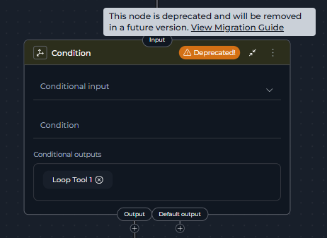
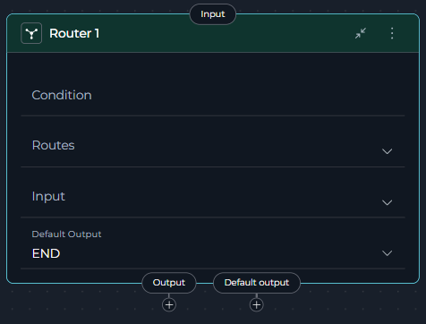
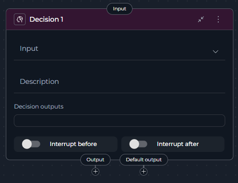
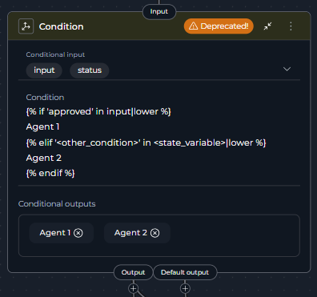
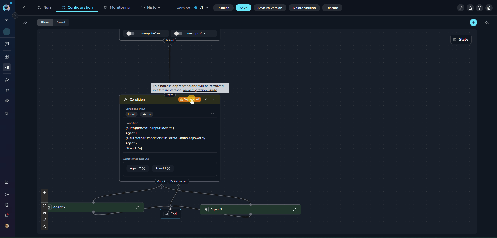
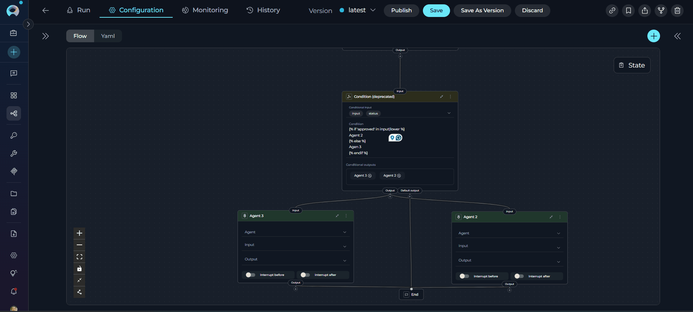

# Migrating from Condition Node to Router or Decision Nodes

## Overview

The **Condition Node** has been deprecated and is no longer available for creation in new pipelines. While existing Condition nodes in your pipelines will continue to function, we strongly recommend migrating to **Router** or **Decision** nodes to take advantage of improved functionality and ensure long-term compatibility.

!!! warning "Deprecation Notice"
    The Condition Node is deprecated and will be removed in a future release. Existing Condition nodes in your pipelines will continue to function, but they display a **warning icon** with "Deprecated!" text in the node header and show a tooltip when hovered. Plan your migration accordingly.

**What changed:**

* **Condition Node** is now deprecated and displays a **warning icon** with "Deprecated!" text in the node header
* Creating new Condition nodes is no longer possible through the Add Node menu
* Existing Condition nodes continue to function but should be migrated
* **Router Node** is the primary replacement (recommended for most use cases)
* **Decision Node** is available for complex, LLM-powered routing scenarios
* Hovering over the warning icon shows a tooltip with migration guidance

### How to Identify Deprecated Condition Nodes

Deprecated Condition nodes are visually marked in the pipeline editor:

* **Warning Icon**: A yellow/orange warning triangle icon appears in the node header
* **"Deprecated!" Text**: Text next to the icon clearly indicates the deprecation status
* **Tooltip**: Hovering over the warning area shows: *"This node is deprecated and will be removed in a future version. View Migration Guide"* with a link to this guide



!!! info "No Automatic Migration"
    There is no automatic migration from Condition Nodes to Router or Decision Nodes. You must manually replace Condition Nodes in your existing pipelines following the steps in this guide.

**What you need to do:**

* Review pipelines containing Condition nodes
* Choose the appropriate replacement: Router or Decision
* Follow migration steps to update your workflow
* Test the migrated pipeline thoroughly

---

## Why This Change Was Made

The Condition Node has been deprecated in favor of more specialized and capable alternatives:

* **Router Node**: Provides better performance for template-based conditional routing with multiple named paths, and serves as the direct replacement for Condition Node functionality
* **Decision Node**: Offers LLM-powered intelligent routing for complex decision-making scenarios that go beyond simple template-based conditions

These replacement nodes provide clearer semantics, better maintainability, and enhanced functionality for different routing scenarios.

---

## Migration Options

You have two replacement options depending on your use case:

### Option 1: Router Node

!!! tip "Primary Replacement"
    **Router Node** is the recommended replacement for most Condition Node use cases. It provides full feature parity with Condition Node while offering enhanced capabilities.

**Choose Router when:**

* You have explicit conditional logic using templates (most Condition Node scenarios)
* You need multiple named routes based on conditions
* You want fast, deterministic routing without LLM overhead
* Your conditions are based on keyword matching, value comparisons, or status checks
* You're migrating from Condition Node (Router provides the most direct replacement)

**Best for:** Template-based routing, status checks, approval workflows, multi-path branching, direct Condition Node replacement

**Key Advantages:**

* Full functionality coverage of deprecated Condition Node
* Fast, deterministic execution (no LLM calls)
* Familiar template-based syntax
* Better performance and maintainability



### Option 2: Decision Node (Advanced Use Cases)

**Choose Decision when:**

* You need intelligent routing based on natural language criteria
* Your routing logic is complex or nuanced beyond simple template conditions
* You want to leverage LLM reasoning for semantic decisions
* You prefer descriptive instructions over template syntax
* Simple template logic is insufficient for your routing needs

**Best for:** Semantic routing, complex decision logic requiring AI interpretation, context-aware branching




!!! warning "Performance Consideration"
    Decision Nodes use LLM processing and are slower than Router Nodes. Use Decision Nodes only when Router Node's template-based logic is insufficient.

---

## Migration Steps: Condition → Router

Follow these steps to migrate a Condition node to a Router node:

### Step 1: Review the Existing Condition Node

1. Navigate to **Pipelines** in the main menu
2. Open the pipeline containing the Condition node
3. Click the **Configuration** tab
4. Select the **Flow** tab to view the pipeline flow diagram
5. Locate the **Condition node** - it will display with a **warning icon** and "Deprecated!" text in the node header
6. Click on the Condition node to open its configuration panel
7. Review its current configuration:
      * **Conditional Input**: Note which state variables are used
      * **Condition**: Review the template-based condition logic
      * **Conditional Outputs**: Identify the named output paths
      * **Default Output**: Note the fallback route
`



### Step 2: Add a Router Node

1. In the same Flow tab, click the **Add Node** button (+ icon)
2. Select **Router** from the node menu
3. The new Router node will appear on the canvas
4. Position it near the deprecated Condition node for easy comparison

### Step 3: Configure the Router Node

Configure the Router node with the same logic as your Condition node:

1. Click on the **Router node** to open its configuration panel
2. Set the **Input** field:
      * Add the same state variables from the Condition node's **Conditional Input**
      * Example: `input`, `status`, or custom state variables
3. Define the **Condition** using template syntax:
      * Copy the condition logic from the Condition node
      * Ensure it returns the correct route names
      * Example:
        ```jinja2
        
        <NodeName1>
        
        <NodeName2>
        
        ```
      * Replace `<condition>` with your matching text (e.g., `'approved'`)
      * Replace `<state_variable>` with your state variable (e.g., `input`)
      * Replace `<NodeName1>`, `<NodeName2>` with your actual node IDs
4. Configure **Routes**:
      * Add each route from the Condition node's **Conditional Outputs**
      * Route names must exactly match those returned by the condition
      * Example: `<NodeName1>`, `<NodeName2>`
5. Set the **Default Output**:
      * Select the same node as the Condition node's **Default Output**
      * This handles cases where no conditions match

### Step 4: Reconnect the Workflow

1. **Disconnect the incoming connection** to the Condition node:
      * Click on the edge connecting to the Condition node
      * Press `Delete` or click the remove icon
2. **Connect the Router node**:
      * Drag a connection from the previous node to the Router node's input handle
3. **Connect the Router outputs**:
      * For each route (conditional output), drag a connection from the Router node's corresponding output handle to the target node
      * Connect the default output handle to the default target node
4. Verify all connections match the original Condition node's flow

### Step 5: Remove the Deprecated Condition Node

1. Click on the **Condition node** to select it
2. Click the **Delete** icon (trash can) or press `Delete` key
3. Confirm the deletion
4. The Condition node is now removed from the pipeline




### Step 6: Save and Test

1. Click **Save** to save the pipeline configuration
2. Navigate to the **Execution** tab
3. Run the pipeline with test inputs covering all routing paths
4. Verify that:
      * Each condition routes to the correct node
      * The default output works as expected
      * All workflow paths execute correctly

---

## Migration Steps: Condition → Decision

Follow these steps to migrate a Condition node to a Decision node:

### Step 1: Identify Condition Logic

1. Navigate to **Pipelines** in the main menu
2. Open the pipeline containing the Condition node
3. Click the **Configuration** tab → **Flow** tab
4. Click on the **Condition node** (marked with a **warning icon** and "Deprecated!" text)
5. Analyze the conditional logic:
      * What criteria determine the routing?
      * What are the possible output paths?
      * What business logic drives the decision?

### Step 2: Add a Decision Node

1. In the Flow tab, click the **Add Node** button (+ icon)
2. Select **Decision** from the node menu
3. Position the Decision node on the canvas
4. The Decision node will appear with its configuration panel

### Step 3: Configure Decision Criteria

Configure the Decision node with natural language instructions:

1. Click on the **Decision node** to open its configuration
2. Set the **Decision Input**:
      * Select the state variable the LLM should analyze
      * Example: `input`, `messages`, or custom state
3. Write the **Description** with clear routing criteria:
      * Describe when to route to each output
      * Provide specific examples for each path
      * Use structured format with bullet points or numbered lists
      * Example:
        ```
        Your task is to analyze the user's input and route accordingly:
        
        - If the input contains approval language (e.g., "approved", "accept", "yes"),
          route to "Agent 2" node
        - If the input contains rejection language (e.g., "rejected", "deny", "no"),
          route to "Agent 3" node
        - If the intent is unclear, route to "END" node
        ```
4. Configure **Decision Outputs**:
      * Add all possible target nodes from your original Condition node
      * Use descriptive names that match your description
      * Example: `Agent 2`, `Agent 3`
5. Set the **Default Output**:
      * Choose a fallback node for unclear cases
      * Example: `END` or a review node

### Step 4: Map Output Connections

1. **Disconnect the Condition node**:
      * Remove the incoming connection to the Condition node
      * Remove all outgoing connections from the Condition node
2. **Connect the Decision node input**:
      * Drag a connection from the previous node to the Decision node
3. **Connect Decision outputs**:
      * The Decision node automatically creates connections based on Decision Outputs
      * Manually connect each output to the corresponding target node
      * Ensure all paths from the original Condition node are covered

### Step 5: Validate the Migration

1. **Review the Description**:
      * Ensure routing criteria are clear and unambiguous
      * Add examples for each possible routing decision
      * Check that all Decision Outputs are mentioned in the description
2. **Remove the Condition node**:
      * Select the deprecated Condition node
      * Click Delete or press `Delete` key
      * Confirm removal
3. **Save the pipeline**



### Step 6: Test with Various Inputs

1. Navigate to the **Execution** tab
2. Test the pipeline with different inputs:
      * Test cases that should route to each output
      * Edge cases and ambiguous inputs
      * Verify the default output handles unclear cases
3. Monitor the Decision node's routing choices
4. Refine the **Description** if the LLM routes incorrectly

---

## Best Practices

### For Router Node Migration

* **Use Descriptive Route Names**: Name routes clearly (e.g., `ApprovedWorkflow` not `Path1`)
* **Always Define Default Output**: Provide a fallback for unmatched conditions
* **Test All Paths**: Verify each condition routes correctly with test inputs
* **Normalize Comparisons**: Use filters like `|lower` for case-insensitive matching
* **Match Names Exactly**: Route names in conditions must match Routes list exactly (case-sensitive)

### For Decision Node Migration

* **Write Clear Criteria**: Provide specific, unambiguous routing instructions
* **Include Examples**: Help the LLM understand expected routing with concrete examples
* **Structure Descriptions**: Use headings, lists, and formatting for clarity
* **Define All Outputs**: List all possible routing targets in Decision Outputs
* **Monitor and Refine**: Review LLM decisions and update description if needed
* **Test Edge Cases**: Verify behavior with ambiguous or unexpected inputs

### General Migration Tips

* **Migrate One at a Time**: Update and test one Condition node before moving to the next
* **Keep Both Temporarily**: Test the new node before removing the deprecated one
* **Document Changes**: Note any differences in behavior for your team
* **Review Connections**: Ensure all incoming and outgoing connections are preserved
* **Use YAML View**: Check the YAML tab to verify configuration correctness

---

## Troubleshooting

### Router Node Issues

**Problem**: Router node doesn't route to the expected path

**Solutions**:

* Verify route names in the condition **exactly match** the Routes list (case-sensitive)
* Check that condition logic returns the correct route name
* Ensure Input variables are correctly specified
* Test condition logic with actual state variable values

**Problem**: Pipeline fails when Router node executes

**Solutions**:

* Confirm Default Output is defined and points to a valid node
* Verify all route names in the Routes list are valid node IDs
* Check that all referenced state variables exist
* Review YAML configuration for syntax errors

### Decision Node Issues

**Problem**: Decision node routes to the wrong path

**Solutions**:

* Clarify routing criteria in the Description
* Add more specific examples for each output path
* Ensure Decision Outputs list includes all possible targets
* Test with clearer, more explicit inputs

**Problem**: Decision node is slower than expected

**Solutions**:

* This is expected behavior - Decision nodes use LLM processing
* Consider using Router node if simple template logic is sufficient
* Optimize Description to be concise while remaining clear

### Connection Issues

**Problem**: Connections are lost after migration

**Solutions**:

* Manually reconnect nodes after adding Router or Decision node
* Verify each output handle connects to the correct target
* Check that incoming connection to the new node is established
* Save pipeline after verifying all connections

---

## Comparison Table

| Feature | Condition Node | Router Node (Recommended) | Decision Node |
|---------|---------------------------|--------------------------|---------------|
| **Status** | Deprecated (still works) | Active | Active |
| **Can Create New** | No | Yes | Yes |
| **Decision Logic** | Template-based | Template-based | LLM-powered |
| **Configuration** | Conditional Input, Condition, Conditional Outputs | Input, Condition, Routes, Default Output | Decision Input, Description, Decision Outputs |
| **Performance** | Fast | Fast | Slower (LLM call) |
| **Use Case** | Boolean/multi-branch logic | Multi-path routing (direct replacement) | Complex/semantic routing |
| **Condition Syntax** | Jinja2 templates | Jinja2 templates | Natural language |
| **Best For** | Legacy pipelines only | Template-based conditions, Condition Node migration | Intelligent routing, complex decisions |
| **Recommended** | No - migrate away | Yes - primary replacement | For advanced scenarios only |

---

## Related Documentation

!!! info "Additional Resources"
    * **[Control Flow Nodes](../../how-tos/pipelines/nodes/control-flow-nodes.md)** - Complete guide to Router, Condition, and Decision nodes
    * **[Router Node](../../how-tos/pipelines/nodes/control-flow-nodes.md#router-node)** - Detailed Router node documentation
    * **[Decision Node](../../how-tos/pipelines/nodes/control-flow-nodes.md#decision-node)** - Detailed Decision node documentation
    * **[Pipeline States](../../how-tos/pipelines/states.md)** - Understanding state variables used in routing
    * **[Node Connectors](../../how-tos/pipelines/nodes-connectors.md)** - How to connect nodes in pipelines
    * **[YAML Configuration](../../how-tos/pipelines/yaml.md)** - Complete YAML syntax reference

---
