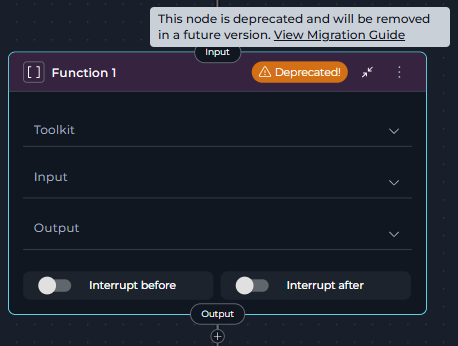
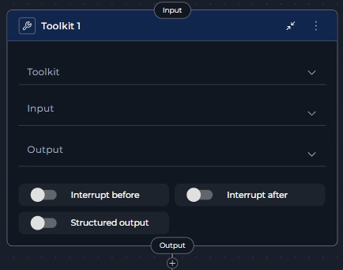
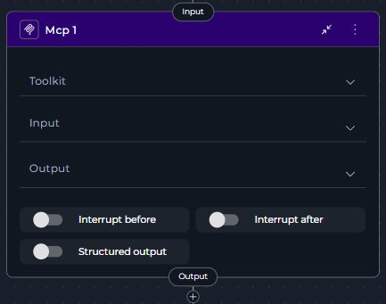
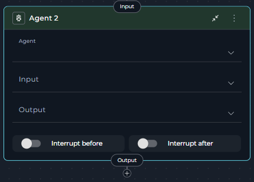
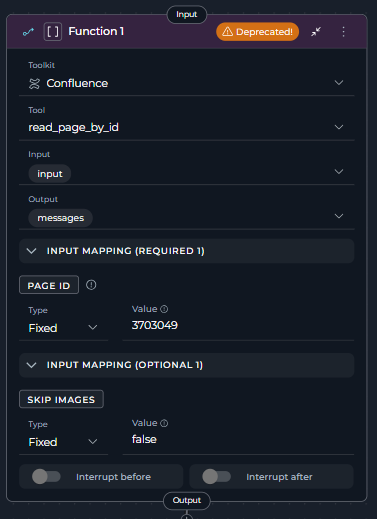
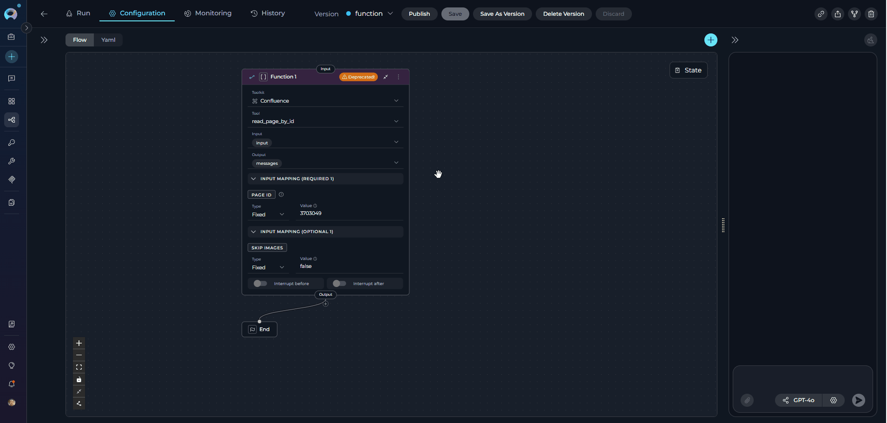
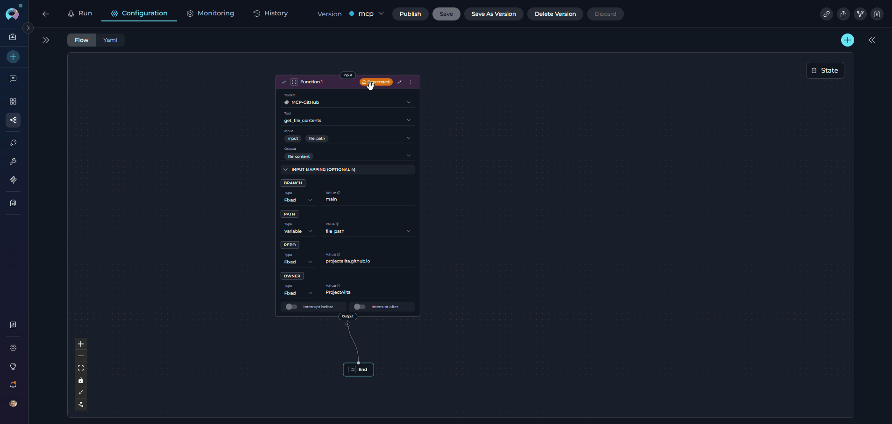

# Migrating from Function Node to Toolkit/MCP/Agent Nodes

## Overview

The **Function Node** has been deprecated and is no longer available for creation in new pipelines starting from **version 2.0.0 B2**. While existing Function nodes in your pipelines will continue to function, we strongly recommend migrating to **Toolkit**, **MCP**, or **Agent** nodes to take advantage of improved functionality and ensure long-term compatibility.

!!! warning "Deprecation Notice"
    The Function Node is deprecated starting from release **2.0.1** and will be removed in a future release. Since version **2.0.0 B2**, users can no longer create new Function nodes. Existing Function nodes in your pipelines will continue to function, but they display a **warning icon** with "Deprecated!" text in the node header and show a tooltip when hovered. Plan your migration accordingly.

**What changed:**

* **Function Node** is now deprecated and displays a **warning icon** with "Deprecated!" text in the node header
* Creating new Function nodes is no longer possible through the Add Node menu
* Existing Function nodes continue to function but should be migrated
* **Toolkit Node**, **MCP Node**, and **Agent Node** are the recommended replacements
* Hovering over the warning icon shows a tooltip with migration guidance

### How to Identify Deprecated Function Nodes

Deprecated Function nodes are visually marked in the pipeline editor:

* **Warning Icon**: A yellow/orange warning triangle icon appears in the node header
* **"Deprecated!" Text**: Text next to the icon clearly indicates the deprecation status
* **Tooltip**: Hovering over the warning area shows: *"This node is deprecated and will be removed in a future version. View Migration Guide"* with a link to this guide

{width="250"}

!!! info "No Automatic Migration"
    There is no automatic migration from Function Nodes to Toolkit/MCP/Agent Nodes. You must manually replace Function Nodes in your existing pipelines following the steps in this guide.

**What you need to do:**

* Review pipelines containing Function nodes
* Choose the appropriate replacement: Toolkit, MCP, or Agent node
* Follow migration steps to update your workflow
* Test the migrated pipeline thoroughly

---

**Why This Change Was Made**

The Function Node has been deprecated in favor of more specialized and capable node types:

* **Toolkit Node**: Provides enhanced functionality for executing toolkit tools with structured output support and better configuration options
* **MCP Node**: Dedicated node for Model Context Protocol servers with specialized MCP tool handling
* **Agent Node**: Enables execution of AI agents with task-based instructions and enhanced capabilities

These replacement nodes provide clearer semantics, better maintainability, and enhanced functionality for different execution scenarios.

---

## Migration Options

You have **three** supported replacements, each suited for different use cases:

### Toolkit Node

!!! tip "For Standard Toolkit Operations"
    **Toolkit Node** is the recommended replacement when your Function node executes tools from standard ELITEA toolkits (Jira, GitHub, Confluence, etc.).

**Choose Toolkit when:**

* Your Function node uses tools from ELITEA toolkits
* You need structured output support
* You want enhanced configuration options for toolkit execution
* You're working with external service integrations

**Best for:** External API calls, service integrations, toolkit-based operations

**Key Advantages:**

* Full functionality coverage of deprecated Function Node for toolkits
* Structured output configuration support
* Enhanced input/output mapping capabilities
* Better toolkit tool management

{width="300"}

### MCP Node

!!! tip "For Model Context Protocol Servers"
    **MCP Node** is the recommended replacement when your Function node executes tools from MCP servers.

**Choose MCP when:**

* Your Function node uses MCP server tools
* You're working with Model Context Protocol integrations
* You need MCP-specific tool filtering and configuration
* You want dedicated MCP server support

**Best for:** MCP server integrations, Model Context Protocol operations

**Key Advantages:**

* Dedicated MCP server support
* MCP-specific tool filtering
* Enhanced MCP tool discovery
* Structured output for MCP operations

{width="300"}

### Agent Node

!!! tip "For AI Agent Execution"
    **Agent Node** is the recommended replacement when your Function node's logic can be better expressed as AI agent tasks or when you need intelligent decision-making.

**Choose Agent when:**

* Your Function node's behavior can be delegated to an AI agent
* You need intelligent task execution with natural language instructions
* You want to leverage pre-configured agents with specialized capabilities
* Your workflow requires LLM-based decision making

**Best for:** AI-driven tasks, intelligent workflows, agent orchestration

**Key Advantages:**

* Natural language task instructions
* Access to pre-configured agents
* Enhanced AI capabilities
* Flexible input mapping with task and chat_history support

{width="300"}

---

## Migration Steps: Function → Toolkit

Follow these steps to migrate a Function node that uses toolkit tools to a Toolkit node:

**Step 1: Review the Existing Function Node**

1. Navigate to **Pipelines** in the main menu
2. Open the pipeline containing the Function node
3. Click the **Configuration** tab
4. Select the **Flow** tab to view the pipeline flow diagram
5. Locate the **Function node** - it will display with a **warning icon** and "Deprecated!" text in the node header
6. Click on the Function node to open its configuration panel
7. Review its current configuration:
      * **Toolkit**: Note which toolkit is selected (e.g., "confluence_toolkit")
      * **Tool**: Note which specific tool is selected (e.g., "read_page_by_id")
      * **Input**: Review input state variables
      * **Output**: Review output state variables
      * **Input Mapping**: Document all parameter mappings
      * **Interrupt Settings**: Note any interrupt configurations

{width="300"}

 **Step 2: Add a Toolkit Node**

1. In the same Flow tab, click the **Add Node** button (+ icon)
2. Select **Toolkit** from the node menu under **Execution Nodes**
3. The new Toolkit node will appear on the canvas
4. Position it near the deprecated Function node for easy comparison

 **Step 3: Configure the Toolkit Node**

Configure the Toolkit node with the same toolkit and tool as your Function node:

1. Click on the **Toolkit node** to open its configuration panel
2. Set the **Toolkit** field:
      * Select the same toolkit that was selected in the Function node
      * Example: Select "confluence_toolkit" from the dropdown
3. Set the **Tool** field:
      * After selecting the toolkit, the Tool dropdown will appear
      * Select the same tool that was used in the Function node
      * Example: Select "read_page_by_id"
4. Configure **Input**:
      * Select the same input state variables that were used in the Function node
      * Example: If Function node had `page_id`, `input`, select those same variables
5. Configure **Output**:
      * Select the same output state variables that were used in the Function node
      * Example: If Function node output to `page_content`, `messages`, configure the same
6. Set up **Input Mapping**:
      * Recreate all parameter mappings from the Function node
      * The Input Mapping section displays parameters required by the selected tool
      * For each parameter, configure the same type and value as in the Function node:
        * **Variable**: Direct state reference (e.g., `page_id`)
        * **F-String**: Formatted string with variables (e.g., `Page ID: {confluence_page_id}`)
        * **Fixed**: Static value (e.g., `123456789`)
7. Configure **Structured Output** (if needed):
      * Toolkit nodes support structured output configuration (Function nodes did not)
      * Enable if you want to enforce a specific output schema
8. Configure **Interrupt Settings**:
      * Copy interrupt before/after settings from the Function node
      * Example: Enable "Interrupt after" if it was enabled in the Function node

 **Step 4: Reconnect the Workflow**

1. **Disconnect the incoming connection** to the Function node:
      * Click on the edge connecting to the Function node
      * Press `Delete` or click the remove icon
2. **Connect the Toolkit node**:
      * Drag a connection from the previous node to the Toolkit node's input handle
      * Example: Connect from "Data Input Node" to the new Toolkit node
3. **Connect the Toolkit outputs**:
      * Drag a connection from the Toolkit node's output handle to the next node in the workflow
      * Example: Connect to "Results Processor Node"
4. Verify all connections match the original Function node's flow

**Before Migration:**

Function Node → END
```
state:
  input:
    type: str
  messages:
    type: list
entry_point: Function 1
interrupt_after: []
nodes:
  - id: Function 1
    type: function
    input:
      - input
    input_mapping:
      page_id:
        type: fixed
        value: '3703049'
      skip_images:
        type: fixed
        value: false
    output:
      - messages
    structured_output: false
    tool: read_page_by_id
    toolkit_name: Confluence
    transition: END


```

**After Migration:**

Toolkit Node → END

```
state:
  input:
    type: str
  messages:
    type: list
entry_point: Toolkit 1
interrupt_after: []
nodes:
  - id: Toolkit 1
    type: toolkit
    input:
      - input
    input_mapping:
      page_id:
        type: fixed
        value: '3703049'
      skip_images:
        type: fixed
        value: false
    output:
      - messages
    structured_output: false
    tool: read_page_by_id
    toolkit_name: Confluence
    transition: END

```

**Step 5: Remove the Deprecated Function Node**

1. Click on the **Function node** to select it
2. Click the **Delete** icon (trash can) or press `Delete` key
3. Confirm the deletion
4. The Function node is now removed from the pipeline

 **Step 6: Save and Test**

1. Click **Save** to save the pipeline configuration
2. Navigate to the **Execution** tab
3. Run the pipeline with test inputs
4. Verify that:
      * The Toolkit node executes the same tool as before
      * Input/output handling works correctly
      * All parameter mappings function as expected
      * All workflow connections function properly

{loading=lazy}

---

## Migration Steps: Function → MCP

Follow these steps to migrate a Function node that uses MCP server tools to an MCP node:

**Step 1: Review the Existing Function Node**

1. Navigate to **Pipelines** in the main menu
2. Open the pipeline containing the Function node
3. Click the **Configuration** tab
4. Select the **Flow** tab to view the pipeline flow diagram
5. Locate the **Function node** using an MCP server tool - it will display with a **warning icon** and "Deprecated!" text in the node header
6. Click on the Function node to open its configuration panel
7. Review its current configuration:
      * **Toolkit**: Note which MCP server is selected (e.g., "GitHub MCP")
      * **Tool**: Note which specific MCP tool is selected (e.g., "get_file_contents")
      * **Input**: Review input state variables
      * **Output**: Review output state variables
      * **Input Mapping**: Document all parameter mappings
      * **Interrupt Settings**: Note any interrupt configurations

{width="250"}

 **Step 2: Add an MCP Node**

1. In the same Flow tab, click the **Add Node** button (+ icon)
2. Select **MCP** from the node menu under **Execution Nodes**
3. The new MCP node will appear on the canvas
4. Position it near the deprecated Function node for easy comparison

**Step 3: Configure the MCP Node**

Configure the MCP node with the same MCP server and tool as your Function node:

1. Click on the **MCP node** to open its configuration panel
2. Set the **Toolkit** field:
      * Select the same MCP server that was selected in the Function node
      * MCP servers appear in the toolkit dropdown with "(MCP)" suffix
      * Example: Select "GitHub MCP" from the dropdown
3. Set the **Tool** field:
      * After selecting the MCP server, the Tool dropdown will appear
      * Select the same MCP tool that was used in the Function node
      * Example: Select "get_file_contents" from available MCP tools
4. Configure **Input**:
      * Select the same input state variables that were used in the Function node
      * Example: If Function node had `owner`, `repo`, `path`, select those same variables
5. Configure **Output**:
      * Select the same output state variables that were used in the Function node
      * Example: If Function node output to `file_content`, `messages`, configure the same
6. Set up **Input Mapping**:
      * Recreate all MCP tool parameter mappings from the Function node
      * The Input Mapping section displays MCP tool parameters
      * For each parameter, configure the same type and value as in the Function node:
        * **Variable**: Direct state reference (e.g., `owner`, `repo`, `path`)
        * **F-String**: Formatted string with variables (e.g., `{repo_owner}/{repo_name}`)
        * **Fixed**: Static value (e.g., `ProjectAlita` for owner, `projectalita.github.io` for repo)
7. Configure **Structured Output** (if needed):
      * MCP nodes support structured output configuration (Function nodes did not)
      * Enable if you want to enforce a specific output schema for MCP responses
8. Configure **Interrupt Settings**:
      * Copy interrupt before/after settings from the Function node
      * Example: Enable "Interrupt after" if it was enabled in the Function node

 **Step 4: Reconnect the Workflow**

1. **Disconnect the incoming connection** to the Function node:
      * Click on the edge connecting to the Function node
      * Press `Delete`
2. **Connect the MCP node**:
      * Drag a connection from the previous node to the MCP node's input handle
      * Example: Connect from "Repository Input Node" to the new MCP node
3. **Connect the MCP outputs**:
      * Drag a connection from the MCP node's output handle to the next node in the workflow
      * Example: Connect to "Content Processor Node"
4. Verify all connections match the original Function node's flow

**Before Migration:**

Function Node (MCP) → END
```
state:
  file_content:
    type: str
    value: ''
  file_path:
    type: str
    value: ''
  input:
    type: str
  messages:
    type: list
entry_point: Function 1
interrupt_after: []
nodes:
  - id: Function 1
    type: function
    input:
      - input
      - file_path
    input_mapping:
      branch:
        type: fixed
        value: main
      owner:
        type: fixed
        value: ProjectAlita
      path:
        type: variable
        value: file_path
      repo:
        type: fixed
        value: projectalita.github.io
    output:
      - messages
      - file_content
    structured_output: false
    tool: get_file_contents
    toolkit_name: MCP-GitHub
    transition: END

```

**After Migration:**

MCP Node → END

```
state:
  file_content:
    type: str
    value: ''
  file_path:
    type: str
    value: tests.md
  input:
    type: str
  messages:
    type: list
entry_point: Mcp 1
interrupt_after: []
nodes:
  - id: Mcp 1
    type: mcp
    input:
      - input
    input_mapping:
      branch:
        type: fixed
        value: main
      owner:
        type: fixed
        value: ProjectAlita
      path:
        type: variable
        value: file_path
      repo:
        type: fixed
        value: projectalita.github.io
    output:
      - file_content
      - messages
    structured_output: false
    tool: get_file_contents
    toolkit_name: MCP-GitHub
    transition: END

```

 **Step 5: Remove the Deprecated Function Node**

1. Click on the **Function node** to select it
2. Click the **Delete** icon (trash can) or press `Delete` key
3. Confirm the deletion
4. The Function node is now removed from the pipeline

 **Step 6: Save and Test**

1. Click **Save** to save the pipeline configuration
2. Navigate to the **Execution** tab
3. Run the pipeline with test inputs
4. Verify that:
      * The MCP node executes the same MCP tool as before
      * Input/output handling works correctly
      * All MCP parameter mappings function as expected
      * MCP server connection is maintained
      * All workflow connections function properly

{loading=lazy}

---

## Migration Steps: Function → Agent

Follow these steps to migrate a Function node to an Agent node when the function's logic can be better expressed as an AI agent task:

**Step 1: Analyze Function Logic for Agent Suitability**

1. Navigate to **Pipelines** in the main menu
2. Open the pipeline containing the Function node
3. Click the **Configuration** tab
4. Select the **Flow** tab to view the pipeline flow diagram
5. Analyze the Function node to determine if it's suitable for agent migration:
      * **Good candidates**: Functions that perform complex reasoning, content generation, analysis, or decision-making
      * **Poor candidates**: Simple deterministic tool calls, API operations, or direct data transformations
      * **Example good candidate**: A Function node that processes user stories and generates summaries
      * **Example poor candidate**: A Function node that simply calls `confluence_toolkit.read_page_by_id` with static parameters

**Step 2: Add an Agent Node**

1. In the same Flow tab, click the **Add Node** button (+ icon)
2. Select **Agent** from the node menu under **Interaction Nodes**
3. The new Agent node will appear on the canvas
4. Position it near the deprecated Function node for easy comparison

**Step 3: Configure the Agent Node**

Configure the Agent node to replicate the Function node's behavior using an AI agent:

1. Click on the **Agent node** to open its configuration panel
2. Set the **Agent** field:
      * Select an appropriate agent from the dropdown that can perform the Function node's task
      * Agents must be added to the pipeline first (Configuration > Toolkits > Add Agent)
      * Example: Select "Content Analysis Agent" to replace a content processing Function node
3. Configure **Input**:
      * Select the input states that the agent needs
      * Example: If the Function node used `user_data`, `context`, select those state variables
4. Configure **Output**:
      * Select the output states where agent results should be stored
      * Example: If the Function node output to `processed_result`, configure the same
5. Set up **Input Mapping**:
      * Configure the agent task and parameters to replicate Function behavior
      * **Common Agent Parameters:**
        * **task**: The main instruction/prompt for the agent
        * **chat_history**: Conversation history (messages array)
        * **Custom Variables**: Agent-specific parameters
      * **Example Task Mapping:**
        ```yaml
        task: |
          Analyze the following user data and provide insights:
          
          User Data: {input.user_data}
          Context: {input.context_info}
          
          Perform the same analysis that was previously done by the toolkit function.
          Provide:
          1. Key findings from the data
          2. Recommendations based on the analysis
          3. Summary in the same format as before
        ```
      * **Example Chat History Mapping:**
        ```yaml
        chat_history: messages
        ```
6. Configure **Interrupt Settings**:
      * Copy interrupt before/after settings from the Function node
      * Example: Enable "Interrupt after" if it was enabled in the Function node

**Step 4: Reconnect the Workflow**

1. **Disconnect the incoming connection** to the Function node:
      * Click on the edge connecting to the Function node
      * Press `Delete`
2. **Connect the Agent node**:
      * Drag a connection from the previous node to the Agent node's input handle
      * Example: Connect from "Data Input Node" to the new Agent node
3. **Connect the Agent outputs**:
      * Drag a connection from the Agent node's output handle to the next node in the workflow
      * Example: Connect to "Results Processor Node"
4. Verify all connections match the original Function node's flow

**Before Migration:**

```
Data Input Node → Function Node → Results Processor Node
```

**After Migration:**

```
Data Input Node → Agent Node → Results Processor Node
```

**Step 5: Remove the Deprecated Function Node**

1. Click on the **Function node** to select it
2. Click the **Delete** icon (trash can) or press `Delete` key
3. Confirm the deletion
4. The Function node is now removed from the pipeline

**Step 6: Validate and Test**

1. Click **Save** to save the pipeline configuration
2. Navigate to the **Execution** tab
3. Run the pipeline with test inputs
4. Verify that:
      * The Agent node produces equivalent results to the Function node
      * Input/output handling works correctly
      * Task instructions properly guide the agent
      * All workflow connections function properly
5. **Compare outputs**: Ensure agent results match expected Function node behavior
6. **Adjust task instructions**: If results differ, refine the agent task prompt

---

## Best Practices

??? example "Choosing the Right Replacement Node"

    **Use Toolkit Node when:**
    
    * Function node executes standard ELITEA toolkit tools
    * You need deterministic, repeatable tool execution
    * Working with external service integrations (Jira, GitHub, Confluence)
    * Parameter mapping is straightforward and well-defined
    * You want structured output support
    
    **Use MCP Node when:**
    
    * Function node executes Model Context Protocol server tools
    * Working with MCP server integrations
    * You need MCP-specific tool filtering
    * Your workflow requires MCP server connections
    * You want dedicated MCP support
    
    **Use Agent Node when:**
    
    * Function node's logic involves reasoning or analysis
    * Task can be expressed as natural language instructions
    * You need LLM-based decision making
    * Working with content generation or complex processing
    * You want to leverage pre-configured AI agents

??? example "General Migration Tips"

    * **Migrate One at a Time**: Update and test one Function node before moving to the next
    * **Keep Both Temporarily**: Test the new node before removing the deprecated Function node
    * **Document Changes**: Note any differences in behavior for your team
    * **Review Connections**: Ensure all incoming and outgoing connections are preserved
    * **Use YAML View**: Check the YAML tab to verify configuration correctness
    * **Test Thoroughly**: Always test migrated pipelines with various inputs to ensure correct behavior
    * **Version Control Migration**: After migrating, save as a new version, test all flows, then update the main (latest) version

??? example "Configuration Best Practices"

    **For Toolkit/MCP Nodes:**
    
    * **Map All Required Parameters**: Ensure all required parameters from the Function node are mapped
    * **Preserve Parameter Types**: Use the same type (Variable, F-String, Fixed) as in the Function node
    * **Enable Structured Output**: Take advantage of structured output support when needed
    * **Verify Tool Selection**: Double-check that the correct toolkit and tool are selected
    
    **For Agent Nodes:**
    
    * **Write Clear Task Instructions**: Provide detailed, unambiguous task descriptions
    * **Include Context**: Pass relevant context through chat_history or task parameters
    * **Test Task Prompts**: Verify agent task instructions produce expected results
    * **Map Custom Variables**: Configure any agent-specific custom variables appropriately
    
    **Example Best Practice:**
    
    ```yaml
    # Toolkit Node - Good Practice
    ✔️ Good: Complete parameter mapping
      toolkit: confluence_toolkit
      tool: read_page_by_id
      input_mapping:
        page_id:
          type: variable
          value: confluence_page_id
        expand:
          type: fstring
          value: "body.storage,version"
        status:
          type: fixed
          value: current
    
    # Toolkit Node - Poor Practice
    ✘ Avoid: Missing required parameters
      toolkit: confluence_toolkit
      tool: read_page_by_id
      input_mapping:
        # Missing page_id - will cause errors
        expand:
          type: fixed
          value: body.storage
    ```

---

## Troubleshooting

??? example "Toolkit/MCP Node Issues"

    **Problem**: Toolkit/MCP node doesn't execute the expected tool
    
    **Solutions**:
    
    * Verify the selected toolkit/MCP server matches the one from the Function node
    * Check that the tool selection is correct
    * Ensure input/output state configurations are correct
    * Verify all required parameters are mapped in Input Mapping
    * Review YAML configuration for syntax errors
    
    **Example Error:**
    
    ```
    Error: Tool 'read_page_by_id' not found in toolkit 'confluence_toolkit'
    Solution: Ensure the toolkit name and tool name are correct. Check that the toolkit is properly configured and the tool exists.
    ```
    
    **Problem**: Input Mapping parameters are missing or incorrect
    
    **Solutions**:
    
    * Review the Function node's original input mapping configuration
    * Verify all required parameters are mapped
    * Check that parameter types (Variable, F-String, Fixed) are appropriate
    * Ensure state variables referenced in mappings exist
    * Test with simplified mappings first, then add complexity
    
    **Example Error:**
    
    ```
    Error: Missing required parameter 'page_id' for tool execution
    Solution: Add input mapping: 
      page_id:
        type: variable
        value: confluence_page_id
    ```
    
    **Problem**: Structured output configuration causes errors
    
    **Solutions**:
    
    * Verify structured output schema is valid
    * Check that output state variables can accommodate the structured format
    * Test without structured output first, then add it incrementally
    * Review schema format and requirements

??? example "Agent Node Issues"

    **Problem**: Agent node doesn't produce expected results
    
    **Solutions**:
    
    * Review and refine the task instructions
    * Ensure task description is clear and detailed
    * Verify the selected agent has appropriate capabilities
    * Check that input parameters (task, chat_history) are correctly mapped
    * Test agent separately to verify its behavior
    
    **Example Error:**
    
    ```
    Error: Agent produces incorrect output format
    Solution: Refine task instructions to specify exact output format:
      task: |
        Analyze the data and provide results in this exact format:
        1. Key Findings: [list]
        2. Recommendations: [list]
        3. Summary: [paragraph]
    ```
    
    **Problem**: Agent task field is empty or not configured
    
    **Solutions**:
    
    * Ensure the task parameter is configured in Input Mapping
    * Provide a clear, descriptive task instruction
    * Use F-String format to include dynamic context: `task: "Process {input.data_type} data"`
    * Verify task instructions guide the agent to replicate Function node behavior

??? example "Connection Issues"

    **Problem**: Connections are lost after migration
    
    **Solutions**:
    
    * Manually reconnect nodes after adding the replacement node
    * Verify each handle connects to the correct target
    * Check that incoming connection to the new node is established
    * Save pipeline after verifying all connections
    * Use YAML view to confirm connections are properly configured
    
    !!! warning "Known Limitation"
        When replacing nodes that are followed by Decision, Condition, or Router nodes, connections may be lost. Document connections before migration (screenshots or YAML backup), then manually reconnect after replacement.

??? example "State Variable Issues"

    **Problem**: State variables not accessible in new node
    
    **Solutions**:
    
    * Verify input state variables are defined in pipeline state
    * Check that state variable names match exactly
    * Ensure state variables are populated before the node executes
    * Review state configuration in YAML view

---

## Comparison Table

| Feature | Function Node | Toolkit Node | MCP Node | Agent Node |
|---------|---------------|--------------|----------|------------|
| **Status** | Deprecated (still works) | Active | Active | Active |
| **Can Create New** | No (since v2.0.0 B2) | Yes | Yes | Yes |
| **Primary Use Case** | Toolkit/MCP tool execution | Toolkit tool execution | MCP server tool execution | AI agent task execution |
| **Structured Output** | Not supported | Supported | Supported | Via agent configuration |
| **Input Mapping** | Basic | Enhanced | Enhanced | Enhanced (task-based) |
| **Tool Selection** | Toolkit + MCP | Toolkit only | MCP only | Agent selection |
| **Best For** | Legacy pipelines only | Service integrations, API calls | MCP server operations | AI-driven tasks, reasoning |
| **Recommended** | No - migrate away | Yes - for toolkit operations | Yes - for MCP operations | Yes - for agent tasks |

---

## Related Documentation

!!! info "Additional Resources"
    * **[Toolkit Node](../../how-tos/pipelines/nodes/execution-nodes.md#toolkit-node)** - Detailed Toolkit node documentation
    * **[MCP Node](../../how-tos/pipelines/nodes/execution-nodes.md#mcp-node)** - Model Context Protocol node documentation
    * **[Agent Node](../../how-tos/pipelines/nodes/interaction-nodes.md#agent-node)** - Agent node documentation
    * **[Pipeline States](../../how-tos/pipelines/states.md)** - Understanding state variables used in pipelines
    * **[Node Connectors](../../how-tos/pipelines/nodes-connectors.md)** - How to connect nodes in pipelines
    * **[YAML Configuration](../../how-tos/pipelines/yaml.md)** - Complete YAML syntax reference
    * **[Flow Editor](../../how-tos/pipelines/flow-editor.md)** - Visual pipeline editing interface
