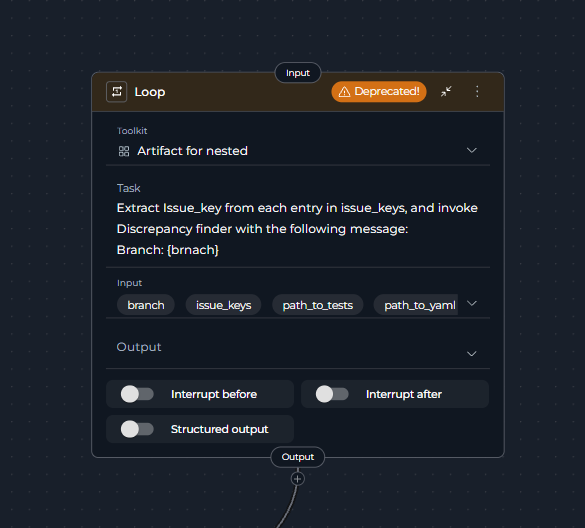
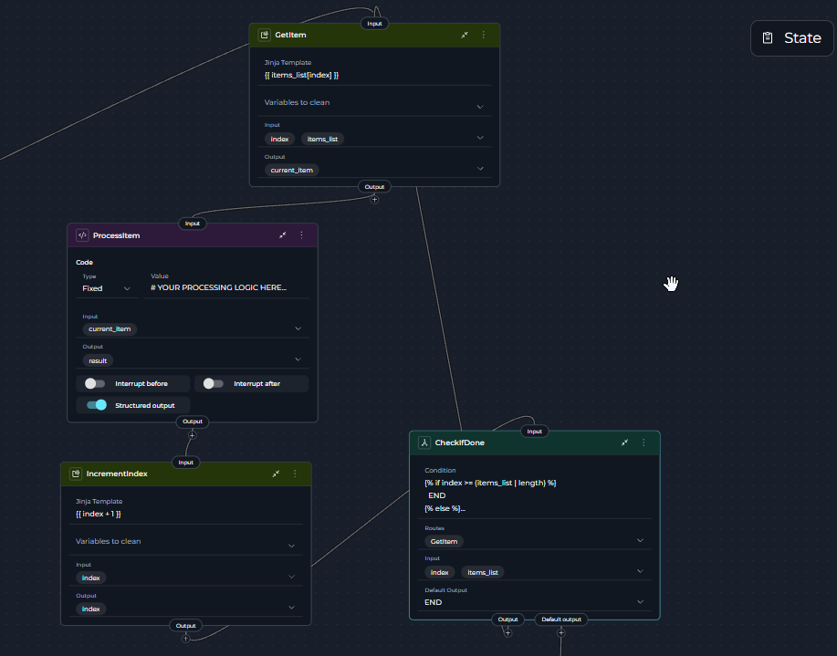
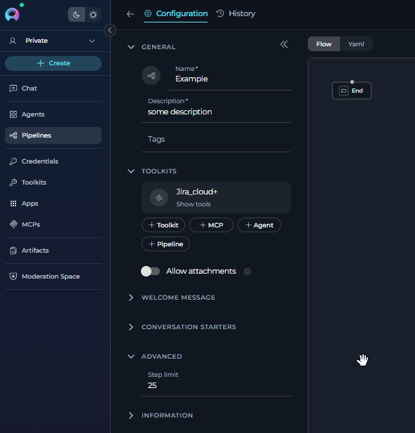
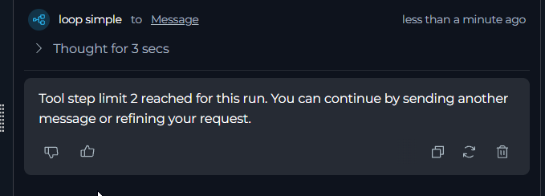

# Loop Node Deprecation and Migration Guide

## Overview

The **Loop node** has been deprecated as of version **2.0.0 B2** and is no longer available for creating new pipelines. This node previously allowed automatic iteration over data batches using a function (toolkit) or Agent within a single node configuration.

This guide will help you migrate your existing pipelines from the deprecated Loop node to **manual loop patterns** using Router, State Modifier, and Code nodes.

!!! warning "Deprecation Timeline"
    - **Version 2.0.0 B2**: Loop node officially deprecated
    - **Future versions**: Loop node may be removed entirely
    - **Existing pipelines**: Loop nodes will continue to function for backward compatibility in version Version 2.0.0 B2

!!! danger "Step Limit Warning"
    **All agents and pipelines have a step limit (default: 25)** to prevent endless loops.
    
    When implementing manual loops, you MUST:
    
    - Increase the step limit to match your expected iterations
    - Set it close to real-world values (not excessively high)
    - Test with small data sets first
    
    **Why this matters:**
    
    - Mistakes in logic or prompts can cause endless loops
    - Endless loops waste tokens and increase costs
    - Can create unwanted records or cause data loss in external systems (Confluence, JIRA, etc.)
    - Pipeline will error with "Step limit reached" if exceeded

## Why Was the Loop Node Deprecated?

The Loop node has been deprecated to simplify the pipeline architecture and provide more explicit control over iteration logic:

- **More explicit control**: Manual loop patterns make iteration logic visible and debuggable
- **Better flexibility**: You can customize loop behavior, exit conditions, and error handling
- **Clearer data flow**: Pipeline visualization shows exact execution paths
- **Reduced complexity**: Eliminates hidden batching and execution logic

## Understanding Loop Node Functionality

The **Loop node** automatically:

1. Accepted a prompt that generated a list of data batches
2. Executed a function (toolkit) or Agent for each item in the list
3. Aggregated results automatically
4. Handled iteration control internally



## Migration Strategy: Manual Loop Pattern

Replace Loop nodes with an explicit loop pattern using these components:

### Core Pattern Components

1. **Code Node,  LLM Node or any other group of nodes**: Initialize the list/batch of items to process
2. **State Modifier Node**: Extract current item and increment index
3. **Router Node**: Check exit condition and control loop flow
4. **Execution Node**: Process the current item (Toolkit, LLM, Agent, or Code)
5. **State Modifier Node** (optional): Aggregate results

### Manual Loop Flow

```
Initialize Data → Get Item → Process Item → Aggregate Result → Increment Index → Check Exit → [Loop Back or END]
```


!!! note "ELITEA Vision: Explicit Over Implicit"
    Manual loop patterns provide better observability, debugging capabilities, and control. While they require more nodes, they make your pipeline logic transparent and maintainable.


## Migration Examples

### Example 1: Simple Loop Pattern (Reading and Processing List Items)

This simplified example shows the basic loop structure. Each node is shown as a placeholder to help you understand the pattern.

**Use Case**: Process a list of items one by one

**Pattern**: Initialize → Get Item → Process Item → Increment → Check → [Loop Back or END]

#### Simplified Pipeline YAML

```yaml
state:
  input:
    type: str
  messages:
    type: list
  items_list:
    type: list
    value: []  # Will hold: ["Item 1", "Item 2", "Item 3"]
  index:
    type: number
    value: 0
  input:
    type: str
  items_list:
    type: list
    value: []
  messages:
    type: list
  result:
    type: str
    value: ''

entry_point: InitializeList
nodes:
  - id: InitializeList
    type: code
    code:
      type: fixed
      value: |-
        # Create a simple list of items
        items = ["Item 1", "Item 2", "Item 3"]

        result = {
            "items_list": items,
            "index": 0
        }
        result
    output:
      - items_list
      - index
    structured_output: true
    transition: GetItem
  - id: GetItem
    type: state_modifier
    input:
      - items_list
      - index
    output:
      - current_item
    template: '{{ items_list[index] }}'
    transition: ProcessItem
  - id: ProcessItem
    type: code
    code:
      type: fixed
      value: |-
        # YOUR PROCESSING LOGIC HERE
        # Example: call a toolkit, use LLM, transform data, etc.
        current = alita_state.get('current_item', '')
        result = {"result": f"Processed: {current}"}
        result
    input:
      - current_item
    output:
      - result
    structured_output: true
    transition: IncrementIndex
  - id: IncrementIndex
    type: state_modifier
    input:
      - index
    output:
      - index
    template: '{{ index + 1 }}'
    transition: CheckIfDone
  - id: CheckIfDone
    type: router
    condition: |-
      
        END
      
        GetItem
      
    default_output: END
    input:
      - index
      - items_list
    routes:
      - GetItem
```

#### Flow Explanation

1. **InitializeList** (Code Node): Creates a list with 3 items and sets index to 0
2. **GetItem** (State Modifier): Extracts the current item using the index (`items_list[0]`, then `items_list[1]`, etc.)
3. **ProcessItem** (Code Node): **[Replace this with your processing logic]** - could be toolkit, LLM, or any operation
4. **IncrementIndex** (State Modifier): Adds 1 to index (0 → 1 → 2 → 3)
5. **CheckIfDone** (Router): Checks if `index >= 3` (list length)
   - If NO: Goes back to **GetItem** (loop continues)
   - If YES: Goes to **END** (loop exits)

**Visual Loop Flow:**

```
InitializeList → GetItem → ProcessItem → IncrementIndex → CheckIfDone
  (index=0)        ↑            |              |               |
                   |            ↓              ↓               ↓
                   └────────[Loop Back]───────────────[If index < length]
                                                       |
                                                    [If index >= length]
                                                       ↓
                                                      END
```



!!! tip "Customizing the Loop"
    Replace the **ProcessItem** node with your actual processing logic:
    
    - **Toolkit Node**: To call external services (Confluence, JIRA, etc.)
    - **LLM Node**: To process items with AI
    - **Agent Node**: To use AI agents
    - **Code Node**: For custom Python logic

---

### Example 2: Writing Data to External Resource (Creating Multiple Confluence Pages)

This example shows how to create multiple items in an external system (Confluence pages).

**Use Case**: Create several documentation pages in Confluence from a list of topics

**Pattern**: Initialize Topics → Get Topic → Create Page → Increment → Check → [Loop Back or END]

#### Pipeline YAML

```yaml
state:
  input:
    type: str
  messages:
    type: list
  index:
    type: number
    value: 0
  topics_list:
    type: list
    value: []
  current_topic:
    type: str
    value: ''
  page_id:
    type: str
    value: ''

entry_point: InitializeTopics

nodes:
  # Step 1: Create list of topics
  - id: InitializeTopics
    type: code
    code:
      type: fixed
      value: |-
        topics = [
            {"title": "Getting Started", "space": "DOCS"},
            {"title": "API Reference", "space": "DOCS"},
            {"title": "Troubleshooting", "space": "DOCS"}
        ]
        
        result = {"topics_list": topics, "index": 0}
        result
    output:
      - topics_list
      - index
    structured_output: true
    transition: GetTopic

  # Step 2: Get current topic
  - id: GetTopic
    type: state_modifier
    input:
      - topics_list
      - index
    output:
      - current_topic
    template: '{{ topics_list[index] }}'
    transition: CreatePage

  # Step 3: Create Confluence page (placeholder - replace with your toolkit)
  - id: CreatePage
    type: code
    code:
      type: fixed
      value: |-
        # REPLACE WITH TOOLKIT NODE FOR CONFLUENCE
        # Example: Use Confluence toolkit's create_page tool
        result = {"page_id": page_id}
        result
    input:
      - current_topic
    output:
      - page_id
    structured_output: true
    transition: IncrementIndex

  # Step 4: Increment counter
  - id: IncrementIndex
    type: state_modifier
    input:
      - index
    output:
      - index
    template: '{{ index + 1 }}'
    transition: CheckIfDone

  # Step 5: Check if all topics processed
  - id: CheckIfDone
    type: router
    condition: |-
      
        END
      
        GetTopic
      
    default_output: END
    input:
      - index
      - topics_list
    routes:
      - GetTopic
```

#### Flow Explanation

1. **InitializeTopics**: Creates list of 3 topics to create pages for
2. **GetTopic**: Gets current topic from list using index
3. **CreatePage**: **[Replace with Confluence Toolkit]** - Creates the page
4. **IncrementIndex**: Moves to next topic
5. **CheckIfDone**: Checks if all topics processed → loops back or ends


!!! tip "Using Real Toolkit"
    Replace the **CreatePage** Code node with a Toolkit node:
    ```yaml
    - id: CreatePage
      type: toolkit
      toolkit_name: Confluence
      tool: create_page
      input_mapping:
        space_key:
          type: fstring
          value: '{current_topic["space"]}'
        title:
          type: fstring
          value: '{current_topic["title"]}'
        body:
          type: fixed
          value: 'Page content here'
    ```

---
      - current_topic
      - page_id
    output:
      - creation_results
    structured_output: true
    transition: IncrementIndex

  # Step 6: Increment index
  - id: IncrementIndex
    type: state_modifier
    input:
      - index
    output:
      - index
    template: '{{ index + 1 }}'
    transition: CheckExit

  # Step 7: Check if more topics to process
  - id: CheckExit
    type: router
    condition: |-
      
        GenerateReport
      
        GetNextTopic
      
    default_output: GenerateReport
    input:
      - index
      - topics_list
    routes:
      - GetNextTopic
      - GenerateReport

  # Step 8a: Get next topic (loop back)
  - id: GetNextTopic
    type: state_modifier
    input:
      - topics_list
      - index
    output:
      - current_topic
    template: '{{ topics_list[index] }}'
    transition: GenerateContent

  # Step 9: Generate final report
  - id: GenerateReport
    type: state_modifier
    input:
      - creation_results
    output:
      - messages
    template: |-
      # Confluence Pages Creation Report
      
      Successfully created {{ creation_results | length }} pages:
      
      
      - {{ result.title }} (ID: {{ result.page_id }})
      
    transition: END
```

#### Flow Explanation

1. **InitializeTopics** (Code Node): Creates list of topics with Confluence metadata
2. **GenerateContent** (LLM): Generates documentation content for current topic
3. **ExtractContent** (State Modifier): Extracts content from LLM response
4. **CreateConfluencePage** (Toolkit): Creates page in Confluence
5. **TrackResult** (Code Node): Records creation result with page ID
6. **IncrementIndex** (State Modifier): Moves to next topic
7. **CheckExit** (Router): Checks if all topics processed → continues or exits
8. **GetNextTopic** (State Modifier): Gets next topic from list (loop back to step 2)
9. **GenerateReport** (State Modifier): Creates summary of all created pages


---

## Configuring Step Limit for Loops

### What is Step Limit?

Every agent and pipeline has a **step limit** that controls the maximum number of execution steps allowed. The default value is **25 steps**.



### Why Step Limit Exists

Step limits prevent endless loops that can:

- **Waste tokens**: Endless loops consume API tokens continuously
- **Increase costs**: More tokens = higher costs
- **Cause data issues**: May create duplicate records in Confluence, JIRA, or other systems
- **Lose data**: Failed loops may partially complete, leaving inconsistent state

### How to Set Step Limit

**For Agents:**

1. Open your Agent configuration
2. Scroll to **Advanced** section
3. Set **Step limit** to your expected number of iterations + buffer

**For Pipelines:**

1. Open your Pipeline in Flow Editor
2. Go to **Advanced Settings**
3. Set **Step limit** to your expected loop iterations + overhead

### Calculating Step Limit

**Formula:**

```
Step Limit = (Number of Items × Steps per Iteration) + Overhead + Safety Buffer
```

**Example 1: Simple Loop (3 items)**

- Items to process: 3
- Steps per iteration: 4 (GetItem → Process → Increment → Check)
- Overhead: 1 (Initialize)
- Safety buffer: 5
- **Total: 3 × 4 + 1 + 5 = 18**

**Example 2: Complex Loop (10 items)**

- Items to process: 10  
- Steps per iteration: 6 (GetItem → Process → Aggregate → Increment → Check → ExtractData)
- Overhead: 2 (Initialize + Finalize)
- Safety buffer: 10
- **Total: 10 × 6 + 2 + 10 = 72**

!!! tip "Best Practices for Step Limits"
    - **Start conservative**: Set limit close to calculated value, not excessively high
    - **Add buffer**: Always add 20-30% buffer for unexpected iterations
    - **Test first**: Run with 2-3 items before full dataset
    - **Monitor execution**: Check how many steps actually used
    - **Avoid large values**: Don't set to 1000 "just in case" - this hides errors

### Step Limit Error

If your pipeline exceeds the step limit, you'll see:

```
Error: Step limit reached (25 steps)
Pipeline execution stopped to prevent endless loop
```


**What to do:**

1. Check if loop logic is correct (Router condition, increment, etc.)
2. Verify you're not in an endless loop
3. If loop is correct, increase step limit appropriately
4. Re-run the pipeline

### When to Use LLM Instead of Loops

For **small iterations** (5-10 items or less), consider using an **LLM node or Agent** instead of manual loops:

**Use LLM/Agent when:**

- Processing fewer than 10 items
- Items can be processed in a single prompt
- You need intelligent interpretation of results
- Data fits within token limits

**Example:**

```yaml
- id: ProcessAllItems
  type: llm
  input_mapping:
    system:
      type: fixed
      value: |
        Process the following list of items and return results for each:
        {items_list}
    task:
      type: variable  
      value: items_list
```

**Benefits:**

- ✔️ Simpler pipeline (no loop logic needed)
- ✔️ Fewer steps (stays within default 25 limit)
- ✔️ LLM can process batch intelligently
- ✘ Limited by token context window
- ✘ All items must fit in one prompt

---

## Step-by-Step Migration Guide

### Step 1: Identify Your Loop Requirements

Answer these questions about your existing Loop node:

1. What list of items needs processing?
2. What should happen to each item?
3. Do you need to save results?

### Step 2: Build the Loop Pattern

Use the simple pattern from Example 1:

1. **Initialize**: Create your list
2. **Get Item**: Extract current item
3. **Process**: Do something with the item
4. **Increment**: Move to next item
5. **Check**: Are we done? If no, loop back

### Step 3: Test Your Loop

1. Start with just 2-3 items
2. Run the pipeline
3. Check that all items were processed
4. Verify results are correct

---

## Common Loop Patterns


### Pattern 1: Process Each Item

Simply process items without saving results.

**Example**: Send notifications, update records

```
Initialize → Get Item → Process → Increment → Check → [Loop or END]
```

### Pattern 2: Collect Results

Process items and save all results.

**Example**: Generate reports, validate data

```
Initialize → Get Item → Process → Save Result → Increment → Check → [Loop or Summary]
```

---

## Troubleshooting


### Error: Step Limit Reached

**Problem**: Pipeline stops with "Step limit reached (25 steps)" error

**Solution**:

1. **Check if endless loop**: Review Router condition and increment logic
2. **Calculate required steps**: Count items × steps per iteration
3. **Increase step limit**: Go to Advanced settings and increase the value
4. **Add safety buffer**: Set limit 20-30% higher than calculated
5. **Test with small data**: Verify loop works with 2-3 items first

**Example:** If processing 10 items with 5 steps each = 50 steps needed → Set limit to 65-70

### Loop Never Stops

**Problem**: Pipeline keeps running forever

**Solution**:

- Check that index increases each time (Step 4: Increment)
- Verify Router condition: ``
- Add safety limit: ``

### Error: List Index Out of Range

**Problem**: Can't access item at index

**Solution**:

- Start index at `0`, not `1`
- Make sure list has items before accessing
- Check Router exits before invalid index

### Only Last Result Shows

**Problem**: Previous results disappear

**Solution**:

- Initialize result variable as empty: `value: ''` or `value: []`
- Use correct template: `{{ existing + new }}` (not just `{{ new }}`)

---

## Frequently Asked Questions

### Why was the Loop node removed?

Loop nodes hid too much complexity. Manual loops make it clear what's happening at each step, making pipelines easier to understand and fix.

### Can I still use my old pipelines?

Yes. Existing Loop nodes will keep working. But we recommend updating to the new pattern for better control and future compatibility.

### What is the step limit and why does it matter?

Every pipeline has a **step limit (default: 25)** to prevent endless loops. When creating loops:

- You must increase the step limit to match your iterations
- Calculate: (items × steps per item) + overhead + buffer
- Set it close to real values - don't use 1000 "just in case"
- Mistakes in loop logic can cause endless loops that waste tokens and may corrupt external data

### Should I use a loop or an LLM for small datasets?

**For 5-10 items or less**, consider using an **LLM node or Agent** instead:

- Simpler pipeline (no loop needed)
- Stays within default 25 step limit  
- LLM can process batch in one call
- Example: "Process these 5 items and return results" as a single LLM prompt

**For more than 10 items**, use manual loop pattern with increased step limit.

### Which node creates the list?

- **Code Node**: When reading files, calling APIs, or transforming data
- **LLM Node**: When AI needs to generate the list

### Can I stop the loop early?

Yes. Add a condition to your Router:

```yaml
- id: CheckIfDone
  type: router
  condition: |-
    
      END
    
      GetItem
    
```

### How do I handle errors?

Wrap processing in try/catch using Code node:

```yaml
- id: ProcessItem
  type: code
  code:
    value: |-
      try:
          # Your logic here
          result = {"success": True}
      except Exception as e:
          result = {"success": False, "error": str(e)}
      result
```

### Where can I learn more?

- **Router Node**: [Router Documentation](../../how-tos/pipelines/nodes/control-flow-nodes.md#router-node)
- **State Modifier**: [State Modifier Documentation](../../how-tos/pipelines/nodes/utility-nodes.md#state-modifier-node)
- **Code Node**: [Code Node Documentation](../../how-tos/pipelines/nodes/execution-nodes.md#code-node)
- **All Nodes**: [Nodes Overview](../../how-tos/pipelines/nodes/overview.md)