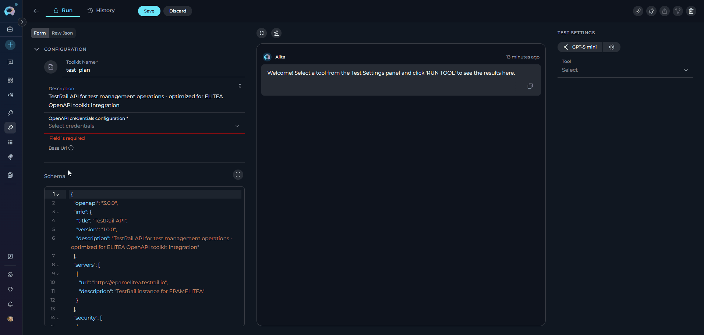

# Migration Guide: Existing OpenAPI Toolkits to v2.0.0 B2

!!! warning "Action Required"
    Starting with release 2.0.0 B2, the OpenAPI toolkit now requires explicit credential configuration for all toolkits. Previously configured toolkits must be updated to include credential selection.

## Overview

This guide provides step-by-step instructions for migrating existing OpenAPI toolkits to ELITEA version 2.0.0 B2. This release introduces mandatory credential configuration for all OpenAPI toolkits.

## Breaking Changes

**OpenAPI Toolkit: Required Credentials Configuration**

**Affected Users:** All users with existing OpenAPI toolkits

**What You Need to Do:**

### Step 1: Update Existing OpenAPI Toolkits

1. **Navigate to Toolkits:** Open the sidebar and select **Toolkits**
2. **Open Toolkit:** Click on your existing OpenAPI toolkit - you will see the **OpenAPI credentials configuration** field highlighted
3. **Access Credential Dropdown:** Click on the **OpenAPI credentials configuration** field
4. **Create New Credential:** Click **New OpenAPI credentials** from the dropdown

     - You will be navigated to the credential creation page
     - **Select Type:** OpenAPI Configuration is pre-selected
     - **Configure Authentication:** Select the appropriate authentication method:
       - **For APIs with authentication:** Choose either:
         - **API Key Authentication** (Bearer, Basic, or Custom header)
         - **OAuth 2.0 Authentication** (OAuth flows)
     - **For public APIs without authentication:** Select **Anonymous**
   - **Fill Required Fields:** Complete the authentication configuration based on your selected method
   - **Save Credential:** Click **Save** to create the credential
   - For detailed authentication configuration instructions, see the [OpenAPI Toolkit Guide - Authentication Methods](../../integrations/toolkits/openapi_toolkit.md#authentication-methods-reference)

5. **Navigate Back:** Return to the Toolkit detail page
6. **Refresh Credentials:** Click the **refresh icon** in the **OpenAPI credentials configuration** dropdown to load your newly created credential
7. **Select Credential:** Choose your credential from the dropdown
8. **Save Toolkit:** Click **Save** to update the toolkit

!!! info "Important Notes"
    - Existing OpenAPI toolkits will not function until credentials are configured
    - If your API does not require authentication, you must still create and select an **Anonymous credential**
    - If you already have credentials created, skip step 4 and directly select your credential from the dropdown
    - You can reuse the same credential across multiple toolkits that access the same API

### Step 2: Verify Toolkit Functionality

After updating your toolkits, verify they are working correctly:

1. **Open Toolkit Detail Page:** Navigate to your updated toolkit
2. **Access TOOLS Section:** View the list of available tools
3. **Test a Tool:** Select any tool and use the **TEST SETTINGS** panel to execute a test request
4. **Check Response:** Verify that authentication is working and you receive expected responses

If you encounter authentication errors, review your credential configuration and ensure all required fields are correctly set.

## Need Help?

If you experience issues during migration or have questions about the new credential requirements:

- Review the complete [OpenAPI Toolkit Integration Guide](../../integrations/toolkits/openapi_toolkit.md)
- Check the [Troubleshooting section](../../integrations/toolkits/openapi_toolkit.md#troubleshooting) for common issues
- Contact [ELITEA Support](../../support/contact-support.md) for assistance

!!! info "Related Documentation"
    - [Credentials Management](../../menus/credentials.md)
    - [Secrets Configuration](../../menus/settings/secrets.md)
