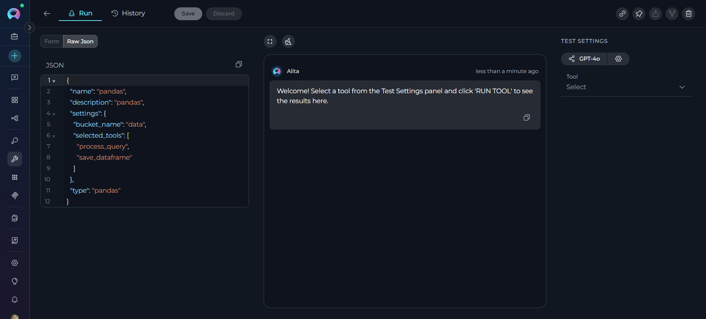
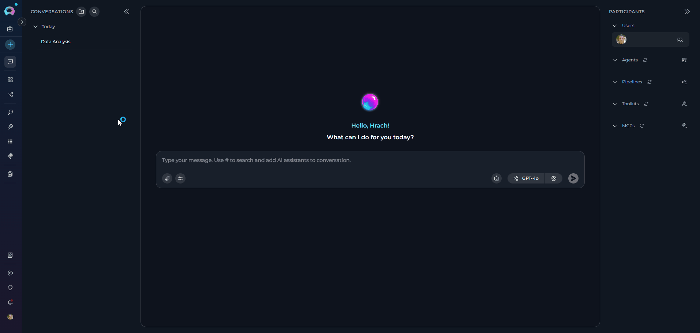
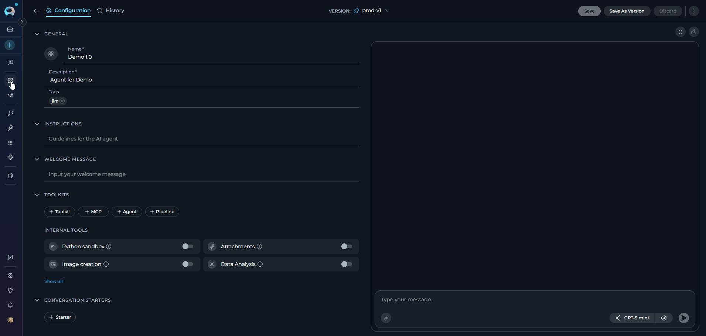

# Migration Guide: Pandas Toolkit to Data Analysis Internal Tool v2.0.0 B2

!!! warning "Action Required"
    Starting with release 2.0.0 B2, existing Pandas toolkits are disabled and no longer functional. Users must migrate to the Data Analysis internal tool available in chat conversations and agents.

## Overview

This guide provides step-by-step instructions for migrating from the deprecated Pandas toolkit to the new Data Analysis internal tool in ELITEA version 2.0.0 B2. The Pandas toolkit has been replaced by a more streamlined internal tool that provides the same data analysis capabilities without requiring separate toolkit configuration.

## Breaking Changes

**Pandas Toolkit Deprecation**

**Affected Users:** All users with existing Pandas toolkits configured in agents

**What Changed:**

- Existing Pandas toolkits are disabled and will not function



- The legacy Pandas toolkit has been replaced by the Data Analysis internal tool
- Data Analysis is now available as an internal tool in chat conversations and agent configurations

**Migration Benefits:**

- Simplified setup - no separate toolkit configuration required
- Better integration with conversation workflows
- Enhanced user experience with natural language data analysis
- Automatic file format detection and processing

## Migration Steps

### Step 1: Enable Data Analysis in Chat Conversations

For ad-hoc data analysis in conversations:

1. **Open a Conversation:** Navigate to any chat conversation
2. **Access Internal Tools:** Click the **Internal Tools** icon (value icon) next to the attachment button
3. **Enable Data Analysis:** Find **Data Analysis** in the popup list and toggle it ON
4. **Confirm Enablement:** A success notification will appear: "Internal tools configuration updated"




### Step 2: Enable Data Analysis in Agent Configuration

For agents that previously used Pandas toolkits:

1. **Navigate to Agents:** Open the sidebar and select **Agents**
2. **Select Agent:** Choose the agent that previously used a Pandas toolkit
3. **Access Toolkits Section:** Scroll to the **TOOLKITS** section at the bottom
4. **Enable Data Analysis:** Find the **Data Analysis** switch and toggle it ON
5. **Save Configuration:** Click **Save** at the top of the page




### Step 3: Update Data Analysis Workflows

The Data Analysis internal tool represents a fundamental shift in how data analysis is performed in ELITEA. Instead of requiring separate toolkit creation and configuration, data analysis is now available directly in both chat conversations and agent configurations.

**Previous Workflow (Pandas Toolkit)**

**Required multiple steps:**

1. Create a separate Pandas toolkit in the Toolkits section
2. Configure bucket/file paths and settings
3. Add the toolkit to specific conversations or agent
4. Use technical Pandas syntax in conversations

**Example usage:**
```
Agent with Pandas toolkit: "Analyze sales_data.csv and show summary statistics"
```

**New Workflow (Data Analysis Internal Tool)**

**Direct usage without setup:**

1. Enable Data Analysis in chat conversations or agent configurations (Steps 1-2 above)
2. Upload data files directly to conversations
3. Use natural language queries for analysis

**Example usage in Chat:**
```
Upload sales_data.csv to conversation, then ask:
"Show summary statistics for sales_data.csv and the top 5 rows"
```

**Example usage in Agent:**
```
Agent with Data Analysis enabled: "Analyze the uploaded sales data and create a summary report"
```

**Benefits of the New Approach:**

- **Simplified Setup:** No toolkit creation or configuration required
- **Universal Access:** Available in any conversation or agent with one toggle
- **Natural Interaction:** Use plain English instead of technical commands
- **Dynamic Data:** Work with any uploaded file without pre-configuration
- **Automatic Processing:** File format detection and intelligent analysis

### Step 4: Remove Deprecated Pandas Toolkits

After migrating to Data Analysis:

1. **Navigate to Toolkits:** Open the sidebar and select **Toolkits**
2. **Locate Pandas Toolkits:** Find any existing Pandas toolkits 
3. **Remove Toolkits:** Click the delete/remove option for each Pandas toolkit
4. **Confirm Removal:** Acknowledge that the toolkit will be permanently removed

!!! warning "Cleanup Required"
    Deprecated Pandas toolkits should be removed from agent configurations to avoid confusion. They will not function after 2.0.0 B2.

### Step 5: Test Data Analysis Functionality

Verify the migration was successful:

1. **Upload Test Data:** Upload a small CSV or Excel file to a conversation
2. **Run Analysis:** Ask for basic analysis (e.g., "Show summary statistics for myfile.csv")
3. **Check Results:** Verify that analysis completes and displays correctly
4. **Test Charts:** Request a chart to ensure file generation works (e.g., "Create a bar chart of sales by region")

## Feature Comparison

| Feature | Legacy Pandas Toolkit | Data Analysis Internal Tool |
|---------|----------------------|----------------------------|
| **Setup** | Separate toolkit configuration required | Enable via Internal Tools toggle |
| **File Access** | Configured bucket/file paths | Upload files directly to conversations |
| **Chart Generation** | Manual code required | Automatic with file downloads |
| **Agent Integration** | Complex toolkit setup | Simple toggle in agent config | |

## Support

If you encounter issues during migration:

1. Check the [Data Analysis Troubleshooting](../../how-tos/chat-conversations/data-analysis-internal-tool.md#troubleshooting) section
2. Verify your ELITEA version is 2.0.0 B2 or later
3. [Contact support](../../support/contact-support.md) if issues persist

!!! info "Additional Resources"

    * **[Data Analysis Internal Tool Guide](../../how-tos/chat-conversations/data-analysis-internal-tool.md)** - Complete documentation for the new Data Analysis tool
    * **[Agent Configuration](../../menus/agents.md)** - Setting up agents with internal tools
    * **[Archived Pandas Toolkit Documentation](../../archive/pandas_toolkit.md)** - Legacy documentation (for reference only)


