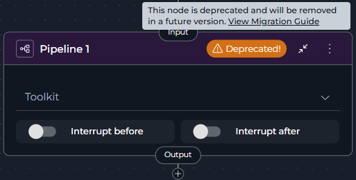
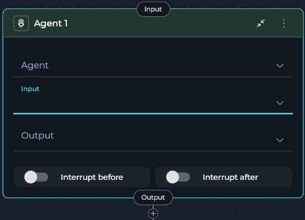
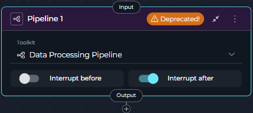
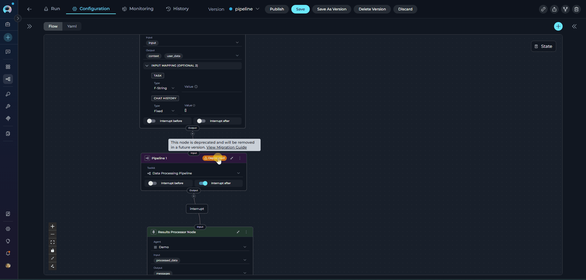

# Migrating from Pipeline Node to Agent Node

## Overview

The **Pipeline Node** has been deprecated and is no longer available for creation in new pipelines. While existing Pipeline nodes in your pipelines will continue to function, we strongly recommend migrating to **Agent** nodes to take advantage of improved functionality and ensure long-term compatibility.

!!! warning "Deprecation Notice"
    The Pipeline Node is deprecated and will be removed in a future release. Existing Pipeline nodes in your pipelines will continue to function, but they display a **warning icon** with "Deprecated!" text in the node header and show a tooltip when hovered. Plan your migration accordingly.

**What changed:**

* **Pipeline Node** is now deprecated and displays a **warning icon** with "Deprecated!" text in the node header
* Creating new Pipeline nodes is no longer possible through the Add Node menu
* Existing Pipeline nodes continue to function but should be migrated
* **Agent Node** is the primary replacement (recommended for all use cases)
* Hovering over the warning icon shows a tooltip with migration guidance

### How to Identify Deprecated Pipeline Nodes

Deprecated Pipeline nodes are visually marked in the pipeline editor:

* **Warning Icon**: A yellow/orange warning triangle icon appears in the node header
* **"Deprecated!" Text**: Text next to the icon clearly indicates the deprecation status
* **Tooltip**: Hovering over the warning area shows: *"This node is deprecated and will be removed in a future version. View Migration Guide"* with a link to this guide



!!! info "No Automatic Migration"
    There is no automatic migration from Pipeline Nodes to Agent Nodes. You must manually replace Pipeline Nodes in your existing pipelines following the steps in this guide.

**What you need to do:**

* Review pipelines containing Pipeline nodes
* Choose the appropriate replacement: Agent node
* Follow migration steps to update your workflow
* Test the migrated pipeline thoroughly

---

## Why This Change Was Made

The Pipeline Node has been deprecated in favor of the more capable and configurable **Agent Node**:

* **Agent Node**: Provides enhanced functionality for executing sub-pipelines and agents with better configuration options, input/output mapping, and parameter handling

These replacement nodes provide clearer semantics, better maintainability, and enhanced functionality for pipeline orchestration scenarios.

---

## Migration Option

You have **one** supported replacement:

### Agent Node

!!! tip "Primary Replacement"
    **Agent Node** is the recommended replacement for all Pipeline Node use cases. It provides enhanced functionality while maintaining the core pipeline execution capabilities.

**Choose Agent when:**

* You have Pipeline nodes that execute sub-pipelines
* You need better control over input/output parameters
* You want enhanced configuration options for pipeline execution
* You're migrating from Pipeline node (Agent provides the direct replacement)

**Best for:** Sub-pipeline execution, agent orchestration, complex workflow management, Pipeline node migration

**Key Advantages:**

* Full functionality coverage of deprecated Pipeline Node
* Enhanced input/output configuration options
* Better parameter mapping capabilities
* Improved pipeline orchestration features



---

## Migration Steps: Pipeline → Agent

Follow these steps to migrate a Pipeline node to an Agent node:

### Step 1: Review the Existing Pipeline Node

1. Navigate to **Pipelines** in the main menu
2. Open the pipeline containing the Pipeline node
3. Click the **Configuration** tab
4. Select the **Flow** tab to view the pipeline flow diagram
5. Locate the **Pipeline node** - it will display with a **warning icon** and "Deprecated!" text in the node header
6. Click on the Pipeline node to open its configuration panel
7. Review its current configuration:
      * **Selected Pipeline**: Note which pipeline is selected (e.g., "Data Processing Pipeline")
      * **Any additional settings**: Review interrupt settings or other configurations



### Step 2: Add an Agent Node

1. In the same Flow tab, click the **Add Node** button (+ icon)
2. Select **Agent** from the node menu
3. The new Agent node will appear on the canvas
4. Position it near the deprecated Pipeline node for easy comparison

### Step 3: Configure the Agent Node

Configure the Agent node with the same pipeline/agent as your Pipeline node:

1. Click on the **Agent node** to open its configuration panel
2. Set the **Agent** field:
      * Select the same pipeline that was selected in the Pipeline node
      * Example: Select "Data Processing Pipeline" from the dropdown
3. Configure **Input**:
      * Select the input states that have been used in the nested pipeline
      * Example: If the nested pipeline expects `user_data` and `context`, select those state variables
4. Configure **Output**:
      * Select the output states that have been used in the nested pipeline
      * Example: If the nested pipeline outputs `processed_data`, select this state variable
5. Set up **Input Mapping** (if needed):
      * **Common Agent Parameters:**
        * **task:** The main instruction/prompt for the agent(e.g., `Analyze the following user data`)
        * **chat_history:** Conversation history (messages array)
6. Configure **Interrupt Settings**:
      * Copy any interrupt or structured output settings from the Pipeline node
      * Example: Enable "Interrupt after" if it was enabled in the Pipeline node

### Step 4: Reconnect the Workflow

1. **Disconnect the incoming connection** to the Pipeline node:
      * Click on the edge connecting to the Pipeline node
      * Press `Delete` 
2. **Connect the Agent node**:
      * Drag a connection from the previous node to the Agent node's input handle
      * Example: Connect from "Data Input Node" to the new Agent node
3. **Connect the Agent outputs**:
      * Drag a connection from the Agent node's output handle to the next node in the workflow
      * Example: Connect to "Results Processor Node"
4. Verify all connections match the original Pipeline node's flow

**Before Migration:**

Data Input Node → Pipeline Node → Results Processor Node

**After Migration:**

Data Input Node → Agent Node → Results Processor Node

### Step 5: Remove the Deprecated Pipeline Node

1. Click on the **Pipeline node** to select it
2. Click the **Delete** icon (trash can) or press `Delete` key
3. Confirm the deletion
4. The Pipeline node is now removed from the pipeline

### Step 6: Save and Test

1. Click **Save** to save the pipeline configuration
2. Navigate to the **Execution** tab
3. Run the pipeline with test inputs
4. Verify that:
      * The Agent node executes the same pipeline/agent as before
      * Input/output handling works correctly
      * All workflow connections function properly

      

---

## Best Practices

### Agent Node Configuration

* **Select Appropriate Agent**: Choose the same pipeline/agent that was used in the Pipeline node
* **Configure Input/Output Properly**: Ensure input sources and output destinations are correctly set
* **Use Input Mapping**: Leverage the enhanced input mapping capabilities for complex parameter handling
* **Test Thoroughly**: Always test migrated pipelines with various inputs to ensure correct behavior
* **Version Control Migration**: After migrating, save as a new version, test all flows, then update the main (latest) version

---

## Troubleshooting

### Agent Node Issues

**Problem**: Agent node doesn't execute the expected pipeline/agent

**Solutions**:

* Verify the selected agent in the Agent node matches the one from the Pipeline node
* Check that input/output state configurations are correct
* Ensure input mapping is properly configured if parameters are required
* Review YAML configuration for syntax errors

**Problem**: Pipeline fails when Agent node executes

**Solutions**:

* Confirm the selected agent exists and is accessible
* Verify input parameters are correctly mapped
* Check that output handling is properly configured
* Review interrupt settings match the original Pipeline node

**Example Error:**
```
Error: Missing required parameter 'data' for agent execution
Solution: Add input mapping: data: input.user_data
```

### Connection Issues

**Problem**: Connections are lost after migration

**Solutions**:

* Manually reconnect nodes after adding the Agent node
* Verify each handle connects to the correct target
* Check that incoming connection to the new node is established
* Save pipeline after verifying all connections

---

## Comparison Table

| Feature | Pipeline Node | Agent Node (Recommended) |
|---------|----------------|--------------------------|
| **Status** | Deprecated (still works) | Active |
| **Can Create New** | No | Yes |
| **Functionality** | Sub-pipeline execution | Enhanced sub-pipeline execution |
| **Configuration** | Pipeline selection | Agent/Pipeline selection, Input/Output, Input Mapping |
| **Parameter Handling** | Limited | Advanced input mapping |
| **Recommended** | No - migrate away | Yes - primary replacement |

---

!!! info "Additional Resources"
    * **[Agent Node](../../how-tos/pipelines/nodes/interaction-nodes.md#agent-node)** - Detailed Agent node documentation
    * **[Pipeline States](../../how-tos/pipelines/states.md)** - Understanding state variables used in pipelines
    * **[Node Connectors](../../how-tos/pipelines/nodes-connectors.md)** - How to connect nodes in pipelines
    * **[YAML Configuration](../../how-tos/pipelines/yaml.md)** - Complete YAML syntax reference
    * **[Flow Editor](../../how-tos/pipelines/flow-editor.md)** - Visual pipeline editing interface 