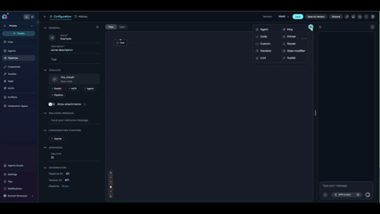
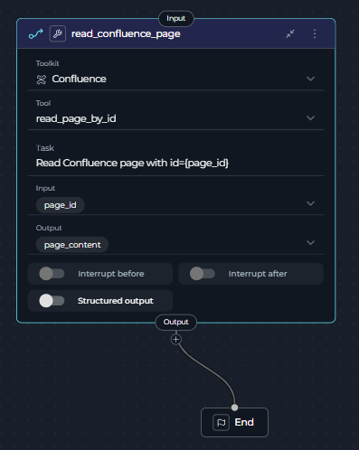
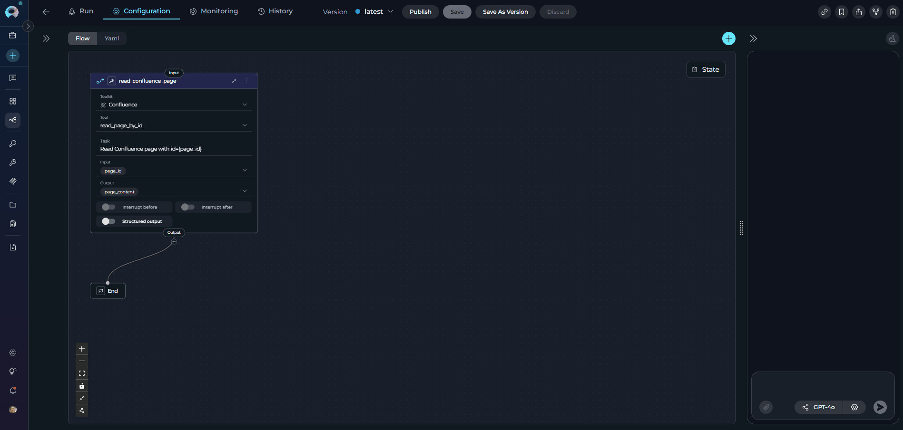

# Tool Node Deprecation and Migration Guide

## Overview

The **Tool node** has been deprecated as of version **2.0.1** and is no longer available for creating new pipelines. Starting with version **2.0.0 B2**, you can no longer add new Tool nodes to your pipelines, although existing Tool nodes will continue to function for backward compatibility.

This guide will help you migrate your existing pipelines from the deprecated Tool node to the **Toolkit node**.

!!! warning "Deprecation Timeline"
    - **Version 2.0.0 B2**: Creation of new Tool nodes disabled
    - **Version 2.0.1**: Tool node officially deprecated
    - **Future versions**: Tool node may be removed entirely

## Why Was the Tool Node Deprecated?

The Tool node has been replaced by the more capable Toolkit node, which provides:

- **Broader functionality**: Support for all toolkit types and capabilities
- **Enhanced filtering**: Better control over which tools are available
- **Structured outputs**: Built-in support for structured output handling
- **Clearer purpose**: More intuitive naming and functionality

## Understanding Tool Node Functionality

The **Tool node** was essentially a **toolkit with an integrated LLM layer**. This meant the LLM automatically handled parameter mapping tasks that you would otherwise need to configure manually.

!!! note "ELITEA Vision: Use LLM Only When Needed"
    Our design philosophy prioritizes using LLM nodes only when necessary. Non-LLM approaches offer better consistency, faster execution, and token efficiency. Use LLM-based solutions when you need dynamic parameter interpretation or natural language processing capabilities.

### Migration Alternatives

You have **two migration strategies** depending on your use case:

#### Option 1: LLM Node with Toolkit (Tool Node Equivalent)

This approach most closely replicates the original Tool node functionality.

**When to use:**

- You need dynamic parameter mapping based on context
- Input configurations vary significantly between executions
- Natural language interpretation is required
- You want LLM to handle the parameter mapping logic

**How it works:**

- Add an **LLM node** to your pipeline
- Attach the corresponding **toolkit** to the LLM node
- The LLM handles parameter mapping automatically (similar to the original Tool node)



**Trade-offs:**

- ✔️ Flexible and context-aware
- ✔️ Handles variable input structures
- ✘ Slower execution due to LLM processing
- ✘ Consumes tokens (cost implications)
- ✘ Less predictable outputs

#### Option 2: Non-LLM Nodes (Recommended for Data Management)

This approach uses deterministic nodes without LLM involvement.

**When to use:**

- Input configurations remain consistent
- You need predictable, repeatable results
- Speed and token efficiency are priorities
- You have technical resources for initial setup

**How it works:**

Combine these node types based on your needs:

1. **Toolkit node**: Execute toolkit functions with explicit parameter mapping
2. **State Modifier node**: Use Jinja2 templating to transform state values (e.g., extract values from JSON)

OR

3. **Code node**: Execute Python code with access to pipeline state and artifacts

**Trade-offs:**

- ✔️ Consistent and predictable results
- ✔️ Faster execution
- ✔️ Token-efficient (no LLM costs)
- ✘ Requires setup and testing
- ✘ Requires technical mindset
- ✘ Less flexible with varying input structures

**Example workflow:**

1. Use **Toolkit node** to read files and save content in pipeline state
2. Use **State Modifier node** with Jinja2 templating to extract or transform values from JSON
3. Use **Code node** to perform complex data processing with Python

!!! warning "Multiple Outputs Limitation"
    **State Modifier can only write to one state variable per node.** If you need to extract or generate multiple output values:
    
    - Use **LLM node with structured output** for AI-generated multi-field responses
    - Use **Code node** for programmatic multi-variable assignments
    - Chain multiple State Modifier nodes (one output per node)

## Migration Path

**There is no automatic migration** for Tool nodes. You must manually replace existing Tool nodes with Toolkit nodes in your pipelines.

### What You Need to Know

- **Manual migration required**: Each Tool node must be replaced manually
- **Configuration transfer**: You'll need to reconfigure toolkit selections and settings
- **No data loss**: Your existing pipelines with Tool nodes will continue to work
- **Future-proofing**: Migrating now ensures compatibility with future releases

## Step-by-Step Migration: Tool Node to Toolkit Node

This guide walks you through migrating a Tool node to a Toolkit node using a **Confluence toolkit** as a practical example.

### Step 1: Identify Tool Nodes in Your Pipeline

1. Open your pipeline in the Flow Editor
2. Look for nodes labeled as "Tool" (they may be marked as deprecated)
3. Note the toolkit and configuration for each Tool node

!!! tip "Finding Tool Nodes"
    Tool nodes are visually similar to Toolkit nodes but are marked as deprecated. Check your pipeline YAML or the node properties panel to confirm the node type.

**Example: Tool Node**

Your original pipeline has a Tool node with this configuration:

```yaml
state:
  input:
    type: str
  messages:
    type: list
  page_content:
    type: str
  page_id:
    type: str
    value: ''
entry_point: read_confluence_page
nodes:
  - id: read_confluence_page
    input:
      - page_id
    output:
      - page_content
    structured_output: false
    task: Read Confluence page with id={page_id}
    tool: read_page_by_id
    toolkit_name: Confluence
    transition: END
    type: tool

```

**Visual Setup:**

- **Node Type**: Tool (deprecated)
- **Toolkit Selected**: Confluence
- **Tool**: read_page_by_id
- **Task**: "Read Confluence page with id={page_id}" (Tool node specific field)
- **Inputs**: page_id
- **Outputs**: page_content



### Step 2: Add a Toolkit Node

1. Click **+ Add Node** in the Flow Editor
2. Select **Toolkit** from the available node types
3. Place the new Toolkit node near the Tool node you're replacing

**Example:**
Add a new Toolkit node next to your existing `read_confluence_page` node in the Flow Editor.

### Step 3: Configure the Toolkit Node

1. **Select the toolkit**:
      - Open the Toolkit node settings
      - Choose the same toolkit that was configured in your Tool node
      - The toolkit filter automatically excludes application-type tools

2. **Set up input mappings**:
      - Transfer the same input mappings from your Tool node
      - Ensure variable names and sources match exactly

3. **Set up structured output** (if needed):
      - The Toolkit node includes structured output support
      - Configure output schema if your workflow requires structured data


!!! note "Key Differences in Toolkit Node"
    - **Task field removed**: The Toolkit node doesn't have a `task` field
    - **Tool field kept**: The `tool` field is explicitly specified (e.g., `read_page_by_id`)
    - **Input mapping added**: The Toolkit node uses `input_mapping` to configure tool parameters:
        - `page_id`: Can use `fstring` type to format the page ID (e.g., `'page id:{page_id}'`)
        - `skip_images`: Boolean flag to skip image processing (set to `false` to include images)
        - Each mapping has a `type` (`fixed`, `fstring`, `from_state`, etc.) and a `value`

### Step 4: Reconnect Edges

1. **Disconnect the Tool node**:
      - Remove incoming edges to the Tool node
      - Remove outgoing edges from the Tool node

2. **Connect the Toolkit node**:
      - Connect the same incoming edges to the Toolkit node
      - Connect the same outgoing edges from the Toolkit node
      - Verify the data flow matches your original pipeline


### Step 5: Update Variable Mappings

1. **Check input mappings**:
      - Verify that variables passed to the Tool node are now mapped to the Toolkit node
      - Update any variable references if node IDs have changed

2. **Check output mappings**:
      - Update any downstream nodes that reference the Tool node's output
      - Change references to point to the Toolkit node's output instead


### Step 6: Remove the Old Tool Node

1. Select the deprecated Tool node
2. Delete the node from your pipeline
3. Verify that no broken edges or references remain

{ loading=lazy }

**Example: Configure Confluence Toolkit Node**

Select "Confluence" from the toolkit dropdown and set up the configuration:

```yaml
state:
  page_id:
    type: str
    value: ''
  page_content:
    type: str
  messages:
    type: list
entry_point: read_confluence_page
nodes:
  - id: read_confluence_page
    type: toolkit
    tool: read_page_by_id
    toolkit_name: Confluence
    input:
      - page_id
    input_mapping:
      page_id:
        type: fstring
        value: 'page id:{page_id}'
      skip_images:
        type: fixed
        value: false
    output:
      - page_content
    structured_output: false
    transition: END
```

**Visual Setup:**

- **Node Type**: Toolkit (current)
- **Toolkit Selected**: Confluence (same toolkit)
- **Tool**: read_page_by_id (now explicitly specified)
- **Inputs**: page_id (same as Tool node)
- **Input Mapping**: Maps page_id using fstring format and sets skip_images to false
- **Outputs**: page_content (same as Tool node)


### Step 7: Test Your Pipeline

1. **Save your changes**
2. **Run the pipeline** to ensure the Toolkit node functions as expected
3. **Verify outputs** match the behavior of the original Tool node
4. **Check error handling** and edge cases

**Example:**

Run the pipeline and verify that:

- The Confluence page is retrieved successfully using the `read_page_by_id` tool
- The page content for page ID `123456` is correctly returned
- The output in `page_content` contains the complete page content
- Downstream nodes receive the expected output

### Migration Summary

**What Stays the Same:**

- ✔️ Toolkit selection 
- ✔️ Input/output configuration
- ✔️ Functionality and behavior
- ✔️ Structured output setting

**What Changes:**

- ✘ Node type (tool → toolkit)
- ✘ Node ID (read_confluence_page remains the same)
- ✘ Task field removed (Toolkit node doesn't have this field)
- ✔️ Tool field kept


## Troubleshooting

### Toolkit Not Showing in Dropdown

**Problem**: The toolkit you were using in the Tool node doesn't appear in the Toolkit node.

**Solution**:

- Verify the toolkit type is not an application-type tool
- Check that the toolkit still exists in your workspace

### Pipeline Execution Fails After Migration

**Problem**: Pipeline runs successfully with Tool node but fails with Toolkit node.

**Solution**:

- Verify all variable mappings are correctly updated
- Check that input/output connections match the original configuration
- Ensure the toolkit name and configuration are identical
- Review any structured output schemas that may need adjustment

### Output Format Changed

**Problem**: The output format from the Toolkit node differs from the Tool node.

**Solution**:

- Check if structured output is enabled in the Toolkit node
- Review the toolkit's output schema configuration
- Adjust downstream nodes to handle the new output format
- Consider using the structured output feature for better data handling

### Input Mapping Configuration Issues

**Problem**: Errors related to input_mapping configuration or variable types.

**Solution**:

- **Understand mapping types**: The Toolkit node uses different type values in `input_mapping`:
      - `Fixed`: Static value that doesn't change (e.g., `value: false` for boolean flags)
      - `F-String`: Format string with variable substitution (e.g., `value: 'page id:{page_id}'`)
      - `Variable`: Reference a variable from the pipeline state (e.g., `value: 'page_id'`)

- **Check variable syntax**: Ensure variables use correct syntax:
      - In `F-String` type: `'text {variable_name}'` (curly braces for substitution)
      - In `Variable` type: `'{variable_name}'` (reference state variable)

- **Verify mapping structure**: Each input_mapping entry needs both `type` and `value` fields
- **Match tool requirements**: Check the tool's documentation for required parameters and their expected formats

!!! info "Additional Resources"
    - [YAML Configuration](../../how-tos/pipelines/yaml.md) - Complete YAML syntax and structure
    - [Pipeline States](../../how-tos/pipelines/states.md) - Working with state variables
    - [Pipeline Overview](../../how-tos/pipelines/overview.md) - Understanding pipeline concepts
    - [Nodes and Connectors](../../how-tos/pipelines/nodes-connectors.md) - Node types and connections
    - [Flow Editor Guide](../../how-tos/pipelines/flow-editor.md) - Visual pipeline editing
    - [Execution Nodes](../../how-tos/pipelines/nodes/execution-nodes.md) - Toolkit and other execution nodes

## Frequently Asked Questions

### How do I get data from toolkit and save it in states?

**Problem:**

The Tool node allowed reading data from different external sources (e.g., JSON files stored in Artifacts) and using those values directly in parameters. With Toolkit nodes, you need to explicitly set parameter values instead of referencing artifact content.

**Example scenario:**

- You have a JSON stored in Artifacts
- You use included pipelines with hierarchical architecture
- Previously, the Tool node could read from artifacts and get values automatically

**Solution:**

**Option A: Use Toolkit + State Modifier Pattern**

1. **Read the JSON file**: Use a **Toolkit node** to read the JSON artifact and save it to pipeline state

2. **Parse and extract values**: Use a **State Modifier node** with Jinja2 templating to extract specific values
   

3. **Use extracted values**: Reference the extracted state variables in downstream Toolkit nodes


**Option B: Use Code Node for Complex Config**

For more complex configuration processing:


**Option C: Use LLM Node (If Dynamic Mapping Needed)**

If your configuration requires interpretation or varies significantly:

- Attach the toolkit to an **LLM node**
- The LLM will handle dynamic parameter mapping from your configuration
- This approach is less efficient but more flexible

!!! tip "Feature Request: Built-in Global Config"
    We are considering implementing global configuration and state as a built-in ELITEA feature. This would simplify hierarchical pipeline architectures and configuration management.

### Which migration approach should I choose?

**Choose LLM Node + Toolkit if:**

- You need the LLM to interpret or map parameters dynamically
- Your input data structure varies between executions
- You're prototyping and need quick setup
- Natural language processing is part of your workflow

**Choose Non-LLM Nodes (Toolkit + State Modifier + Code) if:**

- Your input configuration structure is consistent
- You need maximum speed and reliability
- Token efficiency is important (cost reduction)
- You have technical resources for setup and testing
- You're building production pipelines with data management


### How do I choose between State Modifier and Code node?

**Use State Modifier when:**

- You need simple value extraction from JSON
- String formatting or concatenation is required
- Jinja2 templating can handle your transformation logic
- You want declarative, configuration-based transformations

**Use Code node when:**

- You need complex data processing logic
- Multiple conditional branches are required
- You need to access external libraries
- You require programmatic control over artifacts and state

### Where can I learn more about the alternative nodes?

- **LLM Node**: [LLM Node Documentation](../../how-tos/pipelines/nodes/interaction-nodes.md#llm-node)
- **Toolkit Node**: [Toolkit Node Documentation](../../how-tos/pipelines/nodes/execution-nodes.md#toolkit-node)
- **State Modifier Node**: [State Modifier Node Documentation](../../how-tos/pipelines/nodes/utility-nodes.md#state-modifier-node)
- **Code Node**: [Code Node Documentation](../../how-tos/pipelines/nodes/execution-nodes.md#code-node)
- **Agent Node**: [Agent Node Documentation](../../how-tos/pipelines/nodes/interaction-nodes.md#agent-node)
- **All Node Types**: [Nodes Overview](../../how-tos/pipelines/nodes/overview.md)
- **Pipeline States**: [Working with Pipeline States](../../how-tos/pipelines/states.md)
- **YAML Configuration**: [YAML Configuration Guide](../../how-tos/pipelines/yaml.md)


