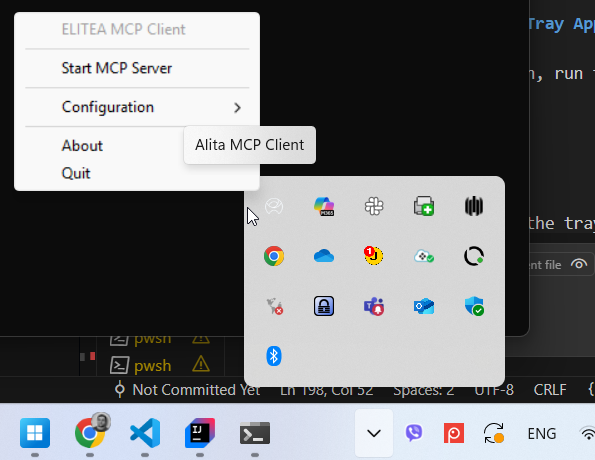

# Configure and Use MCP Servers (Quick Guide)

Get set up in minutes. This guide shows how to configure the Elitea MCP Client, create an MCP in Elitea, and start using it in a conversation (example: Playwright MCP).

---

## Overview

You will:

* Install and start the Elitea MCP Client (macOS or Windows)
* Connect the client to your Private project
* Create an MCP entry in Elitea
* Start a conversation and use your MCP tools (Playwright example)

!!! note "References"
    * MCP Client Setup: [MCP Client Integration Guide](../../integrations/mcp/mcp-client.md)
    * MCPs Menu Overview: [MCPs](../../menus/mcps.md)
    * Chat Basics: [Chat](../../menus/chat.md)

---

## Step 1: Install the Elitea MCP Client

Use the tray app for the simplest experience.

=== "macOS"

**Step 1:** Install pipx and the MCP client:

```bash
brew install pipx
pipx ensurepath
pipx install alita-mcp
```

**Step 2:** Start the tray app:

```bash
alita-mcp tray
```


=== "Windows"

**Step 1:** Install pipx and the MCP client:

```powershell
pip install --user pipx
python -m pipx ensurepath
pipx install alita-mcp
```

**Step 2:** Start the tray app:

```powershell
alita-mcp tray
```



!!! tip "Auto-start on login"
    You can set the tray app to start automatically. See details in the [MCP Client Integration Guide](../../integrations/mcp/mcp-client.md).

---

## Step 2: Configure and Start an MCP Server (Playwright example)

Use your IDE's terminal to run the `alita-mcp bootstrap` command and start your server.

1. Provide:
    * **Deployment URL** (e.g., https://next.elitea.ai)
    * **Authentication Token** (your Personal Access Token)
    * **Project ID** (your Private project)
2. Add an MCP server (example: Playwright):
    * **Type:** stdio
    * **Command:** `npx`
    * **Args:** `@playwright/mcp@latest`
    * **Keep connection alive:** Yes (stateful)
3. Save the configuration.
4. Run the `alita-mcp tray` command.
5. In the tray app, click **Start MCP Server**.


!!! info "No server listed?"
    If you don’t see your server after bootstrap, re-open the tray, or use the CLI `alita-mcp bootstrap` and try again.

---

## Step 3: Switch to Your Private Project in Elitea

1. Open Elitea and sign in.
2. Use the **Project Switcher** (top-left) and select **Private**.


!!! info "First-time users"
    Private project provisioning can take up to 5 minutes.

---

## Step 4: Create the MCP in Elitea (UI)

1. Go to **Menus → MCPs**.
2. Click **+ Create**.
3. If your MCP Client is connected, select the discovered server (e.g., Playwright) or proceed and refresh later.
4. Enter:
    * **Name** (e.g., "Playwright Browser Automation")
    * **Description** (optional)
5. Review the **Tools** list and unselect anything not needed.
6. Click **Save**.


!!! warning "Disconnected state"
    If the MCP shows **Disconnected**, start the tray app and server, then refresh the MCP page.

---

## (Optional) Step 5: Test MCP Tools from the MCP Page

* Open the MCP’s detail page (Menus → MCPs → select your MCP).
* Use **Test Settings** to pick a model, select a tool, provide inputs, and **Run Tool**.
* Review the chat-style output, use fullscreen, and clear results as needed.


---

## Step 6: Start a Conversation Using Your MCP

1. Open **Chat → Conversations**.
2. Click **+ Create** to start a new conversation.
3. In **Participants → MCP**, select the MCP you created (e.g., Playwright).
4. Start chatting and invoke tools naturally.

!!! example "Example prompts with Playwright MCP:"
    1. Navigate to http://localhost:5173/
    2. Switch to Private project
    3. Navigate to Credentials page.
    4. Open the IndexGitHub credential by clicking the card.
    5. Take a screenshot of the page and save it as index-github-credential.png


---


## Quick Troubleshooting

* **Disconnected MCP**: Start the tray app and your server; refresh the MCP page.
* **No tools listed**: Ensure the MCP server is running; revisit or refresh.
* **Tool errors**: Check parameters; retry after restarting the server.
* **Windows PATH issues**: Reopen Terminal/PowerShell after `pipx ensurepath`.

!!! note "More help"
    See the [MCPs menu guide](../../menus/mcps.md) and the full [MCP Client Integration Guide](../../integrations/mcp/mcp-client.md).

---

## Next Steps

* Assign the MCP to an **Agent** or a **Pipeline** to automate workflows.
* Explore additional MCP servers (e.g., GitHub MCP) and enable only the tools you need.
* Keep names clear (e.g., "Playwright (QA)") and monitor connection state.
