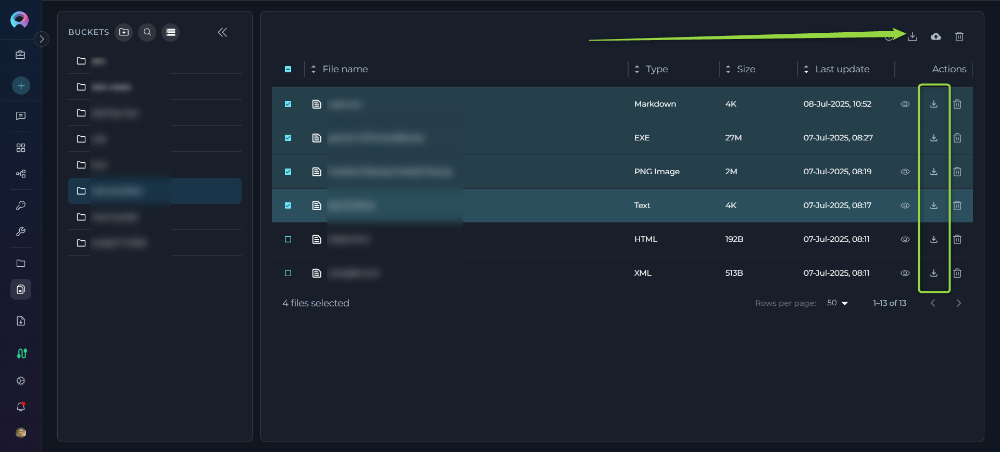

# Artifact Functionality Section

## Private project - Artifacts menu

The Artifacts section in ELITEA provides a dedicated interface for managing artifact buckets and the files they contain. Artifacts are primarily used in conjunction with the Artifact Toolkit within ELITEA Agents, offering temporary storage for data and context during agent workflows. This section allows users to directly interact with artifact storage, enabling actions such as creating buckets, uploading and downloading files, managing retention policies, and organizing project-related data. Artifact storage is project-specific, accessible to project members, and is also available for private projects.

 

## Components

The Artifacts page features the following key components:

*   **Bucket Search Bar:** Located at the top, allows users to search for buckets by name.
*   **Storage Type Selector:** A dropdown menu used to filter buckets by storage type. Currently, only one storage type is available, so this selector may have limited functionality.
*   **Add Bucket Button:** Located in the upper right corner, this button initiates the process of creating a new artifact bucket.
*   **Bucket List:** Displays a scrollable list of all artifact buckets within the project.
*   **File List:** Is located to the right of the bucket list. This list shows the files contained within the selected bucket, displaying file name, size, and last update date. Pagination is available for long file lists, along with options to adjust the number of files displayed per page and sort files by column headers.
*   **Storage Usage Information:** Displayed in the lower left part of the screen, this section shows the total storage usage for the current project and the project's storage limit (default is 9 GB).

## Artifact Functionality

This section describes the functionalities available within the Artifacts page:

###  Accessing the Artifacts Section

*   **Navigation:** Open the ELITEA sidebar by clicking on the Alita icon (located on the right side of the interface). In the sidebar menu, select the **"Artifacts"** option. This will navigate you to the Artifacts management page. In case Artifact menue item is missing contact your administrator to get access.

###  Searching and Filtering Buckets

*   **Searching by Bucket Name:** Use the **Bucket Search Bar** at the top of the Artifacts page. Type in keywords related to the bucket name you are looking for. The bucket list will dynamically filter to show buckets whose names contain the entered keywords.
*   **Filtering by Storage Type:** Utilize the **Storage Type Selector** dropdown. Although currently there might be only one storage option, you can use this selector to filter the bucket list by the available storage type if multiple types were to be available in the future.

###  Creating a New Bucket

*   **Initiate Bucket Creation:** Click the **"+ Add Bucket"** button located in the upper right corner of the Artifacts page.
*   **Enter Bucket Name:** A "New Bucket" window will appear. In the "Name" field, enter a unique name for your new bucket.
    *   **Naming Conventions:** Bucket names must start with a letter and can only contain letters, numbers, and hyphens. Spaces and other special characters are not allowed.
    *   **Uniqueness:** Ensure the bucket name is unique within the project. If a non-unique name is entered, instead of creating a new bucket, the system will use the existing bucket and **update the retention policy of the existing bucket** to the newly provided retention period.
*   **Set Retention Policy:** Select the desired retention policy for the bucket.
    *   **Period Type:** Choose the time unit for retention from the "Period Type" dropdown (Days, Weeks, Months, Years).
    *   **Value:** Enter a numerical value in the number field to specify the duration of the retention period. Be aware that some storage types may have limitations on the maximum retention period (e.g., not exceeding year 9999). Provide meaningful and realistic retention durations.
*   **Save Bucket:** Click the **"Save"** button in the "New Bucket" window to create the bucket with the specified name and retention policy. The newly created bucket will then appear in the Bucket List.

###  Managing Bucket Retention Policy

*   **Access Edit Mode:** In the Bucket List, hover your mouse over the bucket you want to modify. An **"Edit"** icon (pencil icon) will appear. Click on this "Edit" icon.
*   **Modify Retention Policy:** The "Edit Bucket" window will open, displaying the current retention policy. Modify the "Period Type" and "Value" as needed to set a new retention period. Note that you **cannot change the bucket name** in edit mode.
*   **Save or Discard Changes:**
    *   Click **"Save"** to apply the new retention policy to the bucket.
    *   Click **"Cancel"** to discard the changes and revert to the original retention policy.

    
    
    

###  Viewing Files in a Bucket

*   **Select a Bucket:** In the Bucket List, click on the name of the bucket you wish to view the files of.
*   **File List Display:** The **File List** section on the right side of the screen will populate, displaying the files contained within the selected bucket. The list shows the file name, size, and last update date for each file.
*   **File List Navigation:**
    *   **Pagination:** If the file list is long, pagination controls will appear below the list, allowing you to navigate through multiple pages of files.
    *   **Items Per Page:** Use the "items per page" selector to adjust the number of files displayed on each page.
    *   **Sorting:** Click on the column headers ("Name," "Size," "Last Update Date") to sort the file list by that column in ascending or descending order.

    

###  Uploading Files to a Bucket

*   **Select Target Bucket:** Ensure you have selected the bucket in the Bucket List where you want to upload files.
*   **Drag and Drop Files:** Drag and drop files directly from your computer's file explorer into the File List area on the right side of the Artifacts page.
*   **Upload Progress:** After dragging and dropping, a file upload process will begin. ELITEA will provide visual feedback or notifications regarding the upload status. Once the upload is complete, the newly uploaded files will appear in the File List.
**Note:** If a file with the same name and extension is dropped into the bucket, it will be replaced automatically without any prompt or confirmation. Please be cautious.

###  Deleting a File from a Bucket

*   **Access File List:** Navigate to the File List of the bucket containing the file you want to delete.
*   **Single File Deletion:** A **"Delete"** Click this "Delete" icon to delete the file on the right side of the file entry
*   **Multiple File Deletion:** To delete multiple files at once:
    *   Select the checkboxes next to each file you want to delete in the File List.
    *   Once one or more files are selected, a **"Delete"** icon will become active in the upper part of the File List (above the list itself). Click this "Delete" icon to delete all selected files.
*   **Confirmation:** You may be prompted to confirm the file deletion before it is permanently removed.

###  Downloading a File from a Bucket

*   **Access File List:** Navigate to the File List of the bucket containing the file you want to download.
*   **Initiate Download:** Locate the **"Download"** icon (download arrow icon) on the right side of the file entry in the File List. Click this "Download" icon to start downloading the file to your local computer.

###  Deleting a Bucket

*   **Access Delete Mode:** In the Bucket List, hover your mouse over the bucket you want to delete. A **"Delete"** icon (trash can icon) will appear. Click on this "Delete" icon.
*   **Confirmation Window:** A confirmation window will appear, prompting you to confirm the bucket deletion.
*   **Confirm Bucket Name:** In the confirmation window, you will need to **manually type in the name of the bucket** you wish to delete into the provided input field. This is a security measure to prevent accidental bucket deletion.
*   **Delete Bucket:** After typing the bucket name correctly, click the **"Delete"** button in the confirmation window to permanently delete the bucket and all files it contains.
    *   **Caution:** Deleting a bucket is a permanent action. All files within the bucket will be deleted and cannot be recovered.
    

###  Storage Usage Information

*   **View Storage Usage:** The **Storage Usage Information** section is located in the lower left part of the Artifacts page. It displays:
    *   **Current Project Usage:** The amount of storage currently used by all artifact buckets within the current ELITEA project.
    *   **Project Storage Limit:** The total storage quota allocated to the project for artifacts (default is 9 GB).

    

## FAQ

**Q: What types of files can I upload to Artifact buckets?**

**A:** You can upload all types of files to Artifact buckets within the Artifacts section. However, the Artifact Toolkit, used by ELITEA Agents, is primarily designed to work with plain text files. For using files with agents, please refer to the [Artifact Toolkit](../../how-tos/agents-toolkits/artifact_toolkit.md#artifacts)  documentation for supported file types.

**Q: How can project members access files in Artifact buckets?**

**A:** All members who have access to the  Artifacts section can access all buckets and files within that project. They can view, upload, download, and delete files and buckets within the project's Artifact storage.

**Q: I'm getting an "Internal Server Error" when trying to create a bucket.**

**A:** This error can occur if the retention policy you have defined is invalid or exceeds the limitations of the storage system. Try the following:

*   **Review Retention Policy:** Ensure you have provided a reasonable "Value" for the retention period.
*   **Decrease Retention Period:** Try decreasing the retention period value, especially if you have set a very long retention duration (e.g., thousands of years). Some storage systems have limits on maximum retention periods.

**Q: I am trying to create a bucket, but the "Save" button is not active.**

**A:** The "Save" button might be disabled if:

*   **Invalid Bucket Name:** The bucket name you entered contains characters that are not allowed (e.g., spaces, special symbols other than hyphens) or does not start with a letter. Review the bucket naming conventions.
*   **Invalid Retention Policy Value:** You have provided a non-integer or invalid numerical value for the retention policy duration. Ensure you enter a valid whole number for the retention period value.

**Q: Some files are missing or lost from my Artifact bucket.**

**A:** Files might be missing due to the following reasons:

*   **Retention Period Expiration:** Files are automatically deleted when their retention period expires. Check the retention policy set for the bucket.
*   **Intentional or Accidental Deletion:** Files might have been intentionally or unintentionally deleted by another project member or by an agent using the Artifact Toolkit with delete file functionality.