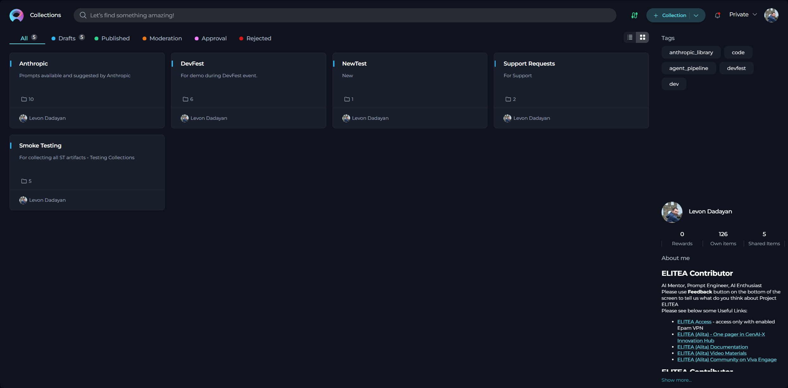
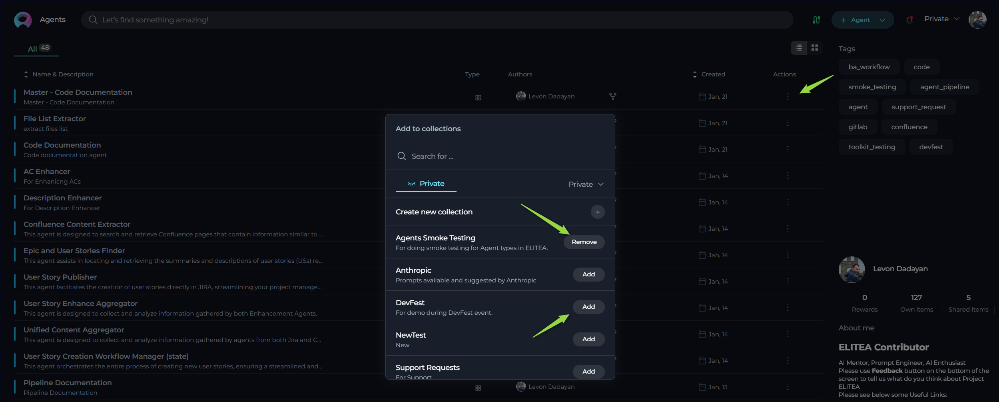

# Collections

## Collections menu

The **Collections** menu within **Private** workspace and **Team** projects in ELITEA serves as your central hub for organizing and managing your **Collections**. Think of it as your personal workspace for curating sets of related **Entities** (Prompts, Datasources, and Agents), allowing for efficient access, management, and sharing of your AI resources.

**Understanding Project Scopes:**

*   **Private Workspace:** Your personal and private area within ELITEA to create and manage your Entities and Collections. Only you have access to your **Private** workspace.
*   **Team Projects:** Collaborative spaces for teams to work together on projects, sharing and managing Entities and Collections. Access to Team projects is controlled by project roles and permissions.
*   **Public Project:** A shared, community space within ELITEA where published Prompts and Collections are available for all users to discover and utilize.

**The Purpose and Usefulness of Collections**

**Collections** are designed to enhance your workflow by providing a structured way to group and manage Entities. They offer significant benefits:

*   **Thematic Organization:** Group Entities by themes, projects, or any relevant category for easy access.
*   **Efficiency:** Consolidate related resources, saving time and effort in finding and utilizing them.
*   **Sharing Best Practices:** Facilitate sharing and collaboration by grouping best-practice Entities into easily shareable units.

### Accessing the Collections menu

To access the **Collections** menu, navigate to the main menu sidebar within your **Private** or **Team** project and click on **"Collections"**.

### Layout of the Collections Menu

The **Collections** menu presents your collections in a visually organized layout, typically using a **Card List View** as shown in the image above.  Key elements of the Collections Menu interface include:

*   **"+ Collection" Button:** Located at the top right corner, this button allows you to create new collections.
*   **Search Bar:** Positioned at the top left, the Search bar enables you to quickly find specific collections by name or description.
*   **View Options:** Icons for toggling between different view formats (e.g., Card list view, Table view) may be available, allowing you to customize how collections are displayed.
*   **Collection Cards:** Each collection is represented by a card, displaying:
    *   **Collection Name:** The user-defined name of the collection.
    *   **Collection Description:** A brief description of the collection's purpose (if provided).
    *   **User Avatar:**  The avatar of the user who created the collection.
    *   **Action Icons:** Icons for performing actions on the collection (Edit, Publish, Delete, Export).

### Creating a New Collection

Creating a collection allows you to organize and categorize your Entities for better accessibility and management. Follow these steps to create a new collection:

1.  **Create New Collection:** Click the **"+ Collection"** button located at the top right of the **Collections** menu.
2.  **Define Collection Details:** In the "Create Collection" dialog:
    *   **Name:** Enter a descriptive **Name** for the collection.
    *   **Description:** Write a concise **Description** explaining the collection's purpose.
3.  **Create Collection:** Click **Create** to create the collection.

### Exploring Collections and Viewing Entities

Exploring collections is straightforward and insightful:

1.  **Open Collection:** Click on a **Collection Card** or **Name** to view its contents.
2.  **View Entities:** Explore the list of Prompts, Datasources, and Agents within the collection.
3.  **Interact with Entities:** Within a collection, you can perform the following actions on individual Entities:
    *   **View and Open Entities:** Click on Entity cards to view their details and configurations.
    *   **Add to Collection:** Use the **Bookmark icon** on Entity cards or in the Actions menu to add Entities to other Collections.

### Filtering Entities within a Collection

Within the **Collection Detail View**, you can filter Entities for easier browsing and management:

*   **Filter by Type using Tabs:** Use the **All**, **Prompts**, **Datasources**, and **Agents** tabs at the top of the Collection Detail View to view specific entity types within the collection.
*   **Filter by Tags:** Use the **"Tags"** filter section, typically located on the right side, to narrow down the displayed list to Entities with specific tags.

### Modifying a Collection

To modify an existing collection:

1.  **Edit Collection Details:** Click the **"Edit" icon** on the Collection Card or within the Collection Detail View.
2.  **Update Information:** Modify the **Name** and/or **Description** in the "Edit Collection" dialog.
3.  **Saving Changes:** Click the **"Save"** button to apply your changes.

### Publishing a Collection (Public Project)

To publish a collection to the Public Project:

1.  **Open Collection Detail View:** Navigate to the Collections menu and open the collection you want to publish.
2.  **Review Collection Contents:** Ensure the collection is complete and contains at least one published entity.
3.  **Publish Collection:** Click the **"Publish collection" icon** within the collection detail view.
4.  **Moderation and Approval:** The collection will be submitted for moderation and, upon approval, published to the Public project.

### Deleting a Collection

To delete a collection:

1.  **Locate Collection:** Find the collection you want to delete in the Collections menu.
2.  **Delete Collection:** Click the **"Delete" icon** on the Collection Card or within the Collection Detail View.
3.  **Confirmation:** Confirm the deletion when prompted.

### Exporting Collections

Exporting a collection allows you to save it as a JSON file for backup or sharing:

1.  **Open Collection Detail View:** Navigate to the Collections menu and open the collection you want to export.
2.  **Export Collection:** Click the **"Export Collection" icon** within the collection detail view.
3.  **Download JSON File:** A JSON file containing the collection data will be automatically downloaded to your device.

### Importing Collections

Importing collections allows you to add pre-built collections from JSON files:

1.  **Import Collection:** Click the **"Import"** button in the Collections menu.
2.  **Select Collection File:** In the "Import Wizard," select the **JSON file** from your device.
3.  **Configure Import Options:** Choose the target project and select Entities to import in the Import Wizard.
4.  **Start Import:** Click the **"Import"** button to import the selected Entities.
5.  **Locate Imported Entities:** Find the imported Prompts, Datasources, and Agents in their respective menus.

**Important Note:** The Collection entity itself is not automatically recreated during import.

For more information about importing collections and entities, please refer to the [Export and Import Guide](../../feature-guides/core-features/export-import.md).

## How to Add an Entity to a Collection

ELITEA offers a convenient **Bookmark icon** to add Entities to Collections directly from the Entity menus:

1.  **Navigate to Entity Menu:** Go to the **Prompts**, **Datasources**, or **Agents** menu.
2.  **Locate the Entity to Add:** Find the Entity you want to add to a Collection.
3.  **Click the Bookmark Icon:** Click the **Bookmark icon** associated with the Entity:
    *   **Card List View**: Top right corner of the Entity card.
    *   **Table View**: "Add to collection" option under the ellipsis icon (`...`) in the Actions column.

    
    

4.  **Select Target Collection:** In the pop-up window, choose the **Collection** to add the Entity to.
5.  **Entity Added:** The Entity is automatically added to the selected Collection.
