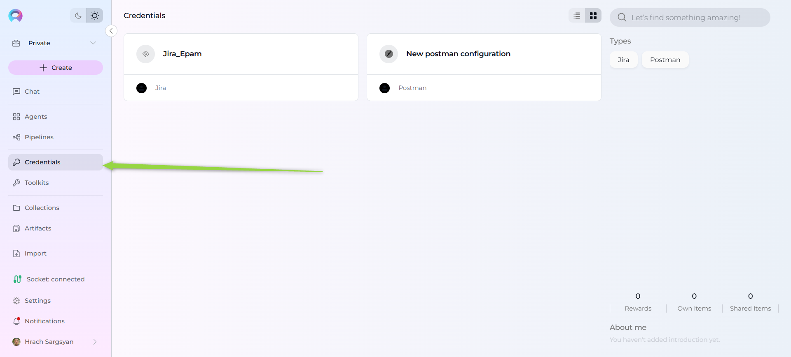

# Credentials

## Introduction to the Credentials Menu

The **Credentials** menu in the ELITEA platform provides a secure and centralized interface for managing the authentication details and access tokens needed to connect your agents and toolkits to external services. Credentials are required for integrations such as project management systems, code repositories, cloud platforms, and other third-party APIs. This guide walks you through the Credentials menu, explains its features, and describes how to manage your authentication data for seamless integration.

---

## What Are Credentials?

**Credentials** in ELITEA are secure records containing sensitive information—such as API keys, OAuth tokens, usernames, or passwords—used to authenticate your agents and toolkits with external platforms. By storing credentials centrally, ELITEA helps ensure secure access control and simplifies credential management across all your integrations.

---

## Navigating the Credentials Menu

The Credentials menu is accessible from the main platform navigation. Upon entering the Credentials section, you'll see a dashboard listing all saved credentials.

### Main Elements:

- **Credential Cards:** Each card displays the credential's name and type.
- **Search and Filter:** Use the search bar to quickly locate credentials by name or type.
- **Add Credential Button:** Use the `+ Create` button to create new credentials.

---

## Supported Credential Types

The ELITEA platform currently supports the following credential types, allowing you to integrate with a wide variety of services and toolkits:

| **Credential Type**             | **Typical Use Case**                 |
|---------------------------------|--------------------------------------|
| **Azure DevOps**                | Project management, CI/CD, code      |
| **Azure DevOps Repositories**   | Code repositories, version control   |
| **Bitbucket**                   | Code repositories, CI/CD             |
| **Confluence**                  | Documentation, wiki management       |
| **GitHub**                      | Code repositories, automation        |
| **GitLab**                      | Code repositories, CI/CD             |
| **Jira**                        | Issue and project tracking           |
| **Postman**                     | API management, integration testing  |
| **QTest**                       | Test management                      |
| **S3Config**                    | AWS S3 storage, file management      |
| **ServiceNow**                  | IT service management, workflow      |
| **Slack**                       | Team messaging, notifications        |
| **Testrail**                    | Test management                      |

---

## Creating a New Credential

You can add new authentication records to the platform by creating a credential through the Credentials menu.

### How to Create a New Credential

Follow these steps to add authentication details to the platform:

1. **Open the Credentials Menu:** Go to the Credentials section from the main navigation bar.
2. **Click `+ Create`:** Find the `+ Create` button at the top of the sidebar.
3. **Select Credential Type:** Choose the required credential type from the categorized list (see above).
    
4. **Enter Credential Details:**
   - **Name:** Provide a clear, descriptive name for your credential.
   - **Parameters:** Enter the required fields such as API keys, tokens, usernames, passwords, or service URLs. Field requirements vary by integration.
   
   > **Security Recommendation:** When prompted for sensitive information like API keys, passwords, or tokens, it's recommended to use **Secrets** instead of entering plain text values. Secrets provide enhanced security for your sensitive data. For more information on creating and managing secrets, see the [Secrets documentation](../../quick-start/secrets.md).
  
5. **Save the Credential:** Click **Save** (top right) to add the credential to your dashboard. It will now appear in the list, ready for assignment to toolkits.

> **Note:** Only users with the necessary permissions can create or configure credentials. If the `+ Create` button is disabled, contact your platform administrator.The exact fields required for each credential depend on the integration type. Refer to the toolkit or integration documentation for details.

---

## Editing and Managing Credentials

### How to Edit an Existing Credential

To edit a credential, open its detailed page from the Credentials dashboard. On this page, you can:

- **Edit Credential Details:** Update the name and parameters (API keys, tokens, URLs).
- **Save Changes:** Click **Save** to apply your updates. Changes are applied immediately and reflected in the dashboard.
- **Set as Default:** Use the "Set as Default" action (⋮ menu) to mark a credential as the default for its type or integration.
- **Delete Credential:** Use the "Delete" icon (top right) to remove the credential. Enter the name of the credential and Confirm deletion in the dialog.

> **Tip:** Regularly rotate and update your credentials to maintain security and compliance.

---

## Assigning Credentials to Toolkits and Agents

Once a credential is created, it is available for assignment when configuring toolkits or agents:

1. When adding or editing a toolkit, open the Credentials dropdown.
2. Select an existing credential from the list or create a new one.
3. Save your changes to apply the credential to your toolkit or agent.

> For more information on creating and managing Toolkits, see the [Toolkits documentation](../../quick-start/toolkits.md)

> **Tip:** Use project-scoped credentials for team integrations, and personal credentials for individual agent tasks.

---

## Troubleshooting

- **Failed Authentication:** Double-check credential values and permissions.
- **Credential Not Appearing:** Refresh the credential list or verify your permissions.
- **Toolkit/Agent Cannot Use Credential:** Ensure the credential is correctly assigned and compatible with the integration.

For further assistance, contact your platform administrator.

---

## Summary

The Credentials menu provides a secure and efficient way to manage authentication details for all your ELITEA platform integrations. By following this guide, you can easily add, edit, and assign credentials to toolkits and agents—enabling secure, automated workflows across your enterprise.

---