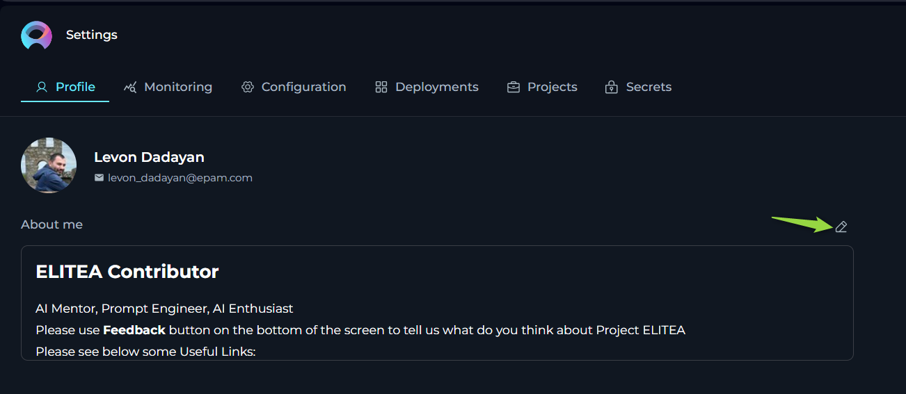
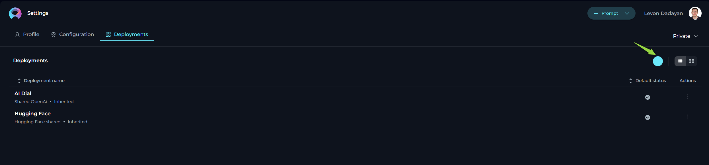
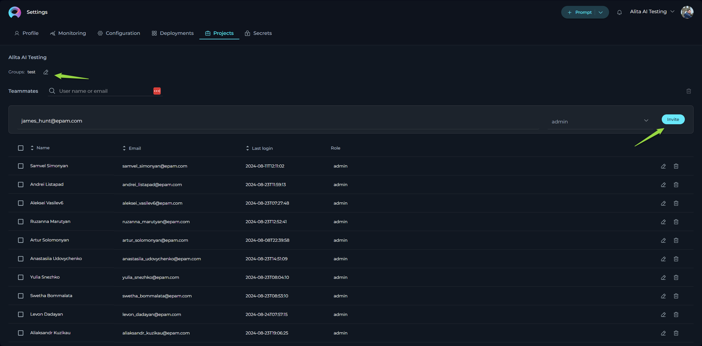
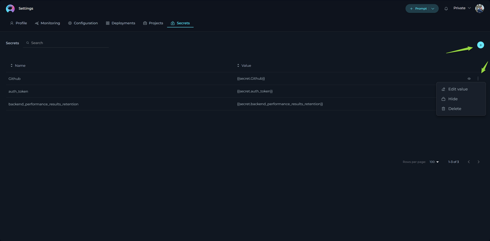

# Settings

The **Settings** is designed to offer you a centralized space to manage vital aspects of your account and configurations. This centralized space is accessible by clicking on your avatar located at the top right corner of the page.

The **Settings** consists of several tabs and settings each dedicated to specific functionalities:

* **Profile**: Customize your user profile within ELITEA.
* **Monitoring**: Keep track of usage statistics by selecting different metrics and timeframes.
* **Configuration**: Manage essential technical settings crucial for the smooth operation of ELITEA's features like Alita Code or Alita Code Chat.
* **Deployments**: Handle the management and launching of AI models or services linked to your ELITEA project.
* **Projects**: Manage users within project. This tab is only available for the user within admin permissions within the project.
* **Theme**: Switch between **Dark** and **Light** theme for the whole application.
* **Log out**: Securely log out from the ELITEA.

**Navigation**:

To navigate through the **Settings** menus, follow these steps:

1. Click on the **Your Avatar** icon located at the top right corner of the page to open the **Sidebar** menu.
2. Select the desired tab by clicking on its name to navigate to that specific section.

## Profile

In the **Profile**, you’re presented with options to personalize your account within ELITEA.

**About me** - fill in or update your personal details to ensure your ELITEA profile remains current. **Note**: Markdown is supported.

## Monitoring

The **Monitoring** feature in ELITEA is designed to provide a comprehensive overview of the application's usage and performance. This feature is essential for administrators and users who want to gain insights into various aspects of the application, from user engagement to the effectiveness of configured artifacts like prompts, datasources, and agents. By leveraging the detailed charts and statistics available within the Monitoring feature, you can make informed decisions to optimize the performance and user experience of your ELITEA application.

This section will guide you through the various components of the Monitoring feature, including configuration options, key metrics, adoption and usage statistics, sentiment analysis, accuracy metrics, prompt topics, and topics summary. Each of these components offers valuable insights that can help you understand how the application is being used and how it can be improved.

### Configuration Options

At the top of the **Monitoring** page, you have several options and settings to configure the charts and metrics you wish to monitor:

* **Projects**: A dropdown lits allowing you to select the project. **Note**: For your Private project, you can only see your private project data. If you have an admin role in another projects, you can select other projects to monitor.
* **From and To Date Fields**: These fields are used to select the time period for which you want to see the data.
* **Aggregation**: A dropdown list providing options to view aggregated data over different time periods. You can choose from `Hour`, `Day`, `Week`, `Two Weeks`, `Three Weeks`, and `Month` to tailor the data aggregation to your specific needs.
* **Type**: A dropdown list allowing you to select among `Prompt`, `Datasource`, `Agent`, and `Conversation` to focus your monitoring on specific elements.
* **Name**: A dropdown list to select specific items by name, such as created prompts, datasources, agents, or conversations.
* **Users**: A dropdown list to select which users' data you want to monitor. **Note**: For your private project, you can only see your own user data. If you have an admin role in another project, you can select other users to monitor.

To apply any changes or selections, click the **Apply** button. Use the **Refresh** button to update the monitoring data based on the latest activities and configurations.

### Key Metrics

Below the configuration options, you'll find an overview of key metrics that give you a snapshot of the current state of the system:

* **Users**: The total number of users interacting with the ELITEA application.
* **Tokens In**: The number of tokens consumed by the ELITEA application.
* **Tokens Out**: The number of tokens generated by the ELITEA application.
* **Engagement**: The percentage of active users out of all users who logged into ELITEA for the selected period, indicating the level of interaction with the application.
* **Acceptance rate**: The percentage of interactions during the selected period where users accepted the generated output by copying, downloading, or saving it, reflecting user satisfaction and utility of the results.
* **Prompts**: The total number of prompts created.
* **Agents**: The total number of agents created.
* **Conversations**: The total number of conversations created.

These metrics are accompanied by a date range selector, allowing you to filter the data for a specific period.

.png)

### Adoption and Usage

Below the key metrics, you'll find the **Adoption and Usage** section, which includes:

* **Active Users**: A bar chart displaying the number of active users over time.
* **Token Usage**: A line chart showing the tokens consumed (In) and generated (Out) over time.

These charts provide insights into user engagement and the application's token economy.

### Acceptance Rate

The **Acceptance Rate** section provides a comprehensive view of user interactions with the ELITEA application, focusing on how often users accept the generated outputs. This section includes visualizations that help you understand user satisfaction and the effectiveness of the system's responses.

**Acceptance Rate Chart**

The Acceptance Rate Chart displays the number of accepted and not accepted interactions for the selected period and filter options. This chart helps you assess how frequently users find the generated outputs useful enough to accept by copying, downloading, or saving them.

* **Accepted Interactions**: This metric shows the count of interactions where user(s) have accepted the generated output, indicating satisfaction and utility.
* **Not Accepted Interactions**: This metric reflects the number of interactions where user(s) did not accept the output, suggesting areas for potential improvement in response quality.

By analyzing the Acceptance Rate Chart, you can gain insights into user satisfaction levels and identify opportunities to enhance the effectiveness of the ELITEA application, ultimately improving the overall user experience.

### Sentiments

The **Sentiments** section provides a visual representation of the emotional tone of both user inputs and the outputs generated by LLMs. Understanding sentiment is crucial for tailoring responses to better meet user needs and improve overall interaction quality.

#### Sentiment Analysis Overview

Sentiment analysis categorizes text into three primary emotional states:

* **Positive**: Indicates a favorable or happy emotional tone.
* **Negative**: Indicates an unfavorable or unhappy emotional tone.
* **Neutral**: Indicates a neutral or indifferent emotional tone.

ELITEA performs sentiment analysis on user inputs to gauge the user's emotional state. This capability is particularly important for providing high-quality customer service, as the LLM can adjust its response tone and content based on the user's emotions.

#### Visual Representation

The **Sentiments** section includes two pie charts that offer a clear visual representation of sentiment distribution:

* **Human Input**: This pie chart shows the sentiment distribution of user inputs. It helps you understand how users are feeling when they interact with the LLMs.
* **LLM Output**: This pie chart displays the sentiment distribution of LLM's outputs. It helps you ensure that the responses generated by the LLM are appropriate and aligned with user emotions.

#### Practical Applications

Understanding sentiment can significantly enhance the user experience in several ways:

* **Customer Service**: By analyzing the sentiment of user inputs, LLMs can adjust its responses to be more empathetic and supportive, thereby improving customer satisfaction.
* **User Engagement**: Monitoring sentiment trends over time can help you identify patterns in user behavior and adjust your strategies accordingly.
* **Content Moderation**: Sentiment analysis can be used to flag potentially harmful or inappropriate content, ensuring a safer and more positive interaction environment.

.png)

### Accuracy

The **Accuracy** section provides detailed insights into the performance and reliability of the ELITEA application. This section includes various metrics and visualizations that help you understand how well the system is responding to user inputs and how effective your configured artifacts (prompts, datasources, agents, conversations) are.

#### Relevance

The **Relevance** metric is divided into two key lines:

* **Input vs Context**: This line measures the relevance of the user's input (question or query) against the context of the artifact (prompt, datasource, agent or conversation). In the ELITEA, "context" refers to the configured instructions for the artifact. A higher relevance score indicates that the user's input closely matches the context, making it easier for the LLM to provide accurate responses.
* **Output vs Input**: This line measures the relevance of the generated output by the LLM against the user's input. A higher relevance score here indicates that the output is closely aligned with the user's query, ensuring that the response is appropriate and useful.

**Note**: The maximum value for relevance is 6. The higher the score, the better the relevance, indicating a more accurate and contextually appropriate interaction.

#### Reliability

The **Reliability Score** answers the question of whether there is enough context to respond accurately to the user's questions or queries. This metric helps you gauge the confidence level of the LLM's responses. **Note**: The maximum reliability score is 10. A higher score indicates that there is sufficient context to provide a correct and reliable response to the user's query.

#### Instruction Quality vs Usage

The **Instruction Quality vs Usage** is a 2x2 matrix that helps you evaluate the effectiveness and utilization of your artifacts (prompts, agents, datasources or conversations):

* **Low Quality, Low Usage**: Artifacts in this box have low quality scores and are rarely used. These artifacts may need to be re-evaluated or improved.
* **High Quality, Low Usage**: Artifacts in this box have high quality scores but are not frequently used. Efforts should be made to promote these high-quality artifacts to increase their usage.
* **High Quality, High Usage**: Artifacts in this box have high quality scores and are frequently used. These are your most effective artifacts and should be maintained.
* **Low Quality, High Usage**: Artifacts in this box have low quality scores but are frequently used. These artifacts should be improved in quality or their usage should be reduced in favor of higher-quality alternatives.

**Matrix legend**:

* **Quality Score**: The maximum quality score is 4. A higher score indicates better quality.
* **Calls**: This metric shows how many times an artifact has been used. Depending on the context (matrix box), a higher number of calls can be either positive or negative.

By analyzing these metrics, you can make informed decisions to improve the accuracy and reliability of your Alita AI application, ensuring a better user experience.

### Prompt Topics

The **Prompt Topics** section provides an automatic classification of the available artifacts (prompts, datasources, and agents) within the Alita AI application. This section helps you understand the distribution and focus areas of your artifacts, enabling you to identify trends and gaps in your content.

#### Chart Components

The **Prompt Topics** section displays a clustered column chart that categorizes your artifacts by topic. This visual representation allows you to quickly see how many prompts, datasources, or agents are associated with each topic. The clustered column chart includes the following components:

* **Items**: Indicates the number of artifacts associated with each topic.
* **Topic Name**: Displays the name of each topic, helping you identify the subject matter of your artifacts.

#### Practical Applications

Understanding the distribution of your artifacts across different topics can provide several benefits:

* **Content Gaps**: Identify topics with fewer artifacts, indicating potential areas where additional content may be needed.
* **Content Focus**: Recognize topics with a high number of artifacts, helping you understand the primary focus areas of your users.
* **Resource Allocation**: Allocate resources more effectively by focusing on topics that require more attention or improvement.

.png)

By leveraging the insights provided by the **Prompt Topics** section, you can ensure that your application covers a comprehensive range of topics, enhancing the overall user experience and effectiveness of the application.

### Topics Summary

The **Topics Summary** section provides an automatic classification of user inputs, categorizing the topics that users have queried or questioned about. This section helps you understand user interests and the most frequently discussed topics within ELITEA.

#### Chart Components

The **Topics Summary** section displays a clustered column chart that categorizes user inputs by topic. This visual representation allows you to quickly see how many times users have queried information for each topic within a selected timeframe. The clustered column chart includes the following components:

* **Items**: Indicates the number of user queries associated with each topic.
* **Topic Name**: Displays the name of each topic, helping you identify the subject matter of user queries.

#### Practical Applications

Understanding the distribution of user queries across different topics can provide several benefits:

* **User Interests**: Identify the topics that users are most interested in, allowing you to tailor your content and responses to better meet their needs.
* **Content Gaps**: Recognize topics with fewer user queries, indicating potential areas where additional content or promotion may be needed.
* **Trend Analysis**: Monitor how user interests evolve over time, helping you stay ahead of emerging trends and adjust your strategies accordingly.

By leveraging the insights provided by the **Topics Summary** section, you can ensure that ELITEA is aligned with user interests, enhancing the overall user experience and effectiveness of the application.

.png)

The **Monitoring** feature in ELITEA offers a robust set of tools and metrics to help you understand the performance and usage of your application. By utilizing the various charts and statistics available, you can gain valuable insights into user engagement, sentiment, accuracy, and the distribution of topics within your project. These insights are crucial for making data-driven decisions that can enhance the overall user experience and effectiveness of your ELITEA application.

Whether you are looking to improve customer's experience through sentiment analysis, optimize the relevance and reliability of LLM responses, or identify content gaps and user interests, the Monitoring feature provides the necessary data to guide your efforts. By regularly reviewing and analyzing these metrics, you can ensure that your project remains aligned with user needs and continues to perform at its best.
By leveraging the comprehensive monitoring capabilities of ELITEA, you can create a more responsive, efficient, and user-friendly application, ultimately leading to higher user satisfaction and better overall performance.

## Configuration

The **Configuration** page serves as the nucleus for managing essential technical settings that enable the smooth operation of ELITEA's features, such as Alita Code or Alita Code Chat. **Note**: The available settings and configurations may vary depending on the project selected. It's important to select the appropriate project from the project dropdown menu to access specific configurations relevant to that project.

* **URL** - this is the base web address through which you interact with ELITEA’s services. It's a crucial link for all your API calls or web requests.
* **Project ID & Integration UID** - unique identifiers for your project and integration instances. These are required when setting up or customizing ELITEA’s services to work within your specific project environment.
* **Integration Options** - allows to select and display available LLMs and Embeddings integrated with your deployments.
* **Model Name** - displays the correct name of selected integration option
* **Personal Tokens** - access tokens are your key to secure communication with ELITEA's backend. Here, you can generate tokens that authorize your applications or scripts to perform operations on behalf of your account. Treat these tokens with care and keep them confidential.

**To create a token:**

1. Click the `+` icon to create a new token.
   * Enter a **name** and set an **expiration date** for the token.
   * Click **Generate** to create the token.
   * Immediately copy and securely store the generated token; it will not be visible again once you close the pop-up window.
3. From the Integration Option dropdown list, select the desired LLM model (e.g., gpt-4, gpt-4o, gpt-4-0125-preview, etc.).
4. Once the LLM model is selected, the **Download VS Code Settings** and the **Download Jetbrains Settings** icons will appear next to the created token. This allows you to download the configuration files to integrate and configure the ELITEA project with Alita Code extensions on VSCode and IntelliJ respectively. For more information about how to setup it, please refer to the [Alita Code Documentation](../user-guide/extensions/alita-code.md).

## Deployments

The **Deployments** page is all about managing and launching AI models or services that you’ve connected to your ELITEA project. **Note**: The available settings and configurations may vary depending on the project selected. It's important to select the appropriate project from the project dropdown menu to access specific configurations relevant to that project.

* **Available Deployments** - view a list of current AI deployments, such as AI Dial or Hugging Face, that have been linked to your project. This snapshot gives you quick access to manage these integrations.
* **Creating New Deployments** - while the possibility exists to set up new deployments, it’s a process that requires coordination with the ELITEA team. This is to ensure seamless integration and avoid potential conflicts with existing configurations.

#### Creating a New Deployment for EPAM AI Dial

To set up a new deployment for EPAM AI Dial within your system, follow these detailed steps:

1. **Obtain API Key**: **Important**: Before proceeding, you must obtain a separate [API Key](https://chat.lab.epam.com/#requestApiKey) from the EPAM DIAL team. This key is essential for authenticating and enabling communication with the AI Dial services.   
2. **API Key Retrieval**: Once you have received the API Key and any additional required information via email, return to this page to input these details.
3. **Initiate Deployment Creation**:  Click the `+` icon to start creating a new deployment.
4. **Select Deployment Type**: From the list of available deployment types, select `AI Dial`.
5. **Configure Deployment Details**: In the configuration window, fill in the following information:
     * **Name**: Enter a descriptive name for the deployment. This name will be displayed alongside LLM models configured with this deployment.
     * **API Base**: For EPAM AI Dial, use `https://ai-proxy.lab.epam.com` as the API Base.
     * **Secret API Key**: Paste the API Key that you received from the AI Dial team.
     * **API Version**: Enter the API version information provided by the AI Dial team.
6. **Add Models to Deployment**:
     * Click the `+` icon to add one or more models associated with this deployment. For each model, provide the model's name, maximum input tokens, and capabilities.
     * **Important**: Ensure that you enter the correct model name as used in EPAM AI DIAL. For detailed information on model specifications and configurations, refer to the [EPAM AI Dial documentation](https://github.com/epam/ai-dial-core).
7. Click **Save** to complete the creation of the deployment.

By following these steps, you can successfully create and configure a new deployment for EPAM AI Dial, enabling you to leverage advanced  capabilities within your projects.

## Integrations

The **Integrations** menu in ELITEA is designed to enhance the platform's functionality and flexibility by allowing users to connect with essential external tools such as Jira, Confluence, Testrail, and GitHub. These integrations enable seamless data flow and collaboration across different platforms, enhancing productivity and efficiency. Once configured, these integrations can be selected as configurations in the Agent's tool setup for each corresponding tool, allowing for streamlined operations within ELITEA. You can create integrations in both **Private** workspaces and **Team** projects, providing versatility in managing your connections.

### Confluence Integration Setup

To set up a Confluence integration, follow these step-by-step instructions:

1. **Initiate New Integration**: Click the `+` icon to start the process of creating a new integration. A pop-up window will appear, prompting you to select the type of integration you wish to create.
2. **Select Confluence**: From the available options, select **Confluence**. This will open a new pop-up window where you can enter the necessary details for the integration.
3. **Enter Integration Details**:
      * **Name**: Provide a descriptive name for the integration, such as "Conf_Integration".
      * **URL**: Enter the Confluence URL for your organization, e.g., `https://kb.epam.com/`.
      * **Authentication Options**: Choose your preferred method for secure connection: 
           * **API Key**: Select this option if you are using an API key for authentication. You have two choices for providing the necessary credentials:
               * **Password**: Enter your API key value directly into the provided field.
               * **Secret**: Select a pre-configured secret from the dropdown list. This secret should have been set up previously in **Secrets** page for secure storage and retrieval.
           * **Username**: Additionally, you will need to input the **Username** associated with your Confluence account to complete the authentication process. 
           * **Token**: Select this option if you are using a token for authentication. Similar to the API key, you have two choices for providing the necessary credentials:
               * **Password**: Enter the your token value directly into the provided field.
               * **Secret**: Select a pre-configured secret from the dropdown list. This secret should have been set up previously in **Secrets** page for secure storage and retrieval.
         * **Hosting Option**: Select the appropriate hosting type for your Jira setup:
           * **Cloud**: If your Confluence is hosted on Atlassian’s cloud.
           * **Server**: If your Confluence is hosted on your own servers or an enterprise environment. **Important Note**: When connecting to Epam's Confluence, ensure you select the **Server** option to establish the correct configuration.
      * **Set as Default**: Check the checkbox to set this integration as the default.
4. **Save the Integration**: Click the **Save** button to finalize the integration setup. Your Confluence integration is now configured and ready to use.

### GitHub Integration Setup

For GitHub integration, choose from the following authentication options:

1. **Initiate New Integration**: Click the `+` icon to start the process of creating a new integration. A pop-up window will appear, prompting you to select the type of integration you wish to create.
2. **Select Confluence**: From the available options, select **GitHub**. This will open a new pop-up window where you can enter the necessary details for the integration.
3. **Enter Integration Details**:
      * **Name**: Provide a descriptive name for the integration, such as "GitHub_Integration".
      * **Authentication Options**: Choose your preferred method for secure connection: 
           * **Private Key**: Select this option if you are using an Private key for authentication. 
             * **App ID**: Enter the **App ID** associated with your GitHub integration.
             * **Private Key**: Enter the configured Private key. You have two choices for providing the necessary credentials:
                 * **Password**: Enter your Private key value directly into the provided field.
                 * **Secret**: Select a pre-configured secret from the dropdown list. This secret should have been set up previously in **Secrets** page for secure storage and retrieval.        
           * **Token**: Select this option if you are using a token for authentication. Similar to the Private key, you have two choices for providing the necessary credentials:
               * **Password**: Enter the your token value directly into the provided field.
               * **Secret**: Select a pre-configured secret from the dropdown list. This secret should have been set up previously in **Secrets** page for secure storage and retrieval.
           * **Password**: Select this option if you are using your GitHub account password for authentication.
               * **Password**: Enter the password associated with your GitHub account. Similar to previous options, you have two choices for providing the necessary credentials:
                   * **Password**: Enter your password value directly into the provided field.
                   * **Secret**: Select a pre-configured secret from the dropdown list. This secret should have been set up previously in **Secrets** page for secure storage and retrieval. 
               * **Username**: Additionally, you will need to input the **Username** associated with your GitHub account to complete the authentication process. 
           * **Anonymous**: Select this option, if no anuthentication is required.
       * **Set as Default**: Check the checkbox to set this integration as the default.
4. **Save the Integration**: Click the **Save** button to finalize the integration setup. Your GitHub integration is now configured and ready to use.

### Jira Integration Setup

To set up a Jira integration, follow these step-by-step instructions:

1. **Initiate New Integration**: Click the `+` icon to start the process of creating a new integration. A pop-up window will appear, prompting you to select the type of integration you wish to create.
2. **Select Jira**: From the available options, select **Jira**. This will open a new pop-up window where you can enter the necessary details for the integration.
3. **Enter Integration Details**:
      * **Name**: Provide a descriptive name for the integration, such as "Jira_Integration".
      * **URL**: Enter the Jira URL for your organization, e.g., `https://jiraeu.epam.com/`.
      * **Authentication Options**: Choose your preferred method for secure connection: 
           * **API Key**: Select this option if you are using an API key for authentication. You have two choices for providing the necessary credentials:
               * **Password**: Enter your API key value directly into the provided field.
               * **Secret**: Select a pre-configured secret from the dropdown list. This secret should have been set up previously in **Secrets** page for secure storage and retrieval.
           * **Username**: Additionally, you will need to input the **Username** associated with your Jira account to complete the authentication process. 
           * **Token**: Select this option if you are using a token for authentication. Similar to the API key, you have two choices for providing the necessary credentials:
               * **Password**: Enter the your token value directly into the provided field.
               * **Secret**: Select a pre-configured secret from the dropdown list. This secret should have been set up previously in **Secrets** page for secure storage and retrieval.
      * **Hosting Option**: Select the appropriate hosting type for your Jira setup:
           * **Cloud**: If your Jira is hosted on Atlassian’s cloud.
           * **Server**: If your Jira is hosted on your own servers or an enterprise environment. **Important Note**: When connecting to Epam's Jira, ensure you select the **Server** option to establish the correct configuration.
      * **Set as Default**: Check the checkbox to set this integration as the default.
4. **Save the Integration**: Click the **Save** button to finalize the integration setup. Your Jira integration is now configured and ready to use.

### TestRail Integration Setup

To set up a Testrail integration, provide the following details:

1. **Initiate New Integration**: Click the `+` icon to start the process of creating a new integration. A pop-up window will appear, prompting you to select the type of integration you wish to create.
2. **Select Jira**: From the available options, select **TestRail**. This will open a new pop-up window where you can enter the necessary details for the integration.
3. **Enter Integration Details**:
      * **Name**: Provide a descriptive name for the integration, such as "TestRail_Integration".
      * **URL**: Enter the TestRail URL for your organization, e.g., `https://testrail.epam.com/`.
      * **Email**: Enter the email used for authentication.
      * **Authentication Options**: Choose your preferred method for secure connection: 
        * **Password**: Enter your password value directly into the provided field.
        * **Secret**: Select a pre-configured secret from the dropdown list. This secret should have been set up previously in **Secrets** page for secure storage and retrieval.
      * **Set as Default**: Check the checkbox to set this integration as the default.
4. **Save the Integration**: Click the **Save** button to finalize the integration setup. Your TestRail integration is now configured and ready to use. 

By setting up these integrations, you can streamline workflows and enhance collaboration across different platforms, making ELITEA a more powerful tool for your projects.

## Projects

The **Projects** menu is specifically designed for administrators and becomes accessible when you hold administrative privileges in any project other than your private project within ELITEA. **Note**: It's important to select the appropriate project from the project dropdown menu to access specific configurations relevant to that project.

### Groups

The **Groups** feature in ELITEA is designed to facilitate efficient management and monitoring of multiple projects by admins or managers. This feature allows you to consolidate several projects under a single group, making it easier to oversee and coordinate activities across these projects.
If you are an admin of two or more projects, you can leverage the Groups feature to organize and monitor your projects collectively:

* **Create a New Group**: Click the **Pencil** icon to initiate the creation of a new group. You will be prompted to name the group and select the projects you wish to include.
* **Add Projects to Existing Group**: If you already have established groups, you can add additional projects to these groups.

This grouping functionality not only simplifies the administrative workload but also enhances the visibility and control over multiple projects, enabling more effective management and monitoring.

#### Teammates

The **Teammates** feature in ELITEA is specifically crafted to streamline the process of collaborating within projects by allowing you to invite new users (teammates) and assign them appropriate roles. These roles include system, admin, editor, and viewer, each providing different levels of access and control within the project. **Note**: Only users with an admin role are empowered to invite new members. This ensures that the invitation and role assignment process is managed by users with appropriate authority and understanding of the project’s needs.

**Inviting New Teammates**:

1. Enter the prospective member's email address in the **Email Address** input field.
2. Select their role from the **Role** dropdown menu. 
3. Click the **Invite** button. 
4. An invitation will be sent, and upon their first login, their details will be added to the **Teammates**, activating their account.

**Notes**

* Multiple users can be invited simultaneously by separating email addresses with a comma.
* For Epam projects, use the invitee's Epam email. For customer projects, the customer's Active Directory is utilized for invitations.

**Managing Teammates**:

The **Teammates** table displays all members, their roles, and their last login information. Admins can modify a user's role or revoke access by clicking the respective **Edit** or **Delete** icons next to a user's name.

## Secrets

The **Secrets** feature in ELITEA serves as a secure vault designed to store and manage sensitive information such as passwords, tokens, API keys, and other authentication details. This centralized system allows you to configure secrets once and utilize them across various components, such as Agent's toolkits within ELITEA.

**Creating a Secret**:

To add a new secret to the vault, follow these steps:

1. Click the `+` icon to initiate the creation of a new secret.
2. Enter a descriptive name for the secret to help you identify its use.
3. In the Value field, input the token, password, API key, or any other authentication details.
4. Once configured, this secret can now be selected and used within various components of ELITEA.

**Managing Secrets**:

The management of secrets is straightforward and secure, facilitated by the **Secrets** table which displays all your configured secrets:

* **View Secret**: Click the **Eye** icon to reveal the value of a configured secret. This allows you to quickly check the details without modifying them.
* **Copy Secret**: Easily copy the secret value to your clipboard (by clicking the hidden value) for use in configurations or integrations.
* **Hide Secret**: Hide the secret from the interface to maintain security when not actively managing the secret.
* **Modify Secret**: Update the value of the secret if the existing credentials change or need to be corrected.
* **Delete Secret**: Remove a secret permanently from the vault if it is no longer needed or if security concerns necessitate its deletion.

This feature enhances the security and efficiency of managing sensitive information within ELITEA, ensuring that authentication details are handled in a secure, centralized manner.

