# Settings

The **Settings** is designed to offer you a centralized space to manage vital aspects of your account and configurations. This centralized space is accessible by clicking on  **Settings** icon in the main navigation sidebar.

The **Settings** consists of several sections organized in a vertical navigation drawer, each dedicated to specific functionalities:

* **AI Configuration**: Manage essential technical settings crucial for the smooth operation of ELITEA's features like Alita Code or Alita Code Chat.
* **Personal tokens**: Create and manage personal access tokens for API access and IDE integrations.
* **Secrets**: Securely store and manage API keys, passwords, and other authentication credentials.
* **Projects**: Manage users within a project. This section is only available for users with admin permissions within the project.
* **Monitoring**: Keep track of usage statistics by selecting different metrics and timeframes.

**Navigation**:

To navigate through the **Settings** sections, follow these steps:

1. Click on the **Settings** icon in the main navigation sidebar or access it through your user menu.
2. Use the vertical navigation drawer on the left to select the desired section by clicking on its name.

   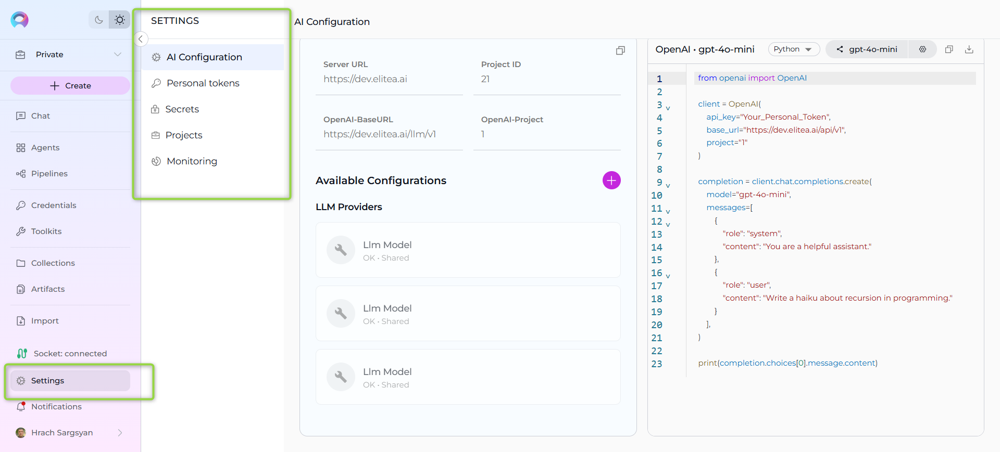

## AI Configuration

The **AI Configuration** section serves as the central hub for managing essential technical settings that enable the smooth operation of ELITEA's features, such as Alita Code or Alita Code Chat. This section provides configuration details and management for AI models and related services within your project environment.

**Note**: The available settings and configurations may vary depending on the project selected. It's important to select the appropriate project from the project dropdown menu to access specific configurations relevant to that project.

### Key Configuration Fields

**Server Configuration:**

* **Server URL** - The base server URL for your ELITEA instance (e.g., `https://nexus.elitea.ai`)
* **Project ID** - The unique identifier for your current project, used for API calls and service requests
* **OpenAI-BaseURL** - The API endpoint URL for OpenAI-compatible services, typically formatted as `{server_url}/llm/v1`
* **OpenAI-Project** - The project identifier used for OpenAI API compatibility (displayed when a model is selected)

**Copy Configuration Features:**

All configuration fields in the AI Configuration section include convenient copy functionality:

* **Individual Field Copy** - Each configuration field displays a copy button (📋) when you hover over it
* **Click to Copy** - Simply click the copy button next to any field to copy its value to your clipboard
* **Copy All Configuration** - Use the copy icon (📋) in the top-right corner to copy all configuration details at once
* **Automatic Feedback** - A toast notification confirms when values are successfully copied
* **Code Examples** - Generated code snippets include copy buttons for easy integration into your projects

This copy functionality makes it easy to transfer configuration values between different environments, share settings with team members, or integrate values into your development workflow.
   

### Integration Options

The **Integration Options** section allows you to select and configure AI models from your available integrations:

* **Model Selection Dropdown** - Choose from configured LLM models available in your project
* **Model Capabilities Display** - View supported capabilities of the selected model (Chat, Completion, Embeddings, Function Calling, etc.)
* **Configuration Details** - Access technical details and settings for the selected model
* **IDE Configuration Generation** - Download configuration files for VS Code and JetBrains IDEs

**Download Configuration Files:**

After selecting a model from the Integration Options, you can download code examples in three different formats:

* **cURL Example** - Download `api_example.sh` file with command-line API usage examples
* **Node.js Example** - Download `api_example.js` file with JavaScript/Node.js integration code
* **Python Example** - Download `api_example.py` file with Python API integration examples
* **Pre-configured Parameters** - Downloaded files include server URL, project ID, model settings, and authentication details
* **Ready-to-Use Code** - Each example contains complete, functional code that you can immediately use in your projects
* **Multiple Language Support** - Choose the programming language that best fits your development environment

These downloadable code examples provide ready-to-use integration templates, eliminating the need to write API integration code from scratch.

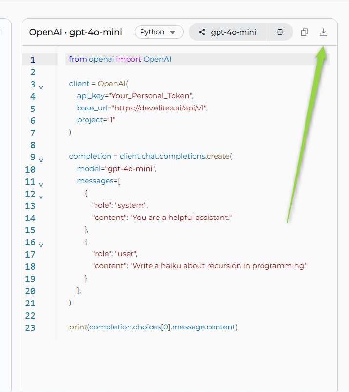

### Available Configurations

The lower section displays organized categories of your configured integrations:

**LLM Providers**
* Lists configured Large Language Model providers and their associated models
* Shows both personal and shared configurations within the project
* Displays model configurations with status indicators (OK • Shared)

**Vector Storage**
* Displays configured vector database connections for embeddings and similarity search
* Includes providers like PGVector and other supported vector stores

**Embedding Models**
* Shows configured embedding model integrations for text processing and similarity calculations
* Lists available embedding providers and their specific models

**AI Credentials**
* Manages authentication credentials for AI service providers
* Securely stores API keys and tokens for various AI platforms

Each configuration section displays the configuration name, type, and sharing status (personal vs. shared). You can create new configurations using the `+` button in the Available Configurations header.

  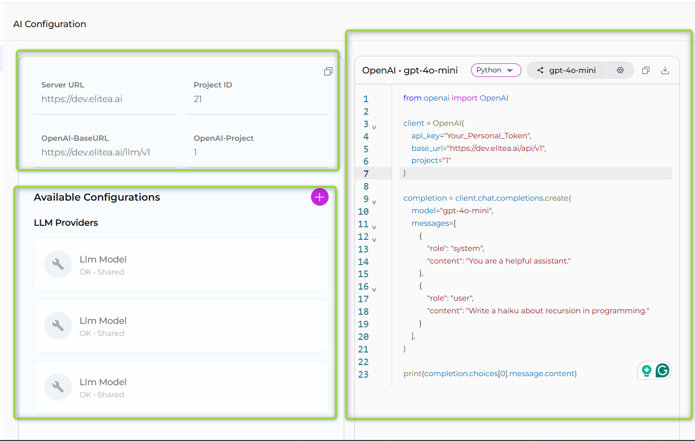

### Creating Model Credentials

To create new model credentials for AI service providers:

1. **Access Credential Creation:** Click the `+` button in the Available Configurations section or navigate to Credentials menu and select **+ Create**

2. **Choose Credential Type:** Select from the following options:
   * **AzureOpenAI** - For Azure OpenAI service integrations
   * **LlmModel** - For general Large Language Model configurations 
   * **PgvectorConfig** - For PostgreSQL vector database connections

   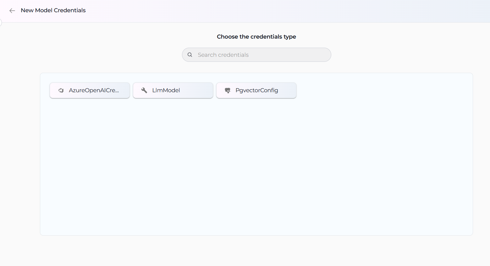

3. **Configure Credential Details:** Enter a descriptive name for the credential, provide required authentication information (API keys, endpoints, tokens), and configure service-specific parameters based on the selected type

4. **Save:** Click **Save** to make the credential available for use

5. **Integration Usage:** Once saved, credentials appear in relevant configuration sections. Use the credentials when setting up agents, toolkits, or other integrations, and generate code examples showing how to use the configured endpoints

## Personal Tokens

The **Personal Tokens** section allows you to create and manage personal access tokens that are essential for API access and IDE integrations. These tokens enable secure communication between your applications, scripts, and development environments with ELITEA's backend services.
 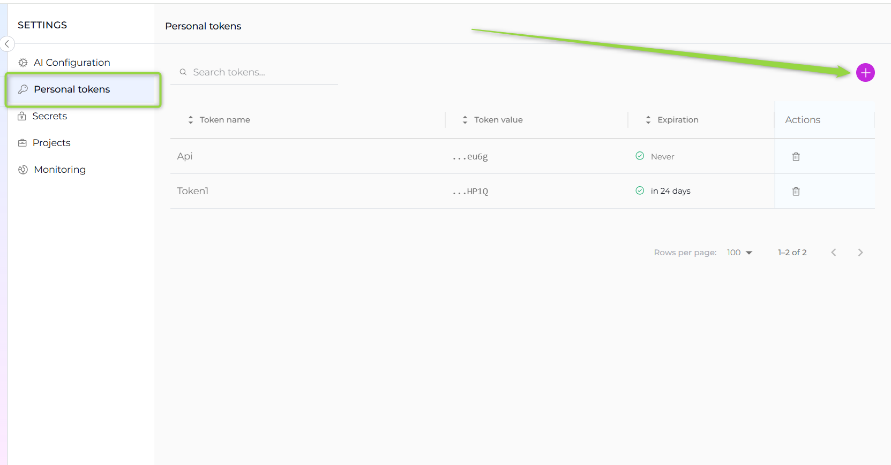

**Creating a Personal Token:**

1. Navigate to the **Personal Tokens** section in Settings.
2. Click the `+` icon to create a new token.
3. Enter a descriptive **name** for the token and set an **expiration date**.
4. Click **Generate** to create the token.
5. **Important**: Immediately copy and securely store the generated token - it will not be visible again once you close the dialog.

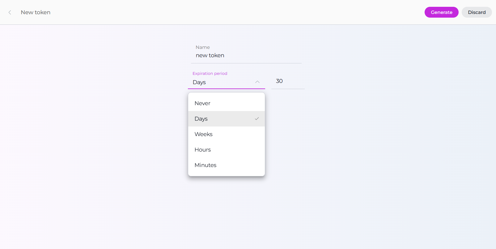
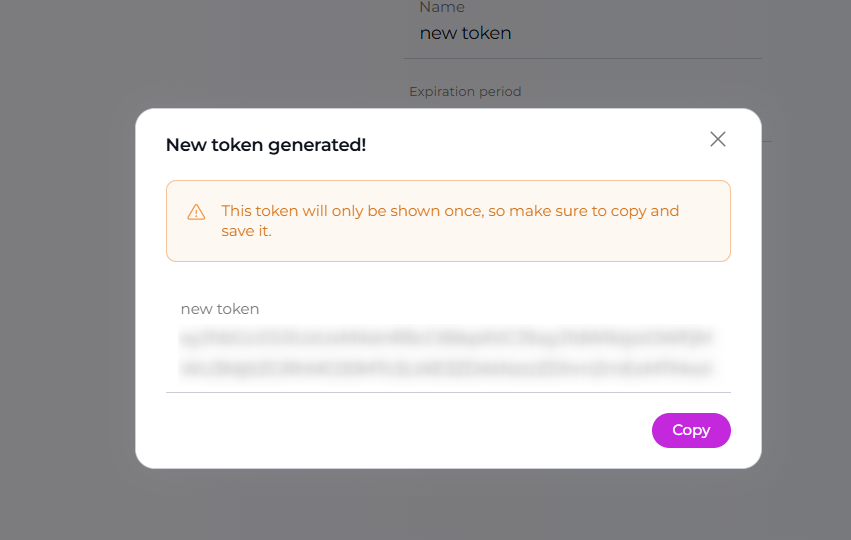

**Managing Personal Tokens:**

* **Token Security**: Once a token is generated, it cannot be viewed again. Make sure to copy and store it securely during creation.
* **Token Expiration**: Monitor token expiration dates and renew tokens before they expire to avoid service interruptions.
* **Deleting Tokens**: Click the delete icon (🗑️) in the Actions column to permanently remove a token. This action cannot be undone, so ensure the token is no longer needed before deletion.

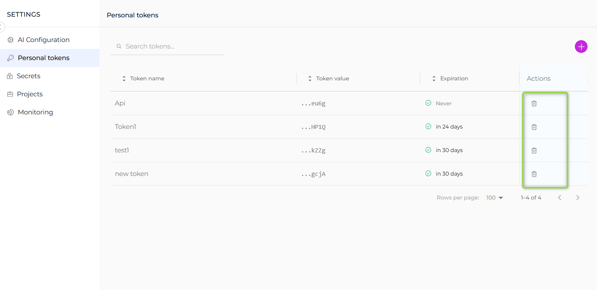

For detailed IDE setup instructions, refer to the [Alita Code Documentation](../extensions/elitea-code.md).

## Secrets

**Note**: The **Secrets** section is not available for public projects. This feature is only accessible in private and organization projects where enhanced security controls are required.

The **Secrets** feature in ELITEA serves as a secure vault designed to store and manage sensitive information such as passwords, tokens, API keys, and other authentication details. This centralized system allows you to configure secrets once and utilize them across various components, such as Agent's toolkits within ELITEA.

  

**Creating a Secret**:

To add a new secret to the vault, follow these steps:

1. Click the `+` icon to initiate the creation of a new secret.
2. Enter a descriptive name for the secret to help you identify its use.
3. In the Value field, input the token, password, API key, or any other authentication details.
4. Once configured, this secret can now be selected and used within various components of ELITEA.

  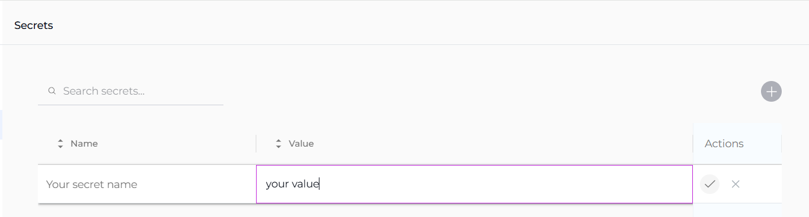

**Managing Secrets**:

The management of secrets is straightforward and secure, facilitated by the **Secrets** table which displays all your configured secrets:

* **View Secret**: Click the **Eye** icon to reveal the value of a configured secret. This allows you to quickly check the details without modifying them.
* **Copy Secret**: Easily copy the secret value to your clipboard (by clicking the hidden value) for use in configurations or integrations.
* **Hide Secret**: Hide the secret from the interface to maintain security when not actively managing the secret.
* **Modify Secret**: Update the value of the secret if the existing credentials change or need to be corrected.
* **Delete Secret**: Remove a secret permanently from the vault if it is no longer needed or if security concerns necessitate its deletion.

This feature enhances the security and efficiency of managing sensitive information within ELITEA, ensuring that authentication details are handled in a secure, centralized manner.

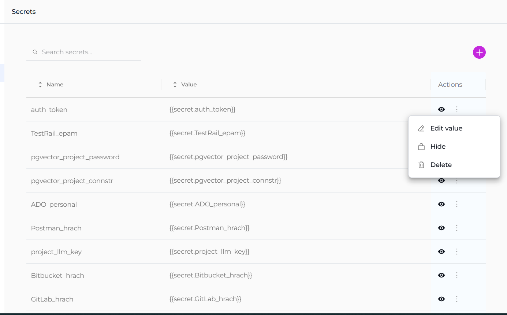

## Projects

The **Projects** section is specifically designed for administrators and becomes accessible when you hold administrative privileges in any project other than your private project within ELITEA. **Note**: It's important to select the appropriate project from the project dropdown menu to access specific configurations relevant to that project.

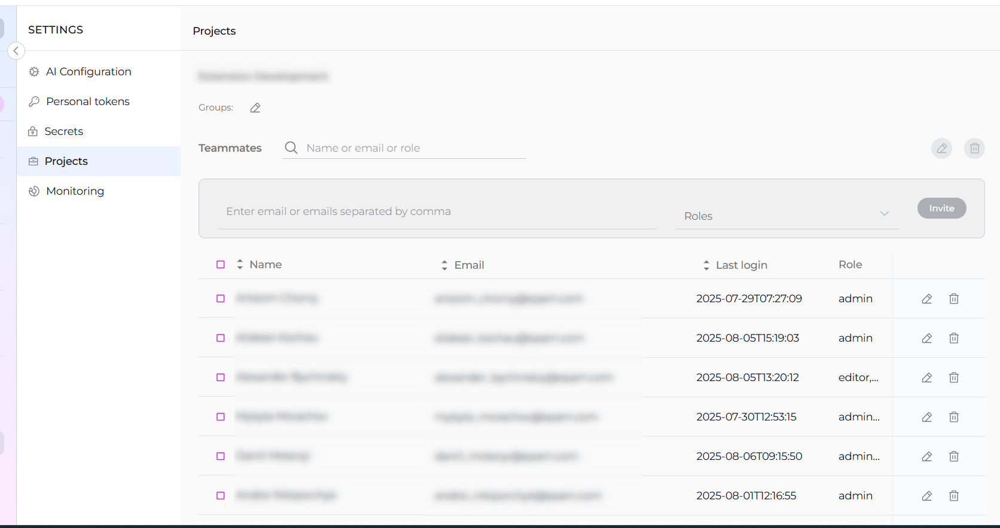

### Groups

The **Groups** feature in ELITEA is designed to facilitate efficient management and monitoring of multiple projects by admins or managers. This feature allows you to consolidate several projects under a single group, making it easier to oversee and coordinate activities across these projects.
If you are an admin of two or more projects, you can leverage the Groups feature to organize and monitor your projects collectively:

* **Create a New Group**: Click the **Pencil** icon to initiate the creation of a new group. You will be prompted to name the group and select the projects you wish to include.

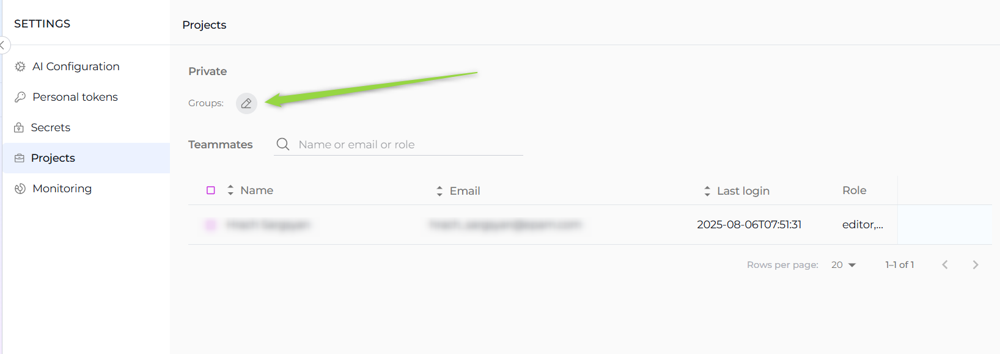

* **Add Projects to Existing Group**: If you already have established groups, you can add additional projects to these groups.

This grouping functionality not only simplifies the administrative workload but also enhances the visibility and control over multiple projects, enabling more effective management and monitoring.

### Teammates

The **Teammates** feature in ELITEA is specifically crafted to streamline the process of collaborating within projects by allowing you to invite new users (teammates) and assign them appropriate roles. These roles include system, admin, editor, and viewer, each providing different levels of access and control within the project. 

**Note**: Only users with an admin role are empowered to invite new members. This ensures that the invitation and role assignment process is managed by users with appropriate authority and understanding of the project's needs.

**Inviting New Teammates**:

1. Enter the prospective member's email address in the **Email Address** input field.
2. Select their role from the **Role** dropdown menu. 
3. Click the **Invite** button. 
4. An invitation will be sent, and upon their first login, their details will be added to the **Teammates**, activating their account.

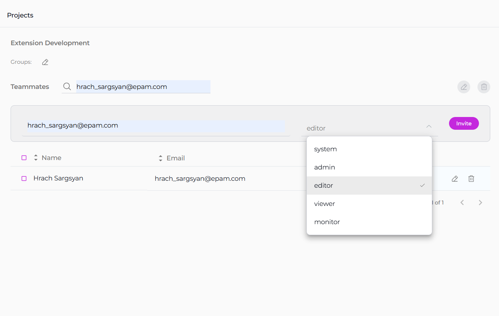

**Notes**

* Multiple users can be invited simultaneously by separating email addresses with a comma.
* For Epam projects, use the invitee's Epam email. For customer projects, the customer's Active Directory is utilized for invitations.

**Managing Teammates**:

The **Teammates** table displays all members, their roles, and their last login information. Admins can modify a user's role or revoke access by clicking the respective **Edit** or **Delete** icons next to a user's name.
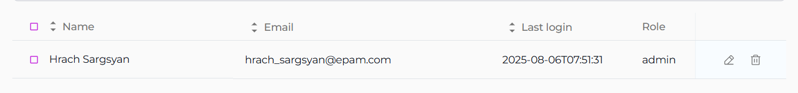

## Monitoring

The **Monitoring** feature in ELITEA is designed to provide a comprehensive overview of the application's usage and performance. This feature is essential for administrators and users who want to gain insights into various aspects of the application, from user engagement to the effectiveness of configured artifacts like agents and conversations. By leveraging the detailed charts and statistics available within the Monitoring feature, you can make informed decisions to optimize the performance and user experience of your ELITEA application.

### Configuration Options

At the top of the **Monitoring** page, you have several options and settings to configure the charts and metrics you wish to monitor:

* **Projects**: A dropdown list allowing you to select the project. **Note**: For your Private project, you can only see your private project data. If you have an admin role in other projects, you can select other projects to monitor.
* **From and To Date Fields**: These fields are used to select the time period for which you want to see the data.
* **Aggregation**: A dropdown list providing options to view aggregated data over different time periods. You can choose from `Hour`, `Day`, `Week`, `Two Weeks`, `Three Weeks`, and `Month` to tailor the data aggregation to your specific needs.
* **Type**: A dropdown list allowing you to select between `Agents` and `Conversations` to focus your monitoring on specific elements.
* **Name**: A dropdown list to select specific items by name, such as created agents or conversations.
* **Users**: A dropdown list to select which users' data you want to monitor. **Note**: For your private project, you can only see your own user data. If you have an admin role in another project, you can select other users to monitor.

To apply any changes or selections, click the **Apply** button. Use the **Refresh** button to update the monitoring data based on the latest activities and configurations.

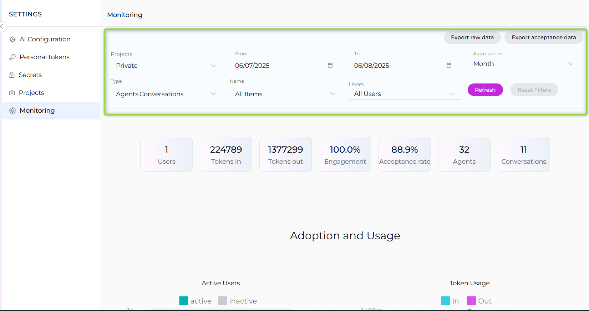

### Key Metrics

Below the configuration options, you'll find an overview of key metrics that give you a snapshot of the current state of the system:

* **Users**: The total number of users interacting with the ELITEA application.
* **Tokens In**: The number of tokens consumed by the ELITEA application.
* **Tokens Out**: The number of tokens generated by the ELITEA application.
* **Engagement**: The percentage of active users out of all users who logged into ELITEA for the selected period, indicating the level of interaction with the application.
* **Acceptance rate**: The percentage of interactions during the selected period where users accepted the generated output by copying, downloading, or saving it, reflecting user satisfaction and utility of the results.
* **Agents**: The total number of agents created.
* **Conversations**: The total number of conversations created.

These metrics are accompanied by a date range selector, allowing you to filter the data for a specific period.

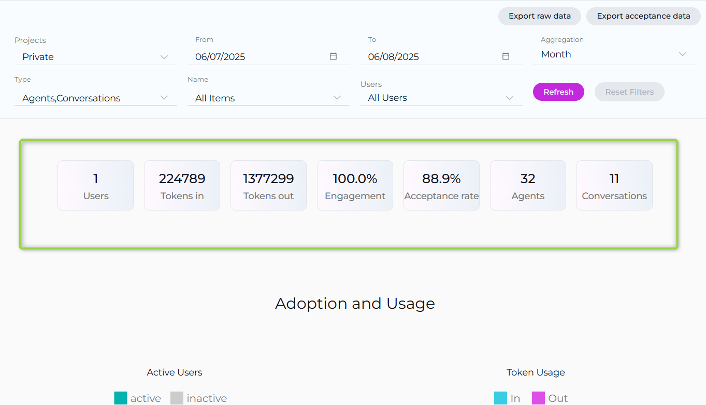

### Available Charts

The Monitoring feature provides several chart types to help you analyze different aspects of ELITEA usage:

#### Adoption and Usage

* **Active Users**: A bar chart displaying the number of active users over time.
* **Token Usage**: A line chart showing the tokens consumed (In) and generated (Out) over time.

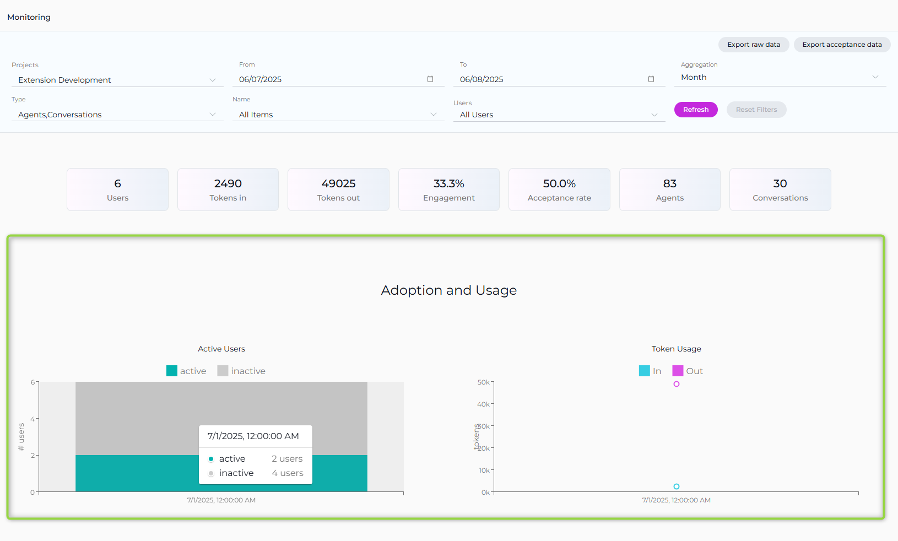

These charts provide insights into user engagement and the application's token economy.

#### Acceptance Rate

The **Acceptance Rate** chart provides a comprehensive view of user interactions with the ELITEA application, focusing on how often users accept the generated outputs. This chart helps you assess how frequently users find the generated outputs useful enough to accept by copying, downloading, or saving them.

* **Accepted Interactions**: Shows the count of interactions where users have accepted the generated output, indicating satisfaction and utility.
* **Not Accepted Interactions**: Reflects the number of interactions where users did not accept the output, suggesting areas for potential improvement in response quality.

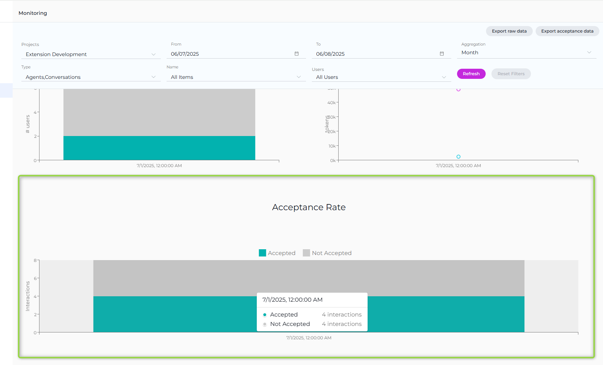

### Project Group Support

When you have administrative access to multiple projects, the Monitoring feature supports project grouping:

* **Project Treemap**: Visual representation of projects within a selected group, allowing you to drill down into individual project metrics.
* **Portfolio-Level Monitoring**: Aggregate metrics across multiple projects for high-level oversight.

### Data Export

The Monitoring feature includes comprehensive export capabilities to help you create reports and share insights with stakeholders. Two main export options are available in the top-right corner of the Monitoring interface:

#### Export Raw Data

The **Export raw data** option allows you to export comprehensive monitoring data based on your current filter selections. This export includes:

* All metrics data for the selected time period
* User activity information
* Token usage statistics
* Agent and conversation performance data
* Chart data points and trends

#### Export Acceptance Data

The **Export acceptance data** option provides focused export of user acceptance metrics, including:

* Acceptance rate statistics
* User interaction data showing accepted vs. not accepted outputs
* Detailed acceptance trends over time
* Performance indicators related to user satisfaction

#### Export Formats

Both export options support multiple file formats to accommodate different analysis needs:

* **JSON**: Machine-readable format ideal for data processing and integration with other tools
* **Excel**: Spreadsheet format perfect for detailed analysis, pivot tables, and business reporting
* **CSV**: Comma-separated values format for compatibility with various data analysis tools and databases

#### Using Export Features

1. Configure your monitoring filters (Projects, Date Range, Type, Name, Users, Aggregation)
2. Click **Refresh** to apply your filter settings
3. Choose either **Export raw data** or **Export acceptance data** from the export dropdown
4. Select your preferred format (JSON, Excel, or CSV)
5. The file will be downloaded to your device for further analysis

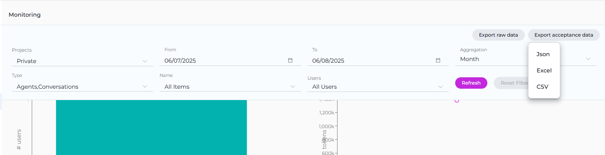
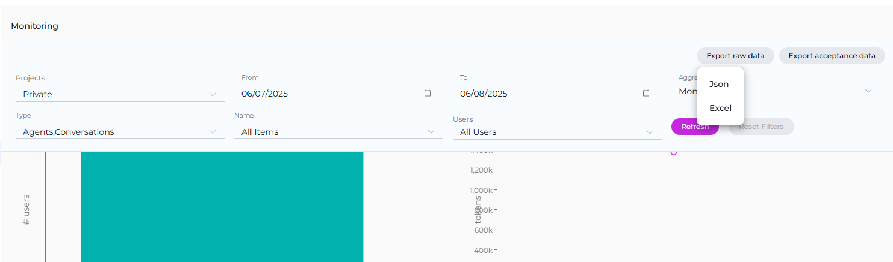

These export capabilities enable you to perform deeper analysis, create custom reports, share data with stakeholders, and integrate monitoring insights into your existing reporting workflows.