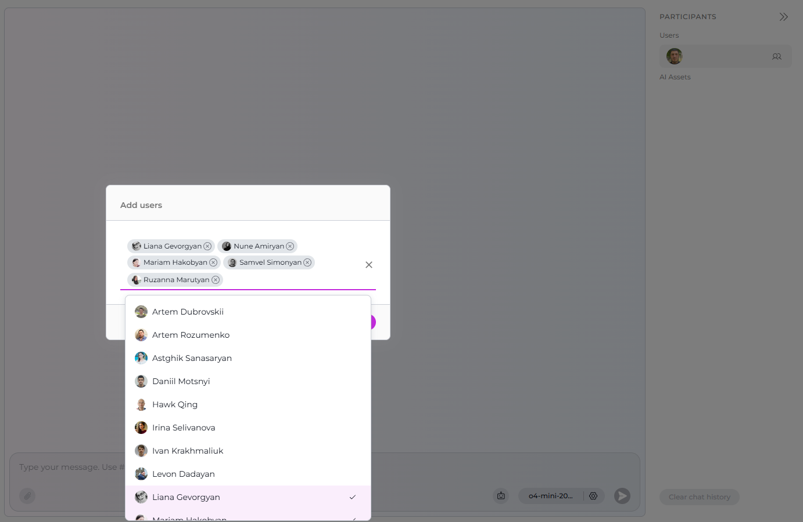
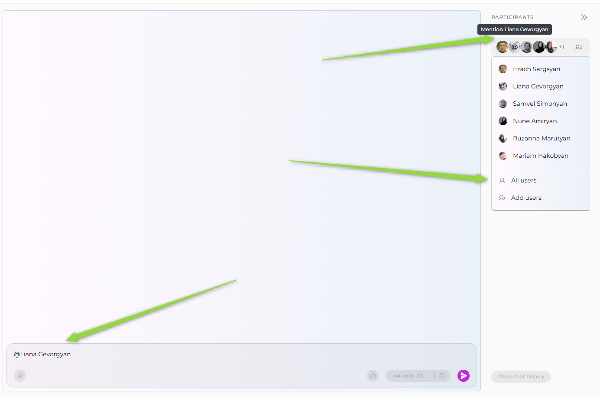

# Quick Guide: Adding Teammates and Collaborating in ELITEA Chat

---

## 1. Add Teammates to a Conversation

1. Navigate to your team's Project in ELITEA.
2. Open your conversation in ELITEA Chat.
3. In the **PARTICIPANTS** panel, click the users icon next to your avatar to see the **Add users** option, then click **Add users**.
4. The **Add users** modal will appear. Use the search bar to find teammates by name.
5. Select one or more users from the list.
6. Click **Add** to confirm. The selected users will be added as participants to your chat.

   

   

---

## 2. Manage Participants

- **View Participants:**  
  All added teammates are visible in the **PARTICIPANTS** section on the right.

- **Remove a User:**  
  Hover over the user and click the **Remove** icon next to the user name, then confirm removal in the dialog.

- **Mention Users:**  
  Hover over user avatars in the participant list or type **@username** in the chat input to mention and notify teammates in the conversation. To mention everyone in the conversation, select the **All Users** option.

   

---

## 3. Collaborative Features

- All added users can send messages, interact with content, and use chat features together.
- Participants can be mentioned for direct notifications.
- The chat layout shows all participants and their status for transparent collaboration.

---

## 4. Tips

- Use the search bar in the add users modal to quickly find teammates.
- Mention users with **@** to get their attention on important updates.
- Remove users if they no longer need access to the conversation.

---

## 5. More Resources
 
- [ELITEA Chat Documentation](../platform-documentation/menus/chat.md)
- [How to Use Chat Functionality](how-to-use-chat-functionality.md)

---