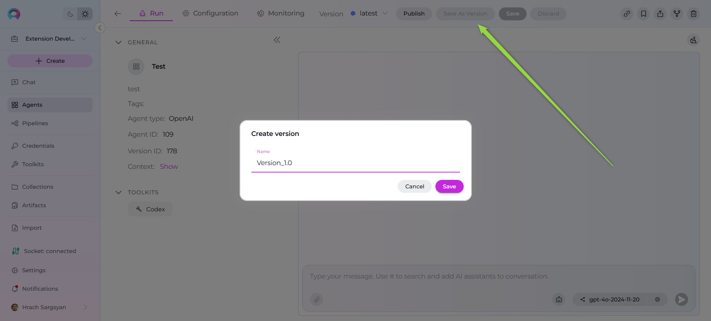
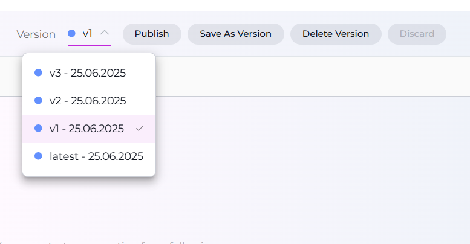
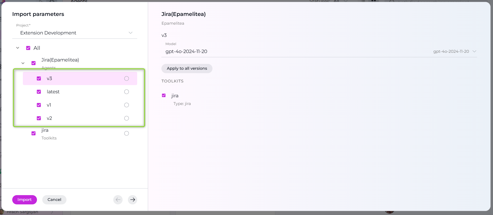

# Agent Versioning Quick Guide

## Overview

Agent versioning in ELITEA allows you to create, manage, and track different iterations of your agents. This feature enables you to maintain multiple versions of an agent while preserving the ability to revert to previous configurations, compare changes, and publish specific versions.

## Key Concepts

**Latest Version**: The initial version created when you first save an agent. This version can be continuously updated without creating new versions.

**Named Versions**: Specific snapshots of your agent configuration that are saved with custom names for easy identification and management.

**Version History**: A complete record of all versions created for an agent, including creation dates, status, and author information.

## Creating and Managing Agent Versions

### Initial Save (Latest Version)

1. **Create Your Agent**: Configure instructions, tools, settings, and other parameters
2. **Click Save**: This creates the "latest" version of your agent
3. **Continue Editing**: You can modify and save changes to the "latest" version without creating new versions

**Note:** The "latest" version represents your working draft and can be updated continuously.

### Creating New Versions

When you want to preserve a specific configuration:

1. **Click "Save As Version"** button in the top toolbar
2. **Enter Version Name**: Provide a descriptive name for your version
   - Keep names under 48 characters
   - Avoid special characters and spaces
   - Use clear, descriptive names (e.g., "production-v1", "beta-testing")
3. **Click Save**: The new version is created and becomes the current active version

**!!! Warning:** Version names must be unique within the agent. The system will prevent duplicate names.

### Version Selection and Navigation

**Using the Version Dropdown**:

  -  Located in the top toolbar next to the agent name
  -  Shows all available versions with creation dates
  -  Click any version to switch and view its configuration

**Version Information Display**:

 - Version ID and name
 - Creation date and time
 - Author information (in public projects)

### Version Management Actions

**For Any Version (except "latest")**:

 - **Delete Version**: Removes the version permanently
 - **Switch Between Versions**: Use the version dropdown
 - **Publish Version**: Submit for moderation and public availability

**Delete Version Process**:

1. Select the version you want to delete
2. Click "Delete Version" button
3. Confirm deletion in the dialog
4. System automatically redirects to remaining version

**Note:** The "latest" version cannot be deleted as it serves as the primary working version.

 

## Publishing Versions

### How to Publish

1. **Select Target Version**: Switch to the version you want to publish
2. **Click "Publish"** button in the toolbar
3. **Enter Version Name**: Provide a name for the published version
4. **Submit for Review**: The version goes to moderation queue

### Publishing Process

- **Moderation Review**: All published versions require moderator approval
- **If Approved**: Version becomes publicly available
- **If Rejected**: You receive feedback and can resubmit after modifications

## Best Practices

### Version Naming Conventions

- **Use Semantic Versioning**: `v1.0`, `v1.1`, `v2.0`
- **Include Purpose**: `production-release`, `beta-test`, `hotfix-001`
- **Date-based**: `2024-01-15-release`, `jan-2024-update`
- **Feature-based**: `enhanced-search`, `multi-lang-support`

### Version Management Strategy

1. **Keep "latest" for Development**: Use for ongoing work and experimentation
2. **Create Named Versions for Milestones**: Save stable configurations
3. **Publish Tested Versions**: Only submit well-tested versions for publication
4. **Document Changes**: Use descriptive names that indicate what changed

### Workflow Recommendations

**Development Workflow**:

1. Work on changes in "latest" version
2. Test thoroughly in Chat interface
3. Create named version when stable
4. Continue development in "latest"
5. Publish stable versions for public use

**Team Collaboration**:

- Create versions before major changes
- Use consistent naming conventions
- Document version purposes
- Test versions before publishing

## Version Export and Import

**Export Capabilities**:

- Export includes all versions of the agent
- Complete configuration preserved
- Tool settings included (excluding credentials)

**Import Options**:

- Select specific versions to import
- Choose target project
- Configure LLM models for each version

**Tip:** It's recommended to import the "latest" version to avoid validation errors.

## Troubleshooting

**Cannot Delete Version**:

- Ensure you're not trying to delete the "latest" version
- Check that you have proper permissions
- Verify you're not on the version you're trying to delete

**Version Not Found**:

- Refresh the page to reload version list
- Check if version was deleted by another user
- Verify project permissions

**Publishing Issues**:

- Ensure all required fields are completed
- Check that tools are properly configured
- Verify model settings are valid

---

*For detailed information about agent creation and configuration, see the [Agents documentation](../platform-documentation/menus/agents.md). For terms and concepts, refer to the [ELITEA Glossary](../home/glossary.md).*
