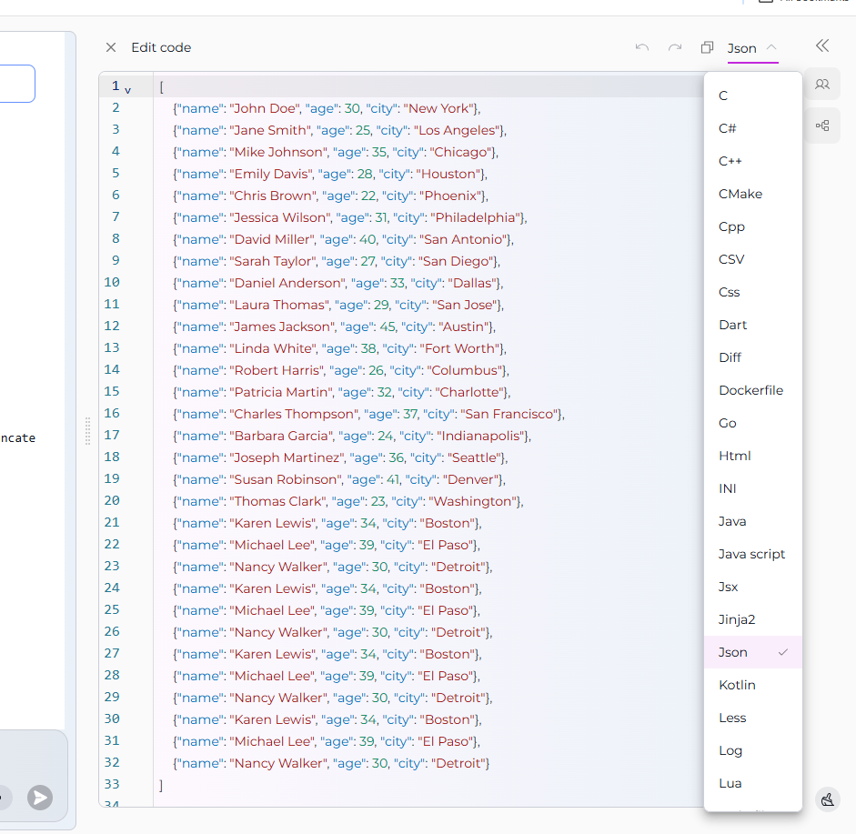
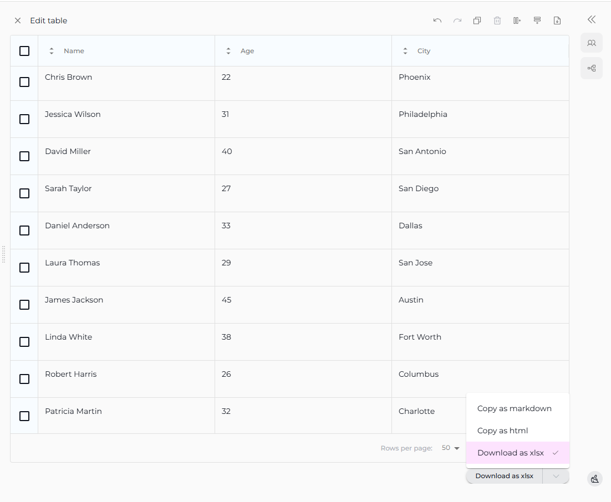
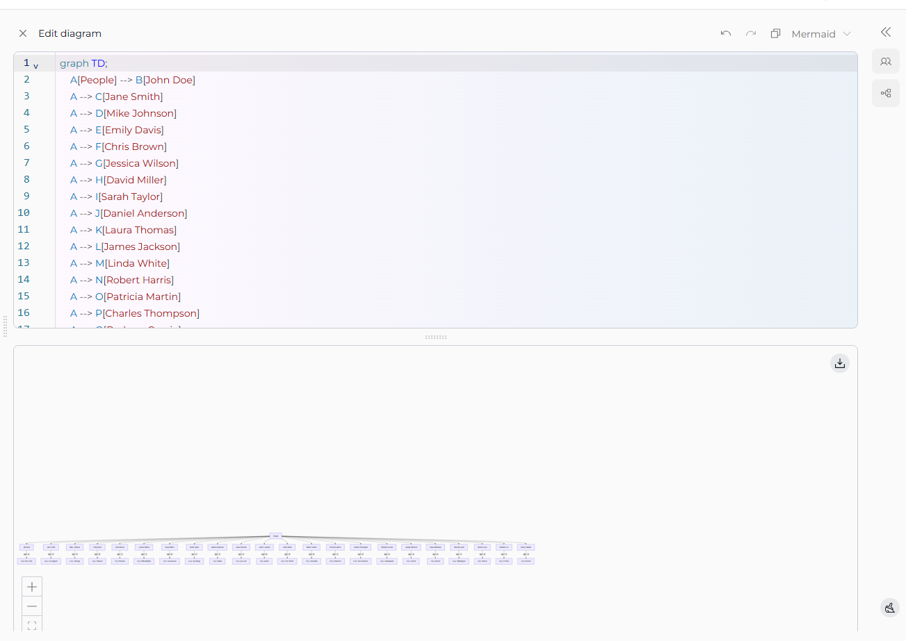

# Quick Guide: Working with Canvas in ELITEA Chat

---

## 1. What is Canvas?

Canvas is a built-in editor in ELITEA Chat that allows you to seamlessly edit, refine, and manage AI-generated code, tables, and diagrams directly within your conversation—without switching to external tools.

---

## 2. How to Activate Canvas

1. In your chat conversation, ask ELITEA to generate code, a table, or a diagram.
2. Canvas appears automatically when an AI participant (Agent, Pipeline, or LLM Model) generates:
- **Code blocks**
- **Markdown tables**
- **Mermaid diagrams**
3. When you see the content block you want to edit, locate the **pencil icon (✏️)** at its top-right corner.
4. Click the **pencil icon (✏️)** to open the content in the Canvas editor.
5. The Canvas editor will appear in a modal window, letting you make direct changes.

    
---

## 3. Core Canvas Features

- **Edit Directly:**  
  Modify code, table cells, or diagram text right in the editor.

- **Universal Controls:**  
  Use **copy**, **undo/redo**, **save**, and **export/download** actions across all editors.

- **Content-Specific Tools:**  
  - **Code Editor:** Syntax highlighting, find/replace, code folding.

     

  - **Table Editor:** Add/remove rows & columns, sort/filter data, import/export (CSV/XLSX).

     

  - **Diagram Editor:** Live Mermaid preview, syntax highlighting, export as PNG/JPG/SVG.

    

- **Seamless Collaboration:**  
  Edits are saved back to the conversation for continued team collaboration.

---

## 4. Best Practices and Tips

- Use Canvas to polish content before sharing or exporting.
- Save your changes frequently.
- Export your work in various formats (e.g., .py, .xlsx, .png) as needed.

---

## 5. More Resources
 
- [ELITEA Chat Documentation](../platform-documentation/menus/chat.md)
- [How to Use Chat Functionality](how-to-use-chat-functionality.md)