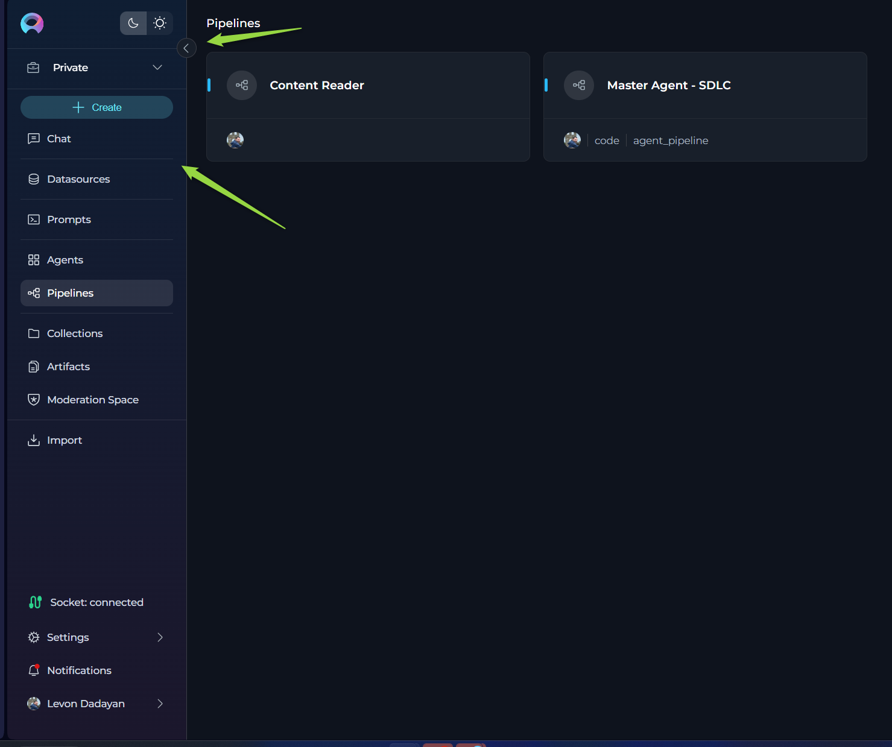
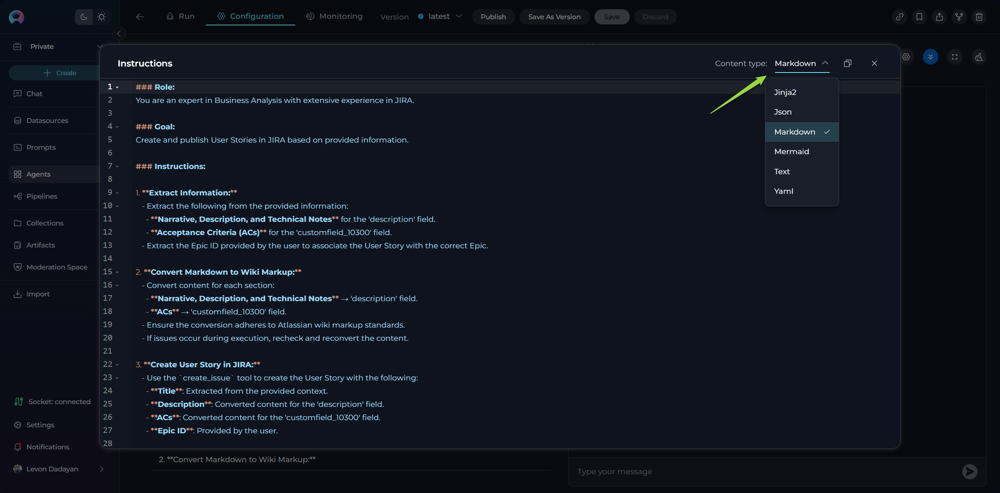

# ELITEA Release Notes

## Introduction

Discover **ELITEA** — your all-in-one platform for working with Generative AI and managing data-driven projects. ELITEA goes far beyond a simple repository: it’s a flexible workspace where you can create, organize, and collaborate on prompts, datasources, agents, pipelines, and collections with ease. From building complex workflows to managing AI assistants or connecting external tools, ELITEA gives you everything you need to bring your ideas to life.

## Information

* **Release Version**: 1.5.1
* **Released on**: 30-Apr-2025
* **Access**: [ELITEA Platform](https://nexus.elitea.ai)

## New Features

### Smart Drawer Navigation

Meet the new **Smart Drawer**! Effortlessly move through ELITEA with a sleek, collapsible menu that adapts to your workflow. Collapse the Drawer to see only intuitive icons with helpful tooltips, or expand it to reveal full menu names and options. Seamlessly switch between **Private/Public** workspaces and **Team** projects - all from this modern, space-saving navigation hub.  
This enhancement makes navigation faster, more intuitive, and visually engaging.

### CodeMirror Syntax Highlighting Everywhere

All relevant input fields and code boxes in ELITEA now feature **CodeMirror** support. Enjoy syntax highlighting, improved readability, and a modern editing experience. You can dynamically switch the syntax highlighting mode directly within each input field, making it easier to work with different content types.  
**Currently supported languages:** Text, YAML, Jinja2, JSON, Markdown, and Mermaid.

### Remove Pipelines from Collections in Table View

Managing your Pipelines just got easier! You can now quickly remove Pipelines from Collections directly from the Table View, giving you more control and flexibility over your workspace organization.

## Changed Features

No changes in this release.

## Fixed Issues

* **Pipeline Tool Node Rename**: Fixed an issue where renaming a tool node in a pipeline caused the toolkit to disappear.
* **Pipeline Node Connections**: Resolved a problem where creating a connection between two nodes failed because the transition name was not updated in YAML.
* **Pipelines in Collections**: Pipelines now correctly appear under the Pipelines section in Collections, instead of being listed under Agents.
* **Save as Version for Nested Toolkits**: Fixed a bug where the "Save as Version" action failed after changing the agent version in a nested toolkit.
* **Artifact Toolkit Naming**: The Artifact toolkit now prevents creating buckets and files with disallowed characters, ensuring better compatibility and data integrity.
* **Agent and Toolkit Stability**: Addressed several minor issues affecting the stability and reliability of agents and toolkits, resulting in smoother operation and fewer unexpected errors.
* **General Usability Improvements**: Various general fixes and enhancements have been implemented across the platform to improve overall usability, responsiveness, and user experience.

## Known Issues

* **GIT Source Authentication**: SSH authentication for GIT sources fails. **Workaround**: Use HTTPS with Username and Password.
* **Collections Import**: After importing Collections, new collections are not being created under the Collections section.
* **Test Connection**: The test connection functionality for the toolkit is currently experiencing issues and may not operate correctly.
  **Confluence Dataset Label Filtering**: When using multiple labels (two or more) as a filter while creating a dataset of Confluence type, an error occurs. The system raises an `ApiValueError`, indicating that the CQL (Confluence Query Language) is invalid or missing. **Workaround**: Use a single label as a filter to avoid this issue.
* **"Add to Collection" Option Missing in Table View for Public Projects**: When working within a Public project, users currently can add entities (e.g., Prompts) to a Collection only from the Detailed (List) View. If the user switches to the Cards View and selects a Prompt to view its details, the "Add to Collection" option icon is not displayed. **Workaround**: Use the Detailed (List) View to add entities to Collections until this issue is resolved.