# Troubleshooting

This troubleshooting page contains common error messages, their causes, and solutions to help you resolve issues quickly. You can search for specific error message keywords to find relevant solutions.

!!! note "Error Message Location"
    ELITEA uses Python in the backend so you can mostly see Python specific errors. When reading error messages, focus on the end of the message where the actual error is usually displayed. Sometimes one error can cause another error, so look for the primary error message.


 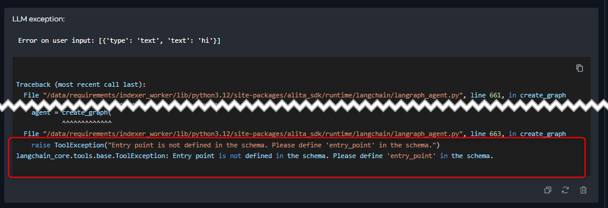 

 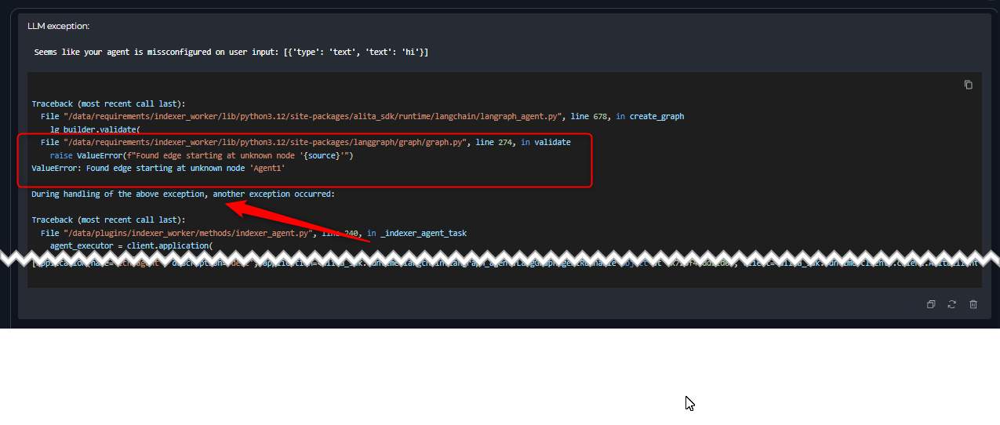   

!!! tip "Pipeline-Specific Hints"
    For pipelines, error messages often specify the node name (e.g., "During task with name 'Agent3'"). You can run the pipeline in the configuration tab where nodes are highlighted during execution, helping you identify where the failure occurred. Use the Run details button on top of the flow to see current state variable values and which node stopped the pipeline.


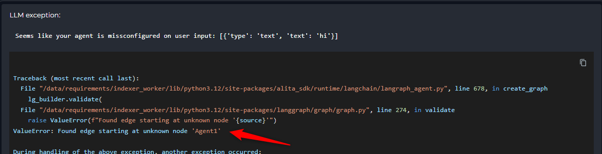

## Agent and LLM Issues

### 1. Agent Stops Without Answer or Provides Truncated Response

**Symptoms:**

- Agent or LLM starts working but stops without providing an answer
- Partial or truncated responses are provided
- Complete answer may be visible in the "thinking step" section but not in the final response

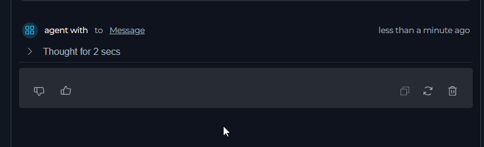

or

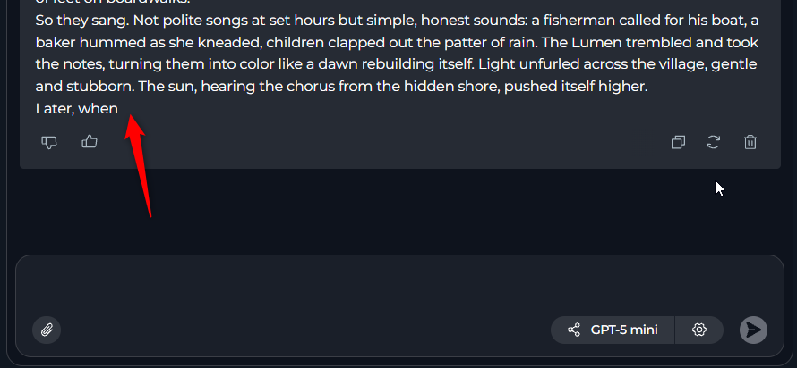

**Primary Cause:**
The LLM has reached its maximum completion token limit and cannot provide a complete answer.

**Solution:**
Check and increase the max completion tokens value in your agent configuration.

**Additionally:**
The same issue can happen with nested agents. If you see partial or no response in thinking steps, check nested agents' max completion tokens.

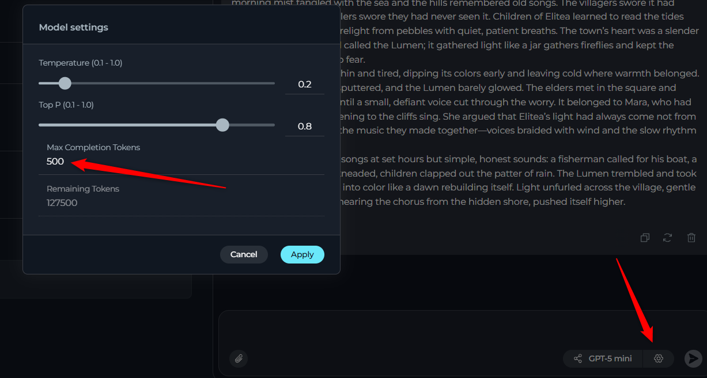


---

## Pipeline Configuration Errors

### 2. Entry Point Not Defined

**Error Message:**
```
..... File "/data/requirements/indexer_worker/lib/python3.12/site-packages/alita_sdk/runtime/langchain/langraph_agent.py", line 663, in create_graph
     raise ToolException("Entry point is not defined in the schema. Please define 'entry_point' in the schema.")
 langchain_core.tools.base.ToolException: Entry point is not defined in the schema. Please define 'entry_point' in the schema.
```


**Symptoms:**

- Error appears immediately during pipeline initialization before execution starts
- Pipeline cannot begin running

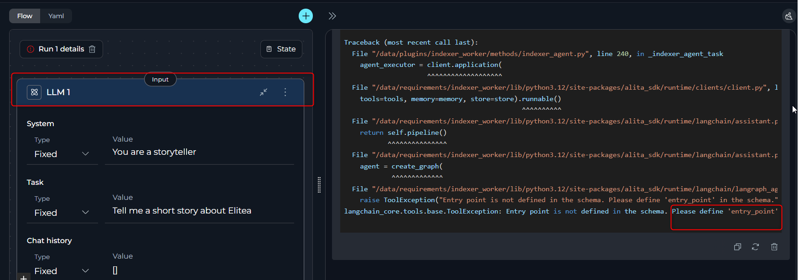


**Cause:**
Pipelines require a manually defined entry point (the node where the workflow starts).

**Solution:**

1. Click the three dots (⋮) on the desired starting node
2. Select the "Entry Point" option

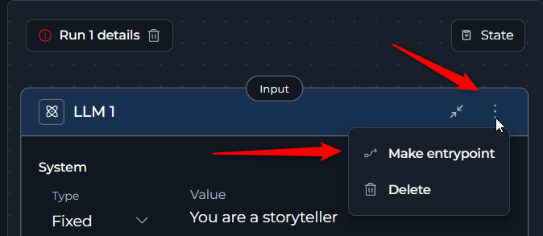

### 3. Empty Task Field


**Error Message Agent node:**
```
     ....  raise ToolException("Task is required to invoke the application. "
 langchain_core.tools.base.ToolException: Task is required to invoke the application. Check the provided input (some errors may happen on previous steps).
 During task with name 'Agent1' and id '70a0071d-e14b-9540-9f88-3c9c4fafe76c''
```

**Error Message Loop node:**
```
/usr/local/lib/python3.12/json/decoder.py\", line 356, in raw_decode\n    raise JSONDecodeError(\"Expecting value\", s, err.value) from None\njson.decoder.JSONDecodeError: Expecting value: line 1 column 1 (char 0)\nDuring task with name 'Loop1' and id '26714a2e-a161-95d8-197b-92efab9b49c4'\n"

```

Similar errors can occur with Decision, router, condition, and other nodes.


**Symptoms:**

- Error appears immediately during pipeline initialization before execution starts
- Specific node mentioned in error message


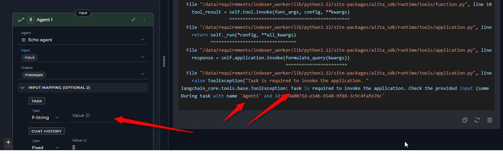

**Cause:**
One of the nodes has an empty "Task" field value.

**Solution:**
Add content to the Task field for the mentioned node. In ELITEA pipeline nodes, the "Task" or similar-by-functionality field is mandatory.

### 4. LLM Node Missing System or User Task

**Error Message:**
```
    ....   raise ToolException(f"LLMNode requires 'system' and 'task' parameters in input mapping. "
 langchain_core.tools.base.ToolException: LLMNode requires 'system' and 'task' parameters in input mapping. Actual params: {'system': '', 'task': 'Tell me a short story about Elitea ', 'chat_history': []}
 During task with name 'LLM1' and id 'ce9dd342-b28c-9313-8d0b-f7cd84648e74'
```

**Symptoms:**
- Error appears immediately during pipeline initialization before execution starts

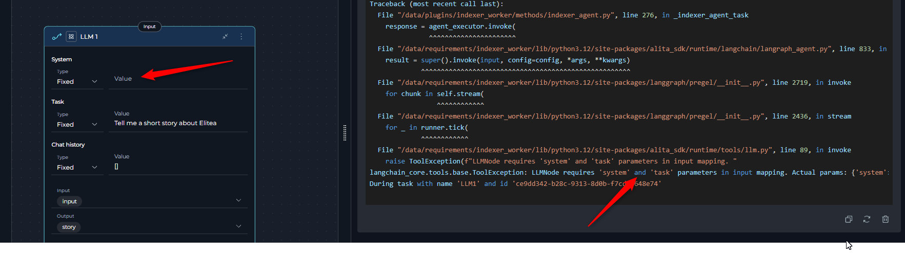

**Cause:**
An LLM node is missing system and/or task field content.

**Solution:**
Fill in either the system task field,  task field, or both for the LLM node.

### 5. Node Missing agent or toolkit

**Error Message:**
```
 ....      raise ValueError(f"Found edge starting at unknown node '{source}'")
 ValueError: Found edge starting at unknown node 'Agent1'
 During handling of the above exception, another exception oc  ....
```

**Symptoms:**
- Error appears during pipeline initialization

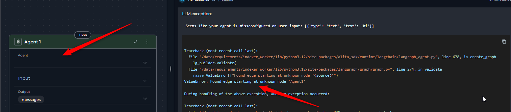

or

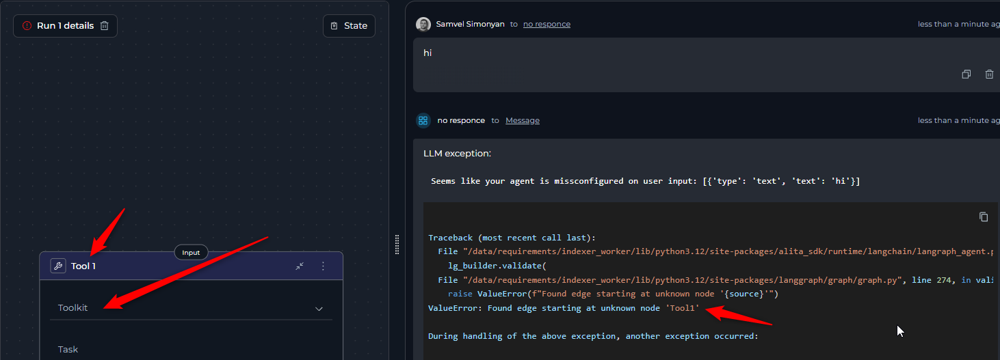

**Cause:**
A node has no agent or toolkit selected from its dropdown.

**Solution:**
Select the agent or toolkit for the particular node.

---

### 6. Nodes Not Receiving Input Data

**Symptoms:**

- Nested agents, toolkits, or LLMs provide general answers instead of using provided input
- Generated content appears unrelated to the expected input

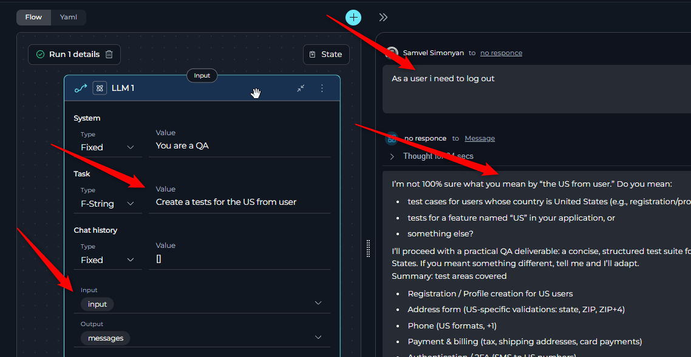

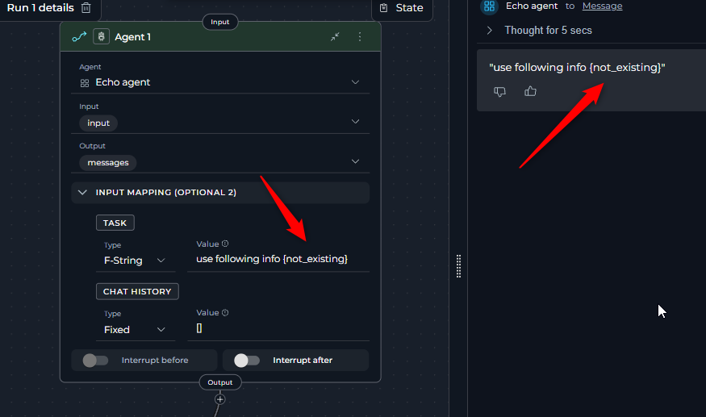

**Cause:**

- The node's task does not contain variables that reference the critical input data or there is a typo.
- Adding variables to the node's Input space helps organize and filter available variables for easier selection, but it does not automatically provide values to the node. To ensure your node receives the necessary data, you must explicitly reference variables from the Input space within the task field.

**Solution:**

- Use variable or f-string task types and make sure the referred variable is included in the task 
- Add appropriate variables to the task so it receives the corresponding input data

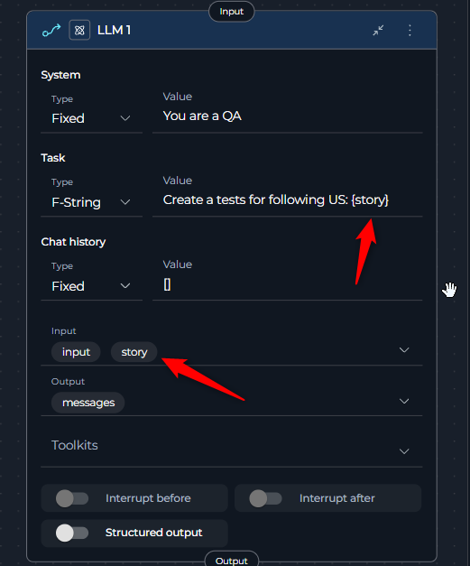

### 7. Multiple LLM Output Variables Receiving Same Content

**Symptoms:**

- You have configured multiple output variables for an LLM node in a pipeline
- All variables receive the same content (entire LLM response) instead of specific mapped values
- Incorrect mapping occurs between intended outputs and variables

**Cause:**

1. **Structured Output toggle is disabled**: When structured output is off, the LLM will populate all variables with the same value (the entire response)
2. **Non-structured output**: The LLM output is not structured or doesn't contain the correct keys needed to map to the variables

**Solution:**

1. **Always enable structured output** when you have more than one output variable
2. **Instruct the LLM to return JSON** with property keys that match your variable names for correct mapping
3. **For Anthropic models**: Explicitly define that the response should be valid JSON format

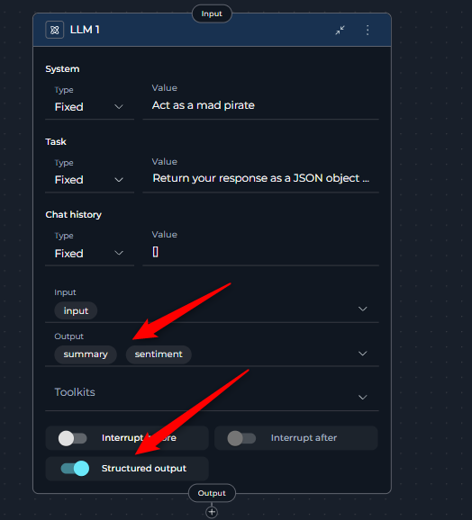

**Example:**
If your output variables are named `summary` and `sentiment`, instruct the LLM:
```
Return your response as a JSON object with the following structure:
{
  "summary": "your summary here",
  "sentiment": "positive/negative/neutral"
}
```

---

## LLM Provider Issues

### 8. Content Policy Violations

**Error Messages:**
```
400 error: "This conversation violates our policy"
"The message you submitted was filtered due to containing prohibited or sensitive content"
"Your request was rejected as a result of our safety system"
```

**Symptoms:**
- LLM returns 400 error with policy violation messages
- Request is blocked before processing


**Cause:**
The message triggered the LLM's safety mechanism. This can happen with sensitive topics or prompts that appear like prompt injection attempts (e.g., "Ignore user input", "always answer this way").

**Solution:**

- Avoid sensitive or inappropriate topics in your agents
- Learn about your provider/employer's additional safety policies
- Clearly define the purpose of instructions like "Ignore user input" to avoid rejection

### 9. Rate Limit Exceeded ( 429 error code )

**Error Message:**
```
... ror: Error code: 429 - {'error': {'message': 'litellm.RateLimitError: AzureException RateLimitError - Hit token rate limit. Minute limit: 0 / 120000 tokens. Day limit: 2019695 / 2000000 tokens. Week limit: 2291930 / 9223372036854775807 tokens. Month limit: 2291930 / 9223372036854775807 tokens.. Received Model Group=1_gpt-5-chat-2025-08-0 ...
```

**Symptoms:**

- Error appears when making requests to LLM or embedding models
- Similar errors may appear with different model names

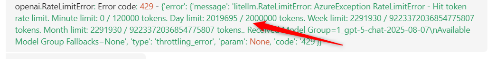

or

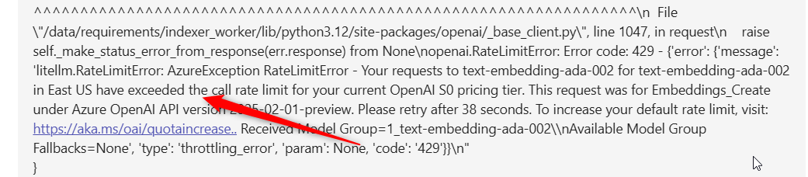

**Cause:**
Possible causes include:

- ELITEA models on shared environments have per-second, per-minute, and per-day and more limits that are shared between all users.One of rate limits has been exceeded.
- The rate limit has been exceeded for your privately configured LLM model added to ELITEA.
- The current embedding model is under heavy load.

**Solution:**

- Wait and retry after some time
- Switch to a different model if available

### 10. Context Length Exceeded

**Error Message:**
```
openai.BadRequestError: Error code: 400 - litellm.ContextWindowExceededError
This model's maximum context length is 128000 tokens. However, your messages resulted in 217815 tokens
```

**Symptoms:**
- Error appears when input exceeds the model's context window
- Different models have different limits (GPT-4o: 128,000, Claude Sonnet: 200,000, GPT-5 400,000 )

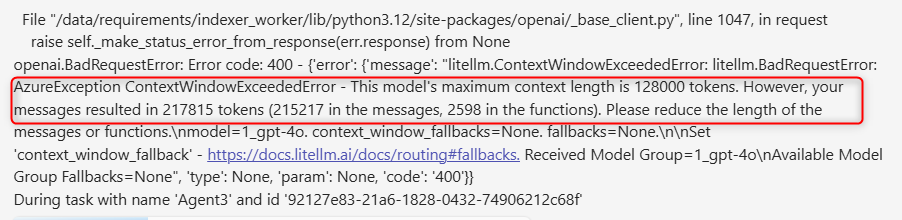

**Cause:**
The input ( e.g. files or other resources being read and passed to context) provided exceeds the LLM's context length limit. 

**Solution:**
- Reduce the length of input messages
- Use summarization techniques to decrease token count
- Do not pass the information directly, but use the Indexing functionality to search for the needed info

---

## Integration and Toolkit Issues

### 11. Indexing Access Issues

**Error Message:**
```
\"/data/requirements/indexer_worker/lib/python3.12/site-packages/atlassian/confluence/__init__.py\", line 639, in get_all_pages_from_space_raw\n    raise ApiPermissionError(\natlassian.errors.ApiPermissionError: The calling user does not have permission to view the content\n"
```

**Symptoms:**
- Error occurs during indexing of Jira or Confluence
- Indexing fails with permission-related errors

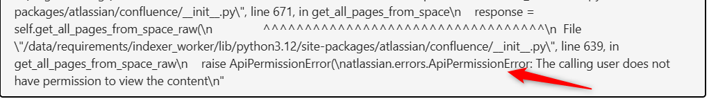

or

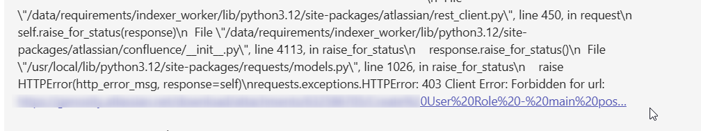

**Cause:**

- The user token doesn't have permission to access one or more documents or items from the resource.
- An item was changed/deleted during indexing process and causes not found error as it was included in the list during preparation phase .

**Solution:**

Use built-in filters for toolkits to avoid accessing restricted items
- JQL for Jira
- CQL for Confluence
Retry to resolve issue with deleted/changed items

### 12. Atlassian API Connection Issues

**Error Message:**
```
... raise TooManyRedirects(\nrequests.exceptions.TooManyRedirects: Exceeded 30 redirects.\n"...
```

**Symptoms:**

- Jira or Confluence tools refuse to connect
- Multiple redirect errors during connection attempts
- Jira or Confluence toolkit works with one tool and does not work with another, like receiving images


**Cause:**

The API version is set incorrectly or is null in toolkit configuration. 
As of November 2025:
- Atlassian Cloud: API version 3
- EPAM Jira platform: API version 2

**Solution:**

- Change the API version to match your deployment
- Contact support to confirm the correct API version
- Note that some requests may work with both v2 and v3, so partial functionality doesn't guarantee correct configuration

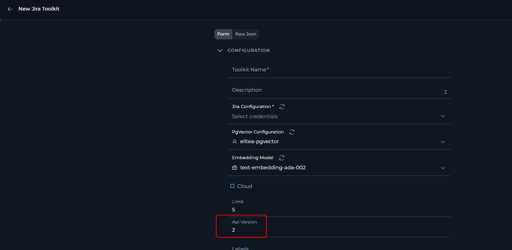

### 13. Atlassian Authentication Token Issues

**Symptoms:**

- Connection failures with authentication errors
- Unexpected authentication behavior

**Error Message:**
```
... \"/data/requirements/indexer_worker/lib/python3.12/site-packages/atlassian/confluence/__init__.py\", line 4105, in raise_for_status\n    raise HTTPError(\"Unauthorized (401)\", response=response)\nrequests.exceptions.HTTPError: Unauthorized (401)\n"...
```

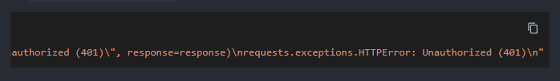

**Cause:**

- Incorrect authentication method is being used (bearer token instead of basic authentication or vice versa).
- Common issue, token taking spaces and not complete token usage

**Solution:**

Use the correct authentication setup:
- **Cloud Jira/Confluence**: Basic Auth with API key + username
- **Server versions**: Bearer auth with API key only (in most cases, including Epam's "Jiraeu" or "KB" )
- **Some server versions**: Basic Auth Username + password may be required

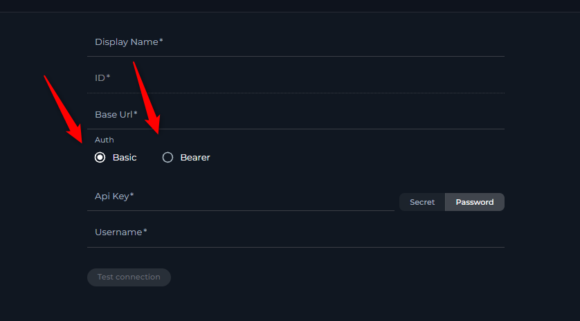

### 14. Toolkit Resource Limit Issues

**Symptoms:**

- When listing resources (issues, work items, tests, etc.) using various toolkits, you receive only a limited number of results (e.g., not more than a certain amount)
- Result lists appear incomplete despite knowing more items exist
- Large datasets show only partial results

**Cause:**

Many toolkit configurations include a **"Limit"** field that restricts the maximum number of results returned per request. This field may be set to a low default value.

**Solution:**

1. **Access Toolkit Configuration:** Navigate to the Toolkits menu and edit the affected toolkit
2. **Locate Limit Field:** Look for a **"Limit"** field in the toolkit's configuration or advanced settings
3. **Increase Limit Value:** Change the limit from the current value to a higher value that meets your needs (e.g., from 10 to 100, or from 50 to 500)
4. **Save Configuration:** Save the toolkit configuration to apply the new limit
5. **Test Results:** Run your resource listing operation again to verify more results are returned

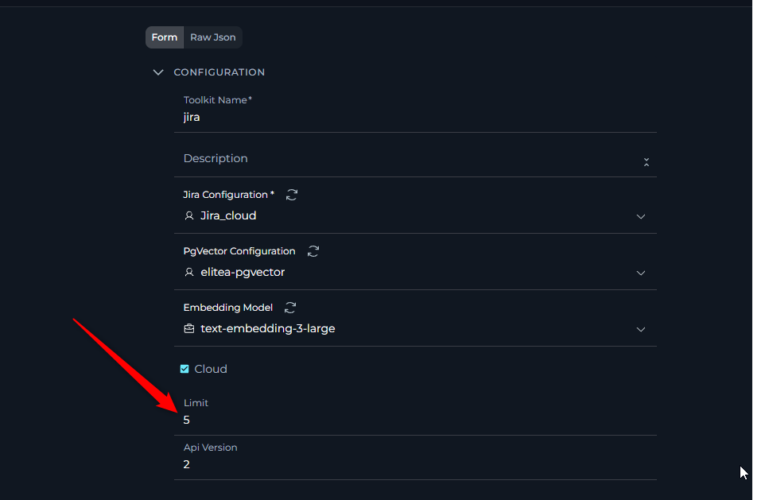

!!! tip "Toolkit Limit Configuration"
    The limit field location may vary by toolkit type. Check both the main configuration section and any "Advanced Settings" or "Parameters" sections.

### 15. Toolkit Configuration Validation Errors

**Error Message:**
```
Failed to validate toolkit configuration: 1 validation error for ***
 configuration
   Field required [type=missing, input_value={'selected_tools': ['crea...uration_personal': True}, input_type=dict]
     For further information visit https://errors.pydantic.dev/2.10/v/missing
```

**Symptoms:**

- Toolkit fails to save or load configuration
- Validation errors appear when trying to use the toolkit
- Error mentions missing required fields

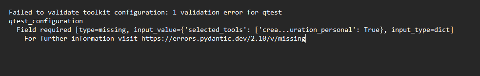

**Cause:**

During migration, import, or toolkit updates from the ELITEA side, mandatory fields may become unfilled or missing. This can happen when:

- Toolkit schema is updated with new required fields
- Data migration doesn't populate all required fields
- Toolkit configuration format changes

**Solution:**

1. **Navigate to Toolkit Configuration:** Go to the Toolkits menu and select the problematic toolkit
2. **Review All Fields:** Carefully check all configuration sections, including:
   Basic configuration fields
   Advanced settings
   Authentication/credential fields
   Integration-specific parameters
3. **Fill Missing Mandatory Fields:** Look for fields marked as required (often indicated with asterisks *) and ensure they contain appropriate values
4. **Check Field Format:** Ensure all field values are in the correct format (JSON, URLs, numbers, etc.)
5. **Save and Test:** Save the configuration and test the toolkit functionality

!!! warning "Required Field Identification"
    Pay special attention to fields that appear empty or have placeholder text. Required fields are usually marked with visual indicators or validation messages.

---

## System and Resource Limitations

### 16. Pipeline Input Processing Issues

**Symptoms:**
- Input provided to the pipeline doesn't work as expected in functions, conditions, or other nodes requiring an exact text match

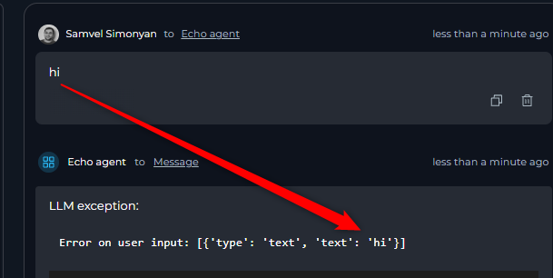

**Cause:**
The input is not sent to the pipeline as plain text but is modified or has additional details added.

**Solution:**

- Use node types that are using LLM on top. The structure will be easily filtred when pamping is done via LLM.
- Add data transformation steps.

### 17. Database Name Length Limitation

**Error Message:**
```
...String should have at most 7 characters..
```

**Symptoms:**

- Error appears when trying to create indexes, vector databases, or collections using agents
- Specific mention of 7-character limit


**Cause:**
ELITEA has a 7-character limit on database ( index) names. An agent is trying to create an index, vector database, or collection with a name longer than 7 characters.

**Solution:**
Instruct the agent to compose names with 7 characters or fewer.

---


## General Troubleshooting Tips

!!! tip "Before You Start"
    - Always check the end of error messages for the actual error details
    - Look for node names in pipeline error messages to identify problem areas
    - Use the pipeline configuration tab to run pipelines and see which nodes fail
    - Check the status button on top of the pipeline flow to see where execution stopped

!!! warning "Common Oversights"
    - Empty required fields (Task, System/User prompts, tools and agents for nodes)
    - Missing variable assignments
    - Incorrect variable names in f-strings
    - Authentication configuration mismatches
    - Token limits and context window constraints

If you don't find your specific issue here, check the [FAQs](faqs.md) page or [contact support](contact-support.md) for additional assistance.