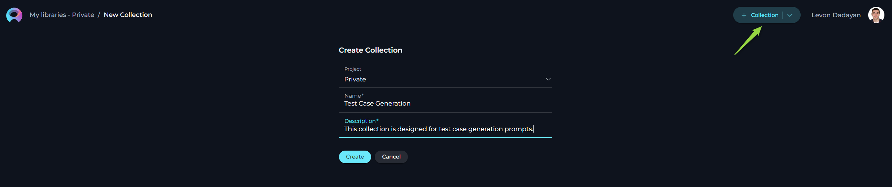

# Alita User Guide

## Introduction

Welcome to the Alita platform, an innovative web application that revolutionizes how you interact with prompts. Alita is not just a repository but a dynamic workspace designed to empower you to create, organize, and collaborate on prompts like never before.

**Key Features:**

- **Prompt Management:** Create new prompts or modify existing ones with ease, while keeping track of different versions.
- **Collection Integration:** Group your prompts into Collections to streamline your workflow or focus on specific themes or projects.
- **Tagging System:** Organize your prompts effectively by adding and editing tags for quick retrieval and categorization.
- **Execution with Precision:** Execute prompts utilizing various models and parameters to suit your unique needs, offering a tailored experience.
- **Advanced Creation Tools:** Use variables, system prompts, Assistant Messages, and User prompts to craft complex prompts with fine-grained control.
- **Flexible Interaction Models:** Engage with the Prompt Library through diverse interfaces, whether via Chat or a Completion approach.
- **Powerful Search:** Quickly find the prompts and collections you need with a robust search feature that recognizes tags, names, and descriptions.
- **Community Engagement:** Create and modify Prompts and Collections, publish your work, and interact with the community through sharing and liking prompts/collections.

Alita is designed to be intuitive, granting you the freedom to focus on creativity and productivity. Whether you are new to prompting or an experienced creator, our user guide will walk you through every feature, ensuring you maximize your Prompt Library experience.

Let's embark on this journey to unlock the full potential of your ideas.

## Access to Alita

To access it:

1. Open your browser.
2. Type in <https://alita.lab.epam.com> in the address bar.
3. Provide your EPAM account to login. **Note**: No need for registration.
4. After successful login, you are navigated to the **Prompts** menu.
5. Once you have access, navigate to **Discover→My Library** menu, where you will be able to create prompts and collections. **Note**: If you are logging in for the first time into Alita, wait for 5 minutes to allow private project initialization to be completed before creating prompts. 

**Note**: No need to enable Epam VPN to access the Prompt Library.

## Prompt Library - Main Interface

The Prompt Library application's main interface encompasses several sections, including the Discover Menu, Search feature, Quick Navigation tabs, Settings, a Quick button for creating prompts or collections, Tags, and Trending Authors.

**Sections:**

- **Discover Menu**: A hamburger menu allowing users to switch among different menus such as Prompts, Datasources, Collections, and My Library.
- **Search**: A Search box available to find prompts by their names and descriptions. Note: The Search functionality operates within the selected menu and is not universal across the entire application.
- **Quick Navigation Tabs**: Tabs enabling users to switch among Latest, My Liked, and Trending pages. The names and content of these tabs will change depending on the menu selected.
- **Page Content**: This area displays the latest published content, which varies based on the selected menu. For example, the Prompts menu will show the latest published prompts, and the Collections menu will display the latest published collections.
- **View Switcher**: A tool for quickly switching between Card and List views.
- **Quick button**: A button that allows for the rapid creation of a new prompt or collection. The function of this button (+Prompt or +Collection) changes based on the selected menu.
- **Settings**: Accessible by clicking on your user avatar/picture. Here, you can configure your Profile settings or Log Out of the application.
- **Tags**: This section displays the tags (categories) associated with the content being viewed. The tags vary depending on the selected menu.
- **Trending Authors**: Shows the authors who have recently contributed or shared the most trending prompts and collections with the community.

.png)

### General Navigation and Management Across the Application

This section outlines common functionalities and actions available across various menus and pages within the application, aiming to provide a consistent and efficient user experience. These functionalities are shared across:

- **Prompts** menu: Including the Latest, My Likes, and Trending pages.
- **Collections** menu: Including the Latest, My Likes, and Trending pages designed for collections.
- **Datasources** menu: Including the Latest, My Likes, and Trending pages for data sources.
- **My libraries** menu: Including All, Prompts, Datasources, and Collections pages.

The context may vary depending on the specific page you're viewing, but the core principles of action and functionality remain consistent, ensuring a unified approach to navigating and managing content within the application.

### Common Viewing Options

- **Card View**: Offers a compact, card-format snapshot of items like prompts or collections, making it easy to visually scan through published materials.
- **Detailed View**: Provides an in-depth look at individual items, presenting extensive details for a comprehensive analysis.

### Search and Filtering Functionality

- **Search**: Seamlessly locate specific items by their name or description using the search feature, which operates within the menu you are currently exploring. This tool is invaluable for quickly finding relevant content.
- **Filtering**: Streamline your search by filtering items using specific tags. This feature is especially useful for discovering content related to particular subjects or themes.

### Sorting Options (Detailed View Only)

- **By Name**: Alphabetically organize published items by their names, providing an effortless method to find specific titles.
- **By Create**: Sort items by their creation date to monitor the chronological development of content or pinpoint the newest additions.
- **By Likes**: Order the items by the number of likes they have received. This functionality is applicable on the pages of Prompts, Collections, and Datasources menus, helping surface popular content.
- **By Authors**: Sort the items by the author's name. This functionality is applicable on the pages of Prompts, Collections, and Datasources menus, helping surface popular content.

These standardized functionalities across different menus and pages are designed to simplify navigation and enhance the content management process within the application, promoting a coherent and user-friendly environment.

## Discover - Menus

The Prompt Library consists of 4 main menus. 

* **Prompts**: Browse through an organized showcase of prompts curated and shared by the community.
* **Datasources**:  Browse through an organized showcase of datasources and shared by the community.
* **Collections**: Browse through an organized showcase of prompt collections curated and shared by the community.
* **My libraries**: Manage your personal creative space where you can craft, save, edit, and organize your prompts and collections.

**Navigation:**

1. To naviagte among the menus, click the **Prompt Library** icon on the top left.
2. The **Hamburger** menu is opened.
3. Click on the menu name to navigate to the desired menu.

## My libraries menu

The **My libraries** menu is a space designed to create prompts, datasources, collections and organize them.

My libraries menu consists of four pages (tabs):

1. **All** - on this page you can find all your created Prompts, Datasources and Collections.
2. **Prompts** - on this page you can find all your created Prompts.
3. **Datasources** - on this page you can find all your created Datasources.
4. **Collections** - on this page you can find all your created Collections.

## My libraries - Prompts page

The **My libraries - Prompts** page serves as a dedicated inventory for all your prompts, irrespective of their current status. Consider it your personal repository for saving and organizing the prompts you've crafted. 

### How to Create a New Prompt

In the context of AI and machine learning, a prompt is an instruction, question, or statement that is given to an AI model to elicit a response or output. It serves as the initial input for systems like conversational agents or generative models.

1. Click the **+ Prompt** button on the top right. 
2. Fill in the **Name**, **Description**, and **Context** fields.
3. Click **Save**.

**Note**: **Name** and **Description** are non-editable fields and can't be modified after saving the prompt.

### How to Create Tags

In the Prompt Library application, Tags serve as an efficient organizational tool that allows you to categorize and manage your collection of prompts. By assigning relevant tags to each prompt, you create an intuitive labeling system that facilitates quick access and retrieval. Later on, you can filter prompts by these tags, simplifying the process of finding the precise prompt you need among a vast collection, which is especially useful for users with an extensive library of different prompt types and topics.

**To add a tag to the prompt:**

1. Type a **tag name** or select from pre-existing tags from **Tags** input box.
2. Press **comma** or **Enter** to create/select tag.
3. Click **Save** to save the prompt with selected tags.
   
**Note:** User has the flexibility to assign one or more tags to each prompt, enabling a multi-dimensional labeling system.

### How to Setup Messages

The MESSAGES section is a crucial component that allows users to structure the flow of interaction within a prompt.

* "**System**" message - a system prompt is a way of providing context and instructions to LLM, such as specifying a particular goal or role for LLM before asking it a question or giving it a task.
* "**Assistant**" message - an Assistant has instructions and can leverage models, tools, and knowledge to respond to user queries
* "**User**" message, on the other hand, exemplifies what a real human user might say or ask within a given scenario.

To enhance the interactivity of a prompt, user can add multiple messages of any type by clicking the + icon, selecting the desired message type, and providing the relevant content.
Additionally, user have the ability to delete, copy, and reorder messages to best fit the flow of the conversation, easily arranging them by dragging and dropping the message boxes as needed for optimal organization and presentation.

### How to Use Variables

The variables within prompts add a layer of dynamic customization, allowing you to tailor prompts to specific needs or contexts.

**Variables** are denoted by double curly brackets (e.g., {{variable_name}}) and should be defined in the prompt's Context input box. Once a variable is entered into the CONTEXT, it automatically populates the VARIABLES section, where you can assign a value to that variable. This feature empowers users to create flexible and reusable prompts that can be easily adapted by changing the values of the variables as needed, without altering the entire prompt structure.

**Note**: User has the flexibility to define one or more variables in each prompt. Variables can also be defined in **Messages**.

### How to Execute Prompt

To execute the prompt and get the output you have 2 options:

* **Chat** - is a specific type of input designed for conversational AI models, which aims to initiate or guide a dialogue. This can be in the form of a question, statement, or command that simulates human-like interaction, prompting the AI to produce a conversational response for engagement.
* **Completion** - is supplied to generative AI models, such as text or code generators, with the intent of the model continuing or completing the given input. The AI uses the context provided in the prompt to produce a coherent and contextually relevant extension or completion of the text.

#### Executing a Prompt Using the **Chat** Option:

1. **Configure the Prompt**: Initialize by providing the necessary context, identifying the prompt with a name, and defining variable values (if applicable).
2. **Select the AI Model**: Choose the appropriate AI model (e.g., gpt-4-0125-preview, gpt-35-turbo, etc.).
3. **Set the Temperature Parameter**: Adjust this parameter to control the level of creativity or unpredictability in responses.
4. **Initiate Interaction**: Enter your text (be it a question or a command) in the chat box and click the **Send** icon.

Upon receiving the output, the following actions are available:

- To continue the dialogue, enter your subsequent text in the chat box and click the **Send** icon.
- To copy the output, click the **Copy to Clipboard** icon.
- To append the output to the **Assistant Message**, click the **Copy to Messages** icon.
- To generate a new response, click the **Regenerate** icon.
- To eliminate the current output, click the **Delete** icon.
- To purge the chat history, click the **Clean** icon.

#### Executing a Prompt Using the **Completion** Option:

1. **Configure the Prompt**: Start by providing the necessary context, naming the prompt, and setting variable values (if needed).
2. **Select the AI Model**: Choose from the available AI models (e.g., gpt-4-0125-preview, gpt-35-turbo, etc.).
3. **Set the Temperature Parameter**: Adjust this to modulate the AI's creative or unpredictable outputs.
4. Choose the **Completion** option.
5. **Initiate Execution**: Click the **Run** button.

Upon receiving the output, the following actions are available:

- To regenerate the output, click the **Run** button again.
- To copy the output, utilize the **Copy to Clipboard** icon.

### Managing Prompt Versions: Save, Create Versions, and Manage

To optimally manage your prompts, understanding how to save and create versions is crucial. Follow these guidelines to efficiently save your prompt, create versions, and manage them.

#### How to Save a Prompt:

- To save your work on a prompt for the first time, simply click the **Save** button. This action creates what's known as the "**latest**" version of your prompt.
- You can continue to modify your prompt and save the changes to the "**latest**" version at any time by clicking the **Save** button again. If you wish to discard any changes made, you have the option to click the **Discard** button before saving.

**Remember**: The "**latest**" version represents the initial version you create. You can keep updating this version with your changes by saving them, without the need to create additional versions for your prompt.

#### How to Create New Versions:

For instances where you need to create and manage different iterations of your prompt:

1. **Initiate a New Version**: Start by clicking the **Save As Version** button.
2. **Name Your Version**: Enter a meaningful version name and confirm by clicking **Save**.

Upon creating a new version of the prompt, several options become available to you:

- **Publish**: Make this particular version of the prompt available for use.
- **Delete**: Remove this version of the prompt if it’s no longer needed.
- **Execute**: Run this specific version of the prompt to see how it performs.
- **Navigate Versions**: Use the **Version** dropdown list to switch between and select different versions of the prompt. This allows for easy comparison and management of various iterations.

By following these steps, you can effectively manage the lifecycle and iterations of your prompts, ensuring that each version is appropriately saved, published, and utilized as per your requirements.

### How to Publish a Prompt

To make your prompt available to the wider Epam Network and Communities, follow these steps for publication:

1. **Publishing Initiation**: With your prompt crafted and saved, initiate the process by clicking the **Publish** button.
2. **Version Naming**: Assign an informative version name (e.g., Gen-1.0) in the pop-up window. This name should encapsulate the essence or objective of the prompt, facilitating version management and future iterations.
3. **Review Submission**: Finalize your submission by clicking **Publish**, forwarding your prompt for the moderation review process. This stage is vital to guarantee the prompts shared within the Epam community meet a standard of quality and relevance.

For publishing a specific version, firstly select the desired version and opt to publish. The chosen version's name appears in the "**Publish version**" pop-up window. It can be published as is or renamed before the final publication step.

**Note**: After publishing, the prompt can be retracted by selecting the **Unpublish** button.

#### Moderator Review Process

Submission to publication triggers a meticulous assessment by the moderators, tasked with ensuring prompt standards for quality, efficiency, and security are upheld.

**Evaluative Steps Undertaken by Moderators**:

1. **Initial Assessment**: An initial examination confirms the prompt's completeness and adherence to the submission guidelines.
2. **Content Review**: Evaluates the prompt’s relevance, clarity, compatibility with best practices, and information security.
3. **Practical Evaluation**: Assesses the prompt's operational feasibility, including variables, system commands, and projected outcomes.
4. **Compliance Check**: Final verification against community norms and security protocols, ensuring the protection of sensitive data.

##### Possible Outcomes of the Review

Post-review, a prompt may be categorized as:

- **Published**: Fulfilling all criteria, the prompt is incorporated into the Prompt Library for community access.
- **Feedback for Revision**: Identified as promising but necessitating modifications. Constructive comments guide the revision.
- **Rejected**: Falling short of the required standards, the prompt is declined for publication.

##### Tracking the Status of Prompts

Prompts undergo several statuses through the review phase:

- **All Statuses**: An overview of all submissions regardless of their review stage.
- **Draft**: Saved yet unsubmitted prompts.
- **Published**: Moderation-approved prompts, now accessible in the Library.
- **On Moderation**: Prompts currently under review.
- **User Approval**: Prompts pending submitter action or approval following moderator feedback.
- **Rejected**: Prompts evaluated and declined for publication.

For status inquiries on your prompts, direct to the "**My Libraries → Prompts**" section on the platform and choose the relevant status from the dropdown menu.

### How to Add Prompt into Collection

To add prompts to your collection, follow these steps:

1. Once you've [created a collection](#how-to-create-a-collection), you can start adding relevant prompts. Navigate to the prompt you wish to add and select an option to **Add to Collection**.
2. Select the **Collection** you wish to add your prompt to from the pop-up window. You can add multiple prompts to a collection as long as they share the thematic relevance or purpose you've defined for your collection.

### How to Export a Prompt

Exporting prompts allows you to utilize them across different platforms by choosing between two specific formats:

- "**[Alita format]**" - This JSON format is optimized for the Alita platform, incorporating Alita-centric details such as prompt versioning, variables with their possible values, tags, and model configurations.
- "**[DIAL format]**" - Also in JSON format, it's tailored for integration with the Epam AI Dial platform, including only information and structuring relevant to DIAL.

#### Exporting Your Prompt:

1. Initiate the process by clicking the **Export prompt** icon.
2. Choose your preferred format (Alita or DIAL) for export.
3. The export process will generate a file, which will then be automatically downloaded to your device.

This functionality facilitates the transfer and application of your prompts across different platforms by generating easily importable JSON files.

## My libraries - Collections Page

The **My libraries - Collections** page serves as a dedicated inventory for all your collections, irrespective of their current status. Consider it your personal repository for saving and organizing the collections you've assembled.

These features ensure your collections are not only stored securely but also organized in a manner that simplifies management, review, and retrieval, tailoring the user experience to your needs and preferences.

**The Purpose and Usefulness of Collections**

**Collections** serve as a means to group prompts by theme, project, or any other meaningful categorization that enhances accessibility and usefulness for the users. 
Collections are immensely valuable for several reasons:

* **Thematic Organization**: They allow for the grouping of prompts by specific themes or projects, making it easy for users to find a set of related prompts.
* **Efficiency**: By organizing prompts into collections, we save time by providing consolidated resources that can be easily accessed and applied.
* **Sharing Best Practices**: Collections can be shared across teams, promoting best practices and unified testing approaches across different projects.
  
  
### How to Create a Collection

Creating a collection allows you to organize and categorize your prompts for better accessibility and management. Follow these steps to create a new collection:

1. Click the **+ Collection** button located at the top right corner of the page.
2. You will be prompted to fill in the **Name** and **Description** fields. It's important to provide clear and concise information here, as this helps others understand the purpose and content of your collection.
3. Click **Save** to create the collection.

After creation, your new collection will be added to the **My Libraries - Collections** page.

### Exploring Collections

Exploring collections is straightforward and insightful:

- Simply click on the collection card or the name of a collection. This action reveals the prompts contained within the selected collection, providing a comprehensive view of its contents.

Within a collection, you can:

- **View** and **Open** available prompts.
- **Modify Collection** (Name and Description).
- **Filter Collection** by tags.
- **Publish Collection**.
- **Delete Collection**.
- **Export Collection**.

### How to Modify a Collection

To modify an existing collection:

1. Click the **Edit** icon.
2. Update the **Name** and/or **Description** of the collection as needed.
3. Click **Save** to apply the changes.

*Note: Modifications are restricted for collections that have already been published.*

### How to Filter Prompts within a Collection

- Easily find specific prompts within a collection by selecting applicable tags from the **Tags** section. This enables efficient organization and retrieval based on subjects or themes.

### How to Publish a Collection

To publish a collection:

1. Ensure the collection is complete and relevant by reviewing its contents.
2. Click the **Publish collection** icon to submit your collection for review, similar to the individual prompt publishing process. The collection will be evaluated according to guidelines for quality and relevance.
3. Once approved, your collection will be published and made available under the **Collection** menu for community use.

*Note: A Collection must contain public prompts before publication.*

### How to Delete a Collection

To delete a collection:

- Click the **Delete** icon. Note that deleting a collection does not remove the prompts within it from your library.

*Note: Deletion is not possible for published collections.*

### How to Export a Collection

Exporting a collection allows for its use on different platforms, offering formats tailored to each:

- "**[Alita format]**" - A JSON format designed for the Alita platform, including detailed information like prompt versioning and model configurations.
- "**[DIAL format]**" - A JSON format intended for the Epam AI Dial platform, incorporating platform-specific structuring.

**Exporting the Collection:**

1. Click the **Export prompt** icon to begin.
2. Select your preferred format (Alita or DIAL) for the export.
3. An export file will be generated and automatically downloaded to your device, enabling cross-platform utilization.

## Prompts Menu

The **Prompts** menu showcases a collection of published and shared prompts within the community. By default, upon logging in, the user is directed to the **Latest** page of the Prompts menu, which presents newly published prompts.

### Layout of the Prompts Menu

The Prompts menu is organized into three distinct pages, each designed to offer a unique perspective on the available prompts:

- **Latest**: Displays all recently published prompts, providing a fresh look at the newest contributions to the community.
- **My Likes**: Highlights the prompts that you have liked. This personalized page allows you to revisit favorites effortlessly.
- **Trending**: Showcases the prompts with the highest number of likes, serving as a valuable resource for discovering top-rated prompts that hold significant value and popularity within the community.

### Engaging with Published Prompts

Interaction within the community is highly encouraged to recognize and appreciate valuable prompts. The following actions enable active participation:

### Liking Published Prompts

Upon publication, a prompt becomes a crucial resource for the community. To support and acknowledge a prompt, use the **Like** functionality:

- To like a prompt, click on the **Heart** icon associated with it.
- **Note**: If you wish to withdraw your like, simply click the **Heart** icon again to Unlike the prompt.

### Other Actions for Published Prompts

**Executing Published Prompts**:

- View and run published prompts by clicking on the prompt card or name. Refer to the [How to Execute Prompt](#how-to-execute-prompt) section for guidance on running a prompt.
- **Note**: Modifications to a published prompt cannot be saved for future use.

**Adding Published Prompts to Collections**:

- Enhance your collections by including published prompts. Visit the [How to Add Prompt into Collection](#how-to-add-prompt-into-collection) section for instructions on incorporation.

**Exporting Published Prompts**:

- For external use or backup, published prompts can be exported. Details on this process are found in the [How to Export a Prompt](#how-to-export-a-prompt) section.

## Collections Menu

The **Collections** menu is a curated space of grouped prompts shared and published within the community. 

### Layout of the Collections Menu

Organized into three distinct pages, the **Collections** menu introduces a structured way to explore and discover grouped prompts:

- **Latest**: Showcases the most recently published collections, offering insight into the newest themes and ideas being explored by the community.
- **My Likes**: Features the collections you have liked, creating a personalized library of favored content that can be revisited at any time.
- **Trending**: Displays collections that have gathered the most likes, serving as an excellent resource for finding highly-regarded and popular collections esteemed by the community.

### Engaging with Collections

Participation and interaction within the community are pivotal in highlighting and appreciating valuable collections. Below are ways you can actively engage:

### Liking Collections

Each collection, upon curation, becomes a vital resource. To show support and appreciation for a collection, you can use the **Like** functionality:

- Simply click on the **Heart** icon associated with a collection to like it.
- **Note**: Should you change your mind, clicking the **Heart** icon again will allow you to unlike the collection.

### Other Actions for Collections

**Exploring Published Collections**:

Simply click on the collection card or the name of a collection. This action reveals the prompts contained within the opened collection, providing a comprehensive view of its contents.

You will be able to work with published prompts within the collection. Detailed instructions for this process are available in the [Other Actions for Published Prompts](#other-actions-for-published-prompts) section.

**Exporting Collections**:

- Collections can be exported for sharing or external use. Detailed instructions for this process are available in the [How to Export a Collection](#how-to-export-a-collection) section.