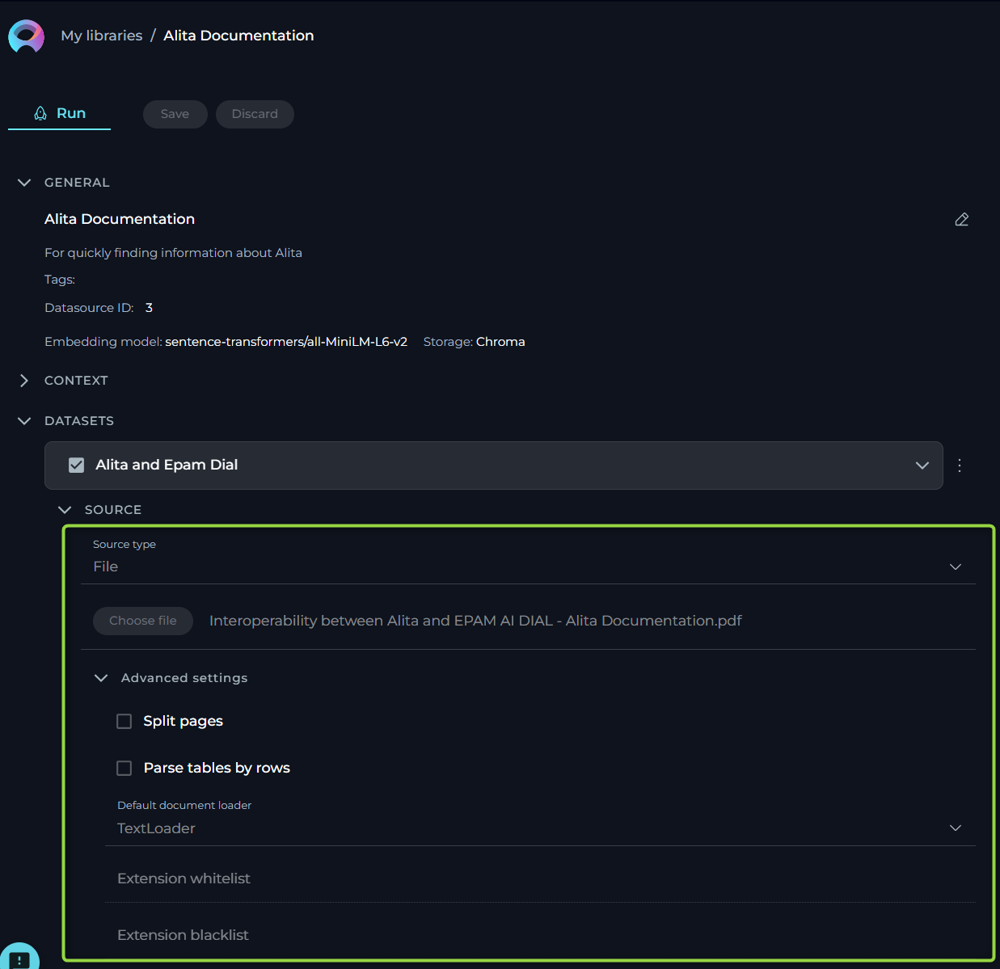
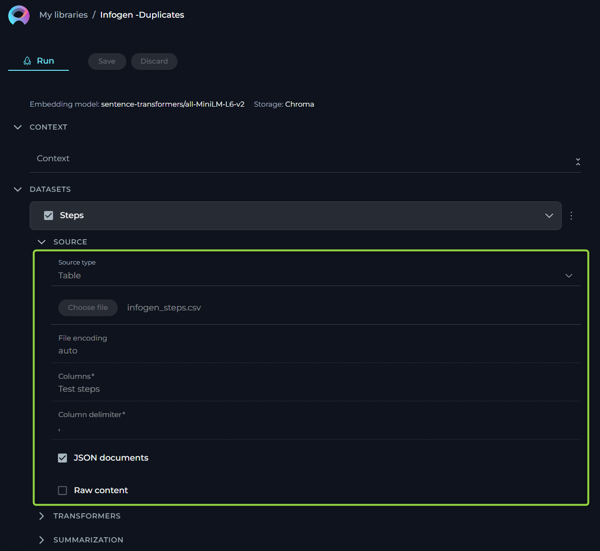
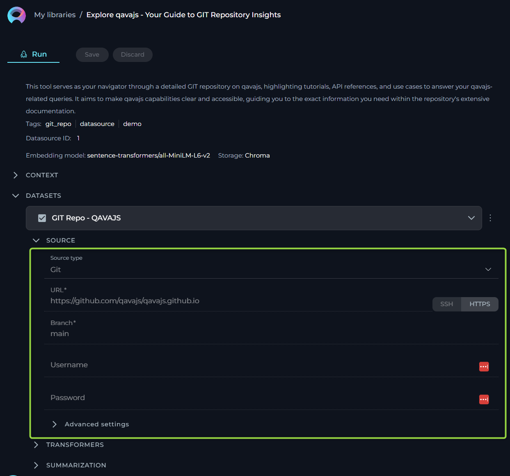
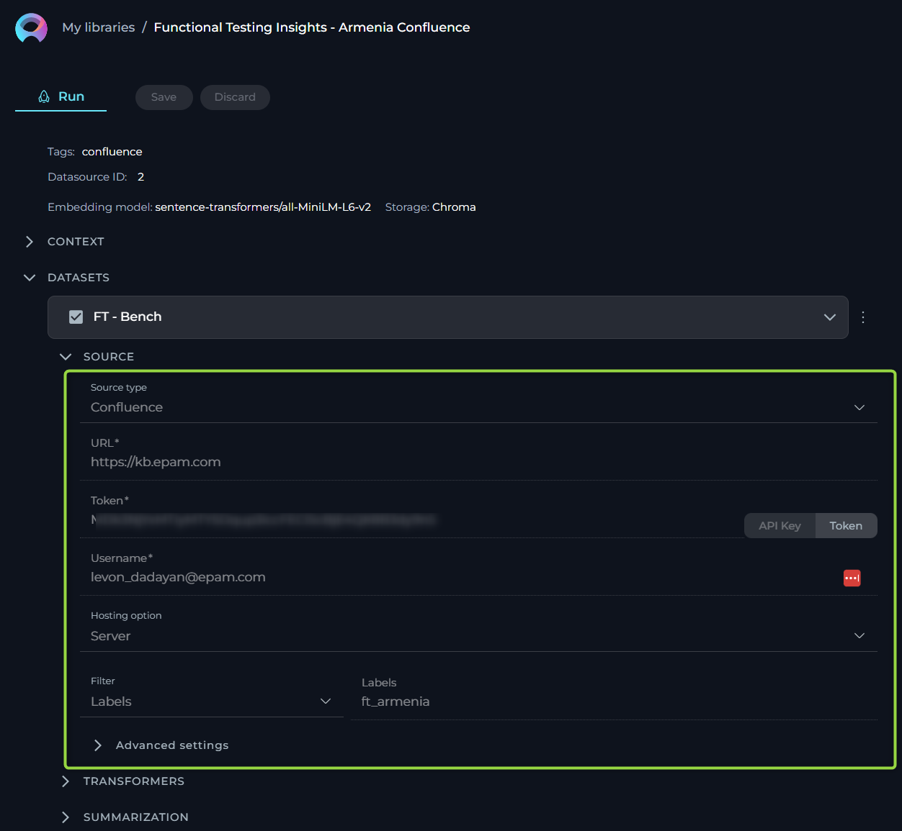
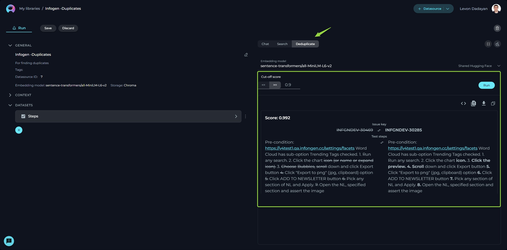

# Datasources

## My libraries - Datasources Page

Datasources play a pivotal role in broadening and enriching the functionalities of ELITEA and AI technologies. They enable the extension of LLMs by integrating user-specific or project-specific data, which is not initially part of the model’s training set, thereby enhancing the LLM's context with tailored information.

### Creating a Datasource

To set up a new datasource and augment your model's capabilities:

1. Click the **+ Datasource** button located at the top right corner.
2. Fill out the **Name** and **Description** fields.
3. Choose an **Embedding model** from the dropdown list provided.
4. Select the desired **Storage type** from another dropdown menu.
5. Optionally, add tags by typing a tag name or selecting from pre-existing tags in the Tags input box.
6. Click **Save** to finalize the creation.

Your newly created datasource will subsequently appear on the **My Libraries - Datasources** page.

### Exploring Datasources

Discovering the intricacies of a datasource is both simple and insightful:

Click on the card or the name of a datasource to unveil its configurations, providing a detailed overview of its setup and usage.

### Connecting a Datasource to a Dataset

The initial step involves linking your datasource to the desired dataset:

1. Press the **`+`** icon to start adding a new dataset.
2. Enter a name for your dataset. *Note*: This is a non-editable field and cannot be altered post-creation.
3. From the dropdown list, select the source type of your dataset. Available options include:
      * **File**: Any supported file type for upload.
      * **Table**: Supported file types with a table structure, such as CSV or XLSX.
      * **GIT**: Any accessible Git repository.
      * **Confluence**: Any Confluence page accessible to you.
      * **QTest**: Any QTest project accessible to you.

Depending on the selected source type, various configurations may be necessary to access the dataset source, primarily involving authentication and authorization parameters. This step is exempt for File and Table options since the files will be directly uploaded.

#### Source type - File

ELITEA supports a variety of file types and offers flexible settings to handle your documents effectively. Below is an easy-to-understand breakdown of the options, settings, and parameters available for configuration.

* **Name** - specify a unique name for your source configuration. This helps in easily identifying and managing multiple sources.
* **Choose File Option** - select the file you wish to process. ELITEA supports a range of commonly used file types, ensuring compatibility and ease of use. Supported File Types: PDF, DOCX, TXT, JSON.
* **Advanced Settings** - under this section, additional features enable further customization of how your file is processed.
    * **Split Pages** - when enabled, each page of your document is treated as a separate entity. This is particularly useful when dealing with PDF documents, enabling more granular control over the analysis or processing of individual pages.
    * **Parse Tables by Rows** Selecting this option ensures that any tables within your document are parsed row by row, maintaining the structure and context. This setting is valuable when dealing with documents that contain tabular information, ensuring the data remains organized and comprehensible.
* **Default Document Loader** - choose the mechanism by which your document is loaded into the system. Each loader handles your file differently, catering to specific needs.
    * **TextLoader** - optimized for plain text documents, ensuring swift and efficient loading.
    * **PythonLoader** - best suited for technical or coded documents, offering more sophisticated parsing capabilities.
* **Extension Whitelist** - specify file extensions that are explicitly allowed. This security measure ensures only designated file types are processed, safeguarding against unwanted or potentially harmful files. List the extensions separated by commas (e.g., pdf, docx, xlsx, json, txt), overriding the default supported types if necessary.
* **Extension Blacklist** - conversely, list file extensions you wish to exclude from processing. Any file type mentioned here will be automatically rejected, further enhancing security and control over the documents your system handles.

#### Source type - Table

This functionality is crucial for users who work with structured data in formats such as spreadsheets or structured text files. The aim is to make the process straightforward for users without requiring deep technical knowledge. Here, we outline the options, settings, and parameters available for your table data sources.

* **Name** - specify a unique name for your source configuration. This helps in easily identifying and managing multiple sources.
* **Choose File Option** - select the file you wish to process. ELITEA supports a range of commonly used file types, ensuring compatibility and ease of use. Supported File Types: CSV, JSON, XLSX.
* **Columns** - specify which column(s) within your table you want to focus on. These columns should contain the data you wish to analyze or use for generating embeddings. You can select single or multiple columns depending on your requirement. This flexibility allows you to tailor the analysis to the specific data points that are most valuable to your objectives. To select multiple columns, separate each column name with a comma (",").
* **JSON Documents** - enable this option if your table data is structured as JSON documents, particularly relevant when dealing with JSON files. This tells the system to parse the file as a collection of JSON entries, allowing for a more nuanced understanding and utilization of nested data structures within the file.
* **Raw Content** - when enabled, this setting ensures that your selected data is treated as raw content, bypassing any default preprocessing or formatting. This is particularly useful when you want the data to be ingested in its purest form, without any alterations that might affect its original structure or meaning.

#### Source type - GIT

For users who rely on Git repositories to manage their code, documents, or other types of projects, this source type allows to streamline the process of linking and extracting data from these repositories. Here, we outline the options, settings, and parameters available for your GIT source type.

* **Name** - specify a unique name for your source configuration. This helps in easily identifying and managing multiple sources.
* **URL** - link to Git Repo. To connect to your Git repository, you'll need to provide the URL. ELITEA supports two types of Git repository links:
    * **SSH** - for a secure and password-less connection. If you choose this option, an SSH key pair is required, with the public key added to your Git account and the private key entered in the subsequent SSH Key field. For **SSH**: input the SSH Key in the designated field.
    * **HTTPS** - a widely used method that might require username and password authentication based on the repository's access settings. For **HTTPS**: if prompted, enter the username and password to authenticate.

**Important Note**:
To ensure a successful connection, **you must clone your Git repository and provide the cloned Git link**. Simply copying the Git repository address from your browser's address bar is not sufficient. Cloning the repository ensures that you're using a valid, accessible link that ELITEA can connect to without issues.

* **Branch** - here, specify the branch within your Git repository you wish to access. By default, the '**main**' branch is selected, but you may adjust this to any branch name that suits your current focus or project needs.
* **Advanced Settings** - under this tab, we offer options to further customize how data is retrieved from your Git repository.
  * **Multithreading** - enabling multithreading can significantly speed up the process of fetching data from your Git repo, especially beneficial for large repositories or when network latency is a concern. This option allows the system to perform multiple operations in parallel, reducing overall extraction time.
  * **Default Document Loader** - choose the mechanism by which your document is loaded into the system. Each loader handles your file differently, catering to specific needs.
      * **TextLoader**: - optimized for plain text documents, ensuring swift and efficient loading.
      * **PythonLoader**: - best suited for technical or coded documents, offering more sophisticated parsing capabilities.
  * **Extension Whitelist** - specify file extensions that are explicitly allowed. This security measure ensures only designated file types are processed, safeguarding against unwanted or potentially harmful files. List the extensions separated by commas (e.g., pdf, docx, txt), overriding the default supported types if necessary.
  * **Extension Blacklist** - conversely, list file extensions you wish to exclude from processing. Any file type mentioned here will be automatically rejected, further enhancing security and control over the documents your system handles.

#### Source type - Confluence

For users who rely on Confluence pages to manage their information, documents, or other types of projects, this source type allows to streamline the process of linking and extracting data from these knowledge pages. Here, we outline the options, settings, and parameters available for your Confluence source type.

* **Name** - specify a unique name for your source configuration. This helps in easily identifying and managing multiple sources.
* **URL** - link to Confluence. To connect to your Confluence KB, you'll need to provide the URL. No need to provide the full link as the page (e.g. https://www.kb.epam.com is enough) handling must be done with the help of **Filters** option. Regarding authentication, you have two options to securely connect to Confluence:
    * **API Key**: If you choose the API Key option, you'll need to generate an API Key from your Confluence account and input it in the provided API Key field.
    * **Token**: Similarly, if the Token option suits you better, you'll have to create an authentication Token from your Confluence user settings and enter it in the Token field.
**Note**: These authentication methods ensure secure access to your Confluence content, maintaining the integrity and confidentiality of your data.
* **Username** - input the username associated with your Confluence account. This is the same username you use to log in to your Confluence site.
* **Hosting Option** - choose the appropriate hosting type for your Confluence setup:
    * **Cloud** - if your Confluence is hosted on Atlassian’s cloud.
    * **Server** - if your Confluence is hosted on your own servers or enterprise environment. **Important Note**: When connecting to Epam's Confluence, ensure you select the **Server** option to establish the correct configuration.
**Note**:This distinction is crucial for establishing the correct connection and accessing your data appropriately.
* **Filter** - use the filter option to refine which Confluence pages you wish to fetch. You can filter by:
    * **Space Key** - to fetch pages from specific Confluence spaces.
    * **Page IDs** - to target specific pages.
    * **Labels** - to retrieve pages tagged with specific labels.

**Important Note**: To establish a successful connection to Confluence from ELITEA, you **must select one of these filters** and provide the corresponding value for it. This step is crucial as it defines the scope of content that ELITEA will access and import from Confluence, aligning the integration process with your project's specific requirements.

* **Advanced Settings** - these settings offer additional controls over how your Confluence content is fetched and presented:
    * **Include Attachment** - check this if you want to include page attachments in your data fetch. Useful for cases where documents or images are integral to your content.
    * **Content Format** - select the format in which you wish to view or receive the content. Options include:
        * **View** - the page content as displayed in Confluence.
        * **Storage** - the raw storage format (HTML/XML) used by Confluence.
        * **Anonymous** - content as it appears to users not logged in.
        * **Editor** - content in an editable format.
    * **Pages Limit Per Request** - define how many pages you want to fetch in a single request, with a default setting of 50. This helps manage data volume and response times.
    * **Max Total Pages** - set the maximum number of pages the system should fetch, defaulting to 1000. Useful for limiting data scope and ensuring performance.

#### Source type - QTest

Integrating QTest with ELITEA enhances your test management by connecting directly to QTest Test Case Management System (TCMS). This integration allows you to select test cases for duplication checks, search functionalities, and leverage manual test cases for future automation with Generative AI. Below, we detail the configuration options, settings, and parameters available for the QTest source type.

* **URL** - the link to your QTest. **Note**: You must provide the link to your QTest in the following format `https://<host of your installation of QTest>/api/<api version used>`
* **QTest Project ID** - the specific project ID within QTest you wish to connect to. Enter the project ID to direct ELITEA to the correct QTest project.
* **API Key** - ELITEA supports two types of authentication methods for QTest API Keys to ensure secure access:
    * **Secret** - a confidential key used for enhanced security during API requests.
    * **Password** - an option for API access, verifying authorized requesters.
* **Test Cases per Page** - configures the number of test cases displayed per page within the QTest for selection.
* **Columns** - specify the columns within your test cases that you wish to focus on for analysis or embedding generation.  Select single or multiple columns to tailor the analysis to your project's specific needs. To select multiple columns, separate each column name with a comma (",").

### Configuring Transformers

Transformers enhance your documents by extracting significant keywords, summarizing content, and improving searchability. *Please note if you don't clearly understand the purpose of the parameters and options available here than leave them as is. Don't make any changes.*

* **Extract Keywords** - options include:
    * **For Document** - analyses the entire document for keyword extraction.
    * **For Chunks** - processes document sections independently for more granular insights.
* **Keyword Extractor** - the only available option is **KeyBert**, designed for efficient keyword extraction.
* **Keyword Strategy** - choices range from **Max Sum**, to **Max MMR High**, and **Max MMR Low**, each offering different focuses on relevance and diversity.
* **Maximum Keyword Count** - defines the limit on the number of keywords to be extracted.
* **Split By** - determines how the document is sectioned for analysis, with options like Chunks, Lines, Paragraphs, Sentences, or Nothing.

### Configuring Summarization

Summarization utilizes LLMs to condense documents into their core messages. Due to the high computational demand, use of this feature incurs additional costs. Please note if you don't clearly understand the purpose of the parameters and options available here than leave them as is. Don't make any changes.

* **Summarization Mode** - select from available LLMs based on your document’s complexity.
* **Document Summarization** - enables summarization of the entire document.
* **Chunk Summarization** - applies summarization to specific sections or chunks of the document.

Finally, click **Create** to index the dataset for use. Note that processing time can take up to 10 minutes, depending on the source type and size.

**Note**: Multiple datasets can be utilized within the same datasource, enhancing versatility and depth of analysis.

### Context

**Context** input field is a designated area for providing instructions (prompt'), that facilitates the utilization of information from configured datasets via LLMs. This prompt guides the LLM on how to interpret and analyze the dataset, ensuring that the generated output aligns with the user's specific objectives. **Note**: By providing detailed and clear instructions in the **Context** field, users effectively guide the processing and analysis of their datasets, leveraging the robust capabilities of LLMs for tailored insights and actions.

### Working with Your Dataset

After you've successfully created your dataset(s), a variety of features become available for you to explore and utilize. These features are designed to help you interact with your dataset in a more intuitive and productive manner. Here's a brief overview of what you can do:

#### Chat

The **Chat** feature is tailored for conversational AI models, enabling you to engage in dialogues or interactions akin to conversing with a human. Whether you're asking a question, making a statement, or giving a command, this feature is designed to generate responses that mimic human conversation.

##### How to Use Chat

1. Select your desired **Embedding model** from the dropdown list.
2. Choose an **AI model** (e.g., gpt-4-0125-preview, gpt-35-turbo, etc.) suited to your conversation needs.
3. Type your text in the chat box and click the **Send** icon to initiate the dialogue.

* **Advanced Settings** (For those who are comfortable with tweaking parameters for more tailored outputs):
     * **Fetch K (1 – 50)**: Determines the number of responses the AI fetches for your query.
     * **Page Top K (1 – 30)**: Specifies the top results to display from your query.
     * **Cut-off score (0 - 1)**: Sets the threshold for response relevance. Higher scores narrow down to more relevant results.
     * **Top K (1 – 40)**: Adjusts the breadth of responses considered by the AI.

**Note**: Please exercise caution with these settings. If unsure about their functions, it's advisable to leave them at their default values.

#### Search

The **Search** function allows you to quickly locate specific information within your indexed dataset.

##### How to Conduct a Search

1. Type your query into the input field and hit the **Send** icon.
2. Optionally, you can switch the **Embedding model** via the dropdown list to refine your search criteria.

#### Deduplicate

**Deduplication** is a handy feature for identifying duplicate information.

##### Steps for Deduplication

1. **Cut-off score**: Set a threshold for considering information as a duplicate. Configuring this score helps the system identify duplicates with greater accuracy.
2. Press the **Run** button to start the process.
3. Remember, deduplication efforts will hinge upon the parameters you've set for the dataset.

By using these features, you’re equipped to enhance your dataset, making it a more efficient and effective tool for your AI applications. Proceed with adjustments only if you're confident in your understanding of their implications.

## Datasources Menu

The **Datasources** menu showcases a collection of published and shared datasources within the community. By default, upon logging in, the user is directed to the **Latest** page of the Datasources menu, which presents newly published datasources.

### Layout of the Datasources Menu

The Datasources menu is organized into three distinct pages, each designed to offer a unique perspective on the available datasources:

* **Latest**: Displays all recently published datasources, providing a fresh look at the newest contributions to the community.
* **My Likes**: Highlights the datasources that you have liked. This personalized page allows you to revisit favorites effortlessly.
* **Trending**: Showcases the datasources with the highest number of likes, serving as a valuable resource for discovering top-rated datasources that hold significant value and popularity within the community.

### Engaging with Published Datasources

Interaction within the community is highly encouraged to recognize and appreciate valuable datasources. The following actions enable active participation:

### Liking Published datasources

Upon publication, a datasource becomes a crucial resource for the community. To support and acknowledge a datasource, use the **Like** functionality:

* To like a datasource, click on the **Heart** icon associated with it.
* If you wish to withdraw your like, simply click the **Heart** icon again to Unlike the datasource.

### Other Actions for Published Datasources

**Using Published Datasources**:

* View and run datasources by clicking on the datasource card or name. Refer to the [Exploring Datasources](#exploring-datasources) section for guidance on using datasource.
* **Note**: Modifications to a published datasource cannot be saved for future use.

