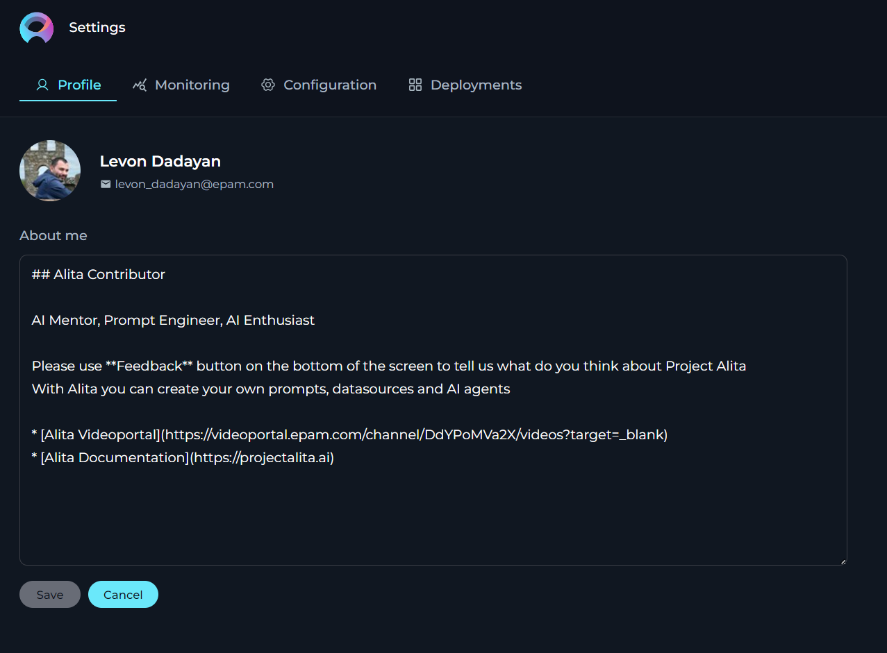
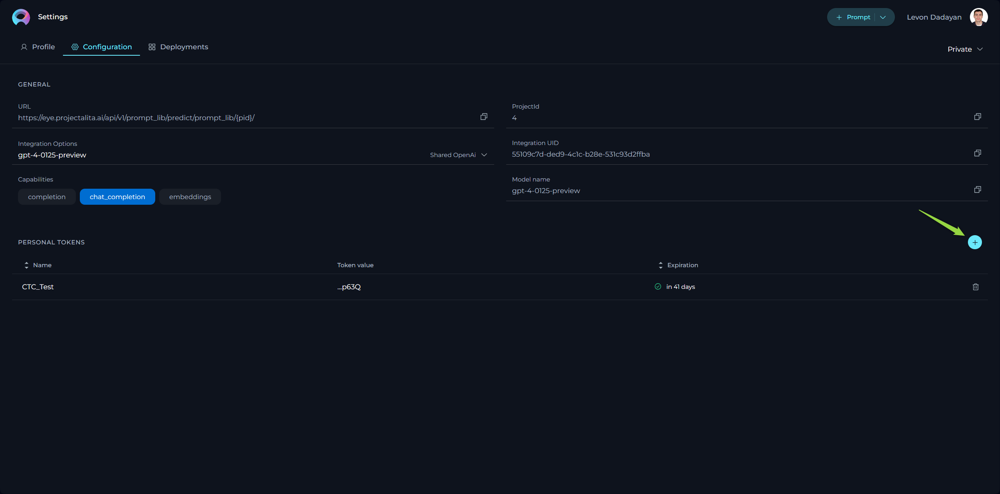

# Introduction

Welcome to the Alita platform, an innovative web application that revolutionizes how you interact with prompts. Alita is not just a repository but a dynamic workspace designed to empower you to create, organize, and collaborate on prompts like never before.

**Key Features:**

* **Prompt Management:** Create new prompts or modify existing ones with ease, while keeping track of different versions.
* **Collection Integration:** Group your prompts into Collections to streamline your workflow or focus on specific themes or projects.
* **Tagging System:** Organize your prompts effectively by adding and editing tags for quick retrieval and categorization.
* **Execution with Precision:** Execute prompts utilizing various models and parameters to suit your unique needs, offering a tailored experience.
* **Advanced Creation Tools:** Use variables, system prompts, Assistant Messages, and User prompts to craft complex prompts with fine-grained control.
* **Flexible Interaction Models:** Engage with the Prompt Library through diverse interfaces, whether via Chat or a Completion approach.
* **Powerful Search:** Quickly find the prompts and collections you need with a robust search feature that recognizes tags, names, and descriptions.
* **Community Engagement:** Create and modify Prompts and Collections, publish your work, and interact with the community through sharing and liking prompts/collections.

Alita is designed to be intuitive, granting you the freedom to focus on creativity and productivity. Whether you are new to prompting or an experienced creator, our user guide will walk you through every feature, ensuring you maximize your Alita experience.

Let's embark on this journey to unlock the full potential of your ideas.

## Access to Alita

To access Alita HUB:

1. Open your browser.
2. Type in <https://alita.lab.epam.com> in the address bar.
3. Provide your EPAM account to login. **Note**: No need for registration.
4. After successful login, you are navigated to the **Prompts** menu.
5. Once you have access, navigate to **Discover→My Library** menu, where you will be able to create prompts and collections. **Note**: If you are logging in for the first time into Alita, wait for 5 minutes to allow private project initialization to be completed before creating prompts. 

**Note**: You need to enable Epam VPN to access Alita.

## Alita - Main Interface

The Alita HUB's main interface encompasses several sections, including the Discover Menu, Search feature, Quick Navigation tabs, Settings, a Quick button for creating prompts or collections, Tags, and Trending Authors.

**Sections:**

* **Discover Menu**: A sidebar menu allowing users to switch among different menus such as Prompts, Datasources, Collections, and My Library.
* **Search**: A Search box available to find prompts by their names and descriptions. Note: The Search functionality operates within the selected menu and is not universal across the entire application.
* **Quick Navigation Tabs**: Tabs enabling users to switch among Latest, My Liked, and Trending pages. The names and content of these tabs will change depending on the menu selected.
* **Page Content**: This area displays the latest published content, which varies based on the selected menu. For example, the Prompts menu will show the latest published prompts, and the Collections menu will display the latest published collections.
* **View Switcher**: A tool for quickly switching between Card and List views.
* **Quick button**: A button that allows for the rapid creation of a new prompt, datasource, application or collection. The function of this button (+Prompt, +Datasource, +Application or +Collection) changes based on the selected menu.
* **Project Switcher**: A tool for quickly switching among projects. **Note**: Becomes available if you are involed in more than one project.
* **Settings**: Accessible by clicking on your user avatar/picture. Here, you can configure your Profile, Settings or Log Out of the application.
* **Tags**: This section displays the tags (categories) associated with the content being viewed. The tags vary depending on the selected menu.
* **Trending Authors**: Shows the authors who have recently contributed or shared the most trending prompts and collections with the community.

.png>)

### General Navigation and Management Across the Application

This section outlines common functionalities and actions available across various menus and pages within the application, aiming to provide a consistent and efficient user experience. These functionalities are shared across:

* **Prompts** menu: Including the Latest, My Likes, and Trending pages.
* **Collections** menu: Including the Latest, My Likes, and Trending pages designed for collections.
* **Datasources** menu: Including the Latest, My Likes, and Trending pages for data sources.
* **My libraries** menu: Including All, Prompts, Datasources, and Collections pages.

The context may vary depending on the specific page you're viewing, but the core principles of action and functionality remain consistent, ensuring a unified approach to navigating and managing content within the application.

### Common Viewing Options

* **Card View**: Offers a compact, card-format snapshot of items like prompts or collections, making it easy to visually scan through published materials.
* **Detailed View**: Provides an in-depth look at individual items, presenting extensive details for a comprehensive analysis.

### Search and Filtering Functionality

* **Search**: Seamlessly locate specific items by their name or description using the search feature, which operates within the menu you are currently exploring. This tool is invaluable for quickly finding relevant content.
* **Filtering**: Streamline your search by filtering items using specific tags. This feature is especially useful for discovering content related to particular subjects or themes.

### Sorting Options (Detailed View Only)

* **By Name**: Alphabetically organize published items by their names, providing an effortless method to find specific titles.
* **By Create**: Sort items by their creation date to monitor the chronological development of content or pinpoint the newest additions.
* **By Likes**: Order the items by the number of likes they have received. This functionality is applicable on the pages of Prompts, Collections, and Datasources menus, helping surface popular content.
* **By Authors**: Sort the items by the author's name. This functionality is applicable on the pages of Prompts, Collections, and Datasources menus, helping surface popular content.

These standardized functionalities across different menus and pages are designed to simplify navigation and enhance the content management process within the application, promoting a coherent and user-friendly environment.

## Discover - Menus

Alita consists of the following main menus:

* **Prompts**: Browse through an organized showcase of prompts curated and shared by the community.
* **Datasources**:  Browse through an organized showcase of datasources and shared by the community.
* **Collections**: Browse through an organized showcase of prompt collections curated and shared by the community.
* **My libraries**: Manage your personal creative space where you can craft, save, edit, and organize your prompts and collections.

**Navigation:**

1. To naviagte among the menus, click the **Alita** icon on the top left.
2. The **Sidebar** menu is opened.
3. Click on the menu name to navigate to the desired menu.

## Settings

The **Settings** is designed to offer you a centralized space to manage vital aspects of your account and configurations. This centralized space is accessible by clicking on your avatar located at the top right corner of the page.

### Tabs in Settings

Settings consists of several tabs, each dedicated to specific functionalities:

* **Profile**: Customize your user profile and monitor your engagement within Alita.
* **Monitoring**: Keep track of usage statistics by selecting different metrics and timeframes.
* **Configuration**: Manage essential technical settings crucial for the smooth operation of Alita's features like Alita Code or Alita Chat.
* **Deployments**: Handle the management and launching of AI models or services linked to your Alita project.
* **Log out**: Securely log out from the Alita Hub.

**Navigation**

To navigate through the Settings menus, follow these steps:

1. Click on the **Your Avatar** icon located at the top right corner of the page to open the **Sidebar** menu.
2. Select the desired tab by clicking on its name to navigate to that specific section.

**Profile Tab**

In the Profile tab, you’re presented with options to personalize your account and monitor your engagement and resource utilization within Alita.

**About me** - fill in or update your personal details to ensure your Alita profile remains current. **Note**: Markdown is supported.
<!--* **Activities and Usage Statistics** - a comprehensive diary of your actions within Alita, alongside usage statistics, offers insight into how you're leveraging Alita over time. This could be beneficial for tracking your project's evolution or analyzing resource consumption.
-->

**Configuration Tab**

This tab serves as the nucleus for managing essential technical settings that enable the smooth operation of Alita's features, such as Alita Code or Alita Chat.

* **URL** - this is the base web address through which you interact with Alita’s services. It's a crucial link for all your API calls or web requests.
* **Project ID & Integration UID** - unique identifiers for your project and integration instances. These are required when setting up or customizing Alita’s services to work within your specific project environment.
* **Integration Options** - allows to select and display available LLMs and Embeddings integrated with your deployments.
* **Model Name** - displays the correct name of selected integration option
* **Personal Tokens** - access tokens are your key to secure communication with Alita's backend. Here, you can generate tokens that authorize your applications or scripts to perform operations on behalf of your account. Treat these tokens with care and keep them confidential.

**Deployments Tab**

The **Deployments** tab is all about managing and launching AI models or services that you’ve connected to your Alita project.

* **Available Deployments** - view a list of current AI deployments, such as AI Dial or Hugging Face, that have been linked to your project. This snapshot gives you quick access to manage these integrations.
* **Creating New Deployments** - while the possibility exists to set up new deployments, it’s a process that requires coordination with the Alita team. This is to ensure seamless integration and avoid potential conflicts with existing configurations.

