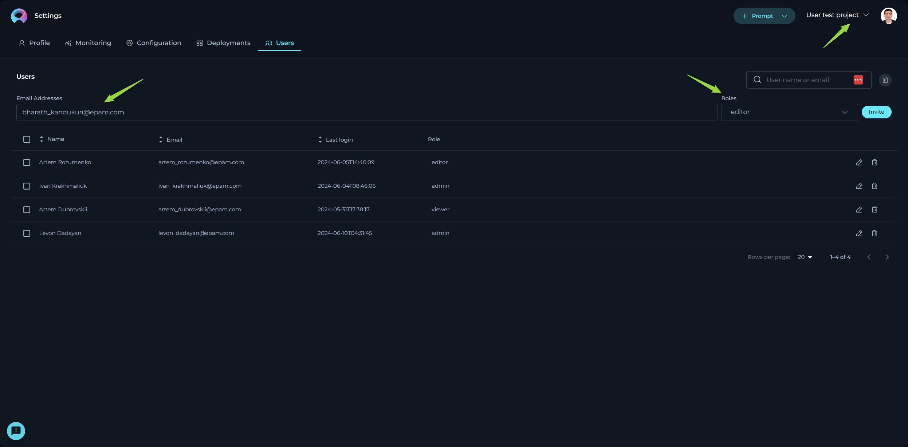

# Introduction

Welcome to the ELITEA platform, an innovative web application that revolutionizes how you interact with prompts. ELITEA is not just a repository but a dynamic workspace designed to empower you to create, organize, and collaborate on prompts like never before.

**Key Features:**

* **Prompt Management:** Create new prompts or modify existing ones with ease, while keeping track of different versions.
* **Collection Integration:** Group your prompts into Collections to streamline your workflow or focus on specific themes or projects.
* **Tagging System:** Organize your prompts effectively by adding and editing tags for quick retrieval and categorization.
* **Execution with Precision:** Execute prompts utilizing various models and parameters to suit your unique needs, offering a tailored experience.
* **Advanced Creation Tools:** Use variables, system prompts, Assistant Messages, and User prompts to craft complex prompts with fine-grained control.
* **Flexible Interaction Models:** Engage with the Prompt Library through diverse interfaces, whether via Chat or a Completion approach.
* **Powerful Search:** Quickly find the prompts and collections you need with a robust search feature that recognizes tags, names, and descriptions.
* **Community Engagement:** Create and modify Prompts and Collections, publish your work, and interact with the community through sharing and liking prompts/collections.

ELITEA is designed to be intuitive, granting you the freedom to focus on creativity and productivity. Whether you are new to prompting or an experienced creator, our user guide will walk you through every feature, ensuring you maximize your ELITEA experience.

Let's embark on this journey to unlock the full potential of your ideas.

## Access to ELITEA

To access ELITEA HUB:

1. Open your browser.
2. Type in <https://alita.lab.epam.com> in the address bar.
3. Provide your EPAM account to login. **Note**: No need for registration.
4. After successful login, you are navigated to the **Prompts** menu.
5. Once you have access, navigate to **Discover→My Library** menu, where you will be able to create prompts and collections. **Note**: If you are logging in for the first time into ELITEA, wait for 5 minutes to allow private project initialization to be completed before creating prompts. 

**Note**: You need to enable Epam VPN to access ELITEA.

## ELITEA - Main Interface

The ELITEA HUB's main interface encompasses several sections, including the Discover Menu, Search feature, Quick Navigation tabs, Settings, a Quick button for creating prompts or collections, Tags, and Trending Authors.

**Sections:**

* **Discover Menu**: A sidebar menu allowing users to switch among different menus such as Prompts, Datasources, Collections, and My Library.
* **Search**: A Search box available to find prompts by their names and descriptions. Note: The Search functionality operates within the selected menu and is not universal across the entire application.
* **Quick Navigation Tabs**: Tabs enabling users to switch among Latest, My Liked, and Trending pages. The names and content of these tabs will change depending on the menu selected.
* **Page Content**: This area displays the latest published content, which varies based on the selected menu. For example, the Prompts menu will show the latest published prompts, and the Collections menu will display the latest published collections.
* **View Switcher**: A tool for quickly switching between Card and List views.
* **Quick button**: A button that allows for the rapid creation of a new prompt, datasource, application or collection. The function of this button (+Prompt, +Datasource, +Application or +Collection) changes based on the selected menu.
* **Project Switcher**: A tool for quickly switching among projects. **Note**: Becomes available if you are involed in more than one project.
* **Settings**: Accessible by clicking on your user avatar/picture. Here, you can configure your Profile, Settings or Log Out of the application.
* **Tags**: This section displays the tags (categories) associated with the content being viewed. The tags vary depending on the selected menu.
* **Trending Authors**: Shows the authors who have recently contributed or shared the most trending prompts and collections with the community.

.png>)

### General Navigation and Management Across the Application

This section outlines common functionalities and actions available across various menus and pages within the application, aiming to provide a consistent and efficient user experience. These functionalities are shared across:

* **Prompts** menu: Including the Latest, My Likes, and Trending pages.
* **Collections** menu: Including the Latest, My Likes, and Trending pages designed for collections.
* **Datasources** menu: Including the Latest, My Likes, and Trending pages for data sources.
* **My libraries** menu: Including All, Prompts, Datasources, and Collections pages.

The context may vary depending on the specific page you're viewing, but the core principles of action and functionality remain consistent, ensuring a unified approach to navigating and managing content within the application.

### Common Viewing Options

* **Card View**: Offers a compact, card-format snapshot of items like prompts or collections, making it easy to visually scan through published materials.
* **Detailed View**: Provides an in-depth look at individual items, presenting extensive details for a comprehensive analysis.

### Search and Filtering Functionality

* **Search**: Seamlessly locate specific items by their name or description using the search feature, which operates within the menu you are currently exploring. This tool is invaluable for quickly finding relevant content.
* **Filtering**: Streamline your search by filtering items using specific tags. This feature is especially useful for discovering content related to particular subjects or themes.

### Sorting Options (Detailed View Only)

* **By Name**: Alphabetically organize published items by their names, providing an effortless method to find specific titles.
* **By Create**: Sort items by their creation date to monitor the chronological development of content or pinpoint the newest additions.
* **By Likes**: Order the items by the number of likes they have received. This functionality is applicable on the pages of Prompts, Collections, and Datasources menus, helping surface popular content.
* **By Authors**: Sort the items by the author's name. This functionality is applicable on the pages of Prompts, Collections, and Datasources menus, helping surface popular content.

These standardized functionalities across different menus and pages are designed to simplify navigation and enhance the content management process within the application, promoting a coherent and user-friendly environment.

## Discover - Menus

ELITEA consists of the following main menus:

* **Prompts**: Browse through an organized showcase of prompts curated and shared by the community.
* **Datasources**:  Browse through an organized showcase of datasources and shared by the community.
* **Collections**: Browse through an organized showcase of prompt collections curated and shared by the community.
* **My libraries**: Manage your personal creative space where you can craft, save, edit, and organize your prompts and collections.

**Navigation:**

1. To naviagte among the menus, click the **ELITEA** icon on the top left.
2. The **Sidebar** menu is opened.
3. Click on the menu name to navigate to the desired menu.

## Settings

The **Settings** is designed to offer you a centralized space to manage vital aspects of your account and configurations. This centralized space is accessible by clicking on your avatar located at the top right corner of the page.

**Tabs in Settings**

Settings consists of several tabs, each dedicated to specific functionalities:

* **Profile**: Customize your user profile and monitor your engagement within ELITEA.
* **Monitoring**: Keep track of usage statistics by selecting different metrics and timeframes.
* **Configuration**: Manage essential technical settings crucial for the smooth operation of ELITEA's features like Alita Code or Alita Chat.
* **Deployments**: Handle the management and launching of AI models or services linked to your ELITEA project.
* **Log out**: Securely log out from the ELITEA Hub.

**Navigation**

To navigate through the **Settings** menus, follow these steps:

1. Click on the **Your Avatar** icon located at the top right corner of the page to open the **Sidebar** menu.
2. Select the desired tab by clicking on its name to navigate to that specific section.

### Profile

In the **Profile**, you’re presented with options to personalize your account and monitor your engagement and resource utilization within ELITEA.

**About me** - fill in or update your personal details to ensure your ELITEA profile remains current. **Note**: Markdown is supported.

### Monitoring

The **Monitoring** feature in ELITEA provides a comprehensive overview of the application's usage and performance. This section of the User Guide will walk you through the various charts and statistics available within the Monitoring feature, along with detailed settings to customize your monitoring experience.

#### Configuration Options

At the top of the **Monitoring** page, you have several options and settings to configure the charts and metrics you wish to monitor:

* **Type**: A dropdown list allowing you to select among `Prompt`, `Datasource`, `Agent`, and `Conversation` to focus your monitoring on specific elements.
* **Name**: A dropdown list to select specific items by name, such as created prompts, datasources, agents, or conversations.
* **Users**: A dropdown list to select which users' data you want to monitor. **Note**: For your private project, you can only see your own user data. If you have an admin role in another project, you can select other users to monitor.
* **From and To Date Fields**: These fields are used to select the time period for which you want to see the data.

To apply any changes or selections, click the **Apply** button. Use the **Refresh** button to update the monitoring data based on the latest activities and configurations.

#### Key Metrics

Below the configuration options, you'll find an overview of key metrics that give you a snapshot of the current state of the system:

* **Users**: The total number of users interacting with the application.
* **Tokens In**: The number of tokens consumed by the application.
* **Tokens Out**: The number of tokens generated by the application.
* **Gb Used**: The amount of data processed by the application.
* **Prompts**: The total number of prompts created.
* **Datasources**: The number of datasources connected.
* **Agents**: The count of active agents.
* **Conversations**: The number of conversations held.

These metrics are accompanied by a date range selector, allowing you to filter the data for a specific period.

.png)

#### Adoption and Usage

Below the key metrics, you'll find the **Adoption and Usage** section, which includes:

* **Active Users**: A bar chart displaying the number of active users over time.
* **Token Usage**: A line chart showing the tokens consumed (In) and generated (Out) over time.

These charts provide insights into user engagement and the application's token economy.

#### Sentiments

The **Sentiments** section offers a visual representation of the sentiment of inputs and outputs:

* **Human Input**: A pie chart showing the sentiment distribution of user inputs.
* **LLM Output**: A pie chart displaying the sentiment distribution of the ELITEA's outputs.

.png)

#### Relevance

The **Relevance** section includes line charts that measure:

* **Relevance**: Comparing the relevance of input versus context and output versus input.
* **Accuracy**: Displaying the reliability score of the application's outputs.
* **Prompt Quality**: Chart tracks the quality score of prompts over time, helping you understand the effectiveness of your prompts.

#### Topics Summary

Finally, the Topics Summary bar chart categorizes the content into various topics such as Software Development, Requirements Analysis, User Story Creation, and more, providing a breakdown of the subjects addressed by the application.

.png)

By monitoring these statistics, you can gain valuable insights into the performance and usage of the ELITEA platform, enabling you to make informed decisions to enhance user experience and application efficiency.

### Configuration

The **Configuration** page serves as the nucleus for managing essential technical settings that enable the smooth operation of ELITEA's features, such as Alita Code or Alita Chat.

* **URL** - this is the base web address through which you interact with ELITEA’s services. It's a crucial link for all your API calls or web requests.
* **Project ID & Integration UID** - unique identifiers for your project and integration instances. These are required when setting up or customizing ELITEA’s services to work within your specific project environment.
* **Integration Options** - allows to select and display available LLMs and Embeddings integrated with your deployments.
* **Model Name** - displays the correct name of selected integration option
* **Personal Tokens** - access tokens are your key to secure communication with ELITEA's backend. Here, you can generate tokens that authorize your applications or scripts to perform operations on behalf of your account. Treat these tokens with care and keep them confidential.

### Deployments

The **Deployments** page is all about managing and launching AI models or services that you’ve connected to your ELITEA project.

* **Available Deployments** - view a list of current AI deployments, such as AI Dial or Hugging Face, that have been linked to your project. This snapshot gives you quick access to manage these integrations.
* **Creating New Deployments** - while the possibility exists to set up new deployments, it’s a process that requires coordination with the ELITEA team. This is to ensure seamless integration and avoid potential conflicts with existing configurations.

### Users

The **Users** menu is specifically designed for administrators and becomes accessible when you hold administrative privileges in any project other than your private project within ELITEA.

**Adding New Users**:

Only users with an admin role can invite new members. To do so:

1. Enter the prospective member's email address in the **Email Address** input field.
2. Select their role from the **Role** dropdown menu. 
3. Click the **Invite** button. 
4. An invitation will be sent, and upon their first login, their details will be added to the **Users table**, activating their account.

**Notes**

* Multiple users can be invited simultaneously by separating email addresses with a comma.
* For Epam projects, use the invitee's Epam email. For customer projects, the customer's Active Directory is utilized for invitations.

**Managing Users**:

The **Users table** displays all members, their roles, and their last login information. Admins can modify a user's role or revoke access by clicking the respective **Edit** or **Delete** icons next to a user's name.